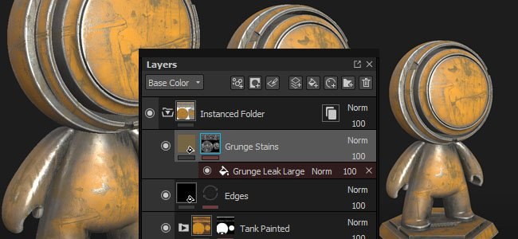
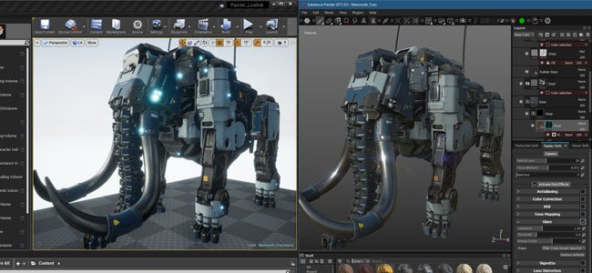
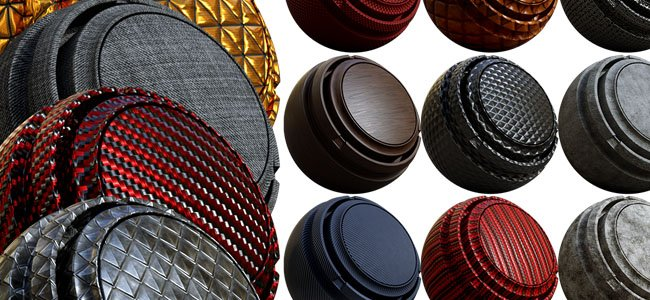
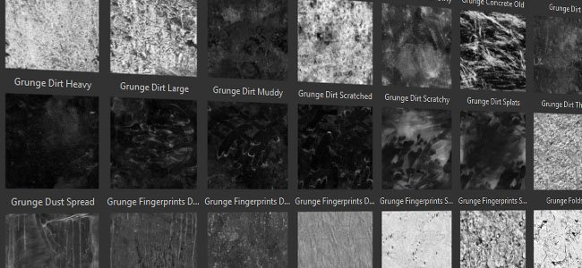
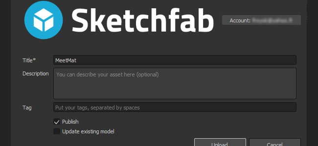

# Version 2017.4

**Substance Painter 2017.4** add a new workflow feature with the **layer instancing** allowing to easily synchronize layers across different Texture Sets inside a project.

Release date : *23 November 2017*

## Major Features

### Layer Instancing

The **layer instancing** is a new system that allows to keep **synchronized** layer **parameters** across **other layers and Texture Sets**. When creating a layer instance the original layer becomes the **source** and the instances will **stay updated** unless the link between them is broken. Instanced layers are a **great way** to **texture an asset in a few clicks** and avoid doing back and forth to update layers. To easily texture an asset, simply **instantiate a folder** across other Texture Sets and put a smart material or any other layer into it, it will be **replicated everywhere** instantly.

There are two ways to create an instance :

* Choose "**paste as instance**" (or use the shortcut CTRL+SHIFT+V), after copying a layer
* Choose "**instantiate across texture sets**" (or use the shortcut CTRL+SHIFT+D) after selection one layer

>[!NOTE]
>
> There are some limitation related to the layer instancing :
> 
> * Any painting actions will only be present on the source layer, instanced layers won't replicate brush strokes.
> * Anchor's references must have the anchor point at the same level of the instance, an anchor point can't be outside of an instanced folder otherwise it will be broken.
> * If a smart material is saved with instanced layers, the source layer must be in the smart material folder otherwise the instance link will be broken.
> * Depending of the layer stack setup, instanced layers can create a cycle, which is not supported and will break the instance result. Either delete or move the instance to fix it.

For more details and examples, see the dedicated page : [Layer instancing](../../../interface/layer-stack/layer-instancing/layer-instancing.md)

### DCC Live-link with Unreal Engine 4 support

The previously beta version of our **live-link plugin** has now been **integrated** in Substance Painter. We took the occasion to support the Unreal Engine 4 which now allows to see the result of a project into the engine automatically.

To connect the application with the **Unreal Engine 4** (version **4.18** minimum required), download the Substance plugins over here : <https://www.unrealengine.com/marketplace/substance-plugin>

### New shelf content

We added **20 new procedural materials** and also added **40 new grunge maps** (with some of them being procedural). The new materials can be found in the "**Materials**" section of the **shelf**, such as the 6 new metals, the 8 new plastics, a few fabrics and 2 new wood surfaces. The new grunge maps can be found directly in the "**Grunge**" section of the **shelf**.

Many thanks to Clément Feuillet and Nicolas Longchamps for allowing us to license their content for this new version.

### Sketchfab export improved

We updated our Sketchfab export and added the ability to publish your project as a draft and even update already uploaded projects. It should make project iterations much easier to do.

### Performance improvements

We continued our work regarding performances improvements. In this new version we reworked quite a lot of our OpenGL rendering in the viewports which should give a nice speed boost. We also improved the way brush strokes are computed and they should require much less bigger texture computations in memory. Overall it will give much faster results and better painting sensations.

## Tutorial

The new features are covered in details in our latest videos :

## Release Notes

### 2017.4.2

(Released January 24, 2018)

**Added:**

* &#91;Export&#93; Get the status of an export with step progress
* &#91;Export&#93; Allow cancelling an export
* &#91;Export&#93; Export textures to Sketchfab without loosing normal map quality
* &#91;Export&#93; Export in glTF binary format (glb)
* &#91;Export&#93; Allow resizing columns in configuration tab of the export window
* &#91;Shader&#93; Add a changelog for the shader API
* &#91;Scripting&#93; Add Before and After callback functions when exporting textures
* &#91;Iray&#93; Upgrade to SDK 2017.1 (support of Volta GPUs)

****Fixed:****

* Crash when quitting the application before the main window is displayed
* &#91;MAC&#93; Crash when loading grayscale maps with IRAY
* &#91;MAC&#93; VRAM detection is not correct with the new High Sierra OS
* &#91;Plugin&#93; Downloading assets from Substance Source does not work anymore
* &#91;Scripting&#93; Incorrect minimum plugin version detection
* &#91;Export&#93; Fail to save export preset after exporting textures
* &#91;Instancing&#93; Issue on generators instantiated in a TextureSet with no Additional Maps
* &#91;Viewport&#93; Dithering does not work with resolution above 4k
* &#91;Viewport&#93; 2D View material display is covered with noise
* &#91;Shelf&#93; Improve loading time for shelf presets
* &#91;Engine&#93; Incorrect blending when painting under color selection

### 2017.4.1

(Released December 15, 2017)

**Added:**

* &#91;Scripting&#93; Export mesh through the scripting API
* &#91;Import&#93; Disable import of unsupported mesh file format (allow only obj, fbx, dae, ply)
* &#91;Log&#93; Indicate more precisely the TDR issue in the log file

**Fixed:**

* Crash if application is closed before resources crawling has finished
* Crash when opening projects with Smudge/Clone tool
* Crash when using redo after an undo of a Shader change in Viewer Settings
* &#91;Engine&#93; Texturing differs between Painter 2017.2 and 2017.4
* &#91;Viewport&#93; Picking on an ID map from an instance samples the wrong color
* &#91;Export&#93; Crash when exporting an invalid normal or occlusion texture
* &#91;Export&#93; PSD files have their groups locked when opened in Photoshop CS6
* &#91;Plugin&#93; Photoshop plugin ignores channel selection and always export everything
* &#91;Layers&#93; Anchors break when copy/pasted across Texture Sets
* &#91;Layers&#93; Some anchor's references cannot be restored if broken
* &#91;Shader&#93; pbr-coated secondary roughness parameter is broken
* &#91;Steam&#93; Version checker pop-up shouldn't be visible at launch

**Known issues:**

* &#91;AMD&#93; Crashes/Freezes when trying to paint on a mesh. Can be fixed with a GPU Driver update.

### 2017.4

(Released November 23, 2017)

**Added:**

* &#91;Instancing&#93; Allow to instantiate parameters across layers
* &#91;Instancing&#93; Allow to jump between a source layer and an instance
* &#91;Instancing&#93; Add a "instantiate across texture sets" action
* &#91;Instancing&#93; Indicate in the layer stack re-entrant instances (cycles)
* &#91;Instancing&#93; Delete instances when a source is removed
* &#91;Instancing&#93; Don't allow Anchor's references from outside an instanced folder
* &#91;UI&#93; Move the Undo Stack into its own window named "History"
* &#91;Plugin&#93; Integrate DCC live-link plugin
* &#91;Engine&#93; Improve painting performances with Sparse painting
* &#91;Export&#93; Add draft and re-export options to Sketchfab exporter
* &#91;Shelf&#93; Add "flip" control for Font substances
* &#91;Shelf&#93; Add 20 new procedurals materials
* &#91;Shelf&#93; Add 40 new grunges maps (bitmap based and procedural)
* &#91;Viewport&#93; Enable brush preview collisions on other visible texture sets
* Update AMD GPU drivers minimum requirements

**Fixed:**

* Crash When computing Substances at too big resolutions
* Crash when painting heavily with particles
* &#91;Viewport&#93; Incorrect specular reflection in the 2D view with specific meshes
* &#91;UI&#93; Some unwanted actions appear into the History window

**Known issues:**

* &#91;Layers&#93; Some anchor's references cannot be restored if broken
* Crash when using redo after an undo of a Shader change in Viewer Settings
