# Version 2018.1

**Substance Painter 2018.1** introduces a brand new interface with a lot of improved behaviors. Performances have been improved as well in a lot of areas.

Release date : *15 March 2018*

## Major Features

### New interface and behaviors

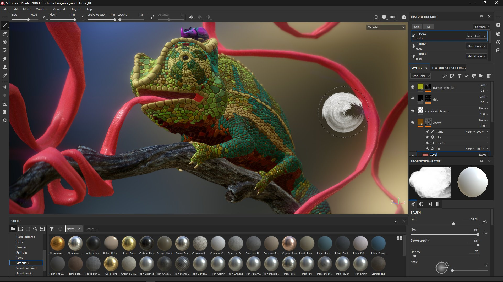{width="650px"}

Substance Painter 2018.1 introduces a **complete rework of the interface**, ranging from color and icons to widget behaviors.

* The **new interface** focus on bringing a brand new design, making it easier to read and less cumbersome to navigate.   
  We reworked all our icons to be more explicit. We also reworked our color scheme which should now be more consistent.  
   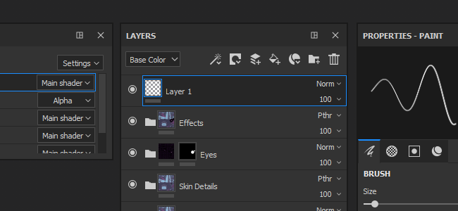
* We improved many widgets, especially our **sliders**, to be more **easy to use** with a **Tablet Pen**.   
  You can click on the bar to move the slider or use the value field to more precisely edit the numbers.   
   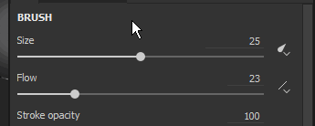 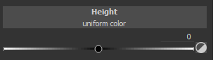
* We have a **new toolbar** that allows to open **Docks** on the fly.   
  Clicking on one of the buttons in the toolbar will display the Dock next to its button and floating above the rest of the interface, re-clicking on the button will close it.  
  If the dock move away from its button, it becomes a regular floating window which can be docked in the interface. If closed, the button will be available again in the Dock Toolbar.  
  This new dock system works more easily with fullscreen. There is no need to have every dock always present in the interface anymore.   
   
* Docks now use our new **Tab layout** which organise items into sections while still being able quickly scroll inside it.   
  This Tab layout allows **big windows** and can present **all the information** at the same time, contrary to regular Tab systems that hide information.  
   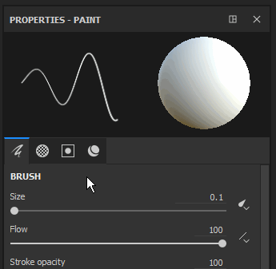 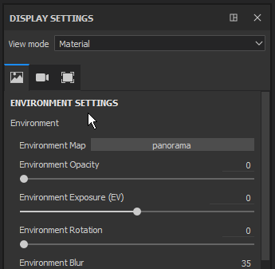 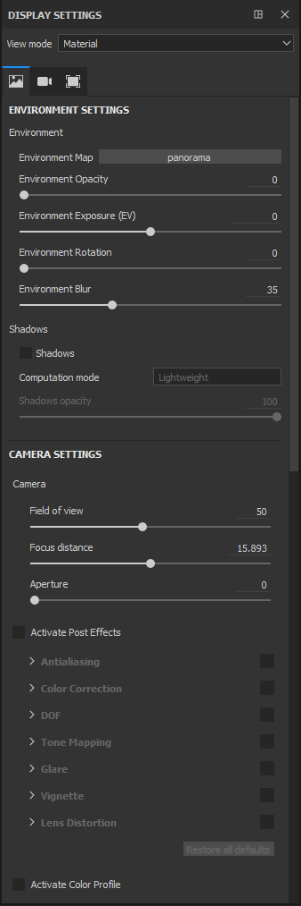
* There is now a **Quick Menu**, which makes **Tool properties** available **directly in the viewport**.  
  To open the quick menu, simply **right-click in the viewport**. To **close** the quick menu, **click again in the viewport**.  
  The menu will only close when clicking into the viewport, allowing the drag and dropping of resources from the shelf directly into the quick menu.  
   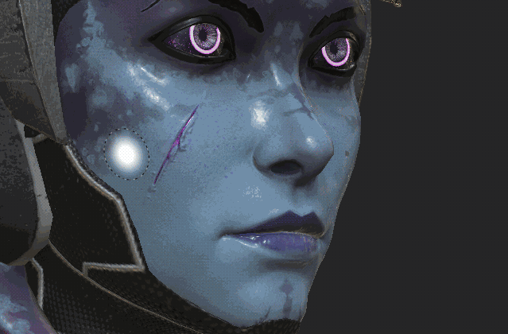
* There is now a new **Contextual Toolbar** at the top for the viewport.  
  This toolbar change its parameters depending of the current tool used. It's a way to quickly access basic tool features (like the brush size).  
   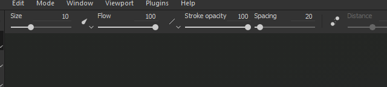
* It is now possible to **reorder effects** using **drag and drop** in the **layer stack**.   
   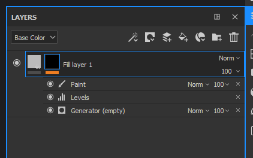
* While the shortcuts "**C**" and "**B**" allow you to quickly vizualise the **Channel** and **Baked textures** into the **viewport**, it is now possible to use the **unified dropdown** to change the viewport display.  
  At the **top right** of the **viewport** there is now a dropdown listing **all the Channels and Mesh maps** (previously Additional maps). This unified dropdown is also available in the **Display Settings** dock.   
   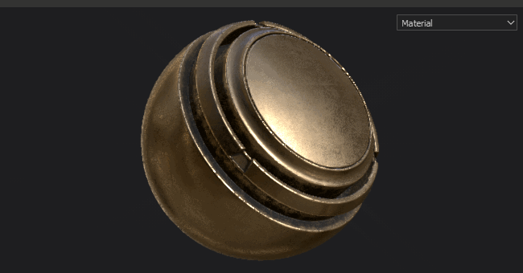
* The **Display Settings** and **Viewer Settings** have been **merged** into a singleDock.  
   **Environment**, **Camera** and **Viewport** settings are now grouped **together**, while **Shaders** parameters have been **moved** into a **dedicated Dock** instead.  
  The Display Settings now takes advantage of the new **Tab layout** to quickly navigate the window.   
   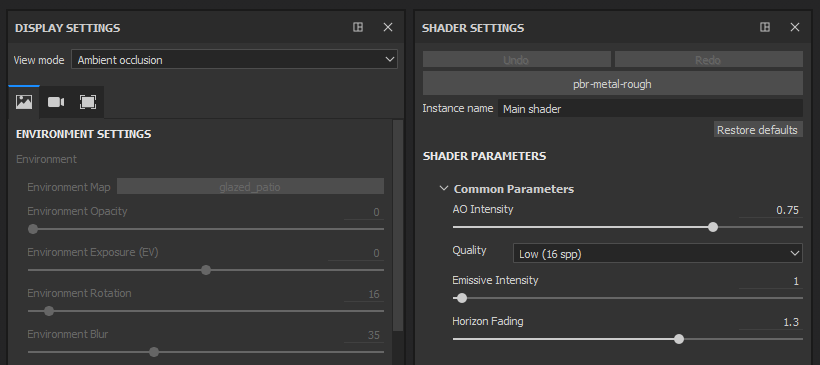

### Drag and drop of Materials and Smart-Materials into the Viewport

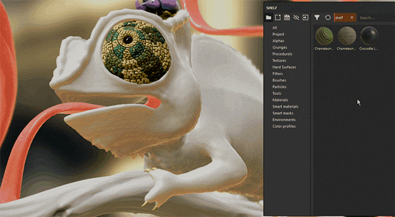{width="650px"}

You can now **drag and drop** Materials and Smart Materials **directly into the viewport**.   
This new action will **highlight the geometry** of the of the **target Texture Set** at the same time. This action will create the new layers at the top of the layer stack of the Texture Set.

### Improved tablet pen behavior

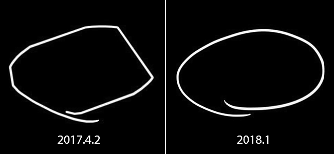

In this version we improved the way we handle Graphics tablet pen movements and inputs, especially when Substance Painter is under a heavy load.   
We no longer lose the inputs anymore while we are doing consecutive computations. This should allow precise brush strokes in any situations.

### Improved seam padding

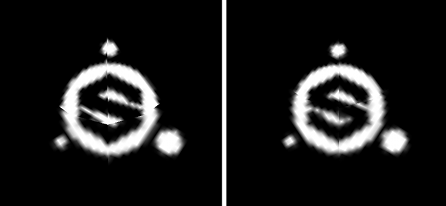

We reworked the way we generate our padding outside the UV islands. Instead of taking the current pixel and dilating it on a certain distance we now look for the neighboring pixel on the other side of the UV seam and interpolate the two values.   
This gives a much better end result and reduce the visibility of the split between UV islands even when the textel ratios don't match.

<table>
<tr style="border: 0;">
<td style="border: 0;" valign="top">

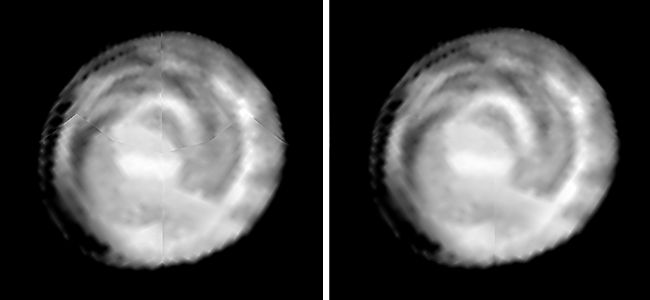{width="200px"}

</td>
<td style="border: 0;" valign="top">

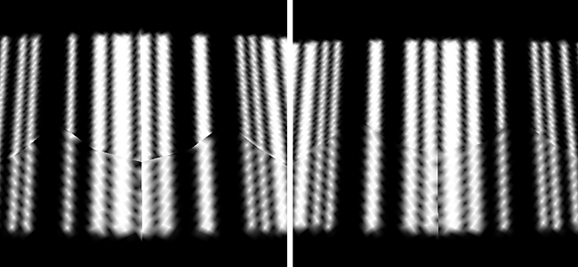{width="200px"}

</td>
</tr>
</table>

This new padding is automatically generated after each brush stroke, resolution change or layer modification.

### Improved performances

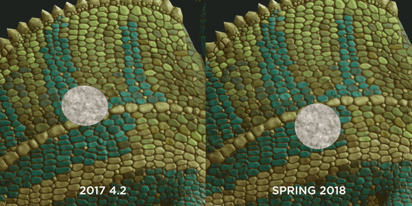{width="650px"}

We also improved performances in this version on multiple levels :

* Opening and saving project should be a bit quicker than before.  
  We reworked the way we encode/decode our **painting data**. This especially affect projects with a lot of paint information (brush strokes).
* We now support lot of **sub-objects** with meshes.   
  It isn't mandatory anymore to merge a mesh into one piece before loading it in Substance Painter. Performance should stay good even with **8000 sub-objects** in a project.
* We changed the way our **viewport** is **refreshed** to reduce the load on the GPU when painting.   
  This means we no longer update the whole image but instead a small region where you are currenlty working.   
  You can feel the difference on less powerful GPUs or when using a high sample count in your shader.
* The **shelf** system is now **faster to discover** resources when launching the application.  
  Substance materials with embeded bitmaps are **twice as fast** to discover (if cooked as non-solid). **Presets** should also see improvements.

### Global scene position baker

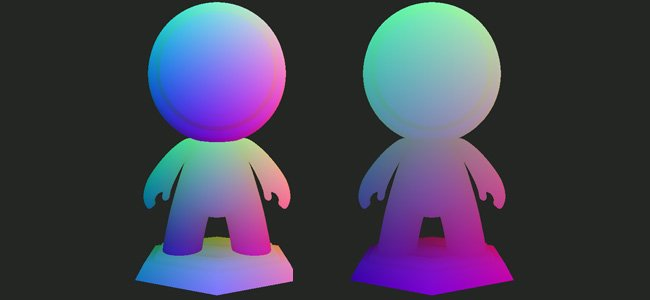

We now have a new setting that allows to bake a position map per Texture Set that take into account the full scene size.   
This new behavior allows to use triplanar projections in Mask Generators that will match across the whole scene instead of creating seams like before. This is really usefull with projects that have a lot of Texture Sets (like UDIM based projects).

In the position baker settings, change the the parameter "**Normalization Scale**" from "**Per Material**" to "**Full Scene**" to enable this new behavior.

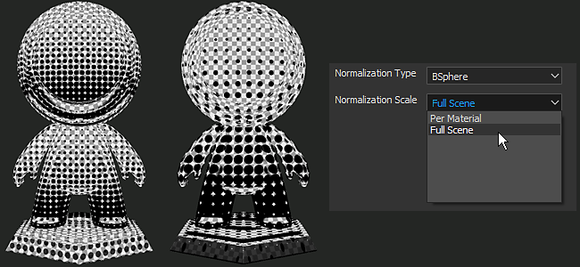

### New content

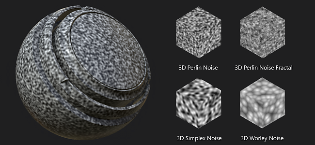

We also added some new content in this release :

* New **3D noises.**   
  Imported direclty from Substance Designer, 4 new 3D and totally seamless noises have been added to the default shelf.  
  These new noises rely on the posiiton map of the project to generate a result without any seams.
* **Non-square** noises  
  The base noises have been updated to the latest version from Substance Designer.   
  This means that the non-square expansion feature is now available in the noise parameters.
* New mask generator **3D Linear Gradient.** This new mask generator allows you to create a linear gradient in any direction in 3D space.  
  The direction can be defined with two 3D positions, which can be picked on the position map directly.  
   Example :

1. 1. Create the mask generator **3D Linear gradient** in one of your layer
   1. Switch the viewport display to "**Position**" (via the viewport dropdown or by using the "**B**" key)
   1. Click on the "**3D Position Start**" parameter to open the **Color Picker** pop-up
   1. **Pick a color** on your mesh **in the viewport**
   1. Repeat the process for the second parameter "**3D Position End**"   
         
       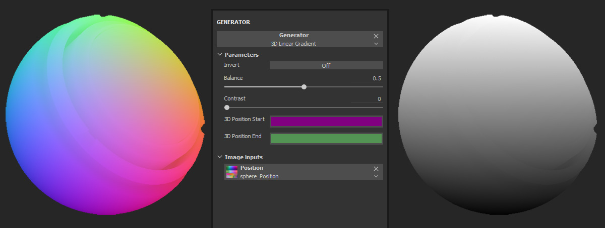

* New template **Lens-studio** (Snap Chat 3D app).  
  We have a new template to easily create projects that target the Lens-Studio application created by Snap.  
  A dedicated shader and export preset are also available. For more details about Lens Studio see : <https://lensstudio.snapchat.com/>
* **Smart Materials** and **Smart Masks** have been updated with the latest version of our Mask Generators.  
  Our Smart presets now all support the **micro details** feature which can be used with **Anchor points**.

### New sample project

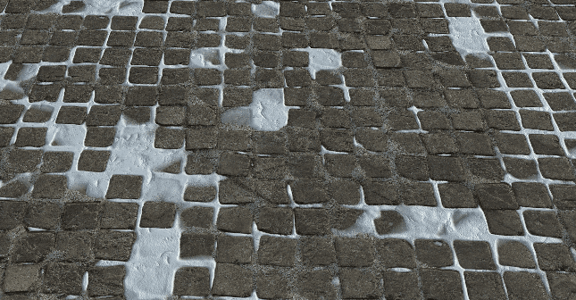{width="650px"}

There is now a new sample project named "**TilingMaterial**" that you can open via the "**File &gt; Open Sample**" menu action.   
This project use a simple plane mesh with overlapping UVs which allows to **paint seamlessly** materials and brush strokes to **create tiling materials**.

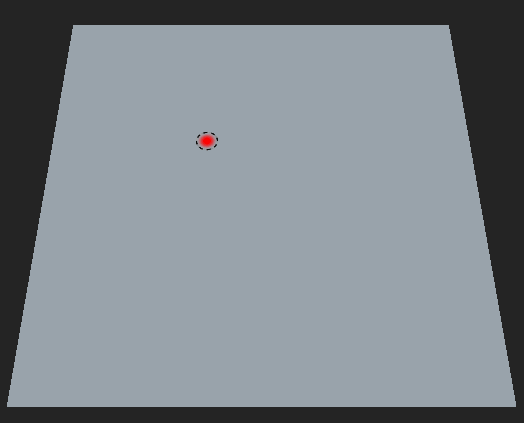{width="400px"}

## Tutorial

A new tutorial course has been added to Substance Academy to cover our new interface : [Getting started with substance painter 2018](https://academy.allegorithmic.com/courses/a97b433a5997fd800b5ed300d783cc41/youtube-e-zpEL0Wcqg)

## Release Notes

### 2018.1.3

(Released June 28, 2018)  
   
 **Added:**

* Summary: Hotfix
* &#91;Preferences&#93; Propose to save project when Painter restarts

**Fixed:**

* &#91;Plugin&#93; Search Substance Source does not work
* &#91;Smart Materials&#93; Importing Smart Materials leads to a crash in some cases
* &#91;Smart Materials&#93; Deleting Smart Materials leads to a crash in some cases
* &#91;Save&#93; Saving leads to a crash in some rare cases
* &#91;Shelf&#93; Invert does not work on Cells 2 and Cells 3
* &#91;Shelf&#93; Typo in some Alphas
* &#91;Shelf&#93; Some substance materials do not render properly

**Known Issues:**

* Computation freeze on AMD VEGA GPUs

### 2018.1.2

(Released June 6, 2018)  
   
  **Added:**

* Summary: Improved Baking Speed, Improved Save System, Updated Sliders, Updated Plugin API, Chinese Translation, Improved Padding now Optional
* &#91;Bakers&#93; Performance improvement with new baker version
* Force display dialog with incompatible GPU
* &#91;Save&#93; Expose new compact project functionality (full/compact save mode)
* &#91;Save&#93; Inform user in case of saving error
* &#91;Clean&#93; Next save in full/compact mode
* &#91;Sliders&#93; Improvement of the precision of the color/grayscale bars and sliders
* &#91;Sliders&#93; Addition of Up/Down arrow controls
* &#91;Sliders&#93; Same detection zone for color and grayscale bar sliders
* &#91;Plugin&#93; Autosave always in incremental mode
* &#91;Plugin&#93; Option to switch plugins to new interface style
* &#91;Language&#93; Add Chinese translation
* &#91;Padding&#93; Option to switch between UV and 3D space neighbor padding per Texture Set in Texture Set Settings
* &#91;Script&#93; Expose save mode: full/compact or incremental
* &#91;Script&#93; Update scripting/QML documentation
* &#91;Log&#93; Indicate save mode in log (full/compact or incremental)

**Fixed:**

* &#91;Tool&#93; Channel slot transforms into a material slot on single-channel fills
* Crash when loading a mesh (FBX) with some faces not assigned by a material
* Crash in Iray with NVIDIA GRID 5.2 on virtual machine
* Crash when undoing a material preset deletion
* Crash when loading some projects
* &#91;Command line&#93; New command line for UDIMs meshes split-by-udim
* &#91;Toolbar&#93; Shrinking of the toolbar
* &#91;Instancing&#93; Cannot instantiate bitmaps across multiple texture sets
* &#91;Viewport&#93; Refresh is not complete when painting on mesh with tiled UVs
* &#91;Iray&#93; Normal Map is applied twice for dielectrics
* &#91;Shelf&#93; Typos in some Substance parameters (alphas, procedurals and matfx)
* &#91;Shelf&#93; Typo for the bitmap "Authorized Personnel Only"
* &#91;Script&#93; Function alg.shaders.materials() does not work anymore

**Known Issues:**

* Computation freeze on AMD VEGA GPUs

### 2018.1.1

(Released April 3, 2018)

**Fixed:**

* &#91;Tablet&#93; Issue when changing default interaction choices
* &#91;Bakers&#93; Crash with Assimp library
* &#91;Bakers&#93; Regression on performance with A.O. map
* &#91;Iray&#93; Lens Distortion is not applied to the Alpha channel
* &#91;Drivers&#93; Update of minimum drivers requirements
* &#91;3Dview&#93; Normals not correctly generated on UDIM meshes without normals information
* &#91;Intel&#93; Crash with Substance Painter 2018.1.0
* &#91;Intel&#93;&#91;Viewport&#93; Issue with padding (black artefacts)

**Known Issues:**

* Computation freeze on AMD VEGA GPUs

### 2018.1

(Released March 15, 2018)

**Added:**

* New overall style (icons, color, behavior)
* New default layout
* &#91;Tablet&#93; User experience enhancement while painting
* &#91;Main menu&#93; Sort native items in views and toolbars first
* &#91;Main menu&#93; Move quick mask actions in viewport section
* &#91;Main menu&#93; Move right-click actions into viewport section
* &#91;Main menu&#93; Rename "View" menu as "Window"
* &#91;Quick menu&#93; New tool properties by right click in viewport
* &#91;Dock widget&#93; New dock toolbar for quick reduce/recall
* &#91;Display settings&#93; Camera and viewer settings window merged
* &#91;Layer stack&#93; Contextual right click menu
* &#91;Layer stack&#93; Drag and drop to move any effect within the same layer
* &#91;Toolbar&#93; Reorganization of toolbar and new contextual toolbar
* &#91;Tools toolbar&#93; Split clone tool into two separate tools
* &#91;Tools properties&#93; Lighter background grayscale value in the preview
* &#91;Tools properties&#93; Organization in tabs (fill and tools)
* &#91;Tool&#93; Painting result matches the stencil
* &#91;Viewport&#93; New cursor for fill layer
* &#91;Viewport&#93; Smoother navigation and painting (higher frame rate)
* &#91;Viewport&#93; Material/Channel/Map selection combobox in viewport
* &#91;Viewport&#93; Reduce flickering while rotating (shadow on)
* &#91;Shelf&#93; Display materials by default when opening Painter
* &#91;Shelf&#93; Loading time improvement of Substance textures and materials (2 to 6 times faster)
* &#91;Shelf&#93; Reorganize materials folders to fit Substance Source structure
* &#91;Shelf&#93; Drag and drop materials directly on the mesh in the viewport
* &#91;Shelf&#93; New 3D Noises (Perlin, Perlin Fractal, Simplex and Worley)
* &#91;Shelf&#93; New 3D Linear Gradient mask generator using mesh position
* &#91;Shelf&#93; Updated base Noises to support non square expansion
* &#91;Shelf&#93; Added new template and export preset for Lens Studio (Snap application)
* &#91;Shelf&#93; Updated Smart Materials and Smart Masks to use latest version of the Mask Editor (micro details)
* &#91;Shelf&#93; New sample project "TilingMaterial" to create seamless tiling materials
* &#91;Shelf&#93; New brush presets (Calligraphy, Wet, Hatching and so on)
* &#91;Sliders&#93; New sliders and grayscale/color bars style and behavior
* &#91;Bakers&#93; Allow use of full scene bounding box to compute the position map
* &#91;Shader&#93; Remove height force parameter from the default shader parameters
* &#91;Engine&#93; Substance engine updated
* &#91;Engine&#93; No or less discontinuities across UV chunks (new seam padding)
* &#91;Plugins&#93; Import materials downloaded from Substance Source more quickly
* &#91;Plugins&#93; Update all plugins to match new overall style
* &#91;Preferences&#93; Preview background color changes automatically
* &#91;Clean&#93; Reduced risk of project corruption
* &#91;Open&#93; Opening project time improvement
* &#91;New project&#93; New project - mesh update time improvement
* &#91;Save&#93; Saving Project time improvement
* &#91;Log&#93; License type reported in log
* &#91;TextureSet&#93; Rename "Bake Textures" button as "Bake Mesh Maps"
* Rename "Additional maps" as "Mesh maps"

**Fixed:**

* &#91;Viewport&#93; Bad performances with meshes containing a lot of sub-objects
* &#91;Tools properties&#93; Channel disabled when dragging and dropping an image into the material slot
* &#91;Tools properties&#93; Brush preview is broken with smudge and clone tools
* &#91;Texture set&#93; Channels order is wrong when using templates
* &#91;Shelf&#93; Missing icon for Grayscale Conversion generator
* &#91;Shelf&#93; Sign Circle Number alpha is broken (missing font)
* Incorrect detection of integrated GPUs at launch
* &#91;Crash&#93; Drag-and-droping an imported ressource named with a # character
* &#91;Engine&#93; Vram detection issue on integrated GPU
* &#91;Engine&#93; Fixed numerous crashes in Substance Engine Linker
* &#91;Engine&#93; Square artefacts when changing resolution
* &#91;Post Effects&#93; Interface resize is slow when post effects are on
* &#91;Bakers&#93; Scene unit is not correctly respected for Ray Distance values
* &#91;Bakers&#93; AO from Mesh Occluder distance is clamped to 1 no matter the input value
* &#91;Bakers&#93; Match by name ignores some meshes with specific names
* &#91;Bakers&#93; Color from mesh Polygroup and Submesh ID setting always return a black image
* &#91;Bakers&#93; ID Baking fails with binary FBX meshes from Blender
* &#91;Shader&#93; Noise in the 2D View with dota-2 and non-pbr-spec-gloss
* &#91;Linux&#93; Only one CPU thread is used when baking
* &#91;MacOS&#93; Crash with brush cursor moving over the viewport

**Known Issues:**

* Computation freeze on AMD VEGA GPUs
* Distorsion post process not taken into account while exporting in IRay (alpha channel)
