# Version 2018.2

**Substance Painter 2018.2** adds long awaited features such as Subsurface Scattering painting that make texturing even easier than before.

Release date : *2 August 2018*

## Major Features

### Subsurface scattering

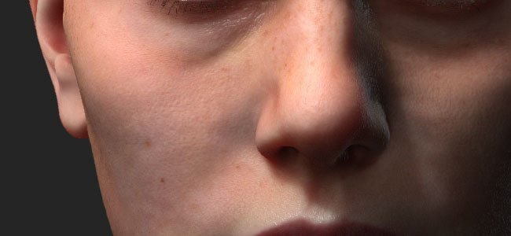

**Subsurface scattering** is now supported in the **realtime** viewport and with the **Iray renderer**.  
Subsurface scattering is a mechanism of light when penetrating an object or a surface. Instead of being reflected, like with metallic surfaces, a portion of the light is absorbed by the material and then **scattered inside**. Many materials in real life have subsurface scattering such as skin or wax.

Our Subsurface effect implementation match very closely both real-time implementations from other game engines as well as other offline renderers. Making it very easy to author scattering textures to use in other applications.

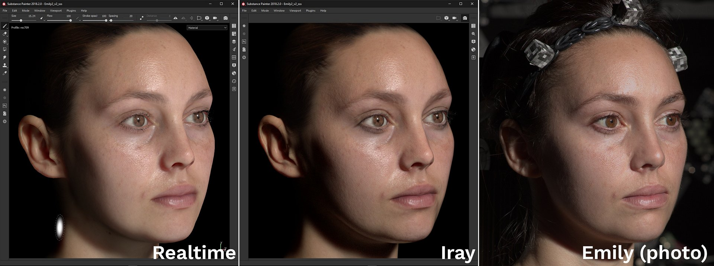{width="650px"}

Above is an example with the well know Digital Emily 2 asset. Thanks to the USC Institute for Creative Technologies and members of the Wikihuman project for allowing us to demonstrate our renders with the Digital Emily 2 assets.  
(Please note this comparison was made under similar but not exact lighting conditions which may explains visual differences.)

To add Subsurface Scattering in a project follow these few steps :

1. Go to the **Display Settings** window and **activate** the **Subsurface Scattering** setting.
1. Add a "**Scattering**" channel in the current texture set
1. Use a fill layer or **paint in white** in the new channel to **reveal** the subsurface effect in the viewport.

A more detailed procedure can be found in the [Subsurface Scattering documentation](../../../features/subsurface-scattering/subsurface-scattering.md).

>[!NOTE]
>
> In order to support Subsurface Scattering in the realtime viewport the **shaders** in the projects have to be **updated**.   
> For custom shaders please refer to the documentation available in the **help menu** for to know what has changed in the **shader API**.

### Manipulators for fill layers

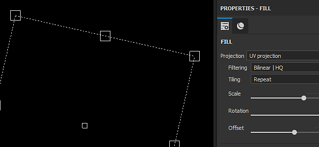

Fill layers controls have been improved to offer manipulators. It is now easier to precisely place and control fill projections.

When using the **UV projection** a manipulator will appear in the **2D View** :

* Clicking **outside** the manipulator will **rotate** it.
* Clicking on the **square** at the **borders** will **scale/resize** it.
* Clicking **inside** the manipulator will **translate** it.
* Use **CTRL** to affect multiple corner in **symmetry**.
* Use **SHIFT** to **constraint** a transformation (translate, rotation or scale).  
   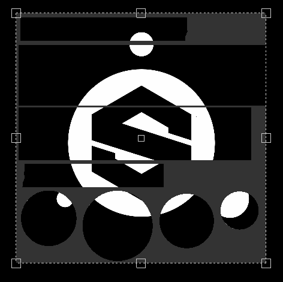

When using the **Tri-Planar projection** a manipulator will appear in the **3D View** :

* The dotted cube represent the global projection
* Use the **W**, **E** or **R** keyboard shortcut to switch between the **Translate**, **Rotate** and **Scale** mode.
* Use the **T** keyboard shortcut to switch between Local and World orientation for the manipulator.
* Use **SHIFT** to **constraint** the transformation.
* The Tri-Planar cube projection can also be modified in the advanced fill layer properties :  
   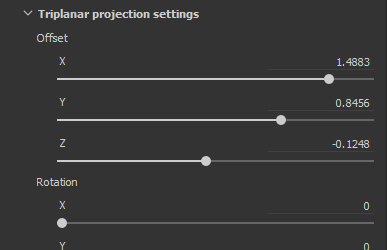   
   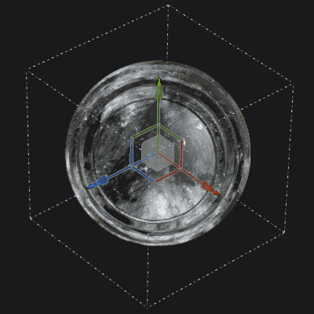

The contextual toolbar at the top of the viewport will also adapt depending of the current projection mode, offering additional tools and controls :

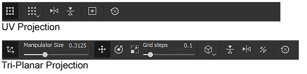

For more details, see the [Fill Layer documentation](../../../painting/fill-projections/fill-projections.md).

### Non-square and non-tilling support for Stencil and Projection tool

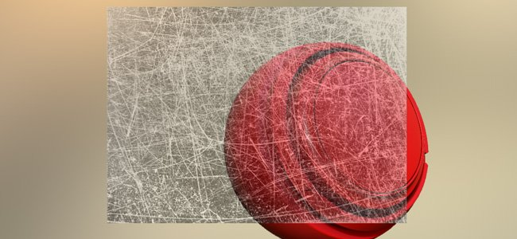

The stencil parameter and projection tool have been improved to support non-square resolutions and non-tilling behaviors.   
The default parameter is now set to non-tilling by default. This parameter can be changed in the tool properties :

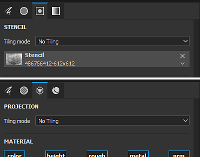

The tilling mode can be set as follow :

* **No Tiling** (default)
* **Horizontal Tiling**
* **Vertical Tiling**
* **H and V Tiling** (old behavior)

This new parameter can be saved in a tool or brush preset, making it easy to share with custom content.

>[!NOTE]
>
> * The projection ratio will also adapt with Substance files that output non-square resolutions. The ratio will be computed directly from the output node.
> * With the projection tool if multiple channels have different ratios, the first ratio found will be applied to all the other channels.

### Camera import and management

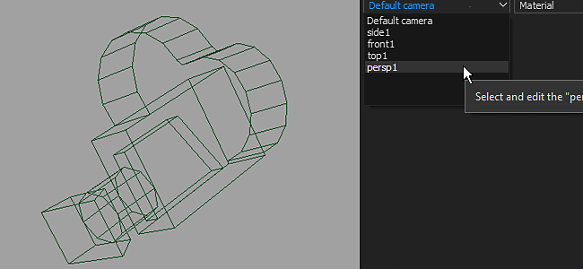

It is now possible to **import custom cameras** inside Substance Painter alongside the mesh import.  
Cameras can be selected **to look through** them in the **3D viewport** and used **to render in Iray**.

For more details, see the [Camera Management documentation](../../../interface/viewport/camera-management/camera-management.md).

To **import cameras** into a project :

1. Export the mesh for the project with cameras in the same file (with a supported format such as FBX, Alembic or glTF)
1. Select the "import cameras" settings in the [new project window](../../../getting-started/project-creation/project-creation.md) (or [project configuration](../../../interface/project-configuration/project-configuration.md)).  
    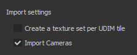
1. Switch to the desired camera with the dropdown in the viewport or by using the settings in the [Display Settings](../../../interface/display-settings/camera-settings/camera-settings.md).  
    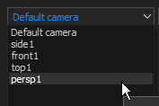

The Camera Settings in the Display Settings window have been extended to control the Camera's properties.   
It is possible to **switch** between cameras, see its **ratio** and **lock** its properties to avoid modifying it. A restore button can be used to revert the camera to its initial values.

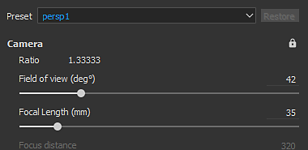

The camera frame (and it's gate) is also taken into account, making it possible to view and paint via a very specific point of view. The frame and gate are displayed over the 3D Viewport and its opacity can be controlled in the **Viewport Settings** from the [Display Settings](../../../interface/display-settings/camera-settings/camera-settings.md) window :

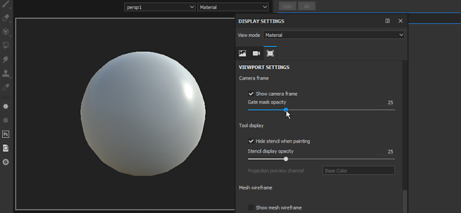

### Layer stack behavior improvements

* **Drag and Drop Materials and Smart Materials onto the ID map :**   
  The drag and drop of content from the shelf into the viewport has been improved. By pressing **CTRL** while drag and dropping a material it is now possible to choose the ID color that will be used as a mask.  
  A black mask with a color selection effect will be added to the new layer created in the layer stack. If the same material is drag and dropped onto an other ID color, the already existing layer will be updated and the ID colors will be combined..  
   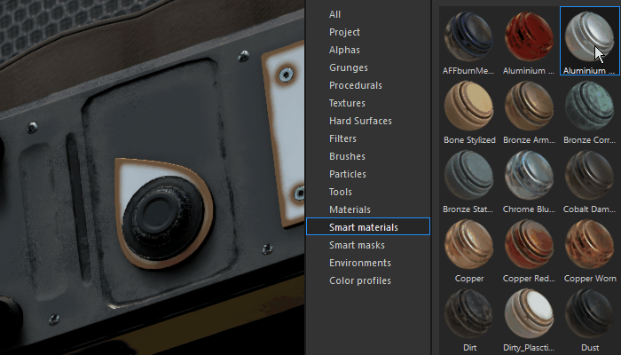
* **Layer stack drag and drop scroll :**   
  Dragging layers around the layer stack is now with a small window.   
  When a resource or a layer is dragged near the borders of the layer stack window, it will automatically start to scroll its content.   
   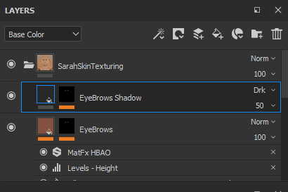

### glTF and Alembic mesh import

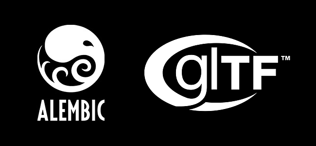

New file formats are now supported for importing meshes and creating new projects :

* **glTF** : This format was already available when exporting textures and can now be used during the import. If a glTF file contains textures they will be imported and placed inside the layer stack (for the metallic/roughness workflow).
* **Alembic** : This format is widely used in the VFX / Animation industry to transfert meshes.

>[!NOTE]
>
> Substance Painter doesn't offer a way to control which frame of animation should be imported at the moment.   
> This means that when exporting an Alembic file the frame of reference to be used for painting on the asset has to be already set.

### Substance integration improvements

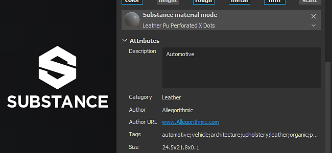

The Substance integration inside Substance Painter has been improved with long awaited requests :

* <b>Visible If :</b>  
  The "Visible if" is a great feature of the Substance file format which allows to hide parameters based on conditions.  
  This feature provides a more clear list of parameters and contextual settings, giving overall more easy to use materials and filters.  
  For more details see the [Substance Designer documentation](../../../../substance-3d-designer/home/home.md).  
  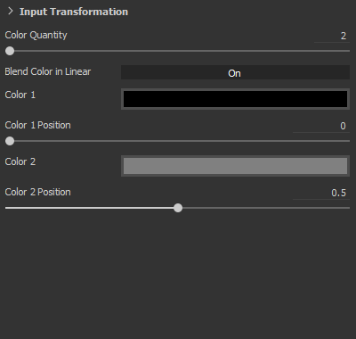
* **Substance Presets** Substance presets are an easy way to provide advanced tweaks and variations of materials. Many materials on [Substance Source](https://source.allegorithmic.com) have presets, so give it a try !  
  If a Substance file contains one or more presets, a new dropdown in the parameter list will be available. Select which preset to apply to update the parameters.  
   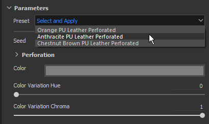
* **Substance Attributes**   
  Substance attributes are now displayed in the interface, making it easier to retrieve information about a specific file.  
  Attributes can be viewed in two different location : above the parameters in the properties window or by right-clicking on an asset in the shelf.  
   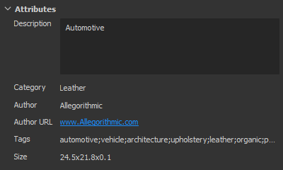 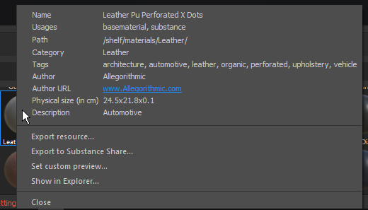

### New sample project "Jade Toad"

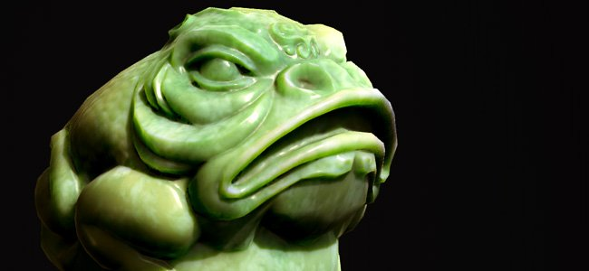

A new sample project named "**JadeToad**" is now included with Substance Painter. This sample project has the **Subsurface Scattering** effect enabled by default.  
To find the project, use the **File** &gt; **Open Sample...** menu entry.

## Release Notes

### 2018.2.3

(Released September 25, 2018)

****Fixed:****

* &#91;2D View&#93; 2D View is broken with some meshes when creating a new project
* &#91;Crash&#93; Switching from UV projection to tri-planar projection leads to a crash
* &#91;RayCollider&#93; Multiple crashes due to "RayCollider"
* &#91;Tool&#93; Switching layers lose the modified brush properties
* Brush settings are reseted when switching to the eraser

**Known issues:**

* Computation freeze on AMD VEGA GPUs
* Huion tablet issue with shortcuts on Windows OS

### 2018.2.2

(Released September 11, 2018)

**Added:**

* Summary: Hotfix with content update, new scripting functionalities and being able to disable the auto update
* &#91;Content&#93;&#91;Shelf&#93; Add a Skin shelf preset
* &#91;Content&#93;&#91;shelf&#93; Conversion of 19 skin normals into materials for subsurface scattering
* &#91;Scripting&#93; Create a project template from an open project
* &#91;Scripting&#93; Get/Set export settings of an opened project
* &#91;Updates&#93; Be able to disable the auto update pop-up from settings and environment variable
* &#91;Updates&#93; Have a not display until next version on the maintenance outdated pop-up

**Fixed:**

* &#91;Camera&#93; Wrong zoom by switching from orthographic to perspective
* &#91;Display&#93; Some maps are displayed in linear instead of sRGB
* &#91;Viewports&#93; Mesh focus does not behave properly
* &#91;2D View&#93; Project with broken camera has disappearing UVs Shells
* &#91;SSS&#93;&#91;Tooltip&#93; subsurface scattering tooltips appear in the log
* Some projects cannot be opened in 2018.2 and error message can't save a null substance package
* &#91;Mask&#93; Paint tool color can be stuck in some cases when working in a mask
* &#91;Material&#93; Maps not appearing in specific situations
* &#91;Proj&#93;&#91;Tools&#93; Manipulator active with a generator
* &#91;Substance&#93; Missing Substance groups of parameters
* &#91;Scripting&#93; Incorrect software name in documentation
* &#91;UDIMs&#93; No information in log about UVs shells on multiple UVs tiles

**Known issues:**

* Computation freeze on AMD VEGA GPUs
* Huion tablet issue with shortcuts on Windows OS

### 2018.2.1

(Released August 3, 2018)

**Fixed:**

* Missing subsurface scattering shader parameters from upgrading projects

**Known Issues:**

* Computation freeze on AMD VEGA GPUs
* Huion tablet issue with shortcuts on Windows OS

### 2018.2

(Released August 2, 2018)

**Added:**

* Summary: Summer release, subsurface scattering Support, projection and fill improvements, camera import and selection, Alembic/glTF support, drag and drop on ID map, improved Substance format support and new content
* &#91;SSS&#93;&#91;Viewport&#93;&#91;Iray&#93; Generic subsurface scattering
* &#91;SSS&#93; Sync MDL and subsurface scattering parameters
* &#91;SSS&#93; Added a new grayscale channel named "Scattering"
* &#91;SSS&#93;&#91;Shader Settings&#93; Scattering type parameter for subsurface scattering (skin or translucent)
* &#91;SSS&#93;&#91;Shader Settings&#93; Scattering scale parameter for subsurface scattering
* &#91;SSS&#93;&#91;Shader Settings&#93; Scattering color parameter for subsurface scattering
* &#91;SSS&#93;&#91;Display Settings&#93; Scattering Sample count for subsurface scattering
* &#91;Shader&#93;&#91;Iray&#93; Integrate subsurface scattering MDL for Iray
* &#91;Shader&#93; Shader update via the resource updater
* &#91;Shader&#93; Update change log API and documentation
* &#91;Tool Properties&#93;&#91;Proj&#93; New parameters for the triplanar projection
* &#91;Viewport&#93;&#91;Proj&#93; Control Fill Layer properties in 3D view directly with manipulators (triplanar projection)
* &#91;Shortcuts&#93;&#91;Proj&#93; New shortcuts Q, W, E, R, T for triplanar projection manipulators
* &#91;Viewport&#93;&#91;Proj&#93; Control Fill Layer properties in 2D view directly with manipulators (UV projection)
* &#91;Shortcuts&#93;&#91;Proj&#93; New shortcut Q for UV projection manipulators
* &#91;Contextual Toolbar&#93;&#91;Proj&#93; Control triplanar projection manipulators
* &#91;Contextual Toolbar&#93;&#91;Proj&#93; Control UV projection manipulators
* &#91;Tool Properties&#93; Disable texture tiling with projection and Stencil tool
* &#91;Stencil&#93; Use non-squared images with the projection tool/stencil
* &#91;Stencil&#93; Allow control of tiling mode in Properties window
* &#91;Stencil&#93; Zoom is not centered on a non-tiling stencil
* &#91;Cameras&#93; Import cameras from Maya, Max, Blender, Modo, DAE
* &#91;Cameras&#93;&#91;Viewport&#93; Select and control imported cameras in viewport
* &#91;Cameras&#93;&#91;Iray&#93; Select and control imported cameras in Iray
* &#91;Cameras&#93;&#91;UI&#93;&#91;New project&#93;&#91;Project configuration&#93; "Import cameras" is checked by default
* &#91;Cameras&#93;&#91;Shortcuts&#93; Add shortcuts "&lt;" and "&gt;" to switch between cameras
* &#91;Cameras&#93;&#91;Viewport&#93; Add frame in viewport
* &#91;Cameras&#93;&#91;Viewport Settings&#93; Control of frame opacity
* &#91;Cameras&#93;&#91;Camera Settings&#93; Maximum focal length at 500mm
* &#91;Cameras&#93;&#91;Camera Settings&#93; Expose ratio
* &#91;Cameras&#93;&#91;Camera Settings&#93; Add a lock option
* &#91;Cameras&#93;&#91;Camera Settings&#93; Add a restore option
* &#91;Cameras&#93;&#91;Camera Settings&#93; Add focus distance attribute
* &#91;glTF&#93; Import of a glTF file
* &#91;glTF&#93; Import ambient occlusion map
* &#91;Alembic&#93; Import Alembic 1 frame with static geometry
* &#91;Shelf&#93; Drag and drop materials directly onto the mesh using ID maps with a modifier (CTRL/Command)
* &#91;Layer Stack&#93; Automatic ID mask creation with drag and drop of materials on mesh with ID maps
* &#91;Layer Stack&#93; Automatic scroll of layers with drag and drop across the layer stack
* &#91;UI&#93;&#91;Tool Properties&#93; Expose Substance's preset
* &#91;UI&#93;&#91;Help menu&#93; Improvement of the Help menu
* &#91;UI&#93;&#91;New Project&#93;&#91;Project Configuration&#93; Reorganization of the window
* &#91;UI&#93;&#91;New Project&#93;&#91;Project Configuration&#93; Replace "Mesh" term by "File"
* &#91;UI&#93;&#91;Substance&#93; Display Substance attributes in UI
* &#91;Shortcuts&#93; "F4" switches between 2D and 3D view
* &#91;Shortcuts&#93; New shortcuts for toggle stencil "N" and quick mask "U"
* &#91;Substance integration&#93; Take into account 'visible if' statements in the Substance parameters
* &#91;Viewport&#93; Shadows not forced to be computed after camera move
* &#91;Content&#93; Update MeetMat with imported cameras
* &#91;Content&#93; Add a sample with subsurface scattering enabled - JadeToad
* &#91;Content&#93; Add a new PBR project template with subsurface scattering enabled
* &#91;Content&#93; Updated export presets to add new Scattering channel
* &#91;Content&#93;&#91;Shelf&#93; Added subsurface scattering support for: pbr-metal-rough, pbr-metal-rough-alpha-test, pbr-coated, pbr-spec-gloss
* &#91;Content&#93;&#91;Shelf&#93; Added Scattering channel to 5 smart materials (marbles and skins)
* &#91;Content&#93;&#91;Shelf&#93; 1 new jade Material
* &#91;Content&#93;&#91;Shelf&#93; 1 new wax Material

**Fixed:**

* &#91;CMD&#93; Different results using same command line with different versions
* &#91;TDR&#93; If TdrLevel is set up you don't have any errors in your log
* &#91;Baker&#93; Ambient occlusion map is flipped
* &#91;ID Map&#93; Crashing when picking outside of 0-1 range
* &#91;Iray&#93; Crash when switching texture sets and going back to Paint mode
* &#91;Viewport&#93; Sync drop areas between viewports for drag and drop
* &#91;Engine&#93; Moire artifact when tiling fill layers or painting small brush
* &#91;License&#93; License service bad software version check
* &#91;License&#93; Rework the way we handle authentication
* &#91;API&#93; Call the `onNewProjectCreated` scripting API event even when creating with a template
* &#91;Shader&#93; Compiled shader is not loaded from cache when shader file doesn't compile
* &#91;Shelf&#93; Exporting HDR file from the shelf will output a file with clamped values
* &#91;Export&#93; EXR export clamps RGB color values between 0-1
* &#91;Content&#93; Procedural noise "3D Perlin Noise Fractal" is pixelated

**Known Issues:**

* Computation freeze on AMD VEGA GPUs
* Huion tablet issue with shortcuts on Windows OS
