# Version 2018.3

**Substance Painter 2018.3** is here and brings a lot of new workflows and rendering features !

Release date : *20 November 2018*

## Major Features

### 2D View Export

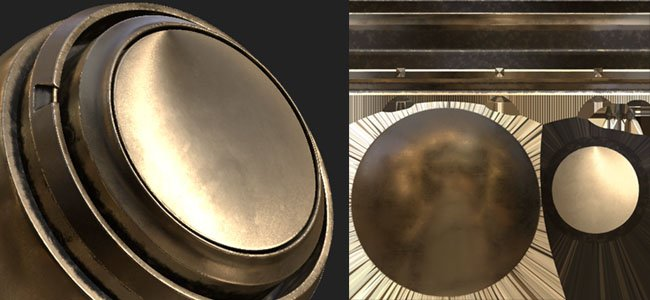

It is now possible to **export the 2D view** rendering **as a texture**. This feature has been requested by many people and we finally made it available ! The export process will take the current state of the **2D view** to render a texture with the regular export settings (padding, file format, bit depth). This means if the view mode is set to **Solo** instead of the **Material** mode the 2D view will be exported as-is.

Head over to the **Export window** and choose the new configuration named "**2D View**" :  
 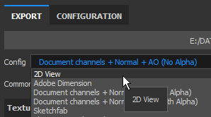

A new **Converted Map** named "**2D View**" is also available in the **Configuration** tab of the Export window in case you wish to create your own **export preset**.

### Improved Baked Lighting Filter

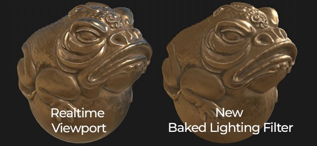

The **Baked Lighting Environment** filter has been greatly improved and now properly supports **HDR environment maps**.  
You can now replicate the lighting of the viewport (as seen in the 2D view) and bake it down into the Base Color channel. The new filter provides further controls such as **rotating** the **environment** map **vertically** and changing the **exposure**.

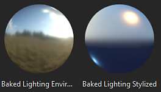

### Real-time Anisotropic Specular Reflections

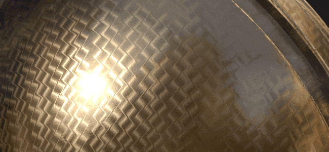

In this new version we introduce a new shader named "**pbr-metal-rough-anisotropy-angle**". This shader supports two channels named "**Anisotropy Angle**" and "**Anisotropy Level**" which can be used to create anisotropic specular reflections. This shader will also translate into Iray as-is without the need of any conversion.

This new shader can be accessed through the [Shader Window](../../../interface/shader-settings/shader-settings.md) by clicking on the shader button and opening the mini-shelf :

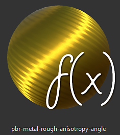

The default sample project "**Preview Sphere**" has been updated to take advantage of that new shader and showcase how to setup the different channels.

>[!NOTE]
>
> If you have strange looking **line artifacts** appearing when using gradients inside the **Anisotropy Angle** channel, try changing the filtering mode to "**Nearest**" in case of a fill layer as this might improve the sampling for the shader and get rid of the problem.

### Updated Clear Coat Shader

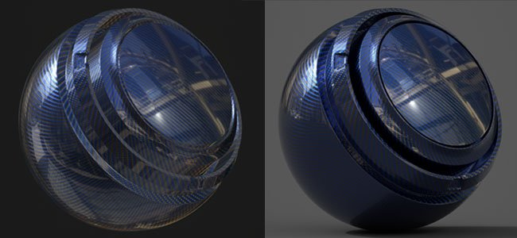

The **Clear Coat** shader (**pbr-coated**) has been improved to offer more controls and rendering possibilities. We also took the opportunity to make it compatible with **Iray** with a dedicated **MDL**.

Here is a list of the changes :

* **Control** the secondary **Roughness** layer (via **User0** channel).
* **Mask** out the secondary layer (via **User1** channel).
* Choose which behavior to apply for the surface layer : **Keep Normal Details** (original) or **Smooth surface** (new, ignore mesh normal map)

For convenience we also added a new project template ready for texturing this new shader named : **PBR - Metallic Roughness Coated**.

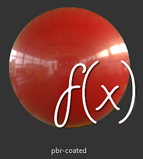

### New Viewport Anti-Aliasing

We Anti-Aliasing post-process of Substance Painter has been reworked and changed to a new method called "**Temporal Anti-Aliasing**" (**TAA**).   
This new technique offers much better results in every case for a very minimal cost. **TAA** works by accumulating information across multiple frames, allowing to produce very smooth edges without losing details.

Since it is no longer a post-effect, the setting has moved a bit inside the **Display Settings** window and is now **below** the **Post-Effects** section.

This new Anti-Aliasing also offers new possibilities when combined with transparency. If a project is using the **Alpha-Test** shader, try enabling the "**Alpha Dithering**" setting :

The new **TAA** will also filter nicely the Blue Noise pattern visible in the **Specular reflections** as well as in the **Subsurface Scattering** samples.

### Sparse Virtual Texturing (SVT)

One big change in this new version is the introduction of the **Sparse Virtual Textures** or **SVT**.

This new system changes some fundamentals of Substance Painter and the way the application works. Substance Painter now uses the SVT as a way to maintain a specific memory footprint for the viewport allowing to **stream in and out textures**. The main benefit is the ability to load bigger projects with more ease and reduce the pressure on the GPU to **improve performances**. This means that if things start to get too big will unload some textures on the disk and retrieve them back later if necessary). This is a **volatile cache** which is deleted when the application closes.

Another benefit of the system is the introduction of **mipmaps** inside the **viewport** which will improve texture quality and reduce the Moire effect especially visible with Fabric patterns.

We exposed a few controls regarding this new system which can be edited in the main preferences (**Edit &gt; Settings**) :

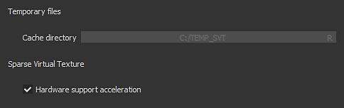

* **Cache directory** : this setting controls where Substance Painter will write its temporary files, including the SVT cache.
* **Hardware support acceleration** : If enabled, Substance Painter will use the native support of Sparse Textures by the GPU (if disabled it will fallback on a software implementation)

For more information about the SVT take a look at our documentation page : [Sparse Virtual Textures](../../../features/sparse-virtual-textures/sparse-virtual-textures.md)

>[!NOTE]
>
> It is recommend to set the **Cache directory** on a **Solid State Drive (SSD)** to ensure the best performances while working with Substance Painter.
> 
> These settings can be overridden via environment variable : [Environment variables](../../../pipeline-and-integration/configuration/environment-variables/environment-variables.md).

### New and Improved Symmetry tool

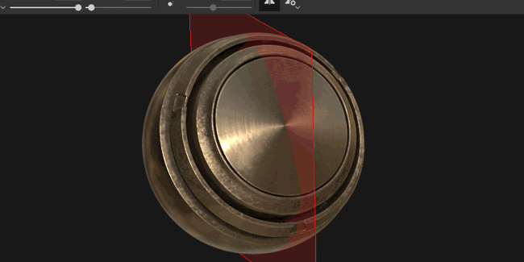

The symmetry tool has been reworked and now allows to offset the point of origin. When a project is partially symmetrical or off-center the plan can now be adjusted. The offset will be saved inside the project per axis.

We also took the opportunity to give that feature some love and now have new visual feedback :

* An **intersection line** is now drawn by **default** on the mesh to show where the plane of symmetry is.
* A **mirrored point** now appears when moving the **cursor** to show where the mirror brush stroke will be applied.

All the new visuals can be tweaked via the new Symmetry menu in the Contextual Toolbar :

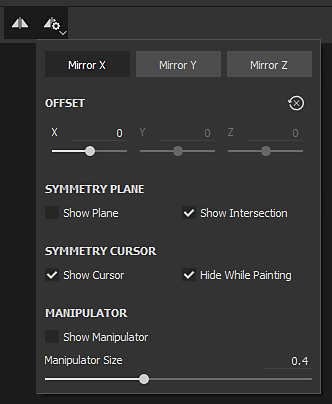

* **Mirror X, Mirror Y, Mirror Z** : Define which direction is used for the symmetry
* **Offset** : Controls the offset value per axis. The Cross Arrow icon allow to reset all the offsets back to 0.
* **Symmetry Plane** : Show Plane allows to draw a plane that cut the mesh. Show intersection draws a line on the mesh where the plane cuts the mesh.
* **Symmetry Cursor** :Show Cursor will draw a secondary brush cursor where the symmetry is applied. Hide While Painting will only show that cursor when not painting.
* **Manipulator** : Show Manipulator will display a manipulator in the viewport to offset the symmetry plane. **Manipulator Size** controls how big the controller will be in the viewport.

The same **shortcuts** as for the Tri-Planar and UV manipulator can be used to hide/show the Symmetry Manipulator :

* **Q** : Show/Hide Manipulator
* **Shift** : Snap translation (discrete offset)
* **+ / -** : Change Manipulator size

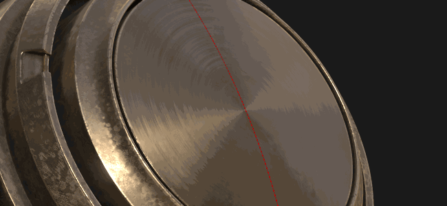

### Improved Tri-Planar manipulator

In addition to the 3 orignal axes for controlling the rotation, we also added a new rotation sphere when controlling the Tri-planar manipulator. The sphere makes it easier to quickly try different angles when projecting noise patterns for example.

### Export 8bit Dithered Textures

When exporting Normal and Height map textures to file formats in 8 bit mode Substance Painter will now automatically apply **dithering** to reduce **banding** **issues**.

>[!NOTE]
>
> In case an export preset use a normal map but something else in the alpha (like RGB = Normal, A = Roughness) only the normal will be dithered.

### Layer stack behavior improvements

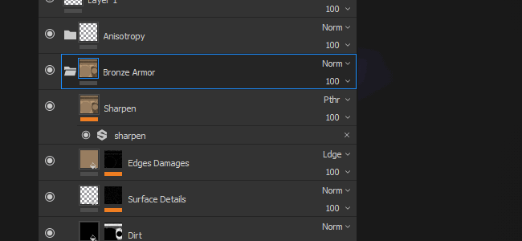

A few workflow improvements have been made to the layer stack and layer management :

* Assign **color** to **layers** and **folders** inside the Layer Stack via the **right-click** menu to organize layers.  
  Substance Painter layer colors behave a bit differently than in other software packages however :
  * Layers inside a folder will inherit the color of the folder (but will appear dimmed).
  * Moving a layer without a color assigned inside a folder that has a color will inherit the folder color.
  * If a layer has a dedicated color it won't be overridden by the folder.This original behavior makes it easier to colorize and organize the layer stack without having to assign too many colors by hand.

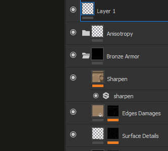

* Quickly **hide and unhide** multiple **layers** by **clicking and sliding** the mouse.  
  We also took this opportunity to refine a bit the behavior of un-hiding layers inside hidden folders which will now un-hide the folder as well.

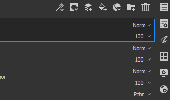

* Quickly **switch between blending modes** with the **Arrow** keyboard **shortcuts**.  
  After **closing** the blending pop-up menu the **focus** will **remain** on the layer which and can continue being changed with the same previous shortcut.

### New Substance Inputs for Filters and Generators

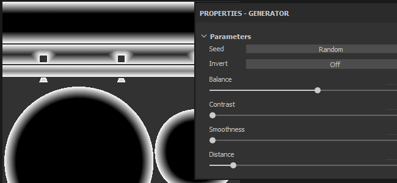

New Substance inputs have been exposed for custom filters and generators. These new texture inputs allow the creation of more advanced effects thanks to new mesh related information.

The new inputs available are :

* Mesh Position
* Mesh World Space Normal
* Mesh World Space Tangent
* Mesh World Space Bitangent
* Mesh Texel Size
* Mesh UV Mask

For more details see the new documentation : [Mesh Based Input](../../../content/creating-custom-effects/mesh-based-input/mesh-based-input.md)

As an example we now provide a new **mask generator** named "**UV Border Distance**" which creates a black and white mask from the border of the UV islands of the current Texture Set.

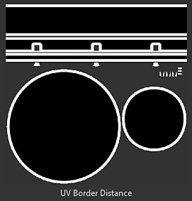

>[!NOTE]
>
> These inputs are provided directly from the engine of Substance Painter based on the project Mesh and don't use the [Bakers](../../../baking/baking.md).

### New and Updated Content

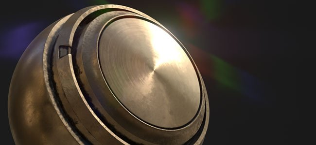

In this new version we included new content :

* New procedural **Gradient** patterns to be used with the new **Anisotropic** shader :

  * Anisotropic Radial
  * Gradient Circular
  * Gradient Disc Overlap
  * Gradient Disc Shifted
  * Gradient Flakes
  * Gradient Alternate
  * Gradient Checker
  * Gradient Checker Double
  * Gradient Weave
  * Gradient Weave Rotated
  * Gradient Weave Angle
  * Gradient Weave Angle Rotated   
     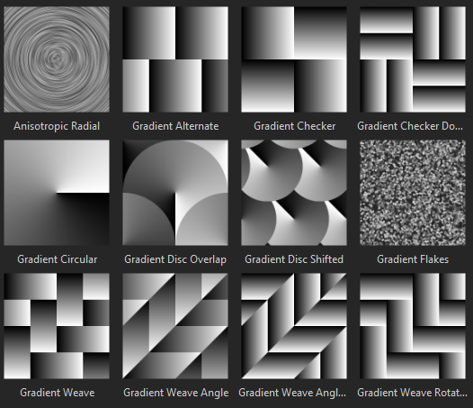
* New **environment** map :

  * Studio Automotive Neutral   
     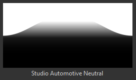
* New **project**  **templates** :

  * PBR - Metallic Roughness Anisotropy Angle
  * PBR - Metallic Roughness Coated
* New **material** :

  * Human Female 30s Face 06 (can be quickly found via the Skin preset in the shelf)  
    This new skin material has been provided by **Texturing.XYZ** and gives great surface details to paint realistic skin.  
     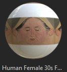

We also updated some of the existing content to refine it :

* Updater filter "**Baked Lighting Environment**" : See above.
* Updated filter "**MatFx Shutline**" : Now allows to hide the material effect and only keep the height/normal result.
* Updated **Sample project** : The Preview Sphere can now be used with symmetry and has a new camera angle for custom renders. Its default shader is now "Anisotropy Angle".

## Release Notes

### 2018.3.3

(Released March 7, 2019)  
  
**Added:**

* &#91;Content&#93; Integrate new project template: "PBR - Metallic Roughness Alpha-blend"
* Linux Dynamic library search order changed to prioritize libraries in the installation directory ahead of what is installed on the system

**Fixed:**

* Mesh sometimes disappears from the 3D viewport (press F to reset camera)
* &#91;glTF&#93; Update Substance Painter Sketchfab uploader with the new Sketchfab license types
* &#91;Import&#93;&#91;glTF&#93; Wrong handling input texture modulation as defined in glTF files
* &#91;Import&#93;&#91;glTF&#93; Ground plane is incorrectly displayed with glTF import in some cases
* &#91;Export&#93;&#91;USD&#93; Opacity does not work in Arkit
* &#91;Export&#93;&#91;USD&#93; USDz export crashes in some cases
* &#91;Export&#93;&#91;USD&#93; Export to USD without saving leads to crash
* &#91;Export&#93;&#91;USD&#93; Incorrect tiling mode for textures, subdivision mode for meshes and output types for shaders
* &#91;Export&#93;&#91;USD&#93; Sparse exports of only some texture sets with all geometry
* &#91;Instance&#93; Crash when trying to delete a broken instance layer
* &#91;Regression&#93;&#91;Export&#93; Some maps not exported in the chosen bit depth
* &#91;Linux&#93; Issue with library libtbb.so.2

**Known Issues:**

* Computation freeze in some cases on AMD VEGA GPUs
* Huion tablet issue with shortcuts on Windows OS

### 2018.3.2

(Released January 24, 2019)

**Added:**

* Summary: hotfix with new features
* &#91;Export&#93; Allow export to USDZ
* &#91;Viewport&#93; Allow to control the texture quality in the Display Settings
* &#91;Viewport&#93; Added mip bias setting in Display Settings
* &#91;Viewport&#93; Added anisotropic filtering in Display Settings
* &#91;plugins&#93; Update official plugins to use the style of Substance Painter 2018
* &#91;License&#93; Install license by default in a user folder

**Fixed:**

* Crash linked to decompression
* Add TAA on solo material
* Noise with shadow, TAA and alpha test shader with dithering
* Remove specular dithering for all classic PBR shaders
* Crash in the shader settings in some cases
* Scattering activation is not synchronized between OpenGL and Iray renders
* Smudge and clone tools do not work anymore on specific meshes
* Some texture sets can not appear in Iray render
* Renamed Texture Sets are not saved after closing project
* Wireframe artefacts when drag and dropping materials on ID maps
* &#91;Scripting&#93; File path creation not forced when saving a project
* &#91;Scripting&#93; Callback “onProjectAboutToSave()” doesn’t work anymore
* Forum links broken in report bug window

**Known Issues:**

* Computation freeze in some cases on AMD VEGA GPUs
* Huion tablet issue with shortcuts on Windows OS

### 2018.3.1

(Released December 06, 2018)

**Added:**

* Summary: hotfix
* &#91;Symmetry&#93;&#91;Viewport&#93; Symmetry painting in the 2D view is back and now features a clone brush preview fixed

**Fixed:**

* &#91;Export&#93; 2D view export outputs a black texture in some cases
* &#91;Iray&#93; Normal information becomes incorrect in Iray after instancing a material layer
* Non square texture sets can lead in some cases to crash
* &#91;Undo&#93; Several Ctrl+Z can randomly lead in few cases to crash
* &#91;QML&#93; AlgScrollView can create a warning in the log in some cases (binding loops)

**Known Issues:**

* Computation freeze in some cases on AMD VEGA GPUs
* Huion tablet issue with shortcuts on Windows OS
* Anti-aliasing and shadows when active together may give unexpected results

### 2018.3.0

(Released November 20, 2018)

<b>&lt;b&gt;Added:&lt;/b&gt;</b>

* Summary: viewport upgrades, proper 2D view export, new UI helpers, an enhanced symmetry tool, new content and a huge boost in performance
* &#91;Anti-aliasing&#93;&#91;Viewport&#93; New temporal anti-aliasing filtering for 3D viewport (via Display Settings)
* &#91;Export&#93; Export the content of the 2D viewport as a single texture
* &#91;Export&#93;&#91;Dithering&#93; Expose dithering at export
* &#91;Layer stack&#93; Colors on layers and folders
* &#91;Layer stack&#93; Quick activation and deactivation of multiple layers and effects
* &#91;Layer stack&#93; Easier navigation for blending modes with up down keys and mouse scroll
* &#91;Proj&#93;&#91;UI&#93; Additional rotation manipulator on all three axis for triplanar
* &#91;Proj&#93;&#91;Shorcuts&#93; - and + to change the UV projection manipulator size
* &#91;Shader&#93; Control coated layer parameters with channels in the PBR-coated shader
* &#91;Substance&#93; Expose new mesh-based texture inputs for filters and generators
* &#91;Symmetry&#93;&#91;Viewport&#93;&#91;UI&#93; Control symmetry offset with manipulators
* &#91;Symmetry&#93;&#91;Contextual toolbar&#93;&#91;UI&#93; New symmetry panel with options
* &#91;Symmetry&#93; New symmetry line intersection mode
* &#91;Symmetry&#93; New symmetry clone cursor
* &#91;Symmetry&#93;&#91;Shortcuts&#93; Q to hide and -, + to change size and shift to snap
* &#91;Log&#93; Improve error messages when unable to export textures
* &#91;Scripting&#93; Allow to change or update the resources in Display Settings
* &#91;Scripting&#93; Allow to create or remove channels in Texture Sets
* &#91;Content&#93;&#91;Shaders&#93; Add support for anisotropy with a dedicated shader (pbr-metal-rough-anisotropy-angle)
* &#91;Content&#93; Update of the preview sphere with anisotropy and modified angle
* &#91;Content&#93; Updated matFx shutline
* &#91;Content&#93; New Texturing.XYZ seamless face scan
* &#91;Content&#93; New anisotropic procedurals
* &#91;Content&#93; New filter: baked lighting environment
* &#91;Content&#93; New environment map: studio automotive neutral
* &#91;Content&#93; New project template: PBR - metallic roughness Anisotropy angle (with anisotropy channels)
* &#91;Content&#93; New project template: PBR - metallic roughness Coated
* &#91;SVT&#93;&#91;Engine&#93; Sparse Virtual Textures (SVT)
* &#91;SVT&#93;&#91;Preferences&#93;&#91;UI&#93; SVT hardware support acceleration option
* &#91;SVT&#93;&#91;Log&#93; Additional information for Sparse Virtual Texturing feature (e.g. size disk)
* &#91;SVT&#93;&#91;UI&#93; Message window at start if size on disk too low for the cache
* &#91;SVT&#93;&#91;Preferences&#93;&#91;UI&#93; Substance Painter global cache location
* &#91;SVT&#93; New environment variable to specify the path of the cache of Substance Painter
* &#91;SVT&#93; New environment variable to activate the SVT hardware support acceleration
* &#91;SVT&#93; Detect sparse support by hardware
* &#91;SVT&#93;&#91;Hardware Sparse&#93; Raise minimum driver version for Nvidia GPU
* &#91;SVT&#93;&#91;Shader&#93;&#91;Viewport&#93;&#91;UI&#93; Warn user if artefacts present with Sparse Virtual Texturing at project opening

<b>&lt;b&gt;Fixed:&lt;/b&gt;   
</b>

* &#91;Color Picker&#93; Painting cursor appearing when trying to pick a color
* Crash by Selecting or Unselecting layers in a specific order can lead to crash
* Crash when pasting as an instance a layer with a mask
* &#91;User Channel&#93;&#91;Regression&#93; Crash when renaming user channel
* &#91;User Channel&#93; Grayed brush preview
* &#91;Alembic&#93; Only one texture set from several materials after import
* &#91;Engine&#93; Exported texture differs from viewport for brush stamps
* &#91;Engine&#93; Invert with a level effect does not fully affect a texture
* Material picker is applying a brush stroke while picking
* Switching resolution to 128x128px leads to a crash
* Mesh map links are not updated properly when rebaking or instancing layers
* &#91;Substance&#93; UserData ColorSpace does not work on Baked Mesh Normal requested as input
* MDL association mismatch when using multiple shaders instances
* &#91;Symmetry&#93;&#91;Fill Layer&#93; Symmetry plane and its manipulator active in Fill Layer
* &#91;Viewport&#93; Pivot point for translation not always updated after clicking
* &#91;UI&#93; Fixed icons and removal of placeholders for HDPI monitors

<b>&lt;b&gt;Known issues:&lt;/b&gt;   
</b>

* Computation freeze on AMD VEGA GPUs
* Huion tablet issue with shortcuts on Windows OS
* Anti-aliasing and shadows when active together may give unexpected results

<b>  
</b>
