# Version 2019.1

**Substance Painter 2019.1** expands upon its existing features and also introduces new artistic tools. This release focus as well on delivering lots of new content.

Release date : *23 April 2019*

## Major Features

### Dynamic Strokes

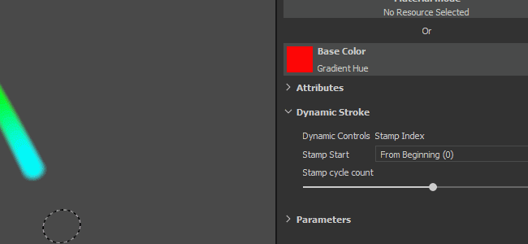

With this release our brush engine now supports what we call Dynamic Strokes. These type of strokes create variations and new effects thanks to the generation of new Substance versions on the fly. Having a new Substance material or alpha for each new brush stroke painted on your asset is now possible.

When a Dynamic Stroke compatible resource is loaded in your Paint tool (Paint, Eraser, Smudge or Clone) a new parameter group will appear :

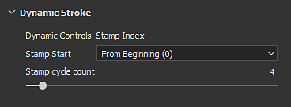

Dynamic Strokes supports the following properties (if exposed in the Substance graph) :

* **Stamp Index** : ID / Number of a stamp inside a stroke.
* **Random Seed** : Can change per stamp or per stroke.
* **Time** : Elapsed painting time of a brush stroke, painting fast or slower produce different results.

The Stamp Index comes with two other parameters :

* **Stamp Start** : *From Beginning* (always start the index from 0) or *From Random Index* (choose a random position between 0 and the maximum defined by **Stamp Cycle Count**).
* **Stamp Cycle Count** : This parameter defines the total amount of Substance variations that will be generated. In order to optimize performances this parameter works as a limit. Substance Painter use it to recycle what has already been generated instead of creating something new.

You can find resources compatible with this new feature simply by browsing the shelf and looking at the new icons which are now sitting next to them :

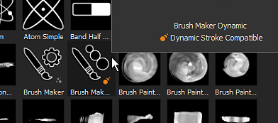

Resources compatible with the feature also get automatically a new tag named "**dynamicstroke**" to make them easy to filter by keywords in the Shelf.

We also added a lot of new **tool presets** to play with :

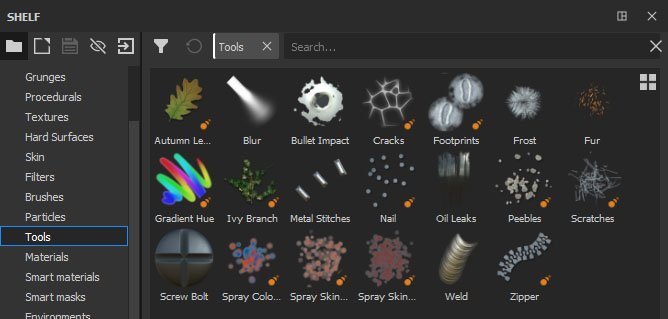{width="450px"}

>[!NOTE]
>
> To know more about this feature (and its performance impact) take a look at the [dedicated documentation](../../../help/painting/dynamic-strokes/dynamic-strokes.md).

### Displacement And Tesselation

Substance Painter now supports **Displacement** and **mesh Tesselation** in both its realtime viewport and in Iray. They can both be controlled in the **Shader Settings** window below the shader parameters.

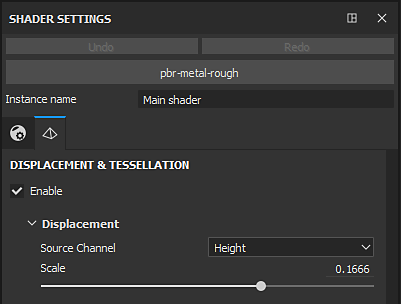

* **Source Channel** : Channel from which the mesh deformation is based on. Default is Height but can be set to Displacement as well.
* **Scale** : Controls the amount of deformation applied to the mesh in the project.

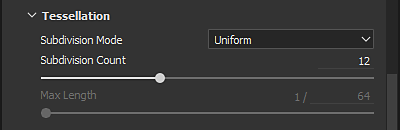

* **Subdivision Mode** : Uniform or Edge Length. Determines how the amount of subdivision is computed.
* **Subdivision Count** : (Mode Uniform) From 1 to 32. A high value produce more polygons which gives more details but can introduce performance issues.
* **Max Length** : (Mode Edge Length) 1 / Value. Every polygon edge is divided until each segment is equal to or shorter than this number, 1/1 being the size of the scene.

Load the "**Tiling Material**" sample project (via **File &gt; Load Sample**) to quickly give a try at this new feature :

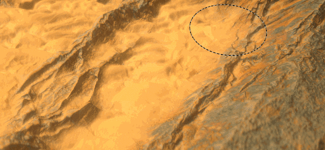{width="450px"}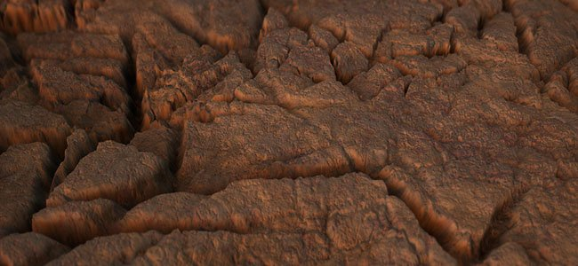{width="450px"}

>[!NOTE]
>
> A new filter named "**Height To Normal**" has been added in the Shelf and can be used to get the final normal map (in case the native conversion by Substance Painter is not strong enough).

### Compare Mask Effect

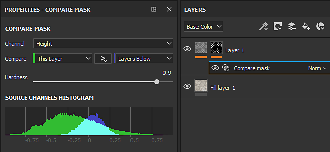

Creating and blending materials can be a bit tough sometimes which is why we created a new effect named "**Compare Mask**". This effect allows to quickly and easily compare two channels and produce a mask as a result.

The Compare Mask effect has the following properties :

* **Channel** : The channel to compare between the source and the target to create a mask from.
* **Compare** : Three parameters are available here to chose how the mask should be computed. The dropdown in the middle define the comparison operation (lesser than, within tolerance, greater than).
* **Constant** : Value to compare against when the compare setting is set to "constant".
* **Hardness** : Control the smoothness/hardness of the resulting mask comparison.
* **Histogram** : Provide an histogram view of the source and the target. Useful to know if they overlap a bit or not at all (if they don't overlap the mask will be empty).

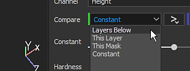

To make things even more easier to setup, you can right-click on a layer and choose the shortcut "**Add mask with height combination**" to quickly add this new mask on your layer. This shortcut will also switch your Height channel blending mode to "Normal" instead of the default "Linear Dodge (Add)".  
 

### Radial Symmetry

We expanded the capabilities of our symmetry tool to handle radial symmetry. There is now a new mode in the symmetry settings menu to enable it (available in the contextual toolbar).

The following settings are available :

* **X / Y / Z** : Controls the direction of the symmetry axis used by the radial symmetry.
* **Count** : The number of duplicated points.
* **Angle Span** : The location of the duplicated points from the original one. This setting can be used to make a full circle or a quarter of it, etc.

We also added a little preview to make it easier to tweak the settings before starting to paint :

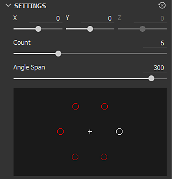

### New Fill Layer Projection Modes

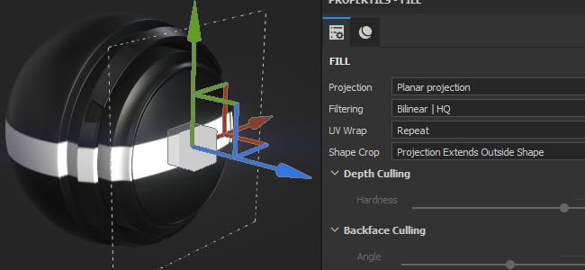

Two new projection modes have been added with fill layers and fill effects : **Planar** and **Spherical**. We also added a lot of new parameters to control further the behaviors of the 3D projections.

* **New Planar Projection mode**  
  Projecting a plane is now possible with this new mode. It can be useful for creating stripes on vehicles or placing decals at a specific location.

  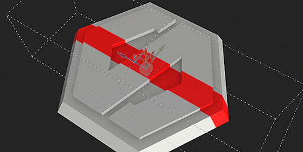
* **Surface Tool for Planar Projection**  
  To make the planar projection easy to manipulate we also added a new control for the 3D Manipulator that we call **Surface Tool** which can be accessed with the shortcut "**Shift+W**". It can also be accessed from the Contextual Toolbar. Note that this new mode is only available with the Planar Projection.

  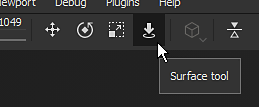

  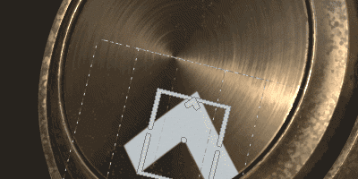
* **Planar Projection Culling / Fading**  
  Multiple settings are available to make the planar projection either continuous or finite. When a culling setting is enabled, the doted box around the manipulator indicates the bounding box for the projection and the middle line is where the projection starts. Scaling the projection allows to control how far it goes and when it starts to fade.

  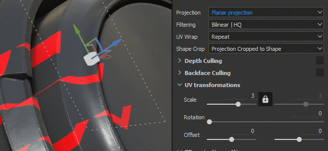{width="500px"}

  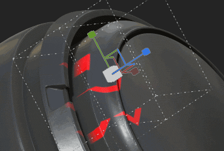
* **New Spherical projection mode**  
  Spherical projections are now doable with this new mode. With it you can achieve advanced patterns or follow more easily curved surfaces.

  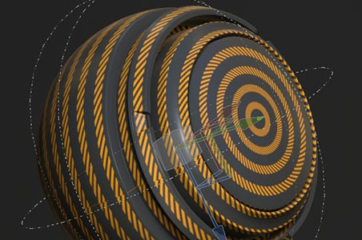{width="350px"}
* **New Shape Crop settings**  
  3D projections now have a setting that controls the repetition of the projection. Very useful for example for a decal to repeat only on a specific area without having to mask it manually.

  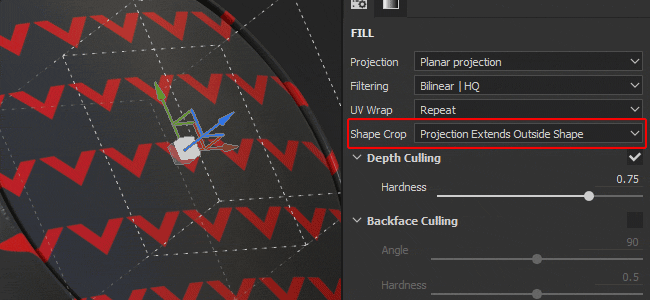{width="500px"}
* **Moved and Renamed existing settings**  
  Because of these new projections we reworked a bit how some settings work. For example "**Tiling**" has been renamed has "**UV Wrap**". The tiling now can be set only vertically or horizontally. The Scale, Rotation and Offset are now part of a new parameter group named "**UV Transformations**" to be more consistent across projection modes.

  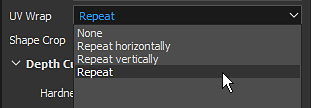

  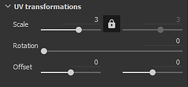
* **Improved Rotation Manipulator all-axis mode** Instead of drawing an explicit sphere, it is now hidden to avoid hiding the texturing below. Clicking in-between the axes will select the sphere which allows to rotate all the axes at once.  
   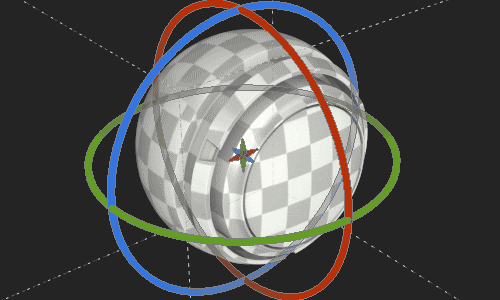

### Various Improvements

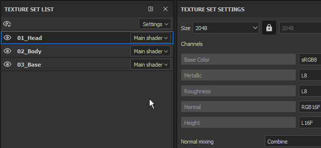

* **Multi-Selection for Texture Set**   
  Selecting multiple Texture Sets to change their resolution all at once via the Texture Set settings is now possible.  
  In multi-selection mode there is still the notion of a "main" Texture Set, which is why additional elements are selected in gray. If you need to switch to a different Texture Set while keeping the current selection, you can use the middle mouse button to do that.
* **Quick show/hide in Texture Set List**   
  You can now click and drag (like in the layer stack) to hide or show Texture Sets.
* **Improved UI for Layer Stack**   
  We changed the icon for the hidden/show state of a layer to be more consistent and easier to understand. We also changed the way selected layers are displayed to be easier to compare with the selection of their effects and other layers.  
   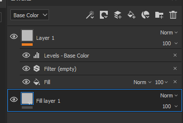
* **New effect position based on current selection** Any new effect added on a layer will now be put just above the currently selected one.  
   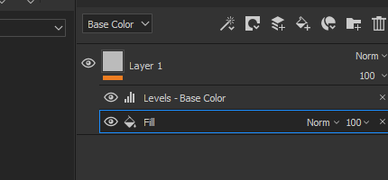
* **Quick toggle of Material channel buttons**   
  You can now press ALT and click on a channel button to isolate it. Clicking again will enable back all the channels.  
   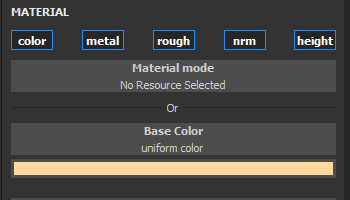
* **Dithering at export** Dithering can now be disabled via a dedicated setting in the export window next to the file format and bit depth. For more information about how and when dithering is applied [see the export documentation](../../../help/getting-started/export/export-window/export-window.md).  
   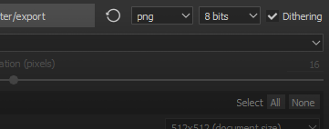
* **Better Histograms**   
  We reworked our histogram generator. Histograms should now display more accurate information and update properly after a change in the layer stack.  
   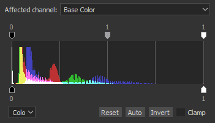
* **Better Instancing of layers**   
  Instanced layers now have their blending mode set to "Pass Through" instead of the default blending mode. This blending mode will improve the compatibility of some effects when layers are instanced across Texture Sets.

### New Content

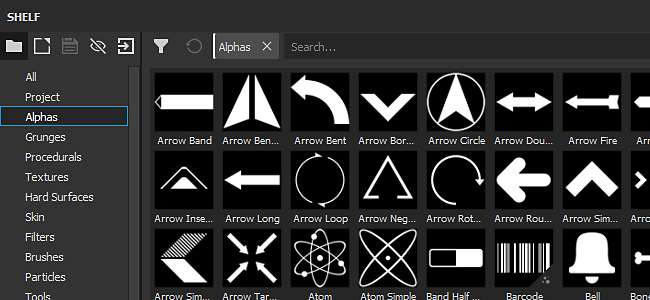

In this release we also added a lot of new content : from presets to alphas and even new powerful filters.

* **New Brush and Tool Presets**   
  This release introduces the new Dynamic Strokes feature and with it we added some Brush and Tool presets ready to use.

  * 10 new Brush presets :
    * Ink Dirty
    * Ink Random
    * Leaf Curved Heavy
    * Leaf Curved
    * Leaf Messy
    * Leaf Simple
    * Leaf Swirl
    * Zigzag Long
    * Zigzag Short
    * Zigzag Step
  * 11 new Tool presets :
    * Autumn Leaves
    * Cracks
    * Footprints
    * Gradient Hue
    * Nail
    * Pebbles
    * Scratches
    * Spray Colored
    * Spray Skin Light
    * Spray Skin Red
    * Zipper
* **93 new Alphas**  
  There are too many to enumerate them all, so take a look at the "Alphas" section of the Shelf and you will see lots of new Arrows, Triangles, Signs and other kind of shapes.
* **13 new Filters**  
  We have many new filters in this new version which can be very handy for a lost of situations :

  * **Blur Slope** : A new blur filter has been added to the family. This filter works in a similar way to the warp filter : use the existing input or a custom one to blur the target channel.
  * **Bevel** : Creates a gradient border around a shape, useful if you want to expand your mask for example.
  * **Color Match** : This filter tries to match a Source color to a Target color. Handy for adjusting colors on a material.
  * **Gradient Curve** : This filter provides a list of curve presets that can be applied on any grayscale input to change their look.
  * **Gradient Dynamic** : Remaps a grayscale input by a new input image (grayscale or color).
  * **Height Adjust** : This filter provides two settings to easily manipulate the height channel : Offset and Multiply.
  * **Height to Normal** : This filter converts the Height channel into a Normal and feeds it to the Normal channel. It has different intensity controls depending of the needs.
  * **Mask Outline** : This filter creates a white on black border around a grayscale input. This is most useful in Mask to create borders around shapes.
  * **PBR Validate** : We added this filter to check that your PBR material colors are in the right ranges. For more information check out the [PBR Guide](https://www.allegorithmic.com/pbr-guide) !
  * **MatFX Peeling Paint** : Simulates old paint starting to peel. This filter outputs alpha which makes it easy to blend with materials below it.
  * **MatFx Water Drops** : Simulates water drops on the surface of an object. Like water on a car after the rain.
* **7 new Generators**  
  With this release we added a few new generators :

  * **Ambient Occlusion** : Mask Generator that offers controls over the Ambient Occlusion Mesh map. Based on the Mask Editor.
  * **World Space Normals** : Mask Generator that offers controls over the World Space Normals Mesh map. Based on the Mask Editor.
  * **Position** : Mask Generator that offers controls over the Position Mesh map. Based on the Mask Editor.
  * **Curvature** : Mask Generator that offers controls over the Curvature Mesh map. Based on the Mask Editor.
  * **Auto Stitcher** : Mask Generator that creates stitches near the UV borders, the Mesh Curvature or around a custom mask input.
  * **UV Texel Density** : Helper that outputs a colored gradient based on the Texel Density of the polygons of the mesh.
  * **UV Random Color** : Generate a random color per UV Island (or based on a custom gradient input).
* **2 new environment maps**

  * Autumn Forest
  * Canopus Ground

    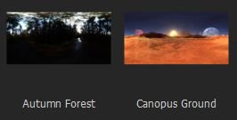
* **5 new Procedurals**

  * Gradient Hue
  * Gradient Builder
  * Color Jitter By Index
  * Color Jitter By Seed
  * Feather Stylized

    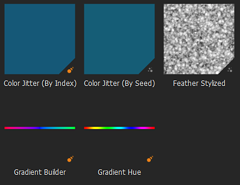

## Tutorials

Checkout our tutorial that cover our latest features :

We also have a tutorial on Substance Academy covering how to create a Dynamic Stroke : [Creating a custom Dynamic Stroke for Substance Painter](https://academy.allegorithmic.com/courses/Creating-a-custom-Dynamic-Stroke-for-Substance-Painter)

## Release Notes

### 2019.1.3

*(Released July 01, 2019)*   
Summary : **Bugfix with 2 new features**

**Fixed:**

* "Follow path" does not work all the time
* Channel mapping doesn't work with SBSAR used in single channel slots
* &#91;Layer Stack&#93; Low performance when scrolling with hidden layers
* &#91;TextureSet&#93; Crash when clicking between masks
* &#91;SVT&#93; Displacement in not displayed properly and flickers in some cases
* &#91;Alembic&#93; Crash with mesh using point normals instead of vertex normals
* &#91;Alembic&#93;&#91;Log&#93; Report error in Log if Alembic file is not supported during import

### 2019.1.2

*(Released May 21, 2019)*   
Summary : **HotFix**

**Fixed:**

* Crash when selecting two resources with an image input

### 2019.1.1

*(Released May 20, 2019)*   
Summary : **HotFix**

**Added:**

* Update to latest version of Substance Engine with last release of Substance Designer 2019.1

**Fixed:**

* &#91;Substance&#93; Visible If is not taken into account for Input Images
* &#91;SVT&#93;&#91;Engine&#93; Changing texture set resolution leads to a crash in some cases
* &#91;Engine&#93; Random black textures appear in some cases
* &#91;Layer Stack&#93;&#91;UI&#93; Toggling a mask with SHIFT can select multiple layers at the same time
* &#91;Layer Stack&#93; Opacity has no effect on Paint effect with Pass-Through blending mode
* &#91;Layer Stack&#93; Height To Normal filter input doesn't update properly with eraser brush stroke
* &#91;LayersStack&#93; Crash when undoing the drop of a smart mask
* Wireframe flickering with shadows and temporal anti aliasing activated
* &#91;Displacement&#93; Lag on AMD with some heavy meshes
* &#91;Windows&#93; Crash when opening some projects via the file explorer
* &#91;Histogram&#93; Crash when removing mask with anchor point in some cases
* Crash in preview generation in some rare cases
* &#91;Crash&#93; Can not reopen a project using too many clone and smudge tools
* No mesh displayed in material mode after saving in some cases
* &#91;Scripting&#93; alg.mapexport.documentStructure() returns incorrect values for folders

**Known Issues:**

* Double clicking texture set name will select it before entering renaming mode

### 2019.1

*(Released April 23, 2019)*   
Summary : **Dynamic Stroke with dedicated new content, Displacement and Tessellation in real-time and Iray, Compare Mask effect, Radial symmetry, Planar and Spherical projection**

**Added:**

* &#91;Tool&#93; Dynamic stroke: Substance variation alongside a brush stroke
* &#91;Dynamic stroke&#93; Expose new stamp index parameter with options
* &#91;Dynamic stroke&#93; Take into account $time parameter
* &#91;Dynamic stroke&#93; Generate new $randomseed parameter per stroke and per stamp
* &#91;Dynamic stroke&#93; Start a dynamic stroke index from a random number
* &#91;Dynamic stroke&#93;&#91;Shelf&#93; Help finding a dynamic stroke resource with dedicated new icon
* Displacement and tessellation in real-time viewport
* Displacement and tessellation in Iray
* &#91;Shader settings&#93;&#91;UI&#93; New tab for controlling displacement and tessellation
* &#91;Layer stack&#93; New CompareMask effect: generate a mask by comparing two channels
* &#91;Layer stack&#93;&#91;UI&#93; New entry in right-click menu "Add mask with height combination" to insert a CompareMask effect
* &#91;Symmetry&#93; New symmetry mode: radial painting
* &#91;Symmetry settings&#93; Expand both sections "Settings" and "Display"
* &#91;Symmetry settings&#93;&#91;UI&#93; Preview for radial painting
* Expose two new projection modes: planar and spherical
* &#91;Proj&#93; New shape crop mode for all projections
* &#91;Proj&#93; Planar mode with new manipulator: Surface tool
* &#91;Proj&#93;&#91;Shortcut&#93; Shortcut SHIFT+W for Surface tool
* &#91;Proj&#93; Planar projection masking with depth culling and backface culling
* &#91;Manipulator&#93; Improvement of rotation manipulator on all three axes for triplanar
* &#91;Tool&#93;&#91;UX&#93; Alt-clicking on a channel focuses that channel (enables it or disables all others)
* &#91;Engine&#93; Update to latest version of Substance Engine
* &#91;Texture set&#93; Multiple selection and change resolution
* &#91;Texture set&#93; Quick activation and deactivation of the texture sets
* &#91;Texture set&#93; Combine solo and all options into a new menu
* &#91;Texture set&#93;&#91;Layer stack&#93; New icon for activation and deactivation
* &#91;Layer stack&#93;&#91;UX&#93; Insert effects above those already selected
* &#91;Layer stack&#93;&#91;UI&#93; Rework layer stack view selection style
* &#91;Layer Stack&#93; Blending mode for instanced layers is now in Pass Through mode by default
* &#91;Export&#93; Option to activate and deactivate dithering
* &#91;Plugin&#93; Support precision modifier for sliders (SHIFT)
* &#91;Plugin&#93;&#91;UI&#93; New icon for autosave
* &#91;Scripting&#93; List the contents of a folder
* &#91;Scripting&#93; Allow deletion of files
* &#91;Scripting&#93; Read all stack information including used resources
* &#91;Content&#93;&#91;Dynamic stroke&#93; New tools and brush presets
* &#91;Content&#93;&#91;Dynamic stroke&#93; Two new procedural gradients: Gradient Hue and Gradient Builder
* &#91;Content&#93; 11 new Filters: MatFx Peeling Paint, MatFx Water Drops and more
* &#91;Content&#93; 7 new generators: Auto Stitcher, UV Random Color, UV Texel Density and more
* &#91;Content&#93; 93 new alphas: new texts, arrows and various other shapes
* &#91;Content&#93; 2 new procedurals: Gradient Hue, Gradient Builder and more
* &#91;Content&#93; 21 new Tool and Brush presets for Dynamic Strokes : Pebbles, Footprints, Spray and more
* &#91;Content&#93; 2 New HDRis: Canopus Ground and Autumn Forest
* &#91;Content&#93; Update content with random seed curation in shelf
* &#91;Content&#93; New icon with exposed random seed parameter in shelf

**Fixed:**

* &#91;Layers stack&#93; Layer stack keeps dragging forever
* &#91;Mac&#93; "Show in Finder" can lead to freezing
* &#91;Scripting&#93; Settings saved via Custom UI are lost if shader file is moved
* &#91;Scripting&#93; API version number is incorrect and not up to date
* &#91;Effect&#93; Histogram content is not displayed correctly
* &#91;Effect&#93; Histogram effect does not update in some cases
* &#91;Shelf&#93; Stitches are not properly aligned on material "Plastic Fabric Pyramid"

**Known Issues:**

* Double clicking texture set name will select it before entering renaming mode
* &#91;Layer Stack&#93;&#91;UI&#93; Toggling a mask with SHIFT can select multiple layers at the same time
