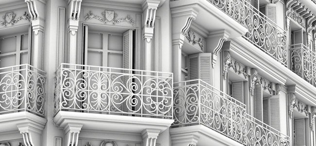
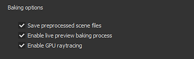
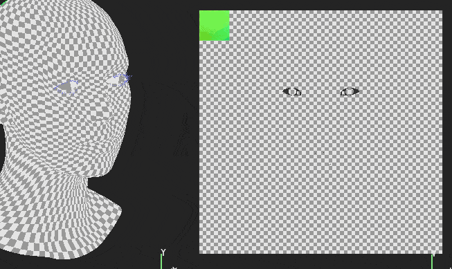
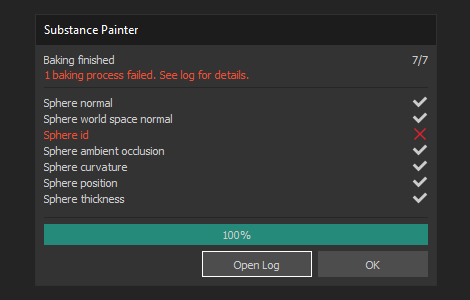
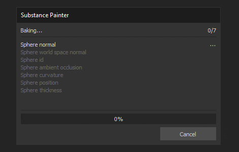
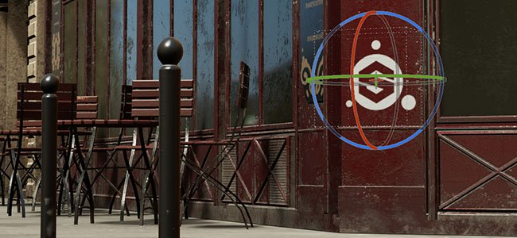
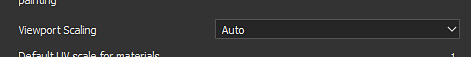
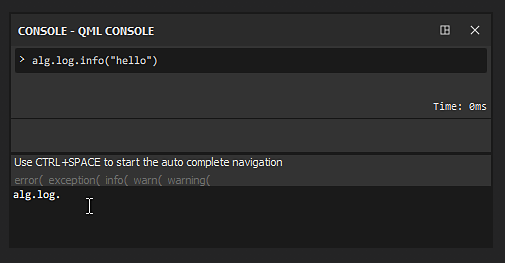
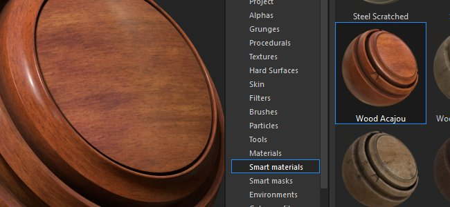

# Version 2019.2

**Substance Painter 2019.2** brings new powerful features to its Bakers and delivers a new set of Smart Materials and Smart Masks in the Shelf.

Release date : *25 July 2019*

## Major Features

### Workflow improvements for Bakers

The baking workflow has been improved with this release with some new features. These improvements will speed up and ease day-to-day work with Substance Painter.

* **Baking process visualization**   
  By default with this new version any baking process will now be visible in the viewport. It allows to preview the result of the bakers in realtime and even cancel it if needed without waiting until the end of the process to offer quicker iterations. This behavior can be disabled by going into the main settings and unchecking the "**Enable live preview baking process**" setting under the "**Baking Options**" section.

  

  {width="500px"}
* **Improved baking dialog**   
  The baking dialog has been reworked and now displays a better status of the current baking process. There is now a counter to indicate how many textures will be computed as well as an explicit list per baker and Texture Set of what is being computed. In case of an error a red cross is displayed next to the baker name. At the end of the process a new button allows to quickly open the log window to learn more about the issue.  
   
* **Canceling in-progress baking** The baking process doesn't lock the application anymore. Substance Painter is now more responsive, meaning it is possible to cancel a bake that is currently in progress without waiting for it to end. Cancellation is not immediate however and may require a few seconds to take effect. This is because internally the baking process works on textures in chunks and cannot stop while a chunk is being computed. When canceling the baking process, the Baking window automatically reopens.  
   

### Performance improvements for Bakers

With the workflow improvement we also took the opportunity to update our Bakers and improve their performances. We also added the support of DXR and Optix to enable GPU Raytracing which allows to bake much faster than before. Note however that GPU Raytracing only affect the Ambient Occlusion and Thickness baker.

* **CPU Raytracing has been improved**   
  Raytracing computation on the CPU is now 2 to 3 times faster than before. So even if your GPU is not compatible with GPU Raytracing you will still get performance improvements in general.
* **GPU Raytracing support with DXR and Optix**   
  With compatible hardware the bakers can now compute directly on the GPU which drastically reduces computation time, especially when anti-aliasing is enabled and lots of rays are defined. DXR is the default option when available, otherwise Optix will be used. It is possible to disable GPU Raytracing by going into the [main settings](../../../interface/settings/settings.md) and looking for "**Baking Options**" :

  

>[!NOTE]
>
> To enable the GPU Raytracing feature make sure to update to the following drivers : **Nvidia drivers 430.86**.  
> DXR is available on RTX GPUs and [GeForce GTX 10xx GPUs](https://www.nvidia.com/en-us/geforce/news/geforce-gtx-dxr-ray-tracing-available-now/). DXR also requires Windows 10 to be up to date to be accessible (version 1809), see this page for more information.

>[!WARNING]
>
> When using GPU Raytracing, the baker may fail if the high-poly mesh cannot fit in VRam. When it happens, it is advised to go into the [main settings](../../../interface/settings/settings.md) and disable "**GPU Raytracing**" setting under the the "**Baking Options**" section. After that you can simply re-launch the baking process.

### Miscellaneous new features and improvements

In this release we also added and reworked a few things to improve the quality of life inside Substance Painter.

* **Improved rotation manipulator**  
  The rotation manipulator was a bit slow in the past making rotations sometimes tedious to perform. Rotation speed is now linked to the camera and scene size.
* **Improved performances on High DPI screens with viewport downscaling**  
  In the [main settings](../../../interface/settings/settings.md) there is now a new parameter named "Viewport Scaling" with the value "**None**" and "**Auto**" (default). When Substance Painter detects that a screen uses HDPI scaling (such as Retina screens on MacOS) it will automatically divide the viewport resolution by 2. This behavior avoids drawing the viewport too big and improves general performances without any noticeable loss of quality.

  
* **New Console plugin for Scripting**  
  We created a new plugin to easily run commands from our Scripting API. It is available on Github : <https://github.com/AllegorithmicSAS/painter-plugin-console>. The console also supports auto-completion.

  

### New content

A new set of Smart Materials and Smart Masks has been added to the default Shelf to cover various usages. Here is the full list of assets that have been added :

* **40 new Smart Materials**

  * Fabric  
    * Fabric Canvas Creased
    * Fabric Composite Reinforced Used
    * Fabric Denim Washed Out
    * Fabric Flannel Tartan
    * Fabric Linen Creased
    * Fabric Linen Worn
    * Fabric Synthetic Dots
    * Fabric Synthetic Sport Used
  * Leather
    * Leather Calf Grain
    * Leather Creased
    * Leather Natural Colored
    * Leather Rough Dark
  * Marble - Granite
    * Marble Verde Alpi
  * Metal  
    * Gold Damaged
    * Iron Forged Old
    * Steel Painted Chipped Dirty
    * Steel Painted Rough Damaged
    * Steel Painted Scraped Dirty
    * Steel Painted Scraped Green
    * Steel Painted Worn
    * Steel Ruined
  * Organic  
    * Creature Skin Alien Blue
    * Creature Skin Green Smooth
    * Creature Teeth
    * Creature Tongue
  * Plastic - Rubber  
    * Plastic Dusty
    * Plastic Glossy Scuffed
    * Plastic Glossy Stained
    * Plastic Grainy Soft
    * Plastic Rough Scratched
    * Plastic Thermoformed
    * Plastic Thick Cracked
    * Plastic Tool Worn
    * Plastic Used Soft
  * Stone  
    * Sapphire Corundum
  * Translucent  
    * Glass Film Dirty Mirror
  * Wood
    * Charcoal
    * Wood Acajou
    * Wood Ship Hull Nordic
    * Wood Ship Hull Old
* **20 new Smart Masks**

  * Crumples
  * Dirt Cavities
  * Dirt Ground
  * Dirt Leak Dry
  * Dirt Soft Edges
  * Dirt Splashes
  * Dirt Spots
  * Dust Plastic
  * Dust Soft Edges
  * Dust Surface
  * Dust Wide Edges
  * Edge Dirty Cracks
  * Edge Stone Cracks
  * Edges Strong Scratched
  * Fabric Thread
  * Paint Damaged
  * Paint Subtle Scratch
  * Sand Cavities
  * Sand Dust
  * Water Drips

## Release Notes

### 2019.2.3

*(Released October 23, 2019)*   
Summary : **Bugfix**

**Added:**

* &#91;Texture Set List&#93; Add button to quickly enable/disable focus mode
* &#91;Log&#93; Add Windows 10 version number in the log file
* Update to latest version of Substance Engine
* &#91;MacOS&#93; Notarized the software to follow new MacOS Catalina distribution requirements

**Fixed:**

* &#91;Plugin&#93; Plugin Source does not work
* &#91;MacOS&#93;&#91;Shader&#93; Mac OS 10.14.5 and AMD: material layering does not work as intended

**Known Issues:**

* Alembic files with subdivisions cannot be imported
* Rare crashes when importing some Alembic files
* UI temporarily unresponsive when baking with DXR on Pascal GPUs

### 2019.2.2

*(Released September 20, 2019)*   
Summary : **Bugfix**

**Fixed:**

* Import resource by scripting can lead to a crash
* &#91;Plugin&#93; Downloading material from source can lead to a crash

### 2019.2.1

*(Released September 17, 2019)*   
Summary : **Bugfix**

**Fixed:**

* &#91;Mac&#93;&#91;USD&#93; Exported USDZ files from MacOS cannot be opened
* &#91;Texture Set&#93; Not possible to isolate a texture set with the ALT modifier
* &#91;Shelf&#93; Presets, Smart Materials and Smart Masks are always modified when exiting application
* &#91;Layer Stack&#93; Cannot select effect after deleting another effect
* Flickering when using a slider inside the tool properties panel
* Crash when exporting presets to shelf
* Crash when exporting a preset with insufficient space
* Crash when creating a preset with insufficient space

**Known Issues:**

* Alembic files with subdivisions cannot be imported
* Rare crashes when importing some Alembic files
* UI temporarily unresponsive when baking with DXR on Pascal GPUs

### 2019.2

*(Released July 25, 2019)*   
Summary : **Major release with updates of the bakers in terms of performance and a new previsualization mode + new content**

**Added:**

* &#91;Bakers&#93; Added support for GPU Raytracing with DXR and OptiX (Ambient Occlusion, Thickness)
* &#91;Bakers&#93; Optimizations and accelerations for CPU Raytracing
* &#91;Bakers&#93;&#91;Vis mode&#93;&#91;UI&#93; New baking visualization mode in viewport
* &#91;Bakers&#93;&#91;Preferences&#93;&#91;UI&#93; New baking option for enabling-disabling GPU Raytracing
* &#91;Bakers&#93;&#91;UI&#93; Rework of the progress bar dialog
* &#91;Bakers&#93; Improvement of warning and error messages
* &#91;Bakers&#93; Allow more responsive cancelling of baking process
* &#91;Bakers&#93; Reopen bake window after clicking cancel
* &#91;Proj&#93;&#91;UX&#93; Usability improvement of rotation manipulator
* &#91;Settings&#93; Option to improve performance by reducing viewport resolution for HDPI screens
* &#91;Scripting&#93; Change texture set resolution
* &#91;Scripting&#93; Get selected texture set
* &#91;Scripting&#93; Allow the user to select a texture set
* &#91;Scripting&#93; Function to know when texture set selection has been changed
* &#91;Shelf&#93; Added 40 new smart materials
* &#91;Shelf&#93; Added 20 new smart masks

**Fixed:**

* &#91;Layer stack&#93; Freeze of UI when multi-selecting layers
* &#91;Layer stack&#93; Grouping lots of layers freezes the UI for longer than usual
* &#91;Layer stack&#93; A layer and an effect can be both selected at the same time in some cases
* Substance graphs used inside painting tools are not generated at the right resolution
* &#91;Baker&#93; "Bake All Texture Sets" button is not disabled when no bakers are selected
* &#91;MacOS&#93; Deactivate the warning message about tessellation
* Projection tool has no preview when used with a mask
* Crashes and corrupted projects when trying to save with insufficient disk space
* &#91;Shelf&#93; Crash when importing a resource on disk via shelf with insufficient space
* &#91;Shelf&#93; Crash when restoring session preset
* &#91;Shelf&#93; Importing a preset with a name that ends with a space leads to a crash
* &#91;Shelf&#93; Importing a resource with a prefix that ends with an empty space leads to a crash

**Known Issues:**

* Alembic files with subdivisions cannot be imported
* Rare crashes when importing some Alembic files
* UI temporarily unresponsive when baking with DXR on Pascal GPUs
