# Version 2019.3

**Substance Painter 2019.3** introduces Photoshop brush presets support and automatic UV unwrapping for your meshes, as well as delivers various quality of life improvements, such as better handling of graphic tablets.

Release date: *December 17, 2019*

## Major Features

### Photoshop Brush Presets Support (ABR)

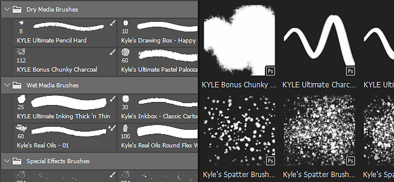

You can now use your Photoshop brushes in Substance Painter. By simply exporting your presets as an ABR file, you can now import them as regular brush presets. Presets contained inside an ABR files will appear in the Shelf as individual brush presets.

If you don't have ABR files to import, you can find a lot of them online:

* [Kyle's Brush Presets on Adobe](https://www.adobe.com/products/photoshop/brushes.html)
* [Brush Presets on ArtStation](https://www.artstation.com/marketplace?q=photoshop%20brush&amp;sort_by=trending)
* [Brush Presets on DeviantArt](https://www.deviantart.com/search?q=photoshop%20brush)
* [Brush Presets on Cubebrush](https://cubebrush.co/marketplace?categories=354,57)

In order to support Photoshop brushes, various new features have been added to the painting tool properties:

* **New Size and Flow Minimum parameters**   
  You can now specify the minimum size and the minimum flow of the tool when Pen Pressure is enabled. This parameter works as a percentage based on the current maximum size/flow defined. These settings are automatically calibrated when using a Photoshop brush preset.  
   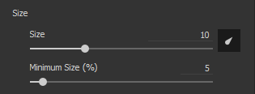
* **New Position Jitter parameters**   
  In order to match Photoshop brush behavior, we added a few new settings. It is now possible to define which axis the jitter is applied to and how random positions are distributed (choose **Uniform** to match Photoshop).  
   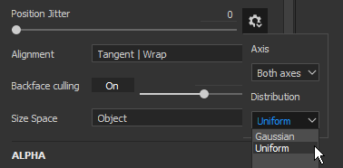   
   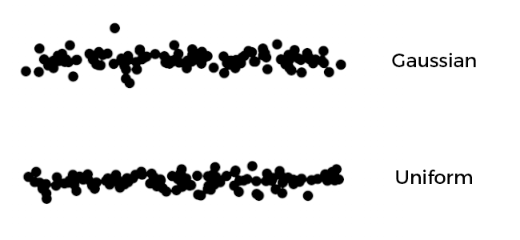
* **New alpha blending mode**   
  Photoshop doesn't composite its brush strokes the same way as Substance Painter does, therefore we added a new blending mode (Lighten) to better match the painting result. This blending mode doesn't over-accumulate when stamps overlap, which can improve the feeling of pressure when painting with a low Flow/Opacity value.  
   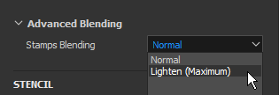   
   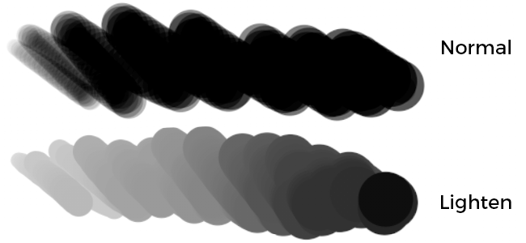
* **Support for Roundness and Flip**   
  A new Substance Alpha named **Brush Maker Photoshop** has been added to support parameters such as Roundness (scale the height of the Alpha) and Flip (mirror an image on both axes). This Substance Alpha is automatically loaded when clicking on a brush preset coming from an ABR file.  
   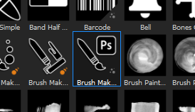   
   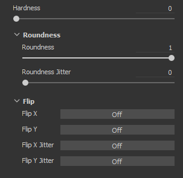
* **New gamma correction for alpha channel of layers**   
  Photoshop doesn't blend its brush strokes in Linear Gamma space, which means blending and opacity may look wrong when painting with a Photoshop brush preset. A new setting can be enabled on layers to match that behavior and apply a gamma correction. This will affect the alpha used to paint brush strokes, as well as how the layer's mask is used to blend with other layers, however layer's blending modes will still operate in Linear gamma space.  
  To **activate this setting**, simply right-click on a layer and choose **Gamma corrected alpha/mask**. A new icon will appear next to the layer to indicate when this setting is enabled.  
   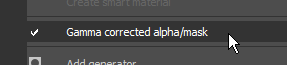 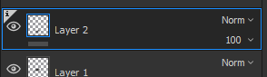   
   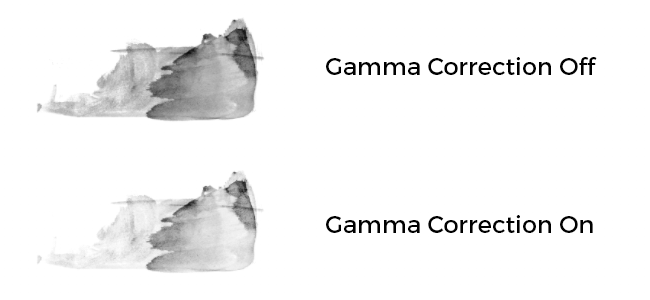
* **Increased maximum value for Spacing and Position Jitter**   
  In order to match properly Photoshop brush presets parameters, the maximum value of the following parameters has been increased:

  * **Spacing**: maximum can now be set to 1000.
  * **Position Jitter**: maximum can now be set to 1000.

For more information, such as how to export ABR files and import them, take a look at the [Photoshop Brush Presets](../../../painting/presets/photoshop-brush-presets/photoshop-brush-presets-abr.md) documentation.

>[!NOTE]
>
> Not all Photoshop brush parameters are supported at the moment, refer to the [compatibility list](../../../painting/presets/photoshop-brush-presets/photoshop-brush-par/photoshop-brush-parameters-compatibility.md) for more information.

### Painting and Graphic Tablet Support Improvements

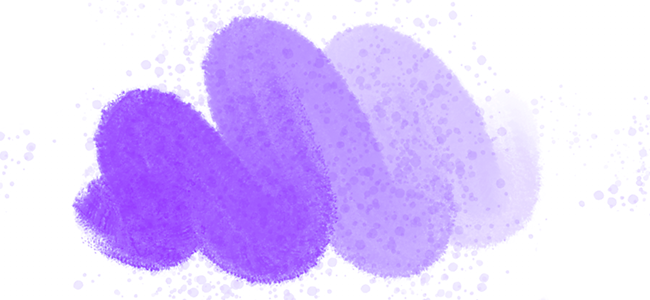

In addition to the support of Photoshop brush presets, numerous improvements and fixes have been made related to the use of graphic tablets.

* **Straight Line first stamp is not doubled anymore**  
  When painting a Straight Line, the first stamp is not duplicated anymore (no need to Undo your stamp just to place the Straight Line in position).  
   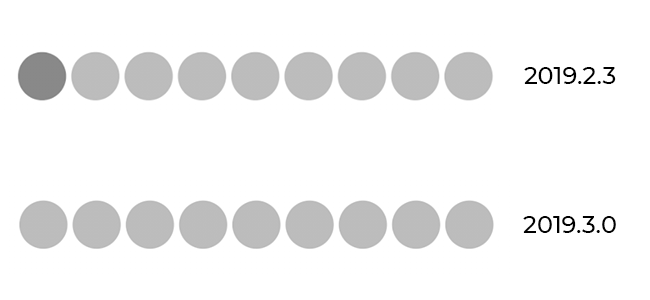
* **Straight Line pressure interpolation**   
  Straights Lines now support pressure. The pressure value will be interpolated between the first stamp and the last stamp.  
   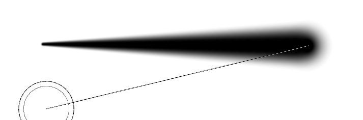
* **New brush preview modes**   
  The brush preview in the viewport can now be changed to different visualization modes. To change the mode, simply click on the new dropdown button in the contextual toolbar.

  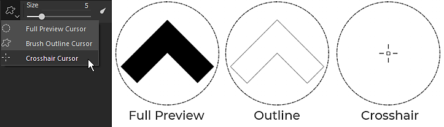
* **Pen pressure curves**   
  In the contextual toolbar it is now possible to define how the pen pressure should be interpreted. These new settings control how fast the pressure build-up which allow different painting styles.

  * **Linear**: No transformation, the pressure it retrieved as provided by the graphic tablet's pen. Use this setting in case a Pen pressure curve is already defined in the Tablet drivers settings.
  * **Ease In** (default): Slow down the beginning of the pressure, making it easier to paint thin or faint strokes.
  * **Ease In Out**: Slow down the beginning of the pressure and speed up its ending, making it easier to paint soft or strong strokes.

  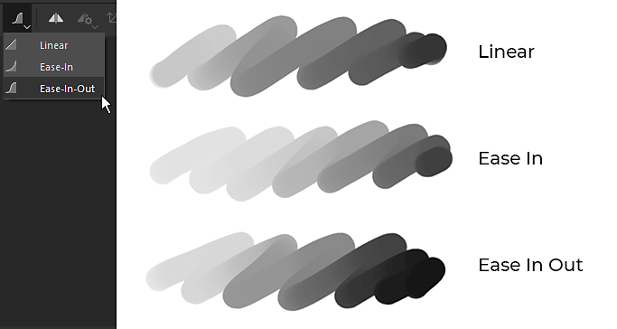
* **Pressure button is not a dropdown anymore**   
  We changed the Pen pressure controls to be simple on/off buttons. This makes enabling and disabling the pressure much easier and quicker.

  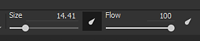
* **Improved support of graphic tablets and switch to Windows Ink**   
  We reworked the way we handle graphic tablets. This should improve compatibility in general with recent models of graphic tablets and reduce the number of issues we had in the past. On Windows we also switched to Windows Ink instead of Wintab to improve the compatibility.

  >[!NOTE]
  >
  > Make sure your Wacom drivers are up to date and that "Windows Ink" is enabled in tablet settings.

### Automatic UV Unwrapping (Beta)

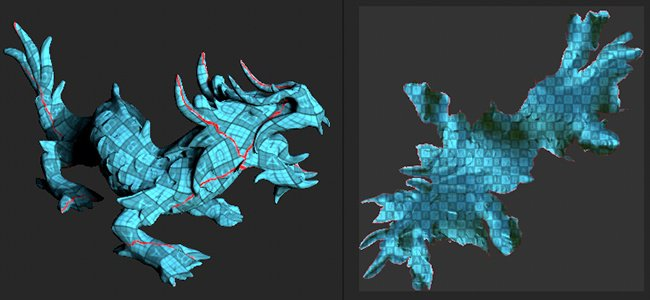

Substance Painter will now automatically unwrap meshes which have missing UV coordinates. This make possible to import any kind of geometry and immediately start to paint. Our UV Unwrapping system will generate one UV island per sub-mesh while still following the material assignation to create Texture Sets. This feature is currently in beta and will evolve in future versions. The Automatic Unwrapping will be only applied to projects that **don't use the UDIM workflow**.

* **Automatic UV Unwrapping**   
  By default Substance Painter will now automatically generate UV coordinates for meshes which are missing them. This apply to both project creation and mesh reimport. It is however possible to disable this behavior by going into the [main settings](https://helpx.adobe.com/substance-3d/unlisted/documentation/spdoc/general-71008262.html) and disabling **Enable automatic UV unwrapping** under **Import Options**.

  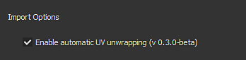
* **UV Unwrapping Progress Bar**   
  When importing a mesh there is a now a progress bar to indicate the current state of the process. This also include the UV Unwrapping process.

  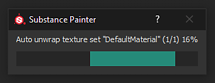
* **Currently Known Issues**   
  Since this new feature is currently in beta, some issues are expected. Refer to the release notes below to get a list of the currently known issues. If the application crash and produce incorrect results, we suggest sending us a crash or bug report via the application to help us investigate the problem and improve the process.

>[!NOTE]
>
> A new **generator** has been added in the Shelf to help visualize the automatic unwrapping. To use it, simply create a new layer, add a generator effect and load the new **UV Checker** resource into it.

### Substance Integration Improvements

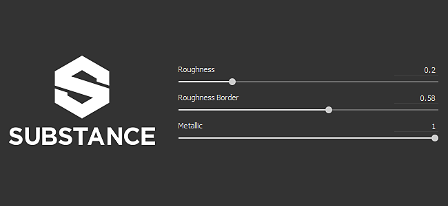

We continue improving the integration of the Substance format by supporting some long awaited features but also by improving existing system such as the Dynamic Stroke feature.

* **Non-clamped with soft ranges sliders**   
  Until now, exposed sliders from Substance graph always behaved like they were clamped. Meaning the values that could be input couldn't go beyond the default minimum and maximum values defined by the parameter.

  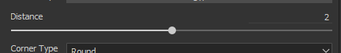
* **Support of the Step defined in parameters**   
  Substance graph that have parameters with a defined step will now be taken into account when tweaking the slider.
* **Increased digit precision for float sliders**   
  Float slider can now have input values that go down to 6 decimals. This is however limited by floating point precision, which means the value input may be rounded in some cases.
* **New Random Seed control with Dynamic Strokes**   
  It is now possible to request multiple random seed values withing a defined range. This allows to create unique and random Substance variations while still getting good performances by benefiting from the cache recycling.  
  Under the Dynamic Stroke group switch the **Random Seed Type** parameter to **Random Per Stroke** or **Random Per Stamp** to access the new parameter. The **Random Sample Amount** defines how many Substance variations will be generated in total. A random variations will be pick within the set already once the amount selected has been generated.

  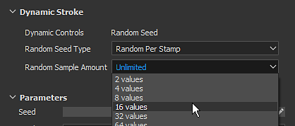
* **New user data Static Dynamic Strokes**   
  A new optimization has been added which allows to specify when a Substance can be considered a dynamic stroke. Similar to the Visible If, it is now possible to add conditions in the userdata field to specify under which condition Substance Painter should generate new Substance variations with the Dynamic Stroke feature. See the [userdata documentation](../../../content/creating-custom-effects/user-data/user-data.md) for more information.
* **New user data to designate an output node as mask for all channels**   
  A new userdata can now be added on an output node to use it an alpha mask for all the other channels. This is similar to the existing **channels\_Alpha** system, but without the need to create a new dedicated output in the Substance graph. See the [userdata documentation](../../../content/creating-custom-effects/user-data/user-data.md) for more information.

### Miscellaneous Improvements

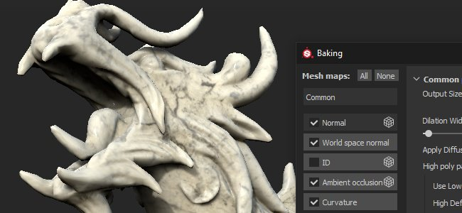

Various improvements have been made in the rest of the application which should help for the day to day work within Substance Painter.

* **Independent viewports focus**   
  The 2D and 3D focus (F shortcut) has been modified with the following behavior:

  * **Mouse over the 2D view**: pressing F will only focus the 2D view.
  * **Mouse over the 3D view**: pressing F will only focus the 3D view.
  * **Mouse outside the viewports**: pressing F will focus both the 2D and 3D view.

  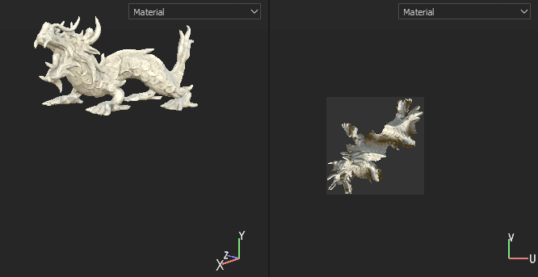{width="400px"}
* **Baking Window keyboard and menu shortcut**   
  The baking window can be open by two new different ways:

  * By pressing **Ctrl+Shift+B**.
  * By going in the Edit menu and clicking on **Bake Mesh Maps**.

  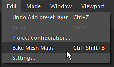
* **Scroll Docks and Windows with Ctrl+Alt+Left Click shortcut**   
  A new shortcut has been added that allows to scroll windows and docks without the need of the mouse wheel. Which this shortcut it is now possible to scroll with the pen of the graphic tablet.

  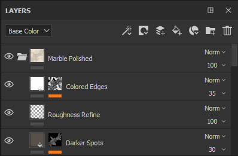
* **Performance improvements**  
  In the background many optimizations have been put in place which should improve the general performances of Substance Painter (from openings projects to painting).

### New Content

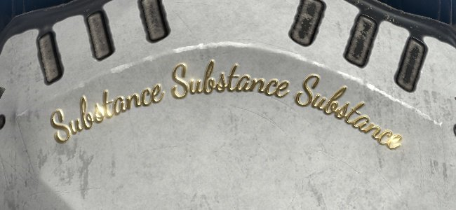

In this release a lot of new content has been added:

* **Updated "Meet Mat" sample project**  
  Mat has been updated with a new topology, making it more friendly with displacement. The ID map has been reworked to offer more masking possibilities and a new set of Cameras is available in the project to offer new viewing angles.

  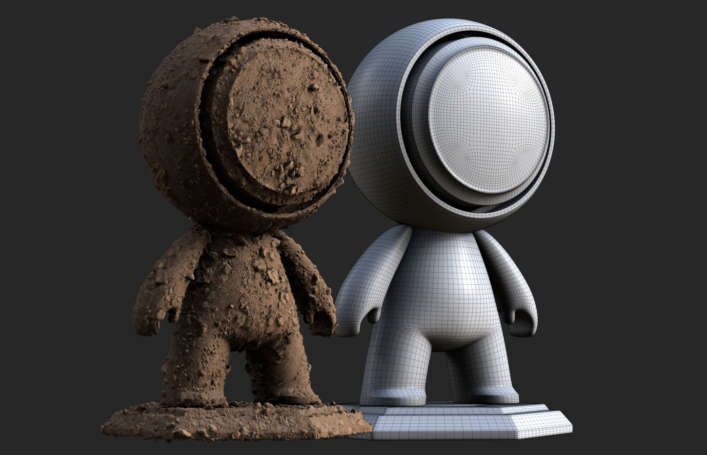{width="500px"}
* **New filters**  
  3 new new filters have been added to make stylized content easier:

  * **MatFx Comic Book**  
    This filter simulate hatching and edge lines based on the input provided (from the base color/diffuse to the curvature).

    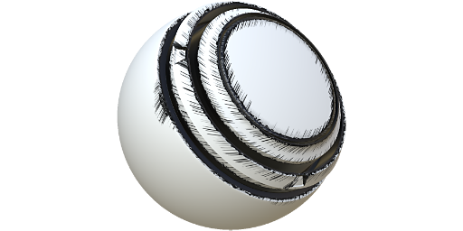
  * **MatFx Watercolor**  
    This filter simulate watercolor painting with color bleeding and paper absorption by reading the input color.

    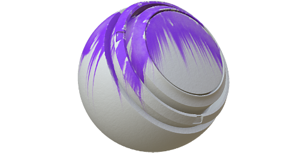
  * **MatFx Oil Paint**  
    Inspired by [Emrecan Cubukcu](https://www.artstation.com/emrecancubukcu) work, this filter read the color information from the input and translate it into brush strokes based on various parameters. Multiple presets are available to easily try out variations. We recommend combining it with the **Baked Lighting Environment** filter or to manually bake/paint shadows in your textures to maximize its effect.

    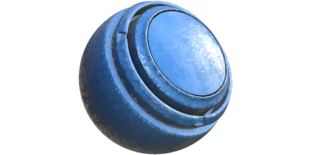

    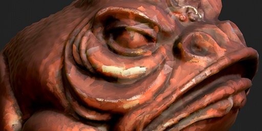

    >[!NOTE]
    >
    > This is a very expensive filter which can take some time to compute. When iterating, it is recommended to disable the layer that contains the effect before tweaking layers bellow it.
* **New brush presets**

  * **102 Photoshop brush presets**  
    With the introduction of the photoshop brush support a new set of presets has been included to showcase it. Those presets are been selected from Kyle T. Webster's packs available on [Adobe website](https://www.adobe.com/products/photoshop/brushes.html).

    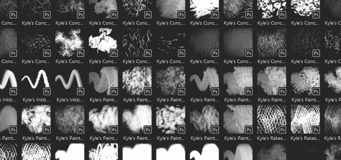{width="500px"}
  * **18 new brush presets**  
    In addition to the Photoshop brush presets, new more regular presets have been added:

    * Basic Hard Pressure
    * Charcoal Fine
    * Charcoal Full Frame
    * Charcoal Light
    * Charcoal Medium
    * Charcoal Natural
    * Charcoal Ramp
    * Wiggle Stroke Dense
    * Wiggly Dots
    * Wiggly Stroke With Break Up
    * Wiggly Strokes
    * Paint Roller Arrow
    * Paint Roller Staples Wide
    * Paint Roller Staples
    * Paint Roller Stitches
    * Paint Roller Stripes
    * Paint Roller Vein Long Narrow
    * Paint Roller Warning Text

    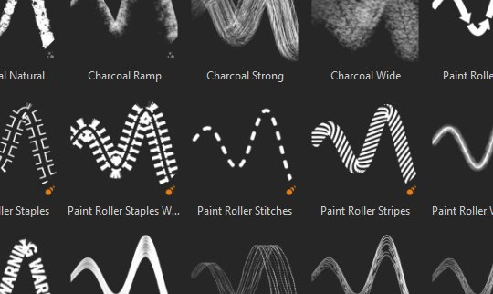{width="500px"}
* **New tool presets**  
  2 new tool presets have been added which simulate gouache paint.

  * Gouache Dense.
  * Gouache Faded.

  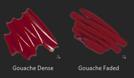
* **New alphas**  
  In addition to the alphas used to create the new brush presets (see above) two new important Alpha have been integrated:

  * **Brush Maker Photoshop**  
    This new Substance graph replicates some specific brush parameters available in Photoshop via the Dynamic Stroke feature. With it is possible to control the Roundness and the Flip or an input image. Some jitter parameter are also available to create more variations. This Substance graph is automatically inserted in the Alpha section when clicking on a Photoshop brush preset coming from an ABR file.

    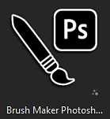
  * **Brush Maker Paint Roller**  
    This new Substance graph simulates a Paint Roller (or simple Ribbon tool) to paint continuous patterns with turns without breaking. To make the setup easier take a look at existing presets or refer to the graph description. We recommend enabling the [Lazy mouse](../../../painting/lazy-mouse/lazy-mouse.md) to make the roll brush draw properly without creating break-ups.

    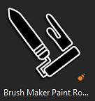

    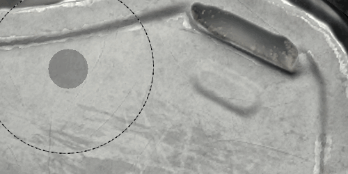{width="290px"}
* **New "UV Checker" generator**  
  A new generator named "UV checker" has been integrated to help analyze the mesh UV coordinates. This make the UVs generated by our Automatic UV Unwrapping easier to understand.

  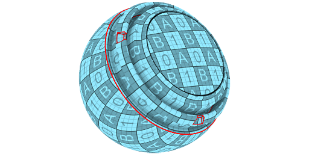
* **New template and export presets**

  * **Keyshot 9+**  
    This export preset makes the exported textures compatible with the new Keyshot 9 feature that simplify the loading and assignation of textures and materials. For more information see the [Keyshot documentation](https://luxion.atlassian.net/wiki/spaces/K9M/pages/1124335675/Material+Importer).
  * **Spark AR Studio**  
    This new project template and export preset make it easier to work with [Spark AR Studio](https://sparkar.facebook.com/ar-studio/).

>[!WARNING]
>
> * This release doesn't support MacOS 10.11 (El Capitan) anymore.
> * This release doesn't support CentOS 6.x anymore.
> * On CentOS 7.5 (or below) the application may not start because of some dependencies issues, to fix the problem either update the system or copy the [following library](https://centos.pkgs.org/7/centos-x86_64/freetype-2.8-12.el7.x86_64.rpm.html) in the installation folder.

## Release Notes

### 2019.3.3

*(Released February 06, 2020)*   
Summary : **Bugfix with upgrade to Iray 2019.3**

**Added:**

* Upgrade to Iray 2019.3
* &#91;Log&#93; Indicate outdated bios for Ryzen CPU leading to crash during baking
* &#91;ABR&#93; Extract ABR alphas to shelf

**Fixed:**

* &#91;Baker&#93; Baking fail if High-poly mesh does not have UVs
* &#91;Linux&#93; Custom mouse shortcuts are not saved
* &#91;Brush&#93; Outline disappears with some alpha shapes
* &#91;Tablet&#93; Bad detection when moving sliders
* &#91;Shortcuts&#93; Can not set up any shortcut with "Ctrl+Alt+MouseClick"
* &#91;Shelf&#93; Can not see resource tooltip when using a pen tablet
* &#91;2D View&#93;&#91;Export&#93; 2D View preset does not take into account the normal information
* Freeze when painting in UV alignment with certain brushes
* Painting under a filter creates artifact on the ongoing stroke
* &#91;Viewport&#93; Incorrect texture cache in viewport after re-importing a mesh
* &#91;Crash&#93; Error when saving after exporting to Photoshop
* &#91;Crash&#93; Writing special symbols in prefix when importing resources
* &#91;Crash&#93; Click on the reference in Anchor Point Properties
* &#91;Anchor Points&#93; Channel does not update when there is a filter between Anchor point and reference
* Iray url link in Help menu does not work

**Known Issues:**

* &#91;UV Unwrapping&#93; Processing high poly meshes can take a long time
* &#91;UV Unwrapping&#93; Vertices at the exact same coordinates are merged
* &#91;UV Unwrapping&#93; UV Generation may fail on some mesh parts in some rare cases
* &#91;UV Unwrapping&#93; Non uniform or highly distorted texel ratio in a single UV island in some cases
* &#91;UV Unwrapping&#93; Non uniform texel ratio between Texture Sets
* &#91;UV Unwrapping&#93; UV island generated can be very elongated and do not fit into UV space in some cases
* &#91;UV Unwrapping&#93; Degenerated faces or non-triangular mesh faces with small or overlaping edges may not get UV unwrapped

### 2019.3.2

*(Released January 21, 2020)*   
Summary : **Bugfix**

**Fixed:**

* Opening a project that was saved in solo channel mode does not display the mesh
* Viewport is not always updated when painting under layer using clone tool

**Known Issues:**

* &#91;Bakers&#93; Crash related to multi-threading on Ryzen CPUs
* &#91;UV Unwrapping&#93; Processing high poly meshes can take a long time
* &#91;UV Unwrapping&#93; Vertices at the exact same coordinates are merged
* &#91;UV Unwrapping&#93; UV Generation may fail on some mesh parts in some rare cases
* &#91;UV Unwrapping&#93; Non uniform or highly distorted texel ratio in a single UV island in some cases
* &#91;UV Unwrapping&#93; Non uniform texel ratio between Texture Sets
* &#91;UV Unwrapping&#93; UV island generated can be very elongated and do not fit into UV space in some cases
* &#91;UV Unwrapping&#93; Degenerated faces or non-triangular mesh faces with small or overlaping edges may not get UV unwrapped

### 2019.3.1

*(Released December 20, 2019)*   
Summary : **Hotfix**

**Fixed:**

* Crash when working on meshes with specific UV projections
* &#91;ABR&#93; Crash when switching between Photoshop presets
* &#91;Linux&#93; Cannot start Substance Painter on CentOS 7.4 because of libGLX dependency issue
* &#91;Bakers&#93; Crash when baking after using File &gt; Clean
* &#91;Bakers&#93; Baking progress dialog freeze after cancel
* &#91;Bakers&#93; Baking mesh after exporting textures does not work
* &#91;Bakers&#93; Using "Match By Name" results with black Mesh Maps
* &#91;Bakers&#93; Cage is not taken into account
* &#91;Shelf&#93; Importing PSD files leads to broken images
* &#91;Sample&#93; "Mat" sample project has broken cameras and incorrect export preset

**Known Issues:**

* &#91;Bakers&#93; Crash related to multi-threading on Ryzen CPUs
* &#91;UV Unwrapping&#93; Processing high poly meshes can take a long time
* &#91;UV Unwrapping&#93; Vertices at the exact same coordinates are merged
* &#91;UV Unwrapping&#93; UV Generation may fail on some mesh parts in some rare cases
* &#91;UV Unwrapping&#93; Non uniform or highly distorted texel ratio in a single UV island in some cases
* &#91;UV Unwrapping&#93; Non uniform texel ratio between Texture Sets
* &#91;UV Unwrapping&#93; UV island generated can be very elongated and do not fit into UV space in some cases
* &#91;UV Unwrapping&#93; Degenerated faces or non-triangular mesh faces with small or overlaping edges may not get UV unwrapped

### 2019.3.0

*(Released December 17, 2019)*   
Summary : **Major release with improvment of handpainting user experience, working with tablets, automatic UV unwrapping in beta (0.3.0) and diverse new content for handpainting**

**Added:**

* Integrate Automatic UV unwrapping 0.3.0 version in Substance Painter
* &#91;UV unwrapping&#93; Automatic UV unwrapping in Substance Painter when No UVs present or partial UVs
* &#91;UV unwrapping&#93; One Global setting to activate and deactivate it
* &#91;UV unwrapping&#93; Version reported in log file
* &#91;UV unwrapping&#93;&#91;UI&#93; Indicate UV Unwrapping progress
* &#91;UI&#93; New settings in contextual toolbar to select the brush preview: Full preview, Brush outline and Crosshair
* &#91;Tool&#93; New advanced blending mode in alpha section: Lighten (Maximum) in addition to Normal
* &#91;Layer Stack&#93; Gamma correction option per layer for alpha or mask (right click menu)
* &#91;Layer Stack&#93;&#91;UI&#93; Add 'i' icon when a layer alpha is gamma corrected
* &#91;Tablet&#93;&#91;Tool&#93; Expose minimum pressure for size and flow
* &#91;Tablet&#93;&#91;UI&#93; New setting in contextual toolbar to select the curve pressure: linear, easy-in, easy-in-out
* &#91;Tablet&#93;&#91;UX&#93; Add Ctrl+Alt+click to scroll
* Import Photoshop brush presets (ABR format)
* &#91;ABR&#93; Support Shape parameters
* &#91;ABR&#93; Support Shape dynamics parameters
* &#91;ABR&#93; Support Transfer parameters
* &#91;ABR&#93; Support Scattering parameters
* &#91;ABR&#93;&#91;Dynamic strokes&#93; Support Roundness and Flip
* &#91;ABR&#93;&#91;Shelf&#93; Expose the brush folder structure in the Filter Editor
* &#91;ABR&#93;&#91;Shelf&#93; Add Photoshop icon in thumbnails
* &#91;ABR&#93;&#91;Shelf&#93; Add list of unsupported parameters in the ABR detailed thumbnail
* &#91;Tool&#93;&#91;Dynamic Strokes&#93; New dynamic stroke setting to control how many random seed to generate
* &#91;Tool&#93;&#91;UI&#93; Add new distribution and axis settings for Scattering jitter
* &#91;Shortcut&#93; Add Ctrl+Shift+B to open the Baking window
* &#91;UI&#93;&#91;Menu&#93; Add entry in 'Edit' menu to open Baking window
* &#91;UI&#93;&#91;Settings&#93; Improvement alignment of the shortcuts list
* &#91;UI&#93; Replace pressure controls (size and flow) icons by on/off buttons
* &#91;Viewport&#93; Allow to focus 2D and 3D viewport separately
* Update to QT 5.12.5
* &#91;UI&#93; Indicate mesh loading progress
* &#91;Substance&#93; Add support for non-clamped and soft range with sliders
* &#91;Substance&#93; Increase Substance parameters precision up to 6 decimals
* &#91;Substance&#93; Take into account the step defined by a parameter
* &#91;Substance&#93; Optimize Dynamic Stroke generation with support of conditions in userdata
* &#91;Substance&#93; Allow to designate a graph output as a mask for all channels via userdata
* &#91;Content&#93; Update 'Mat' sample project with displacement friendly topology, new ID map and new cameras
* &#91;Content&#93; Integrate 3 new filters (MatFx): Comic Book, Watercolor, Oil Paint (inspired by Emrecan Cubukcu work)
* &#91;Content&#93; Integrate 102 Photoshop brush presets from Kyle T. Webster's packs
* &#91;Content&#93; Integrate 18 new brush presets: Paint Roller Arrow, Paint Roller Warning text, Charcoal Fine and more
* &#91;Content&#93; Integrate 9 new alphas: Brush Maker Paint Roller, Brush Maker Photoshop, Brush patterns and more
* &#91;Content&#93; Integrate 2 new tool presets: Gouache Dense and Gouache Faded
* &#91;Content&#93; Integrate 1 new generator : UV checker (highlight UV islands and seams)
* &#91;Content&#93; Integrate 2 new export preset: Keyshot 9+ and Spark AR Studio
* &#91;Content&#93; Integrate 1 new project template : Spark AR Studio (Facebook)

**Fixed:**

* &#91;Tablet&#93; Undoing stylus strokes (Ctrl+Z) lags more than undoing mouse strokes
* &#91;Tablet&#93; Start and end pressure not taken into account when drawing a straight line
* &#91;Tablet&#93; First stamp is drawn twice when using a straight line
* &#91;Tablet&#93; Improve support for Huion tablet shortcuts
* &#91;Tablet&#93; Improve support for Huion pen buttons
* &#91;Tablet&#93; Offset between the brush preview and the drawn stamp
* &#91;Tablet&#93; Shortcuts to modify brushes with pen lead to low performance in rare cases
* &#91;Tablet&#93; Lag when painting on a specific layer
* Blurry textures may occur in rare cases when switching viewport
* &#91;UI&#93;&#91;Substance&#93; Image inputs are not always displayed
* Clean does not remove presets from shelf which have been imported in a project
* &#91;Tool&#93;&#91;Dynamic Stroke&#93; Performance issue when tweaking Stamp Cycle Count
* Refresh issues while painting in 3D/2D viewport mode in rare cases
* Painting one very long stroke can lead to a freeze
* &#91;Tool&#93; Performance issue when painting with specific dynamic strokes
* &#91;UI&#93; Contextual toolbar still display brush properties when selecting a folder
* Symmetry axis values do not reset
* Import of EXR textures with floating point values are fully black
* Alt+click on a channel to isolate does not work for filter and generator
* &#91;Export&#93; Specific project crashes at export
* &#91;Substance&#93; Incorrect default value on dropdown if parameter is hidden by Visible If
* &#91;Shader&#93; Channels defined via Material Layering are not sorted the same way in the UI
* &#91;Shelf&#93; Presets metadata are not saved on disk

**Known Issues:**

* &#91;UV Unwrapping&#93; Processing high poly meshes can take a long time
* &#91;UV Unwrapping&#93; Vertices at the exact same coordinates are merged
* &#91;UV Unwrapping&#93; UV Generation may fail on some mesh parts in some rare cases
* &#91;UV Unwrapping&#93; Non uniform or highly distorted texel ratio in a single UV island in some cases
* &#91;UV Unwrapping&#93; Non uniform texel ratio between Texture Sets
* &#91;UV Unwrapping&#93; UV island generated can be very elongated and do not fit into UV space in some cases
* &#91;UV Unwrapping&#93; Degenerated faces or non-triangular mesh faces with small or overlaping edges may not get UV unwrapped
* Meetmat sample has some issues with imported cameras
