# Version 2020.1 (6.1.0)

**Substance Painter 2020.1 (6.1.0)** delivers a brand new exporter, python scripting, a new curvature baker, new content, and lots of other workflow improvements.

Release date: *April 22, 2020*

>[!NOTE]
>
> Starting with this release, the application version number will start to change its format. **2020.1** now becomes **6.1.0**.

## Major Features

### New Export Texture Window

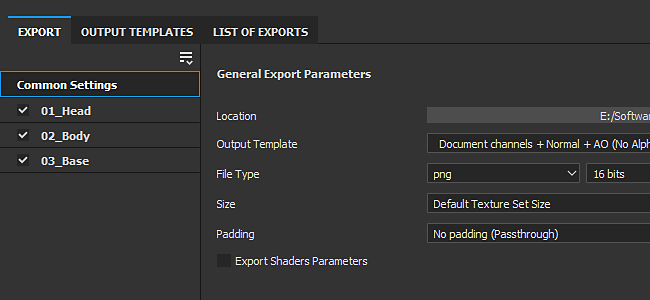

The export window has been fully reworked to offer an easier and more straightforward way to configure and export textures from a project. It also brings some new functionalities that make exporting much more convenient. The new export window is now divided into three tabs:

**Settings**

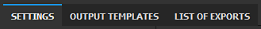

This tab controls the general and specific settings for each Texture Set.

* **New Global Settings**  
  Global Settings are a set of parameters shared across all Texture Sets. They can be used to quickly assign or update parameters without having to manually edit each Texture Set individually. Global Settings have the following parameters:

  * **Output directory**: defines the target location where the textures will be generated.
  * **Output template**: defines the preset to use to configure naming and packing of the exported textures.
  * **File type**: defines file format and bit depth of the exported textures.
  * **Size**: defines the biggest texture resolution a Texture Set will be exported at.
  * **Padding**: defines how information outside of the UV islands will be generated.
  * **Export shaders parameters**: if enabled, exports a json file storing the shader settings and their Texture Set assignments.

  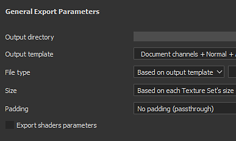
* **Per Texture Set settings and parameters override**  
  Below the Global Settings is the list of Texture Sets from the currently opened project. The General Export Parameters section displays settings inherited from Global Parameters. It is possible to choose a different **export preset per Texture Set** as well.

  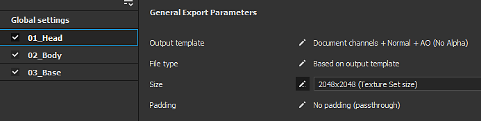

  Clicking on the Pen icon allows to override a specific parameter to change its value. Clicking on it again will disable the override and reset the value back to default (inherited from Global Settings).

  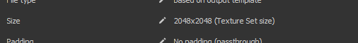
* **Choose which textures to export**  
  Below the Texture Sets export parameters is a list of textures that will be generated. With this list, it is possible to choose precisely which file should be generated by checking or unchecking them. The list also displays the file format and bit depth for each texture, inherited from the export configuration or the output template. Use the pen icon to override the file format and bit depth for a specific texture.
* **Save settings without exporting**  
  It is now possible to save the export configuration of the project without having to export textures by using the new **Save settings** button. This is useful when you'd like to adjust a project without regenerating textures which could take some time.

  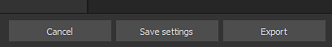
* **Click and drag to quickly enable/disable exports**  
  Use the Mouse click plus drag to quickly enable or disable Texture Sets and textures:

  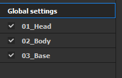

  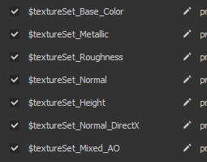

**Output Templates**

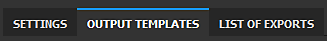

This tab allows to create configuration presets to name the exported textures.

* <b>Create export presets</b>  
  The <b>Output Template</b> tab is identical to the <b>Configuration</b> tab from the old exporter. It can be used to create export presets to quickly name and pack textures. To learn how to create custom export presets, take a look at our documentation page.
* **Setup file format and bit depth in export presets**  
  A new addition to export presets is the possibility to set the file format and the bit depth per texture to make sharing a configuration even easier across projects.

  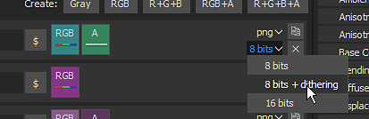
* **Control exported textures from the output template**  
  When setting up the export process, use the new option **Based on output template** to define texture properties from the export preset.

  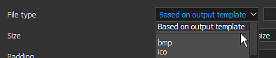

**List of Exports**

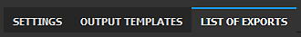

This tab displays the export process in progress as well as a global summary of all the texture exported.

* **List of exported textures**  
  The tab lists each individual texture to be exported per Texture Set, taking into account overridden parameters and ignored/excluded textures. This is a good way to make sure that everything is fine before launching the export process. The interface will automatically switch to this tab when the export process starts.

  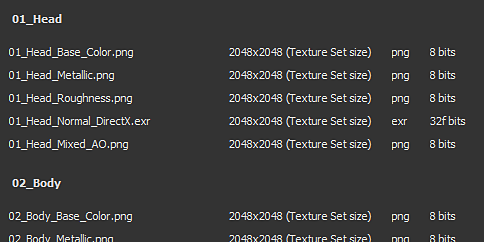
* **Export process and logging**  
  On the right of the tab is a console that outputs details about the in-progress export process. It will indicate which textures were exported successfully, as well as any warnings and errors. The bottom of the interface also displays a progress bar that gives the current status of the process:

  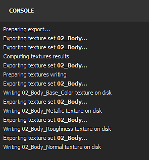

  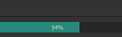

### New Decal Layer Mode

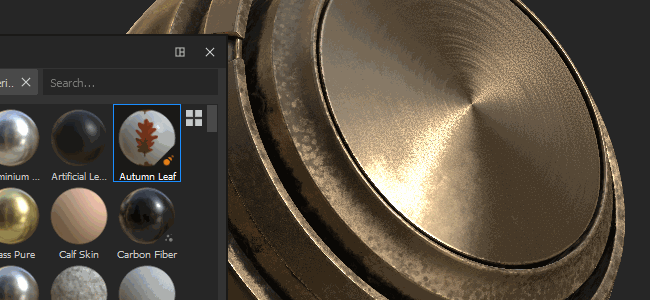

There is a new **Decal** mode available when drag and dropping a material from the [Assets](../../../interface/assets/assets.md). It creates a new fill layer in **Planar Projection** mode which allows to position patterns and images more easily. To use it, simply **drag and drop** any material from the Shelf while pressing the **ALT keyboard shortcut** to preview the manipulator and release the mouse once the decal is where you want it to be. On the release of the mouse button, a new fill layer will be created.

For this occasion, we'd also included 5 decals in the default Shelf selected from Substance Source. If you want to learn more about this new decal workflow, check out [this article](https://magazine.substance3d.com/effortless-grunge-look-with-new-substance-source-parametric-decals/).

>[!NOTE]
>
> To make decals easier to use, we'd implemented a new [user-data keyword](../../../content/creating-custom-effects/user-data/user-data.md) that allows to specify the default blending mode for each channel when creating layers.

### New Python Scripting

It is now possible to write and run **Python** scripts and modules with Substance Painter. We integrated Python 3.7 and PySide2 with Substance Painter, we also provide a custom Python API via the dedicated **substance\_painter** module. Additionally, we took the opportunity to rethink our API from the JavaScript version to make it clearer and easier to use. They share similarities which should make the creation of Python plugins straightforward for existing users.

To learn more about the Python API, check out the documentation accessible via the Help menu within the application.

* **Installing a Python module**  
  Python modules can be installed in the dedicated Documents folder under the user account, but we also provide a way to add supplementary path locations via a dedicated environment variable to make the setup across a studio easier.
* **Substance Painter Python sub-modules**  
  The following sub-modules have been exposed (more will be available at a later date):

  * substance\_painter.display
  * substance\_painter.event
  * substance\_painter.exception
  * substance\_painter.export
  * substance\_painter.logging
  * substance\_painter.project
  * substance\_painter.resource
  * substance\_painter.textureset
  * substance\_painter.ui
* **Python interpreter**  
  A new Python console window is available to try out modules and/or run python scripts:

  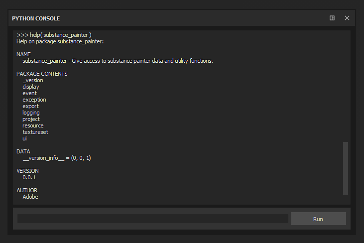{width="500px"}

### Improved Bakers

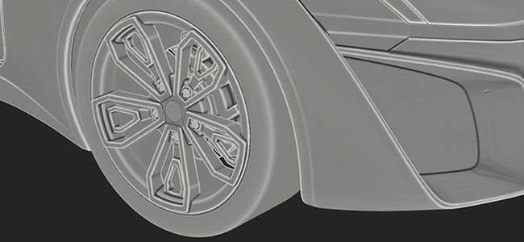

In this release the Curvature baker has been improved and the Ambient Occlusion baker got a few new parameters.

* <b>New Curvature from mesh baker</b>  
  The old curvature baker is now deprecated and has been replaced by the new "from mesh" version which was recently added to Substance Designer. To learn more about the new baker settings, take a look at the documentation page.  
  The new baker has the following features:

  * <b>More accuracy</b>: the curvature computed is much more precise and produces realistic values.
  * <b>Mesh contact</b>: interpenetration between meshes now produces curvature information (which was not the case with the previous baker).
  * <b>High-poly mesh</b>: details are now baked from the high-poly mesh directly instead of converting from the normal map.
  * <b>Performances</b>: the new baker uses raytracing to compute details, which means it benefits from GPU raytracing acceleration (RTX/Optix).

  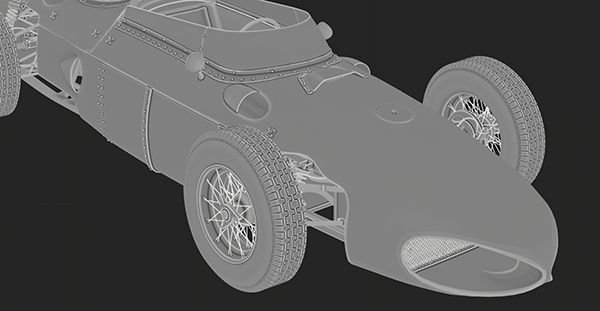{width="500px"}

  It is still possible to access the old curvature baker for compatibility reasons via the Curvature baker settings. Choose the setting **Generate from Normal Map** to use the old baker.

  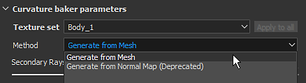
* <b>Improved Ambient Occlusion</b>  
  The Ambient Occlusion baker has been improved to support new settings:

  * <b>Ground Plane</b>: simulates a plane below the mesh to create shadowing coming from the ground. For more information, see the Ambient Occlusion documentation.
  * <b>Ignore Backface</b>: there is a new mesh name suffix to ignore specific object when baking the Ambient Occlusion. For example, this allows to ignore floating geometry details. For more information, take a look at the Matching By Name documentation

  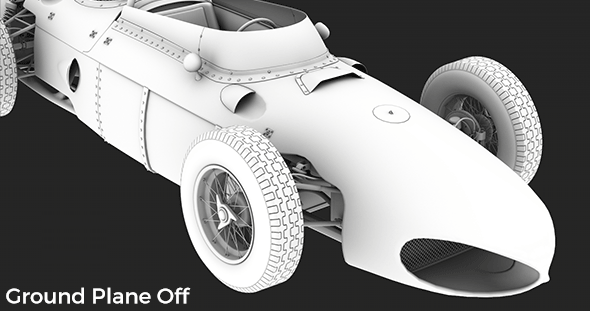{width="500px"}

### Improved Mesh Export (with Tessellation)

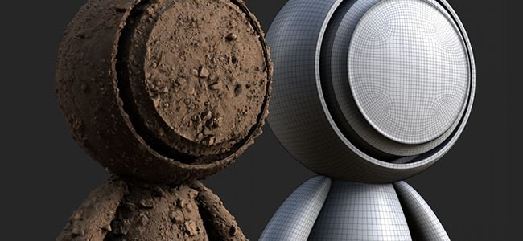

The export mesh has been improved with new features and settings:

* **Export original mesh topology or export mesh with tessellation**  
  When exporting the mesh, it is now possible to choose to apply the tessellation generated for displacement effects. Possible settings are:

  * **Without displacement/tessellation**: export the base mesh without mesh subdivisions. If **Apply Triangulation** is disabled, the original mesh triangles, quads or n-gons will be exported.
  * **With displacement/tessellation**: export the mesh with subdivisions. If **Recompute vertex normals is enabled**, the mesh normals will be adjusted to match the displacement offsets.

  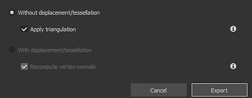
* **Scene hierarchy and mesh names**  
  The original scene hierarchy and the object names from the imported mesh are now preserved and reapplied to the exported mesh.
* **Export with FBX file format**  
  The project mesh can now be exported in FBX, alongside other file formats.  
  **Note**: Incompatible data with Substance Painter is still discarded during import (ex: skinning, joints).

### Improved Automatic UV Unwrapping

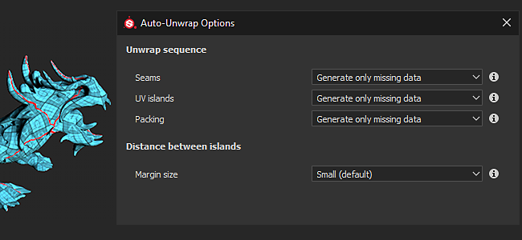

The Automatic UV Unwrap can now be more easily controlled with the help of new settings:

* **Use Automatic UV Unwrapping during project creation**  
  When creating a project, there is now a new setting that allows to enable or disable the new automatic UV unwrapping process. This setting is also available when re-importing a 3D mesh to an existing project.

  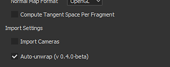
* <b>Advanced Unwrapping settings</b>  
  Next to the checkbox to enable the Automatic UV Unwrapping is a new <b>Options</b> button. It opens a new window with advanced settings to control the unwrapping process, allowing to preserve existing mesh information at different part of the process instead of always recomputing everything like it did before. For more information, see the dedicated documentation. Current settings are:

  * <b>Seams</b>: defines if the existing seams are preserved or regenerated.
  * <b>UV islands</b>: defines if the existing UV unwrap is preserved or regenerated.
  * <b>Packing</b>: defines if the UV island packing is preserved or regenerated.
  * <b>Margin size</b>: defines the spacing between each UV island (percentage).

  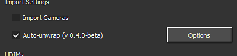

### New Content

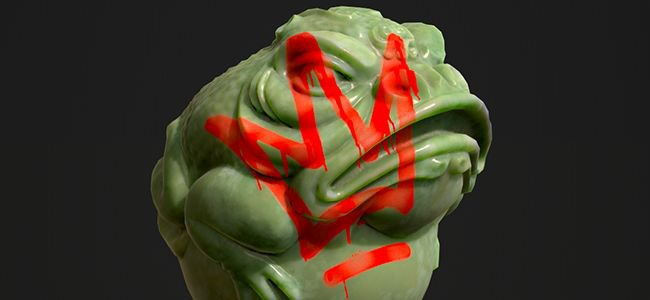

In this release we included a few new materials as well as updated a lot of our export presets to match new software versions.

* **5 new decal materials**  
  We added 5 new materials coming directly from Substance Source to try out the new decal feature:

  * Large Rust Leaks
  * Medium Acarospora Lichen
  * Scarce Blood Leaks
  * Small Bullet Impacts On Concrete Wall
  * Spray Paint Tag

  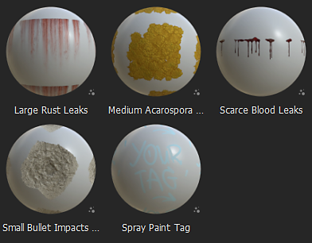
* <b>New Vray shader, project templates and export presets</b>  
  In collaboration with [Chaos Group](https://www.chaosgroup.com/) we integrated two new shaders that replicate the VrayMtl behaviors. They should provide a more accurate look when trying to match renders made with Vray. Use the project templates to easily setup any new project for Vray. Take a look at the documentation to learn more about it.

  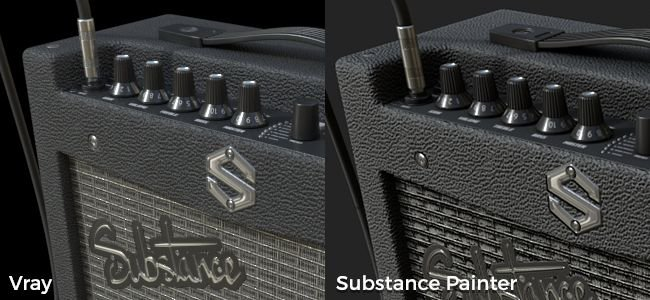
* <b>New Maxwell project templates and export presets</b>  
  In collaboration with [Next Limit](http://www.nextlimit.com/) we integrated new project templates and export presets for the Maxwell renderer.
* **Updated export presets**  
  Many export presets have been updated, mainly to use the new file format and bit depth settings but also to match new software versions.

## Tutorials

Check out our new video tutorials covering the new features:

## Release Notes

### 2020.1.3

*(Released June 16, 2020)*   
Summary : **Bugfix**

**Added:**

* &#91;Export&#93; Add displacement settings in Shader parameters json file

**Fixed:**

* &#91;Crash&#93;&#91;Engine&#93; Crash when trying to erase and replace existing channels
* &#91;Crash&#93; Changing shader after painting a mask in material layering
* &#91;Crash&#93;&#91;Engine&#93; Crashes with some heavy projects
* &#91;Bakers&#93; Matching By Name doesn't work with OBJs exported from zBrush
* &#91;Displacement&#93;&#91;SVT&#93; Textures are not displayed at project opening when displacement is on
* &#91;Export&#93; Some textures are exported uniform gray
* &#91;Export&#93; Disabled Texture Sets should not be exported for Dimension and Sketchfab export presets
* &#91;Scripting&#93;&#91;JavaScript&#93; Crash while using the JavaScript API to access the export config in the onProjectOpened event
* &#91;Scripting&#93;&#91;Javascript&#93; onExportFinished() is not called after an export

### 2020.1.2

*(Released May 28, 2020)*   
Summary : **Bugfix with Substance Engine and Bakers update**

**Added:**

* &#91;Bakers&#93; Update to the most recent version
* &#91;Bakers&#93; New Sampling method in Ambient Occlusion, Curvature, Thickness bakers
* Update to the most recent version of Substance Engine
* &#91;Scripting&#93;&#91;Python&#93; Allow creation of ResourceID for project resources
* &#91;Scripting&#93;&#91;Python&#93; Allow querying channel information
* &#91;Scripting&#93;&#91;Python&#93; Add dryrun and callback functions to simulate texture export

**Fixed:**

* &#91;Bakers&#93; Incorrect normals in World Space Normals baker using a tangent Normal map in specific cases
* &#91;Bakers&#93; Error baking Ambient Occlusion with Optix when no high poly
* &#91;Dynamic Strokes&#93; Lag when loading specific Texture Set
* &#91;Export&#93; Should not export the disabled texture sets for USD, glTF
* &#91;Scripting&#93;&#91;JavaScript&#93; Cannot edit new Curvature baker settings
* &#91;Scripting&#93;&#91;JavaScript&#93; alg.texturesets.addChannel() does not return an error in some cases
* &#91;Scripting&#93;&#91;JavaScript&#93; Typo in Javascript API documentation for setProjectExportOptions()
* &#91;Scripting&#93;&#91;JavaScript&#93; Always exports all texture sets
* &#91;Scripting&#93;&#91;Python&#93; sys.executable returns a path to python.exe instead of Substance Painter
* Texture cache not compatible across Mac OS and Windows/Linux
* &#91;Livelink UE4&#93; Only last material is used for all texture sets in a combined mesh

**Known Issues:**

* &#91;Export&#93;&#91;Dimension&#93;&#91;Skecthfab&#93; Should not export the disabled texture sets
* &#91;Crash&#93; Change shader after having painted a mask in material layering

### 2020.1.1

*(Released May 05, 2020)*

**Added:**

* &#91;Export&#93; Overridden state visual feedback on TextureSet

**Fixed:**

* &#91;Export&#93; Exporter window size too large on special resolution monitor and can not be resized
* &#91;Export&#93; Options are not saved after export
* &#91;Export&#93; Crash or cannot export with "from cache" export preset
* &#91;Export&#93; Cancelling export generates an unexpected additional empty map
* &#91;Export&#93; Fix virtual export preset settings
* &#91;Python&#93; PYTHONPATH env var is not taken into account
* &#91;Python&#93;&#91;Export&#93; Cancelling export via Python returns an exception error
* &#91;Python&#93;&#91;Export&#93; export\_project\_textures incorrect result with psd file format

**Known Issues:**

* &#91;JavaScript&#93; Cannot edit new Curvature baker settings
* &#91;JavaScript&#93;&#91;Export&#93; Always exports all texture sets
* &#91;Bakers&#93; Crash on Linux with GPU raytracing
* &#91;Export&#93;&#91;USD&#93; Should not export the disabled texture sets

### 2020.1.0

*(Released April 22, 2020)*

**Added:**

* New texture and mesh exporter
* &#91;Export&#93; New exporter interface
* &#91;Export&#93;&#91;Export tab&#93; Allow selection of which maps channels are exported per Texture Set
* &#91;Export&#93;&#91;Export tab&#93; Allow modification of the Texture Set size for all Texture Sets in one action
* &#91;Export&#93;&#91;Export tab&#93; Allow a different template per Texture Set (except for USD, glTF, Sketchfab and Dimension)
* &#91;Export&#93;&#91;Export tab&#93; Quick activation and deactivation of maps and Texture Sets
* &#91;Export&#93;&#91;Export tab&#93; Export resolution 8192x8192 no longer experimental
* &#91;Export&#93;&#91;Export tab&#93; Allow modification of the file format and bit depth per map
* &#91;Export&#93;&#91;Export tab&#93; Allow reset to the default parameters' values
* &#91;Export&#93;&#91;Export tab&#93; Allow settings to be saved without exporting
* &#91;Export&#93;&#91;Output templates tab&#93; Rename "Configuration" tab to "Output templates" tab
* &#91;Export&#93;&#91;Output templates tab&#93; Allow definition of file format and bit depth per preset map
* &#91;Export&#93;&#91;List of exports tab&#93; New preview tab to summarize and view export process
* &#91;Import/Export Mesh&#93; Import/Export time performance optimization
* &#91;Export Mesh&#93; Export Mesh in FBX
* &#91;Export Mesh&#93; Export mesh with displacement and tessellation
* &#91;Export Mesh&#93;&#91;UI&#93; New settings for recomputing normal vertex, apply triangulation
* &#91;Export Mesh&#93; Export original mesh topology with new UVs generated by auto unwrapping
* Updated auto UV unwrapping with more controls
* &#91;UV Unwrapping&#93;&#91;UI&#93; Add setting to activate auto UV unwrapping in new project window
* &#91;UV Unwrapping&#93;&#91;UI&#93; New Options to control the unwrapping steps (seams, unwrapping, packing)
* &#91;UV Unwrapping&#93;&#91;UI&#93; Allow conservation of existing unwrapping seams/unwrapping/packing
* &#91;UV Unwrapping&#93;&#91;UI&#93; New Options to fully recompute unwrapping steps
* &#91;UV Unwrapping&#93;&#91;UI&#93; New Option to control the margin size (none, small, medium and large)
* New Bakers
* &#91;Bakers&#93; Replace old Curvature by new Curvature from mesh
* &#91;Bakers&#93; Add match by name option to ignore backface in "Ambient Occlusion" baker
* &#91;Bakers&#93; Add ground plane option in "Ambient Occlusion" baker
* New scripting Python API (3.7.6)
* &#91;Python&#93;&#91;UI&#93; New scripting menu for Python
* &#91;Python&#93;&#91;UI&#93; New Python documentation in Help menu
* &#91;Python&#93; Expose Substance Painter python modules: substance\_painter, alg, display, project.setting, project, texturesets, ui
* &#91;Python&#93; Expose new "substance\_painter" Python module
* &#91;Python&#93; Expose new Python sub-module: alg, display, log, project, resource, texturesets, ui
* &#91;Python&#93; Listener for project changes
* &#91;Python&#93; New examples in Python documentation
* &#91;JavaScript&#93;&#91;UI&#93; Plugins menu replaced by JavaScript
* &#91;Viewport&#93; Allow creation of a decal projection by "drag/dropping + ALT" a resource from the shelf
* New Content
* &#91;Content&#93; 5 new decal materials from Substance Source
* &#91;Content&#93; Add new project templates and export presets for Maxwell renderer
* &#91;Content&#93; Add project template for Keyshot 9 export
* &#91;Content&#93; Update Keyshot 9 export preset to support displacement and emissive
* &#91;Content&#93;&#91;Exporter&#93; Update of all export presets to match latest versions of game engines and renderers
* &#91;Content&#93;&#91;Exporter&#93; Update export presets files to use new format and dithering settings
* &#91;Content&#93; New templates and shaders to support VRay material (VRayMtl)
* &#91;Layer Stack&#93; Allow deletion of layer effects using trash icon or keyboard shortcut Delete
* Remove plugin Substance Source (use launcher with "send to" functionality)
* &#91;Windows&#93; Do not display TDR warning on high-end GPUs

**Fixed:**

* Translation issues in new project file dialog
* &#91;Bakers&#93; Setting "Save preprocessed scene file" does not work anymore
* &#91;Bakers&#93; Crash when baking with optix when no high poly
* &#91;Planar Projection&#93; Projection does not work on meshes with repeating UVs
* &#91;Decal&#93; Difference of behavior in normal channel when using different fill layer projection modes
* &#91;Smudge&#93;&#91;Clone&#93; Artifact may appear when painting in mask
* &#91;Engine&#93; Crash with specific layer content
* &#91;Engine&#93; Random crash when painting in some cases
* &#91;Anchor point&#93; Reference to an empty mask always returns white
* &#91;Export&#93; Layer not taken into account in some particular stack configurations
* &#91;Export mesh&#93; Cannot export with path containing special characters
* &#91;Export Mesh&#93; Cannot read glTF files when exported from Linux or MacOS
* &#91;Import mesh&#93; Re-importing DAE, PLY or glTF does not work as intended
* &#91;Crash&#93; Change shader after having painted a mask in material layering

**Known Issues:**

* &#91;Scripting&#93;&#91;JavaScript&#93; Cannot edit new Curvature baker settings
* &#91;Bakers&#93; Crash on Linux with GPU raytracing
* &#91;Export&#93;&#91;USD&#93; Should not export the disabled texture sets
