# Version 2020.2 (6.2.0)

**Substance Painter 2020.2.0 (6.2.0)** introduces the new UV Tile workflow which allows to paint across UDIMs. It also includes several performance and project size improvements for any type of project.

Release date: *July 23, 2020*

> 

Artist credits: Dragon by &#91;Damien Guimoneau&#93;&#40;https://www&#46;artstation&#46;com/damz&#41; and Robot by &#91;Jason Huang&#93;&#40;https://www&#46;artstation&#46;com/jasonhuang&#41;&#46;

## Major Features

### New UV Tile Workflow with Painting Across UDIMs

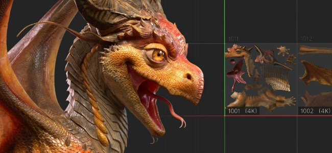

In this release we introduce the new UV Tiles workflow to Substance Painter which allows to paint across UDIM tiles.

With the new workflow, the **UVs are not split into individual Texture Sets anymore**. Instead, UV Tiles are contained inside a single Texture Set based on the material assignation of the mesh. UV Tiles which are within the same Texture Set can be **painted across without seams**, in both the 2D and 3D viewports.

UV Tile is the term used to describe in a generic manner this new workflow since UDIM is mainly a naming convention. While UDIM is currently the only convention available, we have plans to expand it in the future (such as supporting Mudbox or ZBrush naming). We’re also thinking about supporting tiles with negative coordinates, which isn't possible with the UDIM scheme. This is why we chose a broader term for this workflow.

Here is an overview of the changes introduced with this new workflow:

* **Creating a UV Tile project**   
  When creating a new project, there is a new setting to specify if the new workflow should be used or not.

  Note that once the workflow has been decided and the project created, it cannot be changed later contrary to other settings.

  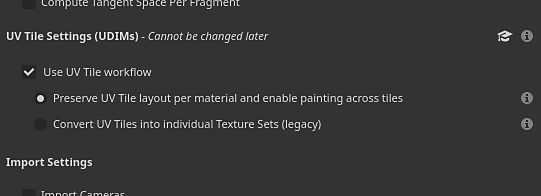
* UV Tiles in 2D Viewport

  When using the new UV Tile workflow, the 2D view will now display a new grid where each UV Tile has a dedicated UDIM number. Each tile can be painted individually.

  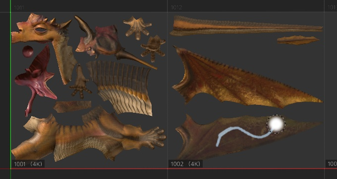
* Painting across UV Tiles

  UV Tiles

  which are within the same Texture Set can be painted across seamlessly. This allows to increase the general resolution and quality of an asset by simply multiplying the number of UV Tiles.
* UV Tiles in Texture Set List window

  The

  Texture Set List has

  been updated to list the UV tiles related to the material found on the imported mesh. Each UV Tile is displayed with its name based on the UDIM convention.

  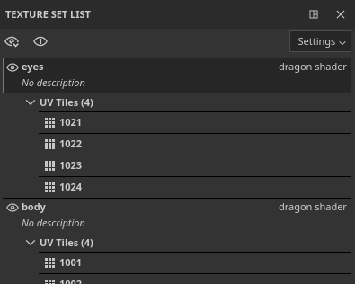
* Changing resolution per UV Tile

  While the default resolution for each UV Tile is based on its parent Texture Set, it is possible to override it per tile. Simply select the tiles in the Texture Set List and then go to the Texture Set Settings window to change the resolution. When a tile has its resolution overridden, the new resolution will be displayed in the 2D View next to its number.

  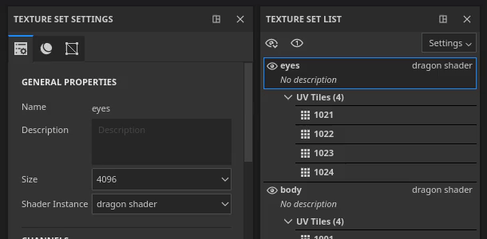
* New layer stack icons

  The layer stack features new icons for paint and fill layers. Since UV Tiles feature many more set of textures, it wasn't possible to display all of them in this small area. This help performance since there is no need to compute specific thumbnails anymore. This new set of icons can be used for regular project as well by enabling a settings in the main settings (see below).

  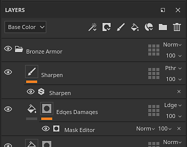
* New UV Tile Mask on layers

  The UV Tile Mask is a new way to mask in/out layers which is more efficient than regular masking. It offers better performances as it allows to fully discard the computation of specific UV Tiles. This is a tool we recommend to use to get a comfortable experience when working in a project with many UV Tiles. For more information, see the [dedicated page](../../../interface/layer-stack/geometry-mask/geometry-mask.md) in the documentation.

  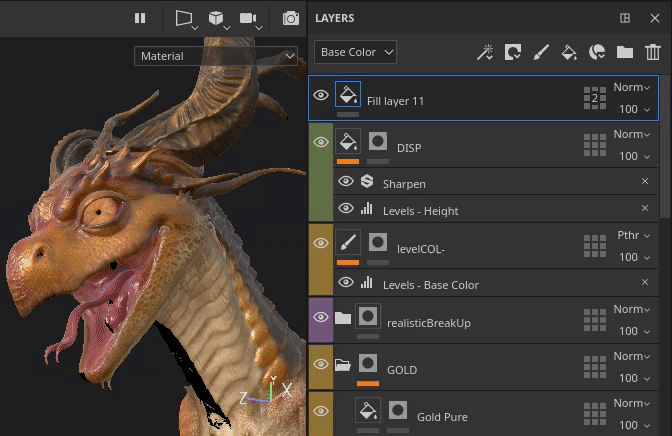{width="550px"}
* **Painting through masked UV Tiles**  
  With multiple UV Tiles being in the same Texture Set, it might be difficult to paint certain areas of a mesh because of other parts of the geometry being in the way. To circumvent that situation, a new painting setting has been added in the contextual toolbar named **Paint strokes ignore masked UV Tiles**. When this setting is enabled, any UV Tile excluded via the UV Tile Mask will be hidden in the viewport, allowing paint strokes to go through/ignore them. Modifying the UV Tile Mask will recompute the brush strokes as it allows reimporting a mesh which may have modified UV Tile or new geometry that needs to be excluded as well. This avoids redoing the paint strokes.

  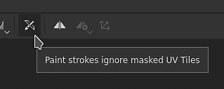

  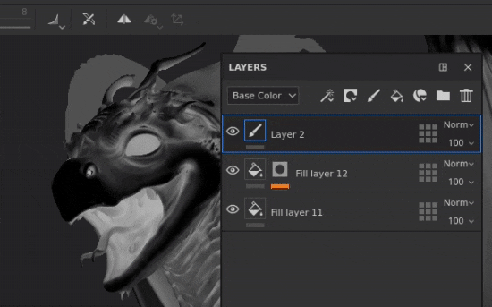
* Baking UV Tiles

  The bakers also support UV Tiles and there is now a selection list in the baking window

  to specify which tiles and Texture Sets should be baked. The selection can be quickly changed by clicking and dragging over the checkbox or by using the new dropdown menus.

  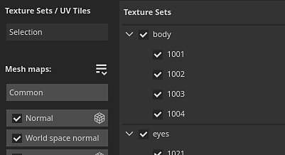

  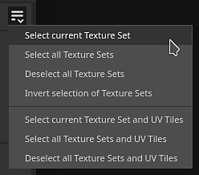
* Exporting UV Tiles textures with the new $udim tag

  A new tag has been added to the output templates which allows to export files with the UV Tile number in their filenames. Currently only the UDIM convention is available. It is also possible to use parentheses to define optional elements in a filename when a tag is not available. This allows for example to create filenames that only append the UDIM number when available with UV Tile projects, making export presets compatible with any type of projects.

  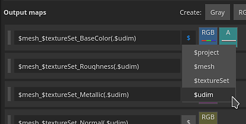
* **Importing image sequences**A sequence of images is a series of textures where each of them match a specific UV Tile. To import an image sequence, simply drag and drop the first file of the sequence into the Shelf or use the import resources window. The remaining files in the sequence will be automatically imported as well. The sequences will be displayed in the Shelf as a single resource with a number indicating how many files they contain. To use the sequence, simply drag and drop it into a fill layer. The projection mode will be automatically set to **Fill (Match Per UV Tile)**.

  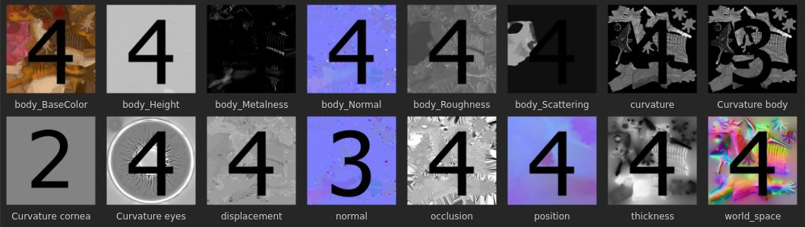{width="600px"}

  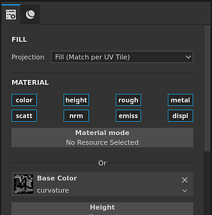
* Support of Facesets with Alembic meshes

  Alembic Facesets are now imported as materials to be split into Texture Sets. This change makes Alembic meshes compatible with the new UV Tiles workflow. If an Alembic mesh contains faces which are not in a Facesets, they will be put automatically into a Texture Set named DefaultMaterial.

To learn more details about the new UV Tile workflow, take a look at the [dedicated documentation](../../../features/uv-tiles/uv-tiles.md).

>[!NOTE]
>
> The UV Tile workflow can be very demanding, we recommend working with SSDs to store both the cache and a project file to reduce loading times and get a smooth experience.

### New Pause Engine

It is now possible to pause Substance Painter engine while working. With the engine paused, any texture computation, viewport updates or paint strokes is registered but not computed.

This new action allows to setup and tweak complex layer stacks and delay the computation to the last moment. The main advantage of pausing the engine is avoiding intermediate computations and instead only compute the final result. This makes the application more responsive and the update overall more rapid. The trade-off is that there is no visual feedback until the engine is unpaused.

To pause the engine, simply click on the **button in the contextual toolbar** above the viewport, or use the **shortcut Shift + Escape** (can be modified in the Settings). To unpause the engine toggle off the button or reuse the shortcut.

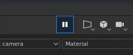

### Performances Improvements

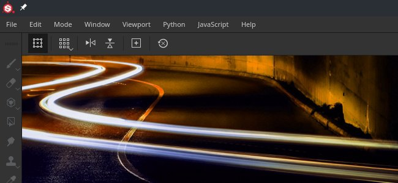

* **Faster export of textures**   
  Exporting textures should be significantly faster, especially with heavy projects that generate many textures. Several improvements have been made in the way textures are generated generate and written. In our internal tests on projects with many Textures Sets or complex layer stacks we saw the export process being generally up to **4 or 5 times faster**.
* **Delayed cache computation when opening projects**Substance Painter uses a cache system to allow fast tweaking and blending of layers. In previous versions this cache was being computed each time a project was opened (visible by the green loading bar at the bottom of the viewport). Now the cache computation is only triggered when trying to edit a layer (by painting or tweaking a fill layer parameter for example). This change allows to open projects without waiting and switching to the desired Texture Sets before starting to work. The computation is also more granular, which allows to only compute what is needed. For example with a project containing UV Tiles, only the tiles that need to be modified are computed.
* **Asynchronous loading of mesh maps**Mesh maps are now loaded asynchronously. This means the application will not be blocked anymore while waiting for the mesh maps to load. This is especially visible when displaying the mesh map in the viewport (as in the image below). It also makes opening projects quicker since there is no wait for the mesh maps anymore.

  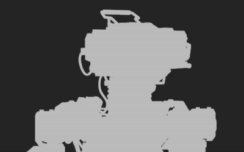
* **Improved mask view mode editing**   
  When using ALT+Click on a mask (or the dedicated view mode) to display it in the viewport, the texture updates are now only performed for the mask. This means painting and editing effects is much more smooth using this view mode as any other computations is delayed until the viewport is set back to the material mode.

  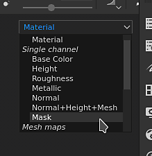
* **New layer stack thumbnails**   
  As mentioned previously, the layer stack can now use a new set of icons. Using these icons can improve general performances as no thumbnails has to be computed. While this is automatic for UV Tile projects, regular projects can choose to use these icons as well by going to **Edit &gt; Settings** and enabling **Replace layer stacks thumbnails with icons**.

  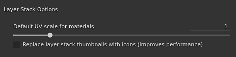
* **Faster incremental save**As project can be smaller and the save process is more granular regarding the data that changed, incremental save (pressing CTRL+S) is now much quicker. This is especially noticeable on heavy projects.
* **Improved Iray startup performances**   
  Switching to the render mode with Iray should be quicker as we improved the way we manage the memory shared within the application.

### Project Size Improvements

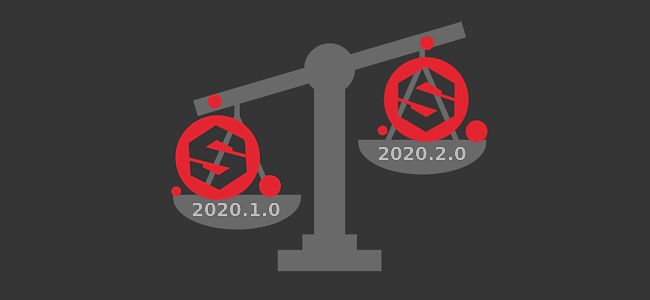

Project files are notorious to have an [heavy file footprint](../../../technical-support/workflow-issues/project-issues/projects-are-really-big/projects-are-really-big.md). We took the time to investigate the root cause of this problem and designed a few solutions. This version introduces a first set of changes:

* **Switching bakers outputs to grayscale images**   
  In previous versions, the bakers would output RGB images in any cases. Now grayscale bakers (curvature, ambient occlusion) will only output grayscale images. This simple change can reduce projects size from 20% to 60% down. To take advantage of this change, mesh maps in existing projects need to be regenerated.
* **Changing default diffusion and dilation settings for bakers**   
  Previously, the bakers would generate a 1 pixel dilation and then a diffusion pattern (blurry pixels outsides the UV islands). This setup generate quite heavy textures as gradient are hard to compress. The default settings have therefore been changed to reduce that issue. By default diffusion is now off and the dilation has been set to 32 pixels (which should match 4K resolutions). We recommend switching existing project to these new settings and rebaking to take advantage this improvement.

### Miscellaneous Improvements

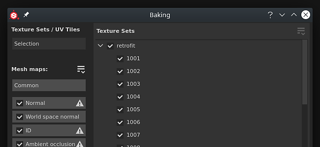

This new version includes a few additional changes:

* **Baking Selection**   
  To make things easier with the new UV Tile workflow, the baking window has been slightly modified to include a new selection list, which includes the UV Tile list per Texture Set. The "bake current Texture Set" button has therefore been removed. To keep the selection of what to bake convenient, several options has been added in dropdown menus:

  

  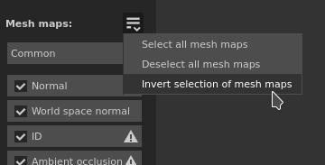
* **Shader Instance in Texture Set Settings**   
  With the rework of the Texture Set list to includes UV Tiles, some slight changes have been made to make the UI less cluttered. The functionality which previously allowed to create and switch to different shader instances has now been moved into the Texture Set settings.

  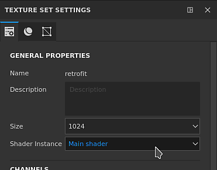

## Tutorials

Below are our new video tutorials covering the new features. More videos are available on [Substance Academy](https://www.youtube.com/playlist?list=PLB0wXHrWAmCx1fWbUyBFcjtfL8xhxZFnv) about the new UV Tile workflow.

## Release Notes

### 2020.2.0

*(Released July 23, 2020)*

**Added:**

* UV Tiles (UDIMs)
* &#91;UV Tiles&#93; Paint across UV tiles
* &#91;UV Tiles&#93; Allow to choose between new and legacy workflow for UV Tiles
* &#91;UV Tiles&#93; Import UDIMs/UV Tile image sequences as a resource
* &#91;UV Tiles&#93; Add list of UV Tiles per Texture Set in Texture Set List window
* &#91;UV Tiles&#93; Allow to edit the resolution of multiple UV Tiles at once in Texture Set Settings
* &#91;UV Tiles&#93;&#91;2D View&#93; Display UV Tiles as a grid
* &#91;UV Tiles&#93;&#91;2D View&#93; New viewport button to display or hide UV Tiles information
* &#91;UV Tiles&#93; Switch painting tool to single channel by default for UV Tile projects
* &#91;UV Tiles&#93; New button in contextual toolbar to ignore masked UV Tiles while painting
* &#91;UV Tiles&#93;&#91;Layer Stack&#93; New layer stack icons to improve performance
* &#91;UV Tiles&#93;&#91;Layer Stack&#93; Improve Paint and Fill icons in the toolbar
* &#91;UV Tile Mask&#93;&#91;2D View&#93; Allow to include or exclude multiple UV Tiles at once (left click, CTRL+left click)
* &#91;UV Tile Mask&#93; New UV Tile mask to include, exclude tiles per layer with a new icon
* &#91;UV Tile Mask&#93;&#91;Layer Stack&#93; Display the number of UV Tiles in the UV Tiles mask icon when not all are included
* &#91;UV Tile Mask&#93;&#91;2D/3D View&#93; Add hover effect to visualize UV Tiles under the cursor
* &#91;UV Tiles&#93;&#91;Bakers&#93; Allow to select and bake specific UV Tiles
* &#91;UV Tiles&#93;&#91;Bakers&#93; Add selection options for Texture Sets/UV Tiles
* &#91;UV Tiles&#93;&#91;Bakers&#93; Right click menu option to select UV Tiles within a Texture Set
* &#91;UV Tiles&#93;&#91;Bakers&#93; Allow quick selection in the Texture Set/UV Tiles by dragging
* &#91;UV Tiles&#93;&#91;Bakers&#93; Replace "All" and "None" buttons in Mesh Maps by more explicit selection options
* &#91;UV Tiles&#93;&#91;Bakers&#93; Display number of textures to be baked
* &#91;UV Tiles&#93;&#91;Export&#93; Allow to select and export specific UV Tiles
* &#91;UV Tiles&#93;&#91;Export&#93; Allow quick selection of UV Tiles by dragging
* &#91;UV Tiles&#93;&#91;Export&#93; Add dropdown menu options for UV Tiles
* &#91;UV Tiles&#93;&#91;Export&#93; Make some export presets unavailable if they do not work with UV Tiles (Adobe Dimension, Sketchfab, glTF, USD)
* &#91;UV Tiles&#93;&#91;Content&#93; Update export presets to use the new $udim tag
* &#91;UV Tiles&#93; Improve error reporting when importing meshes with overlapping UV islands
* &#91;UV Tiles&#93; UV Tiles compatible in Iray
* &#91;UV Tiles&#93;&#91;Scripting&#93; Add UV Tile export documentation to Python doc
* Performance
* &#91;Performance&#93; New button in contextual toolbar to pause engine computation when working (SHIFT+ESC)
* &#91;Performance&#93; Faster project opening by delaying Texture Set cache computation
* &#91;Performance&#93; Don't wait for mesh maps to load when opening project
* &#91;Performance&#93;&#91;2D/3D View&#93; Don't compute Mask channel in viewport when it is not used
* &#91;Performance&#93; Do not block the application when loading mesh maps displayed in the viewports
* &#91;Performance&#93; Improve incremental save speed when saving a project
* &#91;Performance&#93;&#91;Bakers&#93; Change default dilation settings to improve saving time and project size
* &#91;Performance&#93;&#91;Bakers&#93; Switch to grayscale on specific Bakers to improve saving time and project size
* &#91;Performance&#93;&#91;Export&#93; Improve engine performance to export textures faster
* &#91;Performance&#93;&#91;Export&#93; Improve responsiveness when opening the export dialog with a lot of Texture Sets
* &#91;Performance&#93;&#91;Export&#93; Improve performance when switching to tab "List of Exports"
* &#91;Performance&#93;&#91;Iray&#93; Reduce Iray startup time
* Other
* &#91;Bakers&#93; Add selection options for Texture Sets
* Move shader instance management to Texture Set Settings
* &#91;2D/3D View&#93; Add message at bottom of the viewport to indicate which mask type is edited
* &#91;Layer Stack&#93; New option in settings to switch between legacy and new thumbnails
* &#91;Layer Stack&#93; Add visual feedback to indicate loading state of the thumbnails
* &#91;Proj&#93; New projection mode "Fill (Match Per UV-Tile)" to load image sequences
* &#91;Proj&#93; Change fill layers projection mode to "Fill (Match Per UV-Tile)" in specific cases
* &#91;Content&#93; Optimize Charcoal brush presets to improve performance
* Update Iray to version 2020.0.0
* &#91;Export&#93; Disable List of Exports tab when nothing is selected
* Auto Unwrap
* &#91;Auto Unwrap&#93; Improve quality of seams placement
* &#91;Auto Unwrap&#93; Improved parameterization to increase speed and stability

**Fixed:**

* &#91;Alembic&#93; Facesets are ignored when importing files
* &#91;Alembic&#93; Infinite loading time with specific files
* &#91;Import&#93; Incorrect UDIM image sequence is imported when only the file extension differs
* &#91;Crash&#93; Trying to open project locked by another process leads to a crash
* &#91;Export&#93; Emissive channel is not exported with USD format
* &#91;Content&#93; Smart Material "Charcoal" contains paint strokes

**Known Issues:**

* &#91;Texture Set List&#93; Cannot hide description
* &#91;Texture Set List&#93; UI issues
