# Version 2021.1 (7.1.0)

**Substance Painter 2021.1 (7.1.0)** introduces several new features and improvements such as the geometry mask and the copy and paste of effects in the layer stack.

Release data: *28 January 2021*

>[!NOTE]
>
> This release raise the minimum version supported of Ubuntu to 18.04 and MacOS to 10.14. For more details see the [technical requirements](../../../getting-started/system-requirements/system-requirements.md).

## Major Features

### New Geometry Mask

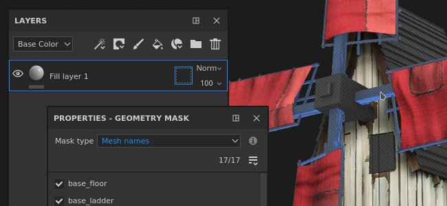

The Geometry Mask is a new masking tool in the layer stack that allows to hide geometry based on mesh names or UV Tiles. It is an evolution of the previously named UV Tile Mask that masked geometry based on UDIM numbers.

This new tool is a better way of masking geometry than regular painting (or when using the [Polygon fill](../../../painting/tool-list/polygon-fill/polygon-fill.md)) because it benefits from several engine optimizations. It is also non-destructive as it doesn't store geometry information (like faces or vertices) but instead just the mesh name or the UV Tile number, so re-importing a mesh won't break the mask. Another benefit is that hiding geometry permit to paint on surfaces that weren't accessible before within a Texture Set, this avoids the need to split an object into several Texture Sets for example.

* **New geometry mask on layers**   
  The geometry mask is automatically available on any layer in the [layer stack](../../../interface/layer-stack/layer-stack.md). By default it has no effect, meaning the layer is fully visible.  
  The Geometry Mask has its own contextual menu that allows to quickly select or deselect all its items but also to copy its values to another layer.

  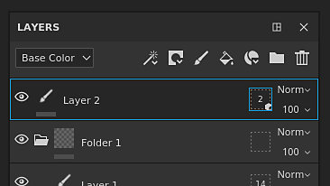

  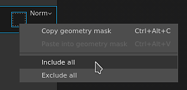

* **Editing the geometry mask properties**The geometry mask follows the same logic as the other layer's contexts (like editing a mask or instanced properties). To enter the geometry mask edition mode, simply click on the doted square at the right of a layer. To exit the geometry mask click on the content or paint mask of the same layer.

  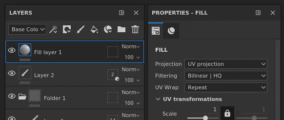

* **Masking by mesh names or by UV Tiles**   
  At the top of the Geometry Mask properties is a dropdown that controls the masking mode. It is possible to choose between masking by UV Tile number or by mesh name. This dropdown is disabled and set to mesh name only in case a project doesn't use the UV Tile workflow.

  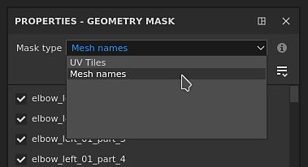

* **Masking geometry via the properties**   
  When editing the Geometry Mask, the properties window will display a list of the mesh names (or UV tiles) based on the geometry related to the current Texture Set.

  * The number above the list indicates how many meshes/UV tiles are unmasked over the total available.
  * The menu next to the number gives quick controls to select all or none of the items and even invert the current selection.
  * The list below defines which items are masked or not. Like other list in the application it is possible to click and drag to enable/disable several items at once or event use **ALT+Click** to isolate an item.

  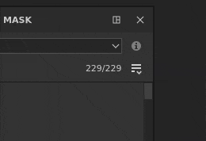 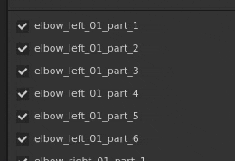

* **Masking geometry via the viewport**   
  The Geometry Mask selection can also be changed in the 2D and 3D views. Simply move the mouse over the part that should be visible/hidden and click on it to toggle its state. When editing the Geometry Mask, masked geometry is displayed with a gray and diagonal lines effect. It is also possible to do rectangular selections by click and dragging to select multiple items at once.  
   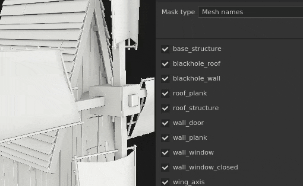 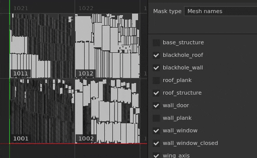

* **Painting hidden / unreachable geometry.**   
  After selecting geometry to mask out in the Geometry Mask, it is possible to enable the **Hide/Ignore excluded geometry** button at the top of the viewport (or by pressing the **ALT+H** shortcut). When enabled, excluded geometry will be hidden (as well as other Texture Sets) to only show geometry that is included / paintable with the current layer. This option allows to paint areas that were previously blocked or out of reach. This option also applies to any kind of layer.

  >[!NOTE]
  >
  > Painting with masked out geometry remains dynamic: if some geometry blocking the painting was initially hidden when the brush stroke was made and is then unmasked it will block again the previously made brush stroke.

  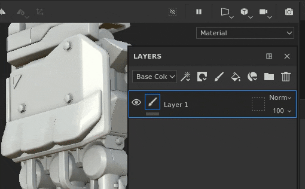

### New Copy and Paste of Layer Stack Effects

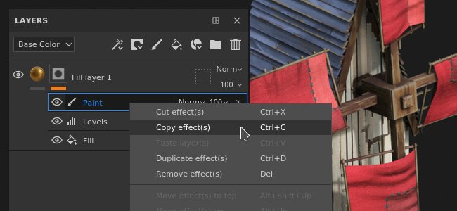

Effects can now be copied across layers and layer stacks, the same way as regular layers.

Multi-selection is now possible as well to offer the possibility to copy and paste multiple effects at once.

For convenience, copying or moving an effect from a mask on a layer without one will automatically add one. This is because effects from the layer content and mask are not compatible with each other. This means copying an effect from a mask into the content of a layer will automatically switch to the mask (or create one).

* **Copy and paste via the contextual menu**  
  Right-click on any effect in the layer stack of a Texture Set and choose the cut or copy action. Then right-click again on any layer and choose paste to move or create a copy of the desired effects. We also took the opportunity to rework the contextual menu and give access to more functionalities:

  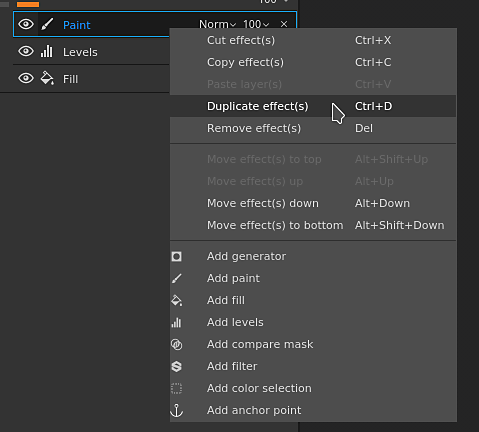

* **Copy and paste with the keyboard shortcuts**  
  Same as with any layer, the keyboard shortcut **CTRL+C** (copy)/**CTRL+X** (cut) and **CTRL+V** (paste) can be used to copy effects based on the current selection. Like with layers, effects are inserted above the current selection.

  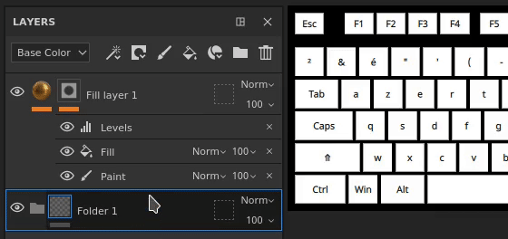

* **Quickly duplicate effect with keyboard shortcuts**  
  Use **CTRL+D** to duplicate the current selection or press and maintain **ALT while dragging** any effect to duplicate it at a desired location:

  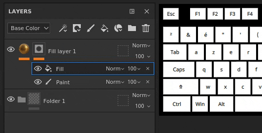

* **Move effects across layers**  
  In addition to the copy and duplication, it is now possible to move an effect by simply drag and dropping it from one layer to another:

  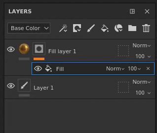

### New General Features and Improvements

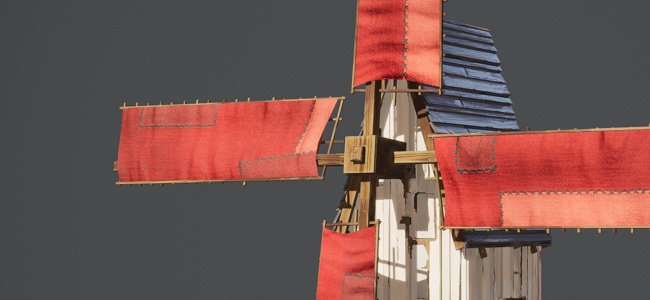

Several improvements have been made in this release:

* **Add a description per UV Tile**  
  A description can now be added for each UV Tile via the Texture Set List. This make the project easier to navigate, especially when exporting and baking as the descriptions can also be seen in these contexts.  
  To add or edit a description simply click on a UV Tile in the Texture Set List window and then go into the Texture Set Settings window to edit it.

  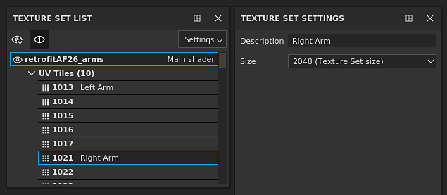

  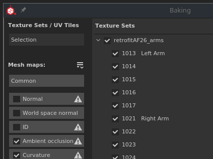 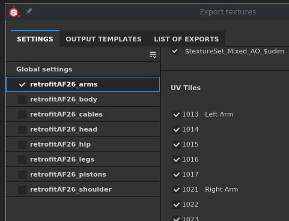

* **New layer stack thumbnails**  
  The optimized layer stack thumbnails have been improved. A material sphere is now displayed for fill layers, making it easier to navigate and see the main properties of each layer even when working with the [UV Tiles](../../../features/uv-tiles/uv-tiles.md) workflow. The thumbnail is generated from the layer information but doesn't take into account effects to avoid being recomputed too often.

  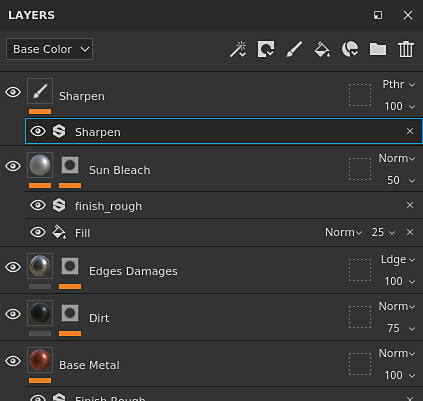

* **Improved Geometry Mask exit in the layer stack**  
  Exiting the Geometry Mask (formerly UV Tile Mask) could be proven difficult with folders in the layer stack if it didn't had a mask. This is because there was no other context to switch on other than selecting another layer. It is now possible to click on the folder thumbnail to exit the Geometry Mask. It is also possible to drag and drop materials or smart materials from the Shelf into the viewport while editing the Geometry Mask.

  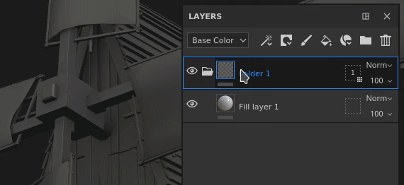

  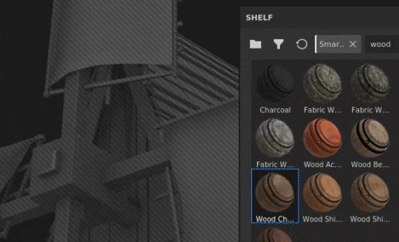

* **New Alt-Click selection in Baking window**  
  The list of mesh maps in the baking window can now be isolated with the **Alt + mouse click** to isolate a specific map to bake, instead of having to exclude them manually. The same shortcut can be used to re-enable all the mesh maps.

  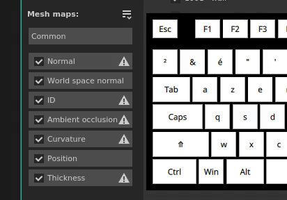

* **New bake current Texture Set button**  
  A new button has been added at the bottom of the Baking window to make it quick and easy to re-bake a Texture Set. Using this button won't affect the custom selection that was previously defined and instead will bake the whole Texture Set (including all its UV Tiles if any are available).

  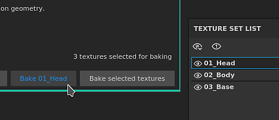

### New Substance Engine Update

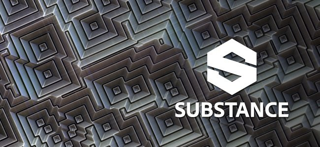

The Substance Engine has been updated to its version 8 to support the latest Substance file format and its functionalities.

For more details on the new Substance Engine features, take a look at [this documentation page](https://helpx.adobe.com/substance-3d/unlisted/documentation/sddoc/version-2020-2-10-2-0-200574252.html).

### New Nvidia RTX 3000 Support in Iray

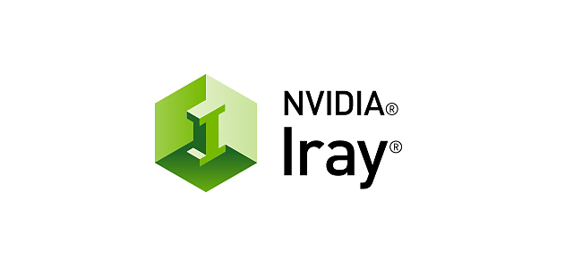

The [Iray renderer](../../../features/iray-renderer/iray-renderer.md) has been updated to its latest version and now supports the new Nvidia Ampere GPUs (RTX 3000 Series and Quadro A Series).

>[!NOTE]
>
> With this update Kepler GPUs (GeForce 600 and 700 series) are not supported anymore, rendering in Iray will be done on the CPU instead.

### New Content

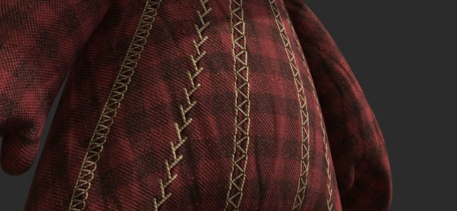

Three new stitch tools have been added in this release and can be used to create complex patterns and realistic stitches. To find them, simply go in the Tool section of the Shelf and look for:

* Stitches Complex
* Stitches Cross Seam
* Stitches Straight

It is recommended to activate the [Lazy mouse](../../../painting/lazy-mouse/lazy-mouse.md) feature in the contextual toolbar to increase the quality of the painted stitches.

Below is an overview of all the presets contained inside these new tools:

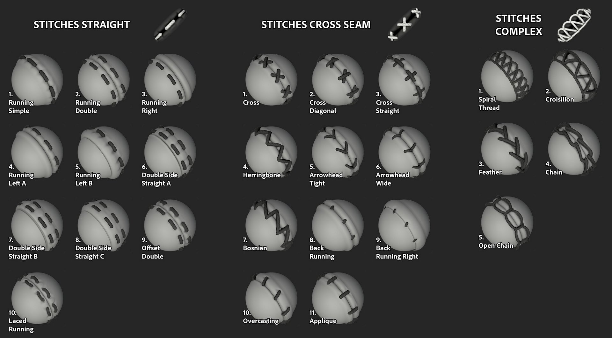{width="800px"}

### New Python Functionalities

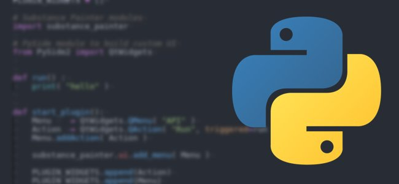

The Python API received several new functionalities. The documentation has also been reworked, notably its examples, to make it easier to understand and learn the API.

* **Resources and shelves management**  
  The resource module has been improved and can now:
  * Create and manage shelves.
  * Search or import resources in shelves and projects.
  * Know if a shelf is being crawled (allowing to know when resources are ready to use).
  * Assign custom thumbnails to resources in a shelf.

* **UV Tiles information**  
  It is now possible to query the UV Tile list of a Texture Set. This open the possibility to create custom exports on a specific range of UDIM tiles for example.

* **Project edition status**  
  A new function and events have been added to know if a project can be edited. This is useful to know if a computation is in progress and modifying the properties of a project is not possible.

>[!NOTE]
>
> The Python API documentation is accessible from the help menu of the application.

## Tutorials

Below are our video tutorials covering the new features:

## Release Notes

### 2021.1

*(Released January 28, 2021)*   
Summary : **Major release, new Geometry Mask which allows to select and paint parts of the geometry, copy/paste effects in the layer stack, improvement of UV Tile workflow, update of Iray, Bakers, Substance Engine and new content**

**Added:**

* New geometry mask and paint selected parts of the geometry
* &#91;Geometry Mask&#93; Allow to paint selected parts of geometry by mesh names
* &#91;Geometry Mask&#93; Rectangular selection in both viewports
* &#91;Geometry Mask&#93; Allow to hide/ignore excluded geometry on any layer
* &#91;Geometry Mask&#93;&#91;Properties&#93; Quick selection for checkboxes with click and drag
* &#91;Geometry Mask&#93;&#91;Properties&#93;&#91;UI&#93; Include/Exclude all with a dropdown in Properties window
* &#91;Geometry Mask&#93;&#91;Properties&#93; Allow to quickly select one item in a list with ALT+LEFT CLICK
* &#91;Geometry Mask&#93;&#91;Properties&#93; Overlay in viewports when hovering Mesh names/UV Tiles in Properties window
* &#91;Geometry Mask&#93;&#91;Layer Stack&#93; Add Copy/Paste options to the geometry mask
* &#91;Geometry Mask&#93; New icon for Hide/ignore excluded geometry button
* &#91;Geometry Mask&#93; New tooltip for Hide/ignore excluded geometry
* &#91;Geometry Mask&#93; Keyboard shortcut ALT+H to toggle on/off "hide ignore excluded geometry" button
* &#91;UV Tiles&#93;&#91;Layer Stack&#93; New Fill layer sphere preview thumbnail for UV Tiles and simplified mode
* &#91;UV Tiles&#93;&#91;Layer Stack&#93; Allow to easily exit the UV Tile mask
* &#91;UV Tiles&#93;&#91;Texture Set List&#93; Allow to give a description per UV Tile
* &#91;UV Tiles&#93;&#91;Texture Set Settings&#93;&#91;UI&#93; Two new section titles in the dropdown menu to change UV Tile resolution
* &#91;UV Tiles&#93;&#91;Viewport&#93; Exit UV Tile Mask when dragging a material into the viewport
* &#91;Layer Stack&#93; Add Copy/Paste options for effects
* &#91;Layer Stack&#93; Allow to copy/paste effects from one Texture Set to another
* &#91;Layer Stack&#93; Allow multi-selection of effects
* &#91;Layer Stack&#93; Add copy/paste options as shortcuts for layer effects
* &#91;Layer Stack&#93; Automatically switch between mask and content when dragging effects to another layer
* &#91;Layer Stack&#93; Automatically create a mask when pasting a mask from another layer
* &#91;Layer Stack&#93; Add move effect actions inside the effects' contextual right click menu
* &#91;Layer Stack&#93; Allow to drag and drop effects from one layer to another
* &#91;Layer Stack&#93; Dragging items onto a folder places them on the top of the folder
* Update Iray to version 2020.1.0
* &#91;Bakers&#93; Update Bakers to version 2.5.4
* &#91;Bakers&#93; Display individual UV Tiles in the baking progress window
* &#91;Bakers&#93;&#91;UI&#93; Allow to quickly bake the current Texture Set with a new button
* &#91;Bakers&#93; Allow user to quickly select one of the bakers with ALT+LEFT CLICK
* Update Substance Engine to version 8.0.8
* &#91;Substance Engine&#93; Support Default Color in new .sbsar files
* &#91;Auto Unwrap&#93; Performance improvement
* &#91;Export&#93; Add visual feedback to indicate which UV Tile's resolution differs from project's default
* &#91;Export&#93; Add scene size factor into exported shader json file
* &#91;Language&#93; Add Japanese translation
* &#91;UI&#93; Update About window with versioning of internal dependencies
* &#91;Scripting&#93;&#91;Python&#93; Allow to manage Shelf resources
* &#91;Scripting&#93;&#91;Python&#93; Allow to know when a project is ready for baking and exporting
* &#91;Scripting&#93;&#91;Python&#93; Allow to know when a Shelf has finished crawling resources on disk
* &#91;Scripting&#93;&#91;Python&#93; Allow to query the list of UV tiles per Texture Sets
* &#91;Scripting&#93;&#91;Python&#93; Allow to assign custom preview to Shelf resources
* &#91;Scripting&#93;&#91;Python&#93; Allow to manage custom shelves
* &#91;Scripting&#93;&#91;Python&#93; Add a method index in each submodule in the documentation
* &#91;Scripting&#93;&#91;Python&#93; New style for the documentation
* &#91;Scripting&#93;&#91;Python&#93; Improvement of resources and Shelf documentation
* &#91;Content&#93; Three new tool presets to make stitches
* &#91;Shelf&#93; Temporarily remove "Export to Substance Share" while transitioning to the new Substance Share platform

**Fixed:**

* Crash when using monitors with different resolutions
* Crash in Substance Engine with some rare projects
* Viewport refresh fails with Hide/Ignore Excluded Geometry when switching layers
* &#91;2D View&#93; 2D Viewport can be missing on some projects
* &#91;Baking&#93; "Match by mesh name" ignores parts of the object
* &#91;Layer Stack&#93; Clicking on a layer effect opens folder
* &#91;Geometry Mask&#93; UV Tile is still counted in mask even when reimporting the mesh without it
* &#91;Geometry Mask&#93; Right click menu in the viewport does not provide the correct tools
* &#91;Engine&#93; Heavy lags on particular projects
* &#91;Scripting&#93; High latency with remote JSON POST requests on Windows
* &#91;Linux&#93; Vram amount is not detected properly with specific integrated GPUs
* &#91;Auto Unwrap&#93; Crashes or long unwrap on some projects
