# Version 7.2

**Substance 3D Painter 7.2** brings new rendering capabilities with the Adobe Standard Material workflow, new ways of sharing content across [Substance 3D applications](https://www.adobe.com/products/substance3d/3d-augmented-reality.html) and an overhauled Assets window.

Release date: *23 June 2021*

## Major features

### New Assets window

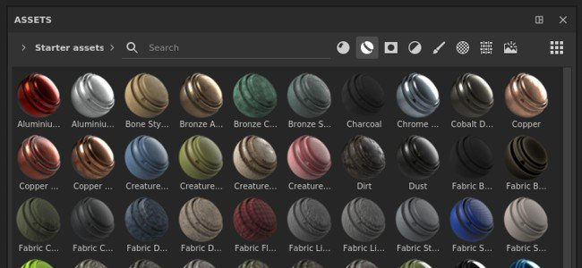

The old Shelf window has been improved and renamed as the Assets window. This redesign focus on making content more quickly accessible and easier to filter with the new dedicated icons. It also comes with an easier navigation system with the breadcrumbs. This redesign also focus on making the experience similar to other Substance 3D software so that managing content across applications is easier.

>[!NOTE]
>
> This release introduces changes in the way we manage the application preferences and the Shelf/Assets content. To know how to migrate your data please take a look a [the dedicated page](../../../pipeline-and-integration/resource-management/preferences-and-content/preferences-and-content-migration.md).

* **New design and layout**  
  The new design focus on simplicity but as well on easier organization of the window. The window can now be docked vertically without wasting space. A new "list" display mode allows to search assets by name much more easily.

  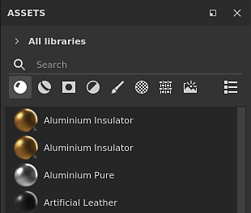

* **New breadcrumb navigation**  
  Navigation resource can be hard sometimes in a tiny UI. With the breadcrumb is not now easier to jump between folders without having to display the full folder hierarchy.

  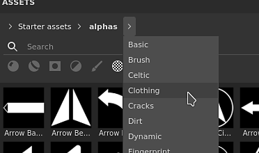

* **New usage filters**  
  There is a lot of different content in the Assets window and the usages are a good way to filter content isolate specific resources. To select a specific usage simply click on the dedicated button. To add or remove multiple usages, press and maintain CTRL while clicking on a button.

  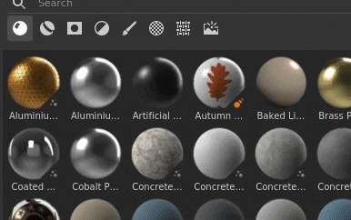

* **Improved thumbnail rendering**  
  We took the time to rework our thumbnail generation system to improve their quality and make them look more consistent across the the Substance 3D ecosystem. We also added the support of displacement.

  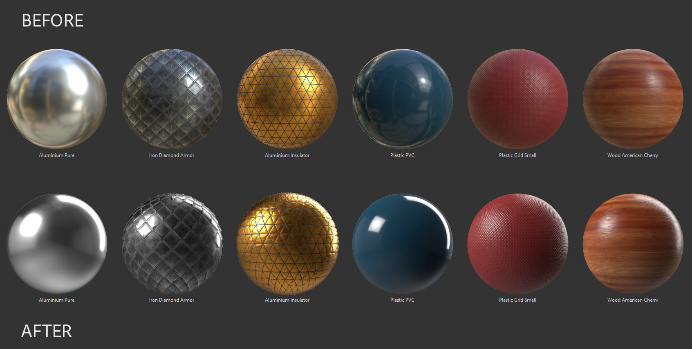{width="500px"}

* **Loading thumbnails from Substance Archives (sbsar)**  
  Custom thumbnails embedded inside Substance files are not loaded and displayed in the Assets window. Sharing custom resources is now easier as there is no need to include the resource metadata for custom icons.

* **Improved performances**The loading and generation time of thumbnails has been improved on several aspects and should now be much faster.

* **Increase preview memory budget to load more thumbnails**  
  By default a limited amount of memory is allocated to the display of thumbnails to save on performances. Having a library with many resources however can lead to loading and unloading thumbnails constantly which make navigation and searching for resources difficult. There is now a new [environment variable](../../../pipeline-and-integration/configuration/environment-variables/environment-variables.md) to override the default budget value.

### New Adobe Standard Material workflow

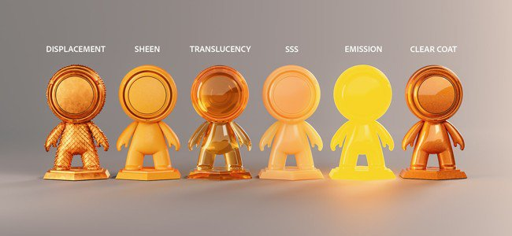

A new shader has been added, named **Adobe Standard Material** (ASM), which supports several features at once allowing to build more complex and accurate materials within a single Texture Set. With this new shader we also took the opportunity to add new channels to make the creation of materials easier as well.

* **New Adobe Standard Material shader**  
  The new ASM shader is a shader that regroups several functionalities as well as an evolution of our PBR rendering. It supports at the same time:
  * **Anisotropy**
  * **Clear coat**
  * **Sheen**
  * **Specular edge color**
  * **Additional subsurface scattering methods**
  * And of course the other existing features such as Parralax Occlusion, Displacement, etc.

* **New channels and user channels**  
  In order to support the new ASM shader new channels have been added. We also doubled the number of users channels to expand the possibilities of custom information and custom shaders.  
  * Coat color
  * Coat roughness
  * Coat normal
  * Coat opacity
  * Coat specular level
  * Scattering color
  * Sheen color
  * Sheen roughness
  * Sheen opacity
  * Specular edge color
  * User channels from 8 to 15

* **Improved Texture Set settings**  
  The channel list menu in the Texture Set settings now groups channels base don their compatibility with the current shader. This helps identify which channels will have an effect in the viewport.

  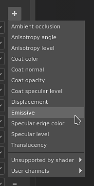

* **New Shader API features with visible if and recompilation**  
  With the development of the ASM shader some changes in the API have been made with two notable features:  
  * **Visible If**: shader parameters can be shown or hidden based on condition make the shader UI easier to read.
  * **Recompilation**: by declaring parameters in a specific way, it is now possible to disable part of a shader and recompile it to optimize it when the parameter change. This allows to discard unused functionalities.

### New Substance 3D ecosystem exchange

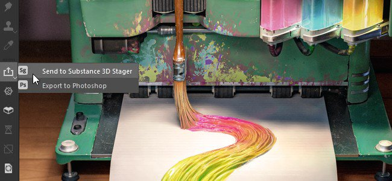

Sending resources and assets between Substance 3D applications is now much easier and accessible in one click with this new workflow. It is now possible to receive Substance files from Substance 3D Designer or Substance 3D Sampler or to send a project into Substance 3D Stager very easily to quickly iterate on content.

>[!WARNING]
>
> This send and receive functionalities are only available through the Creative Cloud Desktop version of the application as it relies on specific technologies to make it possible. This means the Steam or Substance 3D standalone version don't support these features.

* **Painter to Stager**  
  Export from Painter to Stager with the updated export preset or use the **Send to Substance 3D Stager** action to automatically export and import the current project into Stager. No manual configuration needed.

* **Stager to Painter**  
  Receive models from Stager to texture with a similar one click action directly form Stager.

* **Designer or Sampler to Painter**  
  Receive Substance materials, filters and more from Designer or Sampler direclty into the Assets window in one click.

* **Substance 3D Assets to Painter**  
  Receive content such as Substance material from the Creative Cloud Desktop directly into the Assets window of Painter.

* **Show in Bridge**  
  Resources in the Assets window located in a library managed by Adobe Bridge can be opened in Bridge directly by using the right-click menu over a specific resource.

### New content

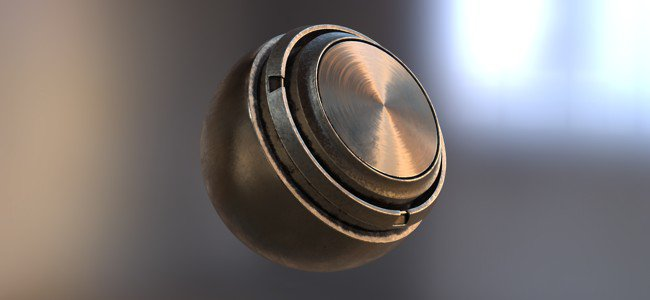

New content has been added in this release:

* **New project templates for Adobe Stand Material (ASM)**  
  To make it easier to start using the new ASM shader, new project templates have been created to speed-up project creation:
  * ASM - PBR Metallic Roughness
  * ASM - PBR Metallic Roughness Anisotropy Angle
  * ASM - PBR Metallic Roughness Coated
  * ASM - PBR Metallic Roughness SSS
  * ASM - PBR Metallic Roughness Sheen

* **New environment maps**  
  Several new environment map has been added to light your projects, including the Studio 06 used to render the new Assets thumbnails:  
  * Interior:
    * Atelier
  * Studio:
    * Studio 06
    * Studio 80s Horror Flick A
    * Studio Black Soft
    * Studio White Soft
    * Studio White Umbrella

### Improved Automatic UV Unwrapping

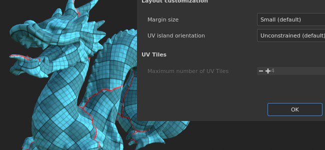

A new update of the automatic UV unwrapping has been added which brings the support of UV Tiles and additional control on the UV generation:

* **UV Tile amount**  
  When generating UVs it is now possible to specific the maximum number of UV Tiles desired to be created. This allows to use the UV generation with the UV Tile workflow as well.

* **UV Island orientation**  
  A ew parameter has been added to add a constraint on the UV island orientation when packed. This allow to make UV islands that a bit more aligned allowing to texture some objects more easily (ex: a wood door to align the wood pattern).

* **Improved packing performance**  
  The packing function has been improved as well to offer good performance with the new UV Tile support.

### General Improvements

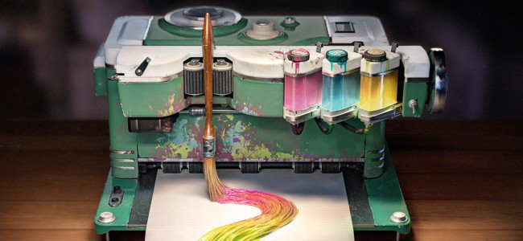

This new version adds several quality of life improvements:

* **Improved sliders performances with graphic tablet's pen**  
  Dragging around sliders with a pen should now be much more responsive. Sliders shouldn't feel sticky anymore.

* **Improved performances with already painted layers**  
  Painting in layer with lot of existing brush strokes should now be much faster and not lead to slowdown anymore.

* **Faster painting after opening a project**  
  Painting on a layer at the top of the layer stack just after opening a project is now immediate. The engine cache computation has been postponed to later, making the re-edition of old projects a bit faster in this context.

* **Sharp normal method**  
  There is a new Height to Normal method parameter in the Texture Set settings which allows to control how the Height channel is converted into a normal map. This new parameter is useful to improve the quality of surfaces with lot of varying details, such as fabric materials.

  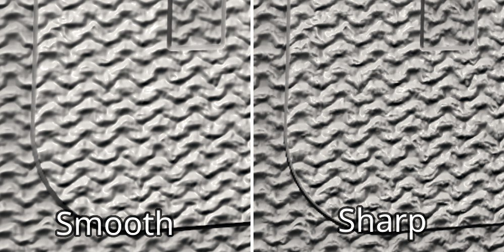{width="450px"}

* **New interface style**  
  The general interface has been slightly adjusted to align better with the general Substance 3D ecosystem. This make jumping from one application to the other less surprising and easier to navigate.

* **New translations**  
  Three new languages have been added to translate the program interface:
  * French
  * German
  * Simplified Chinese

## Release notes

### 7.2.0

*(Released June 23, 2021)*   
Summary : **Major release, it provides an update to the asset panel, a new shader with access to new channels and parameters, an overall refresh of the UI, some much-requested performance improvements, expanded language support, and more!**

**Added:**

* &#91;Libraries&#93; New Asset panel to replace the shelf
* &#91;Libraries&#93;&#91;UI&#93; New Asset panel layout
* &#91;Libraries&#93;&#91;UI&#93; Change default Asset panel orientation and UI
* &#91;Libraries&#93;&#91;UI&#93; Introduce a list view option to library
* &#91;Libraries&#93;&#91;UI&#93; New breadcrumbs navigation in the Asset panel
* &#91;Libraries&#93;&#91;UI&#93; Select "All libraries" when selecting a saved search
* &#91;Libraries&#93;&#91;UI&#93; Select "All libraries" when all folders are deselected
* &#91;Libraries&#93;&#91;UI&#93; New tag for particle brushes
* &#91;Libraries&#93;&#91;UI&#93; Replaced "shelf" by "All libraries" across the app
* &#91;Libraries&#93;&#91;UI&#93; Allow to hide empty folders
* &#91;Libraries&#93;&#91;UI&#93; Default user library should be visible even if empty
* &#91;Libraries&#93;&#91;UI&#93; New filtering method via asset type icons
* &#91;Libraries&#93; Shortcut "CTRL" to select multiple asset types
* &#91;Libraries&#93; New environment variable to control the asset preview memory budget
* &#91;Libraries&#93;&#91;Content&#93; New environment maps
* &#91;Libraries&#93;&#91;Content&#93;&#91;UI&#93; Render displacement on default materials
* &#91;Libraries&#93;&#91;Content&#93; Set Adobe Standard Material (ASM) shader as default for previews generation
* &#91;Libraries&#93;&#91;Content&#93;&#91;ASM&#93; New Project Templates for new ASM shader
* &#91;Libraries&#93;&#91;Thumbnail&#93; Use new Studio 6 environment map
* &#91;Libraries&#93;&#91;Thumbnail&#93; Read thumbnail in resource instead of generating it
* &#91;Libraries&#93;&#91;Thumbnail&#93; Add displacement to thumbnail generation
* &#91;Texture Set Settings&#93;
* &#91;Texture Set Settings&#93;&#91;UI&#93; Expose new height to normal conversion method
* &#91;Texture Set Settings&#93;&#91;UI&#93; Rework of the channels' UI organization
* &#91;Texture Set Settings&#93; User Channels limit raised to 16 channels
* &#91;Texture Set Settings&#93;&#91;UI&#93; Indicate which channels are compatible with currently selected shader
* &#91;Shader&#93;&#91;ASM&#93; New Adobe Standard Material shader
* &#91;Shader&#93;&#91;ASM&#93; Added support for Anisotropy, Clear Coat, Subsurface Scattering, Specular Edge Color, and Sheen
* &#91;Shader&#93;&#91;ASM&#93; Change default channels' color values
* &#91;Shader&#93;&#91;ASM&#93;&#91;Export&#93; Updated export template Adobe Dimension to Adobe Substance 3D Stager
* &#91;Shader&#93;&#91;ASM&#93; Added labels and tooltips for shader and MDL parameters
* &#91;Shader&#93;&#91;ASM&#93; Make the Scatter Color visible in 2D View even if SSS is not supported
* &#91;Shader&#93;&#91;ASM&#93;&#91;Iray&#93; Support ASM shader in Iray with new MDL
* &#91;Shader&#93;&#91;ASM&#93;&#91;Iray&#93; Updated Subsurface Scattering in legacy PBR spec gloss &amp; coated
* &#91;Shader&#93;&#91;ASM&#93;&#91;Content&#93; Changed the default SSS type for samples
* &#91;Shader&#93;&#91;ASM&#93; Added documentation for ASM API
* &#91;Shader&#93;&#91;ASM&#93; Optimize shaders to ignore unused channels
* &#91;Shader&#93; Expose new Texture Set channels
* &#91;Shader&#93; Improved Subsurface Scattering
* &#91;Shader&#93; Hided new shader parameters for some shaders
* &#91;Shader&#93; Visible if for shader parameters
* &#91;Performance&#93;
* &#91;Libraries&#93; Resource preview loading time and calculation performance improvements
* &#91;Engine&#93; Painting performance improvements
* &#91;Auto Unwrap&#93; Packing performance improvements
* &#91;Auto Unwrap&#93;
* &#91;Auto Unwrap&#93; Auto unwrap compatible with UV Tile workflow
* &#91;Auto-Unwrap&#93; New option to position UVs according to mesh orientation
* &#91;Other&#93;
* &#91;Settings&#93; Changed default zoom direction
* &#91;UI&#93; Overall refresh of the UI
* &#91;UI&#93; Rework of the Help Menu
* &#91;UI&#93; Replace invert icon
* &#91;UI&#93;&#91;Plugin&#93; Replace icon for the plugin dcc link
* &#91;UI&#93;&#91;AMD&#93; Update minimum required version and popup message
* &#91;Layer Stack&#93; Create new layer inside selected empty folder
* Update Python Documentation
* &#91;Branding&#93;
* &#91;Branding&#93;&#91;UI&#93; Updated application name to Adobe Substance 3D Painter
* &#91;Branding&#93;&#91;UI&#93; Updated standalone version to 'Substance edition'
* &#91;Branding&#93;&#91;UI&#93; Updated application executable name, installation path, package and icons
* &#91;Branding&#93;&#91;UI&#93; Renamed default library and path
* &#91;Branding&#93;&#91;UI&#93; Updated About Window
* &#91;Branding&#93;&#91;UI&#93; Updated Welcome screen
* &#91;Branding&#93;&#91;UI&#93; Removed year-based version number
* &#91;Localization&#93; New translations in German, French, and Simplified Chinese
* &#91;Interoperability&#93; Not available for Steam and Substance editions
* &#91;Interoperability&#93; Interoperability with Adobe Ecosystem: Designer, Sampler, Stager, and Bridge
* &#91;Interoperability&#93;&#91;UI&#93; Receive and update asset from Designer
* &#91;Interoperability&#93;&#91;UI&#93; Receive asset from Sampler
* &#91;Interoperability&#93;&#91;UI&#93; Send asset to Stager
* &#91;Interoperability&#93;&#91;UI&#93; Show in Adobe Bridge
* &#91;Interoperability&#93;&#91;UI&#93; Allow to quickly access Adobe 3D Assets
* &#91;Interoperability&#93; New usage tags of sbsar
* &#91;Interoperability&#93; Handle received asset types
* &#91;Interoperability&#93; Asset received from Adobe Substance 3D Designer or Adobe Substance 3D Sampler are stored in user's default chosen library
* &#91;Interoperability&#93;&#91;UI&#93; New icon in left toolbar to send to Stager or Photoshop

**Fixed:**

* &#91;Tablet&#93; Low performance when Painting with pressure
* &#91;Tablet&#93; Issue on tablets with slider controls
* &#91;Crash&#93; Name mismatch between Texture Set list and Exporter
* &#91;Crash&#93;&#91;Libraries&#93; Double click on a sub-library
* &#91;Libraries&#93; Issue when Crawling library directories
* &#91;Libraries&#93; Force preview generation command line does not work as expected
* &#91;Libraries&#93;&#91;Content&#93; Baked Light Environment filter is black by default
* &#91;Linux&#93;&#91;MacOS&#93;&#91;Export Mesh&#93; Cannot import glTF created on Linux/MacOS
* &#91;Linux&#93; Dragging and dropping a file into the Asset panel can lead to a crash
* &#91;Auto-Unwrap&#93; Auto-Unwrap is available even if a mesh has not been selected for reloading
* &#91;Particles&#93; Wrong particle behavior with gravity
* &#91;Layer Stack&#93; Level histogram can only use Luminance with some channels
* &#91;Geometry Mask&#93; Right-click menu on a folder when editing the geometry mask does not work
* &#91;Projection&#93; Seam with spherical projection &amp; bilinear filtering
* &#91;UV Tiles&#93; Export mask to file only exports tile 0, 0
* &#91;Export Mesh&#93; FBX mesh export is empty
* &#91;Iray&#93; Normal map is not taken into account in new projects when rendering
* &#91;Save&#93; Save issues on shared drives
* &#91;Baking&#93; Rebaking a mesh with modified parameters displays a warning
* &#91;Baking&#93;&#91;Regression&#93; Incorrect result when high poly meshes' global bounding box does not include the scene origin
* &#91;Python&#93; Custom user libraries are not taken into consideration

**Known Issues:**

* &#91;Libraries&#93; Saved searches not saved if no project opened
* &#91;NVIDIA&#93; Message for outdated driver even if the driver is up to date
