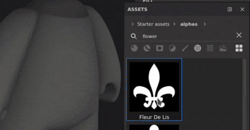
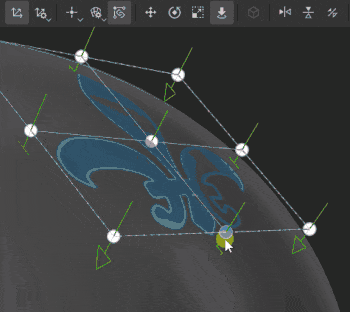
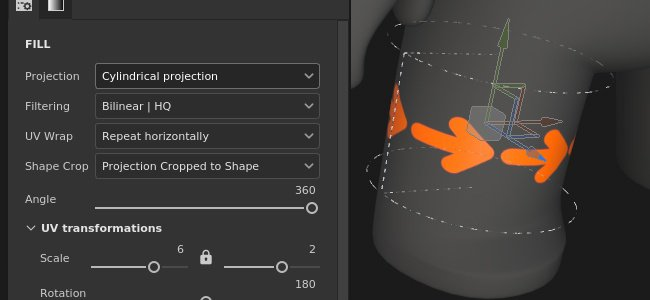
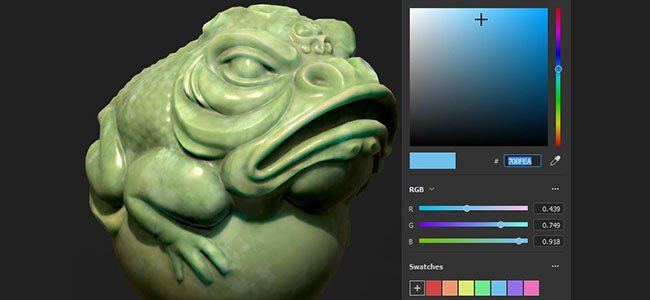
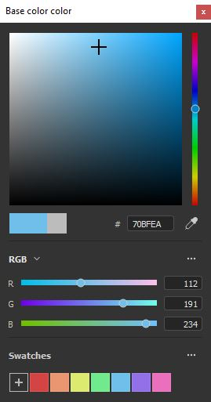
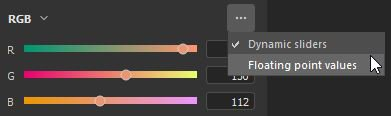
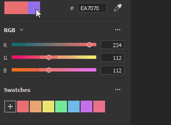
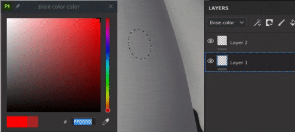
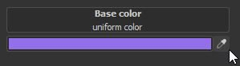
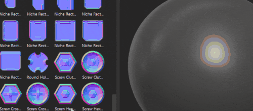

# Version 7.3

**Substance 3D Painter 7.3** brings new ways of texturing meshes with the new warp and cylinder projections for fill layers.

Release date: *13 October 2021*

## Major features

### New warp projection

This release introduces the new 3D warp projection for fill layers and fill effects. This projection allows to distort a texture or an image with the help of a deformation grid and controllable points.

* **Quick setup via drag and drop**Choose a material, an alpha, a texture or a procedural from the Assets library, drag and drop onto the desired part of the mesh (shortcut **ALT** required for Materials). If your asset is not a material, a popup with inquire which channel you would like to assign it to.  
  Once the layer is created, you will see that the new *Warp projection* is automatically selected. The layer has standard 3D projection mode controls, but also a new parameter *Projection Depth* which allows to set the depth of the warp projection (represented by green arrows as a visual queue).  
  You can also select this projection mode manually on any fill layer or effect without having to drag and drop an asset into the viewport.

  

* **Automatic placement with the Surface tool**When the new Warp layer is created, you will see that the Surface tool is automatically selected. This allows you to move the image so it remains on the surface of your mesh at all times. However you can always switch to any of the other manipulators and adjust its translation (shortcut **W**), rotation (shortcut **E**) or scale (shortcut **R**). To return to the Surface tool, use shortcut **SHIFT + W**. When switching to *Edit vertices* mode, the Surface tool is also the default selection and it snaps vertex movement to the surface of your mesh. However you can temporarily and quickly override the surface tool by **maintaining CTRL** which allows you to move the selected point in any direction, not just on the surface.

* **Easily editable warp grid**Once the global placement of the image is done, it is also possible to edit the warp grid itself for greater precision and flexibility. To go into grid edit mode, you can either use the newly added warp menu, or the shortcut **SHIFT + V**. This will allow to edit existing vertices of the grid.  
  You can evenly subdivide the grid as a whole, but keep in mind that if you had previously moved the vertices, they will be reset to their original positions. Grid subdivision can be done via the new warp options menu.   
  Alternatively, it is possible to add individually placed splits which would allow to have greater detail only where needed. To add splits, select any of the three options in the warp menu - crosswise, horizontally or vertically. When one of them is selected, hovering the cursor over the Warp projection and clicking anywhere within it will add a new split. This will not alter the position of existing points.

  
* **Automatic adjustment of vertex orientation**By default tangents of individual vertices are adjusted to the mesh's surface, which means they will always be correctly oriented in relation to the mesh no matter where they are dragged. This auto-tangent option can be turned off via a new button in the contextual toolbar, in which case the orientation will remain fixed at all times.

  

For more information on the Warp projection's settings and properties, see the [dedicated documentation page](../../../painting/fill-projections/warp-projection/warp-projection.md).

### New cylinder projection

This release adds a cylindrical projection method for fill layers and fill effects. The new projection allows to fit an image or texture around objects such as columns, pillars or more organics shapes like a character's arms.

* **Wrap an image around a mesh**  
  You can easily wrap an image around a cylindrical surface by using a fill layer or a fill effect and selecting *Cylindrical projection* in the Projection dropdown. If the image does not need to be repeated outside the projection gizmo, you need to select *None* for *UV Wrapping* and *Cropped to Shape* in *Shape Crop* to make sure that your image does not go out of bounds. Then you just need to use the manipulator to adjust the projection to the desired position.

* **Adjust the angle of projection**  
  Once your image is in place, there is a new Angle setting available. This setting can be used to adjust whether the image is projected all the way around the cylindrical shape, or is restricted to a certain angle. It does not crop the image, but rather reduces its width.

  

For more information, see the [dedicated documentation page](../../../painting/fill-projections/cylindrical-projection/cylindrical-projection.md).

### Improved color picker

This release brings several quality of life improvements to the color picker.

* **New window layout**  
  The improved color picker window has been reworked to accommodate a more vertical layout, similar to Sampler's latest release. It is divided into three sections - the main color field which includes the current and last selection, the hex field, eyedropper and the hue slider; the manual RGB/HSV sliders section; and the swatches.  
   

* **New 0-255 RGB values**  
  Alongside porting the existing ways of entering color value, the improved color picker also allows to work in 0-255 RGB values. This option is available when *Floating point values* is unchecked in the sliders section dropdown menu.

  
* **Saving color swatches**  
  Color swatches can now be saved in Painter! Once the desired color is selected, it is possible to press the plus button in the Swatches section of the color picker, and the color will be stored across sessions and projects. A swatch can be cleared by right-clicking on it, or alternatively it is possible to bulk-delete all swatches at once via this section's dropdown menu. There is no limit to the number of swatches that can be saved.

  
* **Color picker window remains open**  
  The color picker window can be now be moved around and placed anywhere, even on a different screen, and it will remain open as long as there is no context switch, which means that when you are switching between paint layers while hand painting textures, you can keep the color picker window open for easier access.

  

* **More accessible eyedropper**  
  Now the color picking eyedropper can be found directly next to the color field, but you can still find it within the color picker as well. The more accessible eyedropper retain all previous functionalities - you can still click and hold to pick a color anywhere on your screen(s). This exposed eyedropper can be found next to all color fields in Painter, not just layer channels.

  

For more information, see the [dedicated documentation page](../../../interface/color-picker/color-picker.md).

### Other features and improvements

* **Asset drag and drop improvements**  
  With the introduction of the Warp, the decal feature where assets can be drag and dropped from the library into the viewport while maintaining ALT had seen some rework. Now, when a decal is created this way, it is no longer using the Planar projection, but the Warp projection. Automatic selection of the Warp projection should improve speed and efficiency of decal adjustments on the mesh.  
  Moreover, it is now possible to drag and drop not only materials, but image-type assets into the viewport. When selecting an alpha, a texture or a procedural, there is no need to use the ALT modifier. It can be dropped onto the mesh - that would prompt a menu giving the option to select whether this image should be used within a mask or any of the layer's channels.

  

* **Autosave plugin improvement**  
  Autosave will no longer trigger during longer or heavier operations, such as mesh reloading, baking or export.

* **Performance improvements**  
  Some maintenance and optimization was done for slider manipulation and painting performance.

* **New functions in the python API**  
  The Python API had seen some recent additions, which allow to reload mesh, update resources, as well as set and query UV Tiles' resolution via scripting.

* **Substance engine update 8.3.0**  
  Alongside some fixes and general improvements, this Substance engine update now takes into account new graph types. It is also possible to verify the .sbsar file version, which should improve the use and download of the appropriate Substance 3D Assets versions.

* **Receiving Substance 3D Assets from CC Desktop**   
  It is now possible to access Substance 3D Assets, like Materials, Atlases and Decals, from the CC Desktop app. And moreover, they can be sent directly to the Painter library.

## Release notes

### 7.3.0

*(Released August 13, 2021)*   
Summary : **Major release. It contains a new 3D warp projection, a new cylindrical projection, improvements of the color picker, new functions in Python API and bug fixes**

**Added:**

* &#91;Projection&#93;&#91;Warp&#93; Expose 3D warp as a new projection mode
* &#91;Projection&#93;&#91;Warp&#93; Allow decal mode for Alphas, Textures and Procedurals with drag and drop in the viewport
* &#91;Projection&#93;&#91;Warp&#93; Use warp projection with decal shortcut (ALT)
* &#91;Projection&#93;&#91;Warp&#93;&#91;Toolbar&#93; Transform warp as whole or per vertices
* &#91;Projection&#93;&#91;Warp&#93;&#91;Toolbar&#93; Add grid points with split warp cross wise, horizontally or vertically options
* &#91;Projection&#93;&#91;Warp&#93;&#91;Toolbar&#93; Dedicated menu for reset actions
* &#91;Projection&#93;&#91;Warp&#93;&#91;Toolbar&#93; Option to automatically adjust tangents when moving points
* &#91;Projection&#93;&#91;Warp&#93;&#91;Toolbar&#93; Dedicated menu for grid edition (size, reset, color and handle size)
* &#91;Projection&#93;&#91;Warp&#93; New keyboard shortcut to switch whole-vertices warp edition mode (SHIFT+V)
* &#91;Projection&#93;&#91;Warp&#93; Click + Ctrl allows to switch between surface tool and other tools
* &#91;Projection&#93;&#91;Cylindrical&#93; Expose the cylindrical projection mode
* &#91;Projection&#93;&#91;Toolbar&#93; Group manipulator settings (size, grid steps, angle steps)
* &#91;Color Picker&#93; New color picker UI
* &#91;Color Picker&#93; Use sRGB values in color picker widgets
* &#91;Color Picker&#93; Allow to save and delete color swatches
* &#91;Color Picker&#93; Eyedropper accessible from color and normal slots
* &#91;Color Picker&#93; Allow to edit dynamic color between 0 and 255 values
* &#91;Color Picker&#93; Make HSV/RGB state common across the app
* &#91;Color Picker&#93; Color Picker window is semi-persistent
* &#91;Color Picker&#93; Pressing Esc closes the color picker window
* Performance improvement for UI interaction and while painting
* &#91;Engine&#93; Update to new Substance engine version (8.3.0)
* &#91;Scripting&#93;&#91;Python&#93; Allow to reload the mesh of the current project
* &#91;Scripting&#93;&#91;Python&#93; Allow to update resources in projects
* &#91;Scripting&#93;&#91;Python&#93; Allow to set and query the resolution of UV Tiles
* &#91;Interoperability&#93; Not available for Steam and Substance editions
* &#91;Interoperability&#93; Receive multiple resources from Bridge

**Fixed:**

* Color picker does not display the right color
* &#91;Baking&#93; Texture set list are not ordered correctly
* &#91;FBX import&#93; 3ds Max group pivot transformations are not taken into account
* &#91;Substance Engine&#93; Crash with import of corrupted SBSAR
* &#91;MacOS&#93; Project configuration option in different languages is not present
* Autosaves can freeze Painter during long processes

**Known Issues:**

* &#91;Projection&#93;&#91;Warp&#93; Split option remains selected after splitting is done
* &#91;Projection&#93;&#91;Warp&#93; Flip does not work when transformation is set to world space
* &#91;Projection&#93;&#91;Warp&#93; Artifact lines between patches in some rare cases
* &#91;Projection&#93;&#91;UV&#93; Pivot point is reset when flipping projection
* &#91;Mac M1&#93; Smart materials are not displayed correctly
* &#91;M1&#93;&#91;Regression&#93; Material layering not working
