# Version 7.4

**Substance 3D Painter 7.4** adds support for OpenColorIO with the introduction of the new Color Management workflow.

Release date: *24 November 2021*

## Major features

### New color management

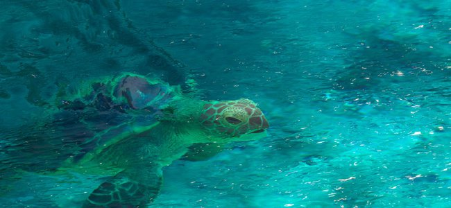

This version introduces color management with the support of [OpenColorIO](https://opencolorio.org/) (OCIO for short) version 2.

This new workflow allows to manage and calibrate colors from import to export and inside the viewport as well, allowing to match any content across different applications more easily.

* **Project settings**   
  When creating a new project it is now possible to enable color management. Existing project can also enable color management via the project settings.  
  To enable color management, switch from **Legacy** (default) to **OpenColorIO** and use one of the default configurations or a custom one.

  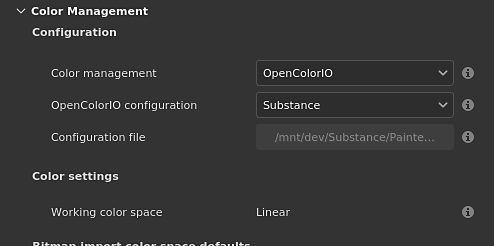{width="400px"}

* **Viewport display settings**   
  At the top of the 2D and 3D views are two controls for color management:  
  **Color button**: enable or disable the color transformation of the viewport.  
  **Display transform dropdown**: select which display transform to use to convert the colors.

  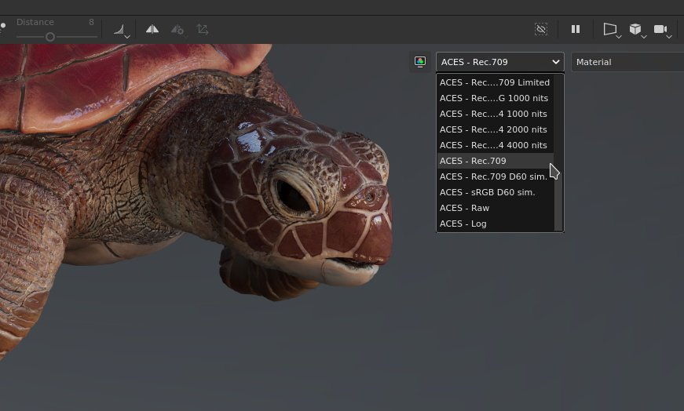{width="500px"}

* **Color picker settings**   
  When color management is enabled, the color pickers offers new controls. Color are edited in the working color space specified by the configuration.  
  Below the HSV/RGB sliders is displayed the final color value, transformed from the working space to the display color space.

  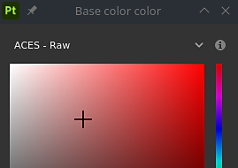

  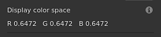

* **Import bitmaps and Substance materials with custom color space**   
  Dedicated settings are available to specify how resources should be handled, including how Substance materials output should be interpreted.  
  It is also possible to know which color space a resource is using by parsing its filename.

  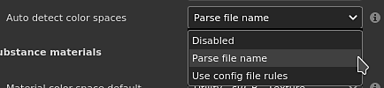

* **Export settings**   
  When exporting textures, color managed channels will display in their filenames the name of the color space used with the help of the new keyword **$colorSpace**.

  {width="250px"}

  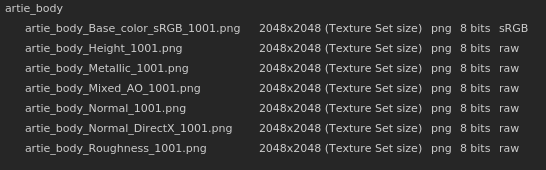

>[!NOTE]
>
> To learn more about how color management works inside the application, see the [dedicated page](../../../features/color-management/color-management.md).

### New undock of 2D and 3D viewport

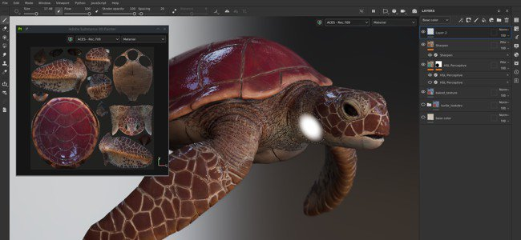

The 2D and 3D view can now be undocked to be moved elsewhere. For example by having the 3D view on a main screen while the 2D view sits on another screen.

Working with an undocked view is easier to organize the layout of the application and to keep a eye on things without loosing too much painting area.

* **Undock a view**   
  To undock a view, simply open the view menu and choose one of the two options. Each option opens a new window with the its view inside, while the other view remains docked inside the main interface.

  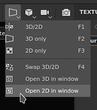

* **Swap even with an undocked view**   
  While a view is undocked, the swap action from the view menu can be used to exchanged them.

  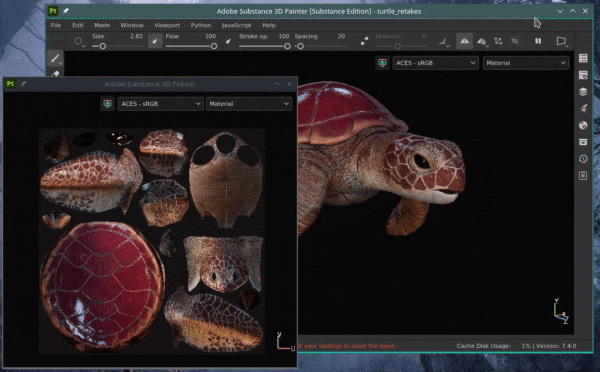{width="500px"}

* **Compatible with color management**   
  The undocked view has its own color management display transform, making it easier to manage in different monitors.

  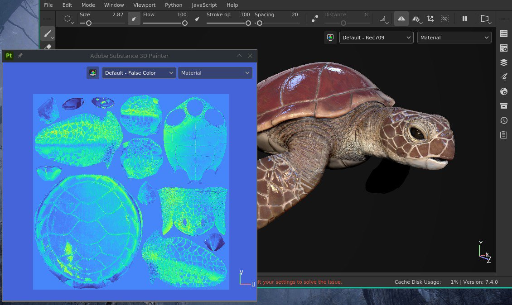{width="500px"}

### New support for SpaceMouse® by 3Dconnexion

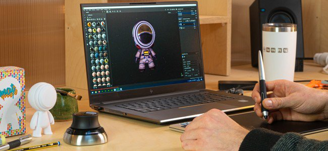

The **SpaceMouse®** is a device by 3Dconnexion that allows to manipulate the 3D viewport camera in a more intuitive and friendly way. It is now supported natively and directly plug and play with Painter.

For more information, see the dedicated [documentation page](../../../features/spacemouse-by-3dconnexion/spacemouse-by-3dconnexion.md).

>[!NOTE]
>
> * Available with version 7.4.2 and above.
> * Make sure to install the latest SpaceMouse® drivers to benefit from the Painter control scheme.

### New content

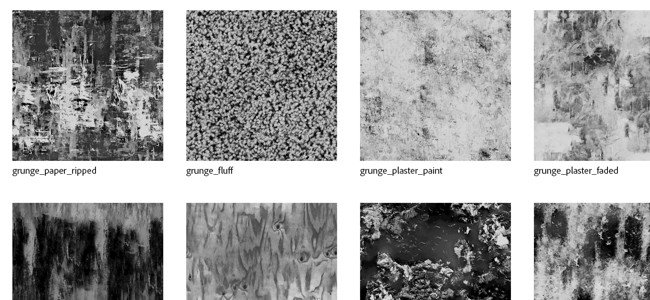

A new set of assets has been added to the default content available with the application:

* New decals, tool presets and filter (by **Käy Vriend**):  
  * **Decals**
    * Scar Plain Straight
    * Pocket Patch Regular
  * **Presets**
    * Zipper Advanced Tape
    * Zipper Advanced Stop
    * Zipper Advanced Slider
    * Tightening Cord Lace
    * Tightening Cord Eyelet
    * Glitter Stars Golden
    * Glitter Party
    * Glitter Dots Pastel
  * **Generator**
    * Inflate Shrink/Wrap

* New grunge bitmaps (by **Emiel Sleegers**):  
  * Grunge Plaster Paint
  * Grunge Plaster Faded
  * Grunge Paint Peeled
  * Grunge Humidity
  * Grunge Fluff
  * Grunge Cobweb
  * Grunge Bush
  * Grunge Wood Soft
  * Grunge Paper Ripped
  * Grunge Cracked Deep
  * Grunge Brushed Dust

### Improved automatic UV unwrapping

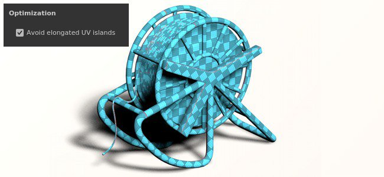

The automatic UV unwrapping has been updated with a new option that to improve the support of 3D models with extended surfaces.

This new setting named **Avoid elongated UV islands** take better advantage of the UV space by splitting UV islands that could be too long.

Below is an example of this new settings without using it vs using it:

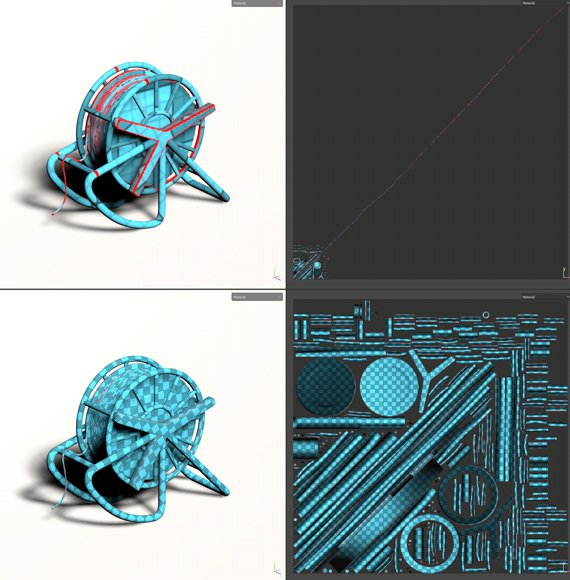{width="500px"}

### Improved Python scripting

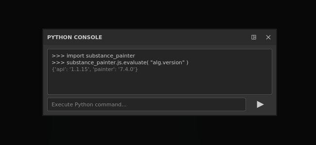

The Python API has a new method which allows to call the Javascript API.

This new method make it easier to migrate old plugins toward the new Python API. It also unlock some features such as **Baking** and **Shader** management that haven't been exposed in Python yet.

To run a Javascript command from Python, use the **evaluate()** function form the new **js** submodule. More information can be found inside the API documentation (available via the Help menu of the application).

## Release Notes

### 7.4.2

*(Released March 08, 2022)*

**Added:**

* &#91;SpaceMouse&#93;&#91;Windows&#93; Support of the 3Dconnexion SpaceMouse in the 3D Viewport for navigation
* &#91;SpaceMouse&#93;&#91;Windows&#93; Basic shortcuts/keys for Pro and Enterprise SpaceMouse models in the 3D Viewport
* &#91;SpaceMouse&#93;&#91;Windows&#93; Dedicated rotation center icon in the 3D Viewport
* &#91;Color Management&#93; Use roles from OCIO configuration to change default settings
* &#91;Color Management&#93; Color manage the properties window for color widgets
* &#91;Color Management&#93; Color manage the properties window for material preview
* &#91;Color Management&#93; Color manage swatches in color picker
* &#91;Color Management&#93; Add a setting to define the standard sRGB color space
* &#91;Color Management&#93; Add the Standard sRGB color space from OCIO config in color picker Display selector list
* &#91;Color Management&#93; Improvements for color space override menu
* &#91;Color Management&#93; Allow to override the environment map color space in Display Settings
* &#91;Color Management&#93; Draw color picker gradients based on current Display
* &#91;Color Management&#93; Clamp HDR values by default in color editor
* &#91;Color Management&#93; Use passthrough (no color space) for filters in Legacy mode
* &#91;Color Management&#93; Limit gradients display in color editor to match &#91;0-1&#93; range
* &#91;Color Management&#93; Hide Display selector in color picker in Legacy mode
* &#91;Color Management&#93; Make color picker hexadecimal field always in sRGB color space
* &#91;Color Management&#93; Disable color picker Display dropdown for data channels
* &#91;Optimization&#93; Warp grid recomputes only covered UV tiles
* &#91;Export&#93; Allow to export UV Tile projects for Sketchfab, USD and glTF
* &#91;Scripting&#93;&#91;Python&#93; Allow to change tonemapping function

**Fixed:**

* &#91;Sketchfab&#93; Updating existing model ends up creating new model
* &#91;Sketchfab&#93; Crash when searching for previously updated model
* Crash when exporting to USD
* Crash when creating a new shader instance in Geometry Mask or when geometry is hidden
* &#91;Import Asset Window&#93; Crash when changing the type of imported resources
* Normal mesh maps are inverted when used in layer stack
* &#91;Substance&#93; User data blending mode is not taken into account
* &#91;Color Management&#93; Bitmaps with color space in filename are imported as UV Tile sequences
* &#91;Color Management&#93; Color managed outputs of Substance graph are in wrong color space
* &#91;Color Management&#93; Polygon Fill tool displays the wrong color
* &#91;Color Management&#93; ACES tonemapper is applied to channels in solo mode
* &#91;Color Management&#93; Tool preview sphere lighting is not color managed
* &#91;Color management&#93;&#91;Export&#93; Converted maps applies an incorrect conversion
* &#91;Scripting&#93;&#91;Python&#93;&#91;Color Management&#93; Projects created with template &amp; OCIO environment variable are in Legacy mode
* &#91;Scripting&#93;&#91;Python&#93; Cannot use the JavaScript evaluate function on startup
* &#91;3D Adobe Offer&#93; Can not launch Painter when using regional settings with languages not supported by default

**Known Issues:**

* 3Dconnexion SpaceMouse not supported on MacOS
* &#91;UI&#93; Horizontal scroll bar with color management appearing in some cases in new project window
* &#91;Bakers&#93; "Average normals" setting has no effect in UV Tile projects
* &#91;Mac M1&#93; Smart materials are not displayed correctly
* &#91;Color Management&#93; Resources used in projection mode are not color managed in the overlay

### 7.4.1

*(Released December 14, 2021)*

**Added:**

* &#91;Color Management&#93; Use data role in exported filenames
* &#91;Color Management&#93; Expand the section Color Management, by default, when OCIO is selected in new project and project settings windows
* &#91;Color Management&#93; Add ACES tonemapper in legacy mode
* &#91;Color Management&#93; Adjust default configuration settings
* &#91;Color Management&#93;&#91;Export&#93; Fill $colorSpace in filenames for data channels
* &#91;Export&#93; Export UV Tile project to Stager
* &#91;Interoperability&#93; Not available for Steam and Substance editions
* &#91;Interoperability&#93; Allow to send a UV Tile project to Stager

**Fixed:**

* &#91;MacOS&#93;&#91;Crash&#93; Painter does not start with Catalina
* &#91;Color Management&#93;&#91;Crash&#93; Random crash when playing with data type/color management on user channel
* &#91;Color management&#93; Resources used as grayscale in mask display color space new menu
* &#91;Color Management&#93; User channel is darker in the viewport in legacy mode + solo view
* &#91;Color Management&#93; Env map is always linear when used in iRay
* &#91;Color Management&#93; Color picker does not pick the right value for data channel in legacy mode
* &#91;Color management&#93; Color picker is broken inside of a Substance in legacy mode
* &#91;Color management&#93; Switching between solo channel views in the viewport does display with the right color space when using the dropdown menu
* &#91;Color Management&#93; Export applies the wrong conversion on color managed user channels in legacy mode
* Strokes made in solo view mask are not shown when switching back to material view
* &#91;Export&#93; Converted maps are not exported as color managed channels
* &#91;Texture Set&#93; Tooltip with original name is missing on renamed user channels
* &#91;Steam&#93; Files missing when checking file integrity with Steam

**Known Issues:**

* &#91;Mac M1&#93; Smart materials are not displayed correctly

### 7.4.0

*(Released November 24, 2021)*

**Added:**

* &#91;Color Management&#93; Support of Color Management OpenColorIO version 2
* &#91;Color Management&#93; Add color management settings to project settings
* &#91;Color Management&#93; Warning window about Color Management configuration changes when opening a project
* &#91;Color Management&#93; Display an error message if an invalid OCIO config file is selected
* &#91;Color Management&#93; Allow to override configuration with OCIO environment variable
* &#91;Color Management&#93; Multiple OCIO configurations integrated by default with the application
* &#91;Color Management&#93; Extract color space name from imported bitmap filename
* &#91;Color Management&#93; Allow to override the color space with one color space from the configuration in Properties window
* &#91;Color Management&#93; Add color management options in Texture Set Settings
* &#91;Color Management&#93;&#91;Viewport&#93; Allow to color manage 2D and 3D views separately
* &#91;Color Management&#93; Load and convert environment map to the working color space
* &#91;Color Management&#93; Adjust color picker and editor with current color space
* &#91;Color Management&#93; Allow to select the display transform color space in the viewport with a new dropdown menu
* &#91;Color Management&#93; Apply display transform with Iray rendering results
* &#91;Color Management&#93; Export textures with different color spaces
* &#91;Color Management&#93;&#91;Python&#93; Apply color management settings from Environment variable (OCIO) to new projects
* &#91;Viewport&#93; Allow to undock the 2D or 3D viewport
* &#91;Auto Unwrap&#93; New option to avoid elongated islands
* &#91;Scripting Python&#93; Call JavaScript functions from Python API
* &#91;New Project Window&#93; Make the imported maps section collapsible
* &#91;Projection&#93;&#91;Warp&#93; Allow to hide normals as an option in the Warp settings
* &#91;Content&#93; 11 new grunge maps
* &#91;Content&#93; 8 new tool presets (zipper, tightening cord, glitter)
* &#91;Content&#93; 8 new materials (scar, pocket, ...)
* &#91;Content&#93; 1 new generator (inflate shrinkwarp)

**Known Issues:**

* &#91;Mac M1&#93; Smart materials are not displayed correctly
* &#91;Color Management&#93;&#91;Crash&#93; Random crash when playing with data type/color management on user channel
* &#91;Color Management&#93; Color picker does not pick the right value for data channel in legacy mode
* &#91;Color management&#93;&#91;Iray&#93; Saving the render in EXR or TIFF while Color Management is activated in the viewport will always save in linear
* &#91;Color management&#93; Resources used as grayscale in mask display the wrong Color Space menu
* &#91;Color Management&#93;&#91;Iray&#93; Env map is always linear when used in Iray
* &#91;Color Management&#93;&#91;Export&#93; Converted maps are not exported as a color managed channels
* &#91;Color Management&#93;&#91;Export&#93; Export ignores if user channel is color managed or not with legacy mode
