# Version 10.0

<b>Substance 3D Painter 10.0</b> brings support of Illustrator (.ai) files, integrates Substance 3D Assets, imports Fonts via the Text resources, adds layer stack functionalities in the Python API, and several quality of life improvements.

Release date: *16 May 2024*

## Major features

### New text resource

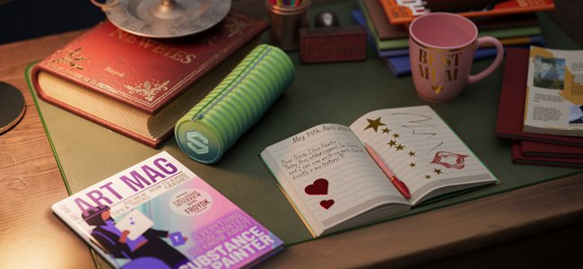

This new version introduces the <b>Text resource</b> which is a way to load font files to write text in different contexts (brush, fill projection, Substance image inputs, etc.) to embellish your textures.

* <b>Browse your fonts in the Assets window</b>  
  Fonts are now listed in the Assets window under their own filter. They are gathered from different locations on the operating system (and also from the Libraries).

  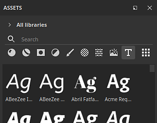
* <b>Drag and drop fonts like any other resources</b>  
  Fonts can be used as text resources like any other kind of resource. Drag and drop them to automatically create fill projection. They can also be used in brushes or as input in Substance filters.

  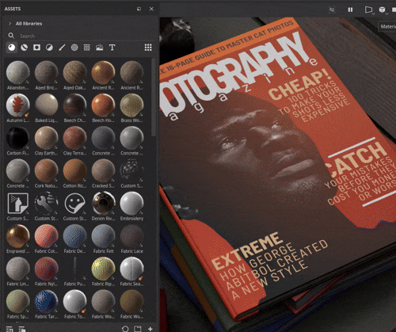
* <b>Text resource parameters</b>  
  When creating a text resource, you can tweak a few parameters to adjust the look of your text: vertical and horizontal alignment, automatic or manual size, line and character spacing, color, etc.

  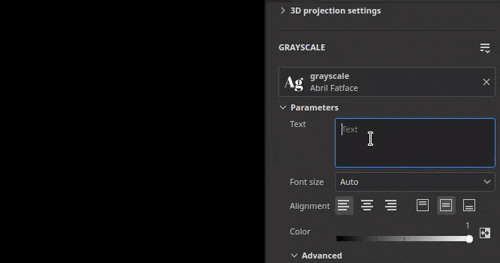
* <b>Wide range of characters and feature supported</b>  
  The Text resource supports right to left writing as well as [ligatures](https://en.wikipedia.org/wiki/Ligature_(writing)). (To be able to write non latin characters a compatible font is required.)

  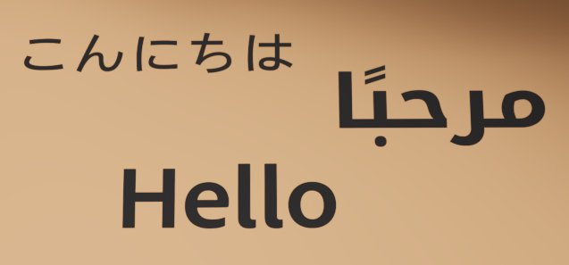
* <b>Import custom fonts like regular resource</b>  
  You can import your own fonts files directly into your Library or project like any other resources. Some types of fonts are not supported however, for more information see this [documentation page](../../technical-support/workflow-issues/shelf-issues/font-import/font-import.md).

>[!NOTE]
>
> For more information about the <b>Text resource</b>, see the [dedicated documentation page](../../painting/text-resource/text-resource.md).

### New import of Illustrator files (.Ai)

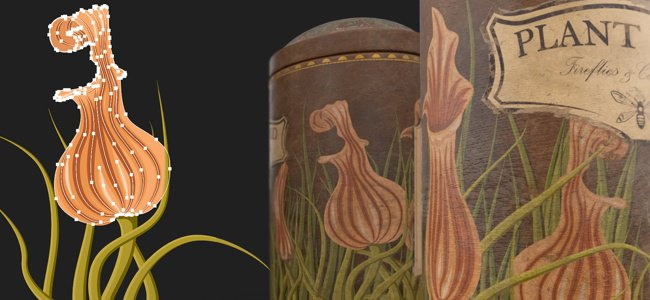

Following the support for <b>.svg</b> files, this new version also adds the ability to import Illustrator files (<b>.ai</b>).

* <b>Illustrator (.Ai) file support</b>  
  In this new version .ai files can now be imported and rendered in Painter to be used as resource in brushes, fill projections or as Substance image inputs.
* <b>.svg and .ai files share common settings</b>  
  SVG and Illustrator documents share similar settings, notably the resolution, crop area and scope selection parameters. This means that vectorial resource can be managed in a similar way.

  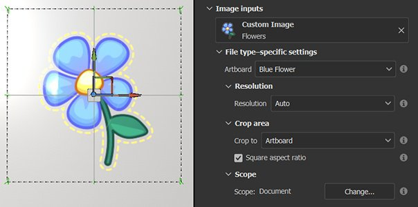
* <b>Artboard selection</b>  
  Illustrator documents support artboards, when using an .ai file you can also choose between different artboards available via the dedicated setting.

  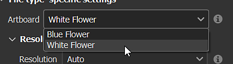
* <b>Improved scope selection</b>  
  The scope selection window has been improved with the support of thumbnails, making it easier to browse and select only specific elements.  
  For performance reasons thumbnails are off by default and can be enabled with the <b>Show thumbnails</b> checkbox.

  

>[!NOTE]
>
> Importing Illustrator (<b>.ai</b>) files is currently only supported on Windows and MacOS.

### New Substance 3D Assets integration

A new window is available which embeds the Substance 3D Assets website directly inside Painter. This integration makes it easier to browse and download resources directly in your own library.

* <b>New Substance 3D Assets window</b>  
  A new dock is available in the interface to browse Substance 3D Assets. If the dock is not visible and closed it can be found again in the dock toolbar on the right of the interface.

  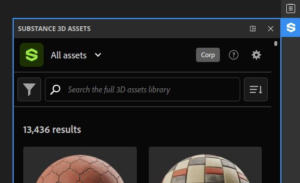
* <b>Download manager</b>  
  You can see the assets currently being downloaded via the dedicated manager using the bottom left button of the window. Assets that may fail to download can be started again from this list.

  
* <b>Find your downloaded assets easily</b>  
  The button in the bottom right of the window opens a menu with a few actions to help navigate the website but also to shows were assets have been donwloaded.

  

>[!NOTE]
>
> Upon the first launch a login into your account will be necessary to download assets. This login is then be cached for future uses.

>[!NOTE]
>
> The Substance 3D Assets dock is not available in the Steam version.

### New layer stack module in Python API

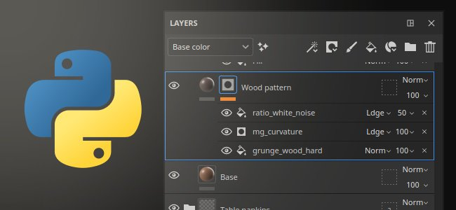

This release sees the addition of the new layer stack module in our Python API. This API allows to control the layer stack of a project, opening the door to the creation of advanced layer stack plugins and custom tools.

* <b>New Layer stack API</b>  
  The new <b>layerstack</b> module allows to control the layer stack of a project in many ways. You can:

  * Query and set the selection of layers and effects.
  * Create new layers, folders and effects (including filters, anchor points, etc.).
  * Instantiate layers.
  * Get and set parameters of layers and effects, load resources into them.
  * Get and set Substance parameters.
* <b>Scoped modifications and pause of the engine</b>  
  Manipulating the layer stack could lead to long computations, this is why we also exposed the possibility to pause and unpause the engine from the API (like in the UI). We also made it possible to group modifications together, for both performance reasons but also to undo a single time multiple operations.
* <b>Basic color management</b>  
  With the exposition of the layer stack we needed to introduce the notion of color management in our API. A new <b>colormanagement</b> module has been added to create, tweak colors and choose the color space of bitmaps. (This part of the API isn't complete yet and will be expanded in future versions.)
* <b>Query export preset information</b>  
  Export presets are now exposed in our API, allowing to query the list of presets (both predefined and custom). Their content can also be retrieved in a similar format to our existing export textures API.
* <b>New possibilities ahead!  
  </b> This new part of the API allows to do a lot of new things, like saving and restoring a selection of layers or changing the random seed of all the resources in a project for example:

  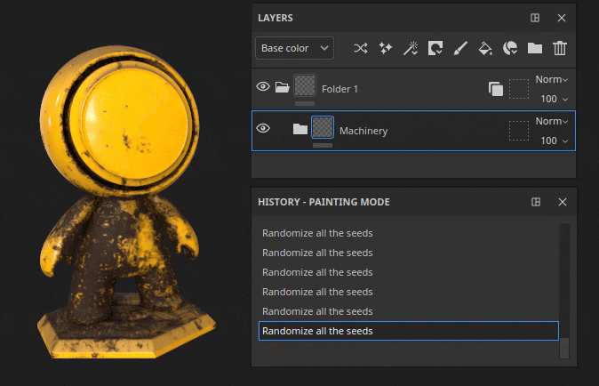

>[!NOTE]
>
> For more information on the API, see the documentation included with the application (via <b>Help &gt; Scripting documentation &gt; Python API</b>) which includes many code snippets to easily get started.

>[!NOTE]
>
> Examples of layer stack plugins can also be found in our [online documentation](https://adobedocs.github.io/painter-python-api/).

### Improved normal map painting

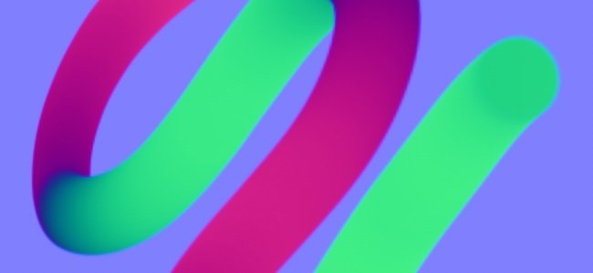

In this release we reworked the normal map painting workflow. We notably changed the way we accumulate and blend normal brush stamps. This changes were made to address issues related to painting flow maps.

* <b>Fixed accumulation issue</b>  
  Painting over and over an area in the normal channel will no longer saturate or clamp and create holes or artifacts. Switching the normal channel to RGB32F is also no longer needed.

  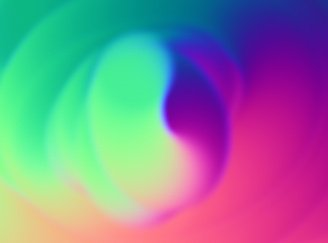
* <b>Fixed undo breaking painted strokes</b>  
  Undoing a brush stroke no longer breaks other already painted strokes.

  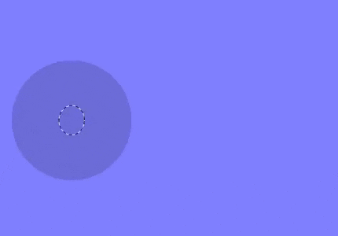
* <b>Transparency on zero alpha</b>  
  Brush stamps made with a texture with an alpha at zero will now draw as transparent. The example below shows a brush stamp (left) versus a planar projection (right).

  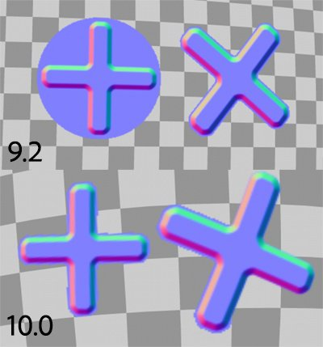

>[!NOTE]
>
> For more information on painting flow map, see the [documentation page](../../painting/advanced-channel-painting/flow-map-painting/flow-map-painting.md).

### Improved transform manipulators

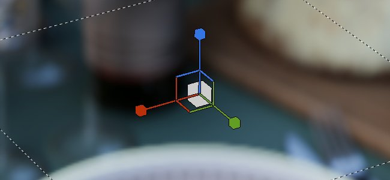

Several improvements have been made to enhance the usage of the transform manipulators.

* <b>Precision mode with CTRL</b>  
  Pressing control while dragging on a manipulator will now enter into a new precision mode which allows more meticulous operations. This change applies to the translate, rotate and scale manipulators.  
  Here is an example before and after pressing CTRL while dragging:

  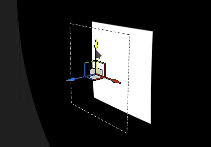
* <b>New scale behavior</b>  
  The scale intensity is now based on the current scale value itself and not on the scene size anymore. This makes relative changes easier to do, especially at small values. Combined with the precise mode it makes scaling a lot more pleasant.  
  Another change is scaling down until 0 will no longer go into negative values. This avoid the issue of wanting to scale down a projection and flipping it by accident.

  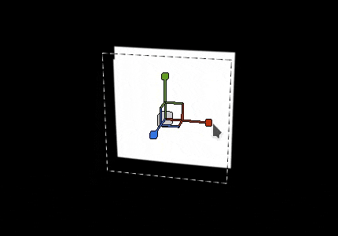
* <b>Improved surface manipulator rotation</b>  
  The surface decal manipulator is now a lot more stable when dragging around a surface. It doesn't increase its rotation when just doing back and forth translations.  
  Here is the <b>old</b> behavior compared to the <b>new</b> one:

  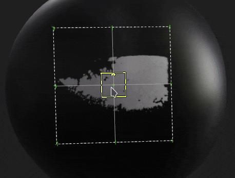

  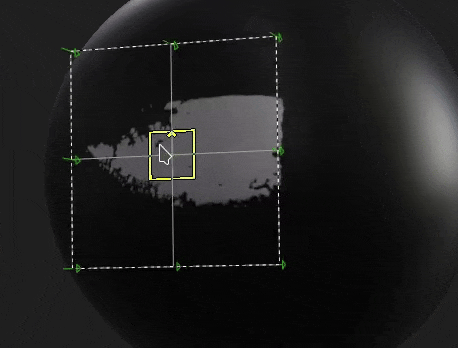
* <b>Camera aligned projection on drag and drop</b>  
  Drag and dropping a resource into the viewport allows to create a warp projection directly on the surface of the mesh. This projection was previously incorrectly rotated, it is now aligned to the camera.

  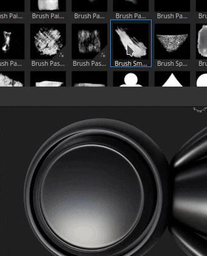

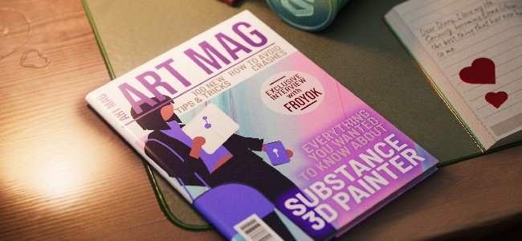

A few other improvements have been added, notably:

* <b>Updated Tile Generator</b>  
  The <b>Tile Generator</b> blending mode parameter can now be changed and will modify the result as expected. The resource has also been updated to the latest version available in <b>Substance 3D Designer</b>.
* <b>Fixed banding/quality issues on some filters</b>  
  Several filters were stuck on 8 bit precision instead of 16 bit, leading to banding/artifacts when using them (like the histogram scan or directional blur). This is now fixed.
* <b>Color space in SBSAR output</b>  
  When the Legacy or OCIO color management workflow is enabled, the SBSAR export will now reference the color space names used in the project on the respective outputs.
* <b>Faster resource discovery</b>  
  With the introduction of the <b>Text resource</b> we added a new cache to make crawling of resources on the disk faster on next startup. This is quite notable when resources are installed on a HDD or when a library has gigabytes of resources. This new cache can be disabled with a command line, see the dedicated [documentation page](../../pipeline-and-integration/configuration/command-lines/command-lines.md) for more information.

Many thanks to the website [is this arabic ?](https://isthisarabic.com/) which was of great help during the development of this version.

Reference to artworks used in the medias above:

* [Man wearing black shirt](https://unsplash.com/photos/man-wearing-black-shirt-aoEwuEH7YAs) by Lucas Gouvêa
* [Pink and green](https://unsplash.com/photos/pink-and-green-abstract-art-ruJm3dBXCqw) by Pawel Czerwinski
* [unDraw illsutrations](https://undraw.co/illustrations)
* Claude Monet

## Tutorials

## Release notes

### <b>10.0.0</b>

Release date: <b>2024/05/16</b>  
Summary: <b>Major release, edition of the layer stack with Python API, read native Illustrator files, integration of 3D Assets and new text resource</b>

<b>Added</b>:

* &#91;Illustrator&#93; Use Illustrator files with art boards in Painter
* &#91;Illustrator&#93;&#91;SVG&#93; Add previews in scope selection
* &#91;Substance 3D Assets&#93; Browse, select and download 3D Assets directly in Painter
* &#91;Substance 3D Assets&#93;&#91;UI&#93; New panel
* &#91;Substance 3D Assets&#93; Support environment maps and materials
* &#91;Substance 3D Assets&#93; Allow to reload and navigate and open location folder in new Substance 3D Assets panel
* &#91;Substance 3D Assets&#93; Addition of a download manager
* &#91;Text Resource&#93; Allow to use embeddable fonts
* &#91;Text Resource&#93; Allow to render a font/text on a mesh
* &#91;Text Resource&#93; Display fonts from user and other shared paths in Assets panel with a new category
* &#91;Text Resource&#93;&#91;Properties&#93; Add support for advanced font properties
* &#91;Text Resource&#93; Allow to search/view fonts in mini-shelves
* &#91;Text Resource&#93; Add error message/dialog when importing an incompatible font
* Miscellaneous
* &#91;Fill projection&#93; Improve Scale manipulator behavior when using small values
* &#91;Manipulators&#93; Add new precise mode when pressing CTRL shortcut
* &#91;Manipulators&#93; Improve surface manipulator stability when translating
* &#91;Export&#93; Add colorspace name in SBSAR outputs
* &#91;Performance&#93; Improve library discovery time of assets on disk
* &#91;Substance&#93; Update to Substance engine version 9.1.2
* &#91;Drag and Drop&#93; Align decal rotation to camera when dropping in viewport
* &#91;Python&#93; Edition of the layer stack
* &#91;Python&#93; Allow to select layer, effect, mask, geo mask in UI
* &#91;Python&#93; Allow to get/set layer blending modes
* &#91;Python&#93; Allow to get/set fill layer projection settings
* &#91;Python&#93; Allow to query Substance material color from a fill layer
* &#91;Python&#93; Allow to query and set uniform colors and resources in layers and effects
* &#91;Python&#93; Allow to create and edit text resources in layer stack
* &#91;Python&#93; Allow to edit active channels on layers and effects
* &#91;Python&#93; Allow to batch actions to have a single undo/redo
* &#91;Python&#93; Allow to load/edit vectorial source parameters
* &#91;Python&#93; Allow to edit layer and effects color properties with color management
* &#91;Python&#93; Allow to query and create instanced layers
* &#91;Python&#93; Allow to add color selection effect
* &#91;Python&#93; Allow to control bitmap image color management
* &#91;Python&#93; Allow to pause/unpause engine
* &#91;Python&#93; Allow to navigate to siblings and parent nodes
* &#91;Python&#93; Allow to create filter/generator effect
* &#91;Python&#93; Allow to add level effect
* &#91;Python&#93; Allow to add smart mask on a layer
* &#91;Python&#93; Allow to create/edit anchor points
* &#91;Python&#93; Allow to get/Set mask on layers
* &#91;Python&#93; Allow to create compare mask effect
* &#91;Python&#93; Allow to query and use presets from Substance resources
* &#91;Python&#93; Allow to list presets and their values via internal\_properties function for Substance resources
* &#91;Python&#93; Allow to list predefined export presets
* &#91;Python&#93; Allow to list export presets available in the library
* &#91;Python&#93; Allow to retrieve the content of export presets

<b>Fixed</b>:

* &#91;Crash&#93; Undoing "Remove shader instance" with Ctrl-Z
* &#91;Crash&#93; Create a layer on empty stack if last selection was an effect
* &#91;SVG&#93; Issue with custom cropped area value
* &#91;Auto-Unwrap&#93; Recomputing only the packing without any change to UV orientation results in crash
* &#91;Drag and drop&#93; Lag due to external resources are preloaded multiple times
* &#91;UI&#93; Drag and drop resource thumbnail can hide warning message in layer stack
* &#91;Performance&#93; Masked UV tiles are still computed
* &#91;USD&#93; Wrong highlight for scope selection
* &#91;Resource&#93; Bitmap image gets corrupted after painting in normal channel and saving project
* &#91;USD&#93; Support left-handed vertex mesh ordering
* &#91;Substance&#93; Reset to default always go back to zero for angle widget
* &#91;Engine&#93; Painting with an SVG in a stencil doesn't work
* &#91;Engine&#93; Normal map brush strokes break after an undo
* &#91;Content&#93; Graphic to Material filter has incorrect alpha blending and color space
* &#91;Content&#93; Blending modes on Tile Generator are not working
* &#91;Content&#93; Histogram scan filter produces banding in some cases
* &#91;Content&#93; Baked lighting stylized does not take painted height into account
* &#91;Python&#93; Unexpected error when retrieving instanced layer information after shader change

<b>Known Issues</b>:

* &#91;Color Management&#93; HDR color space conversions with ACE on Linux produce clamped colors
* &#91;Crash&#93;&#91;Linux&#93;&#91;AMD&#93; Dragging and dropping resources in layer stack on Wayland OS
* &#91;Regression&#93;&#91;UI&#93; Right Click Menu is too small on HD screens
* &#91;Crash&#93;&#91;Python&#93; USD export triggered by TextureStateEvent
* &#91;Save&#93; Spp project file is lost when "save as" fails
* &#91;MacOS Intel&#93; Crash when importing some presets
* &#91;Illustrator&#93; Cannot import Ai files after server crash without restarting Painter
* &#91;Import&#93; Assets with same name but different extensions are overridden
