# Version 10.1

<b>Substance 3D Painter 10.1</b> adds new powerful filters, improved USD functionalities and updated VFX Platform and Linux support.

Release date: *17 September 2024*

>[!NOTE]
>
> This version of Painter now uses Qt version 6 which affects the support of Python and JavaScript plugins. See below for more details.

## Major features

### New default filters

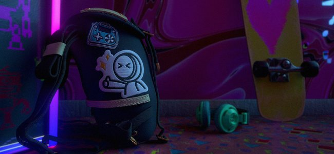

In this release several new filters have been added to greatly expand the texturing process:

* <b>New embroidery decal material</b>  
  Inside the materials section of the Assets window you can find a new Embroidery decal materials. Drag and drop it anywhere over you mesh, plug in any resource (like a texture or even a font) and you will be able to easily create new fabric details.

  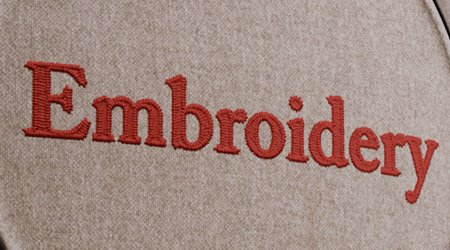
* <b>New fill area color/mask filter</b>  
  These two new filters allow to fill any closed paths or outlines. This is useful to quickly fill 3D paths for example. Because they are filters they can also be used for manual brush strokes or in other situations.

  
* <b>New FXAA filter</b>  
  This new filter can quickly reduce the aliasing, especially on hard edges that can appear after a level for example or on masks made with the color selection effect.

  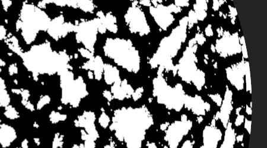
* <b>New highpass filter</b>  
  With this generic filter you can generate a grayscale texture to use it for more advanced effects (like softening, blurring or sharpening details).

  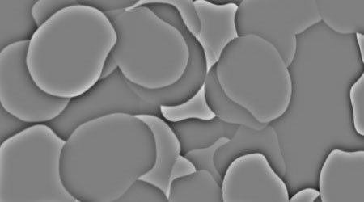
* <b>New pixelate filter</b>  
  The pixelate filter can simulate a reduction in resolution which can be useful to stylize colors and patterns.

  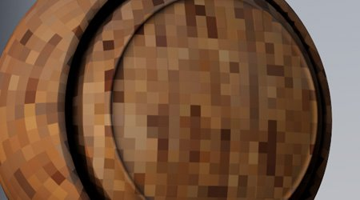
* <b>New posterize filter</b>  
  This filter can be useful to reduce the number of colors in an image which can help create contrasts in shapes and build stylized effects.

  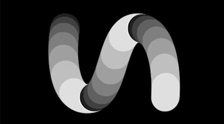
* <b>New threshold filter</b>  
  The threshold filter is a quick way to create sharp binary black and white masks from a grayscale input.

  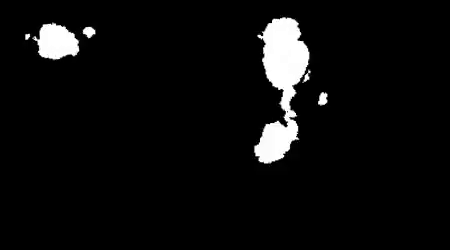
* <b>New smoothstep filter</b>  
  The smoothstep filter is another way of doing a level or contrast to refine grayscale information. This filter also applies an exponential curve to the result, making it possible to convert linear gradients into smooth curves.

  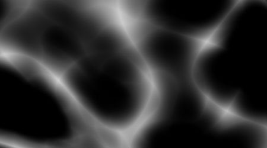
* <b>Improved Transform and Mirror filters</b>  
  The transform filter has been updated to support non-uniform scaling, flipping horizontally or vertically, and simpler to use parameters. The mirror filter has also been refreshed with more straightforward parameters.

  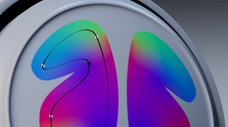
* <b>Improved icons</b>  
  To make standard filters more visible and easier to find, their icons have been remade. Icons tinted yellow are meant to be used on the content of a layer, while grayscale icons are generic and can be used both in layers content and mask.

  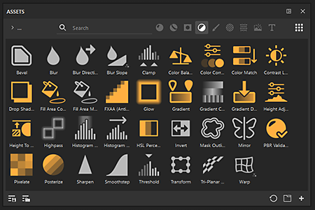
* <b>Minor fixes on filters</b>  
  A few other filters has been adjusted to fix some issues:

  * The height adjust filter was affecting the alpha of a layer, making it difficult to use in some cases.
  * The blur filter wasn't using a linear color space in Legacy color management mode, creating incorrect colors when blending/mixing its input.

### USD and VFX Platform support update

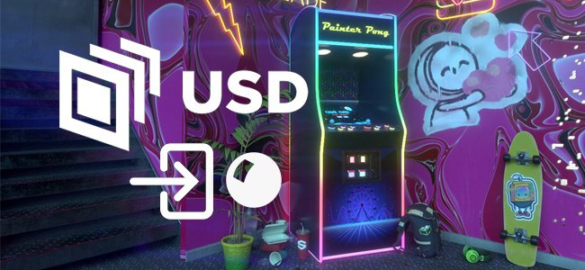

In this version of Painter many third party components have been improved and updated:

* <b>Export textures with Adobe Standard Material in USD  
  </b>When exporting textures from Painter into an USD file, you will now get the Adobe Standard Material properties with them. This make these USD files ready to be used into application that support those properties as well.
* <b>Import textures from USD files</b>  
  Importing an USD file will now also import its texture in the project it creates, making back and forth between applications easier. If the USD file uses the Adobe Standard Material this will also configure the shader settings, making the result in the viewport match the other source application.
* <b>Gltf changes  
  </b>Following the USD update, some change of behavior for the GLTF format were required to ensure parity. When importing a gltf file Painter will now presume that the normal map will be in OpenGL format.  
  Some gltf files may use the DirectX format instead. Therefore a new setting has been added in the new project window to take it into account (note that the normal format can also be overriden from the layer stack).

  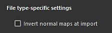
* <b>Updated dependencies</b>  
  Several libraries used by Painter have been updated, notably to match the VFX platform reference. Here are the new versions used in Painter 10.1:

  * Qt 6.5.6 (and PySide6 6.5.6)
  * Substance Engine 9.1.3
  * OpenEXR 3.2
  * Python 3.11
  * OCIO 2.3.2
  * OpenSubdiv 3.6.0
* <b>Updated Linux support  
  </b>This new version of Painter now supports Red Hat Enterprise Linux (RHEL) version 8.6 as the minimum, but should also be compatible with version 9.x.

### Improved performance

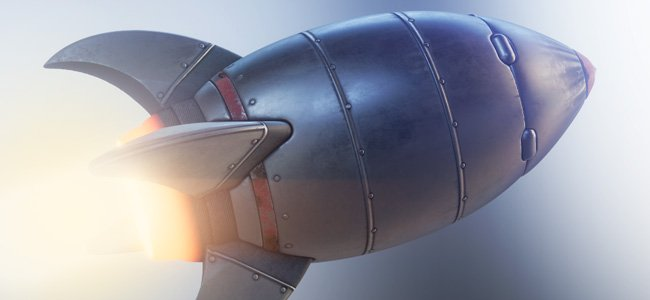

A few areas of the application have received some performance improvements:

* <b>Improved opening time of projects  
  </b>Project that used a lot of brush strokes should now be faster to open in Painter. The saving time of these project should also be slightly improved.  
  In some of our test projects we observed a reduction from 50s to only 6s of loading time when opening a project. Memory consumption when opening old projects and converting them to the latest version has also been improved.
* <b>Improved tesselation performance  
  </b>We now employ an automatic optimization when tesselation is enabled in the Shader settings. Triangle that are smaller than a pixel on screen will not be tesselated anymore, leading to less triangles to drawn and therefor faster rendering times.  
  This change doesn't produce visual differences and doesn't affect the mesh export process.
* <b>Simplified thumbnails are now the default</b>  
  In version 6.2 we introduced the simplified thumbnails for UV Tiles projects to improve performance, but regular projects could still use the old way of computing layers thumbnails. This behavior was controlled via an application setting.  
  This setting now defaults to the optimized thumbnails by default to help performance on any projects. It can be reverted in the main preferences if desired.

  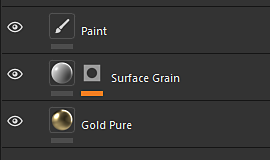

### Painter 10.1 migration notes

>[!NOTE]
>
> * Python plugins may need to be updated following the update to Qt6. See [this page for more details](https://adobedocs.github.io/painter-python-api/guides/qt6-migration/).
> * <b>JavaScript </b>plugins have now been moved into a subfolder inside the User Documents directory. Existing plugins will not appear anymore in the application as they need to be moved manually into that folder.
> * On Steam/Ubuntu, a system library is required to make Painter work properly. Make sure that the libxcb-cursor is installed before launching the application.

## Release Notes

### 10.1.0

Release date: <b>2024/09/17</b>

Summary: <b>Major release, new content: Fill area mask/color filter, embroidery decal filter and six generic Substance filters, import USD with material and shader properties, performance improvement, VFX platform 2024 compliant and migration to Linux RedHat</b>

<b>Added</b>:

* &#91;Content&#93; Add new Fill area mask/color filter
* &#91;Content&#93; Add new Embroidery decal filter
* &#91;Content&#93; Add 6 new generic Substance filters (FXAA, pixelate, highpass, posterize, smoothstep, threshold)
* &#91;USD&#93; Export USD layer with a defined ASM material
* &#91;USD&#93; Import USD with material and shader properties
* &#91;Performance&#93; Enable optimized layer stack thumbnails by default
* &#91;Performance&#93; Reduce project file opening time and memory consumption (data decoding)
* VFX platform 2024 compliant
* &#91;VFX Platform 2024&#93; Update to Python 3.11
* &#91;VFX Platform 2024&#93; Update to OpenEXR 3.2
* &#91;VFX Platform 2024&#93; &#91;USD&#93; Update OpenSubdiv 3.6.0
* &#91;VFX Platform 2024&#93;&#91;Color Management&#93; Update to OCIO 2.3.2
* &#91;Linux&#93; Migration to Linux RedHat
* &#91;Linux&#93; Update Nvidia driver min version to 535.171.04
* &#91;Import&#93; Add an option to flip normal map when importing a GLTF mesh
* &#91;UI&#93; Use operating system default value for drag event detection distance
* &#91;Substance Engine&#93; Add call strip function to remove the symbols from the executable
* &#91;Splash screen&#93; Update to new splash screen format
* Update Substance Engine to version 9.1.3
* &#91;Python&#93; Show link to examples in the layer stack documentation menu
* &#91;JavaScript&#93; Move Javascript plugins into javascript/plugins subfolder

<b>Fixed</b>:

* &#91;Illustrator&#93; Crash exporting a UV Tile with .ai graphic in specific cases
* &#91;Dynamic Strokes&#93;&#91;Path&#93; Random per stroke does not work on a path
* &#91;UI&#93;&#91;Properties&#93; Lock is enabled when tiling is non-uniform
* ​Debug TXT file is created when double clicking on Painter project
* &#91;USD&#93;&#91;Export&#93; Some textures may be missing
* &#91;ASM&#93; Scattering Color channel ignores metallic
* &#91;Content&#93; Blur filter doesn't work in "working" color space
* &#91;Content&#93; Height Adjust filter also modifies the alpha of the layer

<b>Known Issues</b>:

* &#91;Color Management&#93; HDR color space conversions with ACE on Linux produce clamped colors
* &#91;Win&#93;&#91;Crash&#93; &#91;ACE&#93; Not using sRGB ICE color space for display transform
* &#91;Regression&#93;&#91;UI&#93; Right-click Menu is too small on HD screens
* &#91;Crash&#93;&#91;Python&#93; USD export triggered by TextureStateEvent
* &#91;MacOS Intel&#93; Crash when importing some presets
* &#91;Crash&#93; Relocate resource and save project
* &#91;Engine&#93; Painting with Clone tool in normal channel shift colors incorrectly
* &#91;Python&#93; Ghost widget appears deleted by script still functioning
* &#91;RedHat&#93; Color picker issues
