# Version 11.0

<b>Substance 3D Painter 11.0</b> adds a new automatic resource update workflow, a filled path tool as well as general improvements for paths, an automatic cage for baking, and several new filters for creating stylized textures.

Release date: <b>11 March 2025</b>

>[!NOTE]
>
> This version of Painter removes the support of Mac Intel configurations. See below for more details.
> 
> This version also raises the minimum supported version of Windows 10 to 22H2.
> 
> For more information check out our [system requirements page](../../getting-started/system-requirements/system-requirements.md).

## Major features

### New automatic update of resources

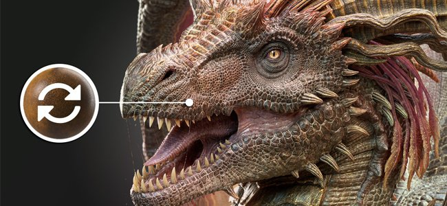

Keeping libraries and projects up to date with the latest versions of your resources is now possible with the new auto-update workflow. With this new process Painter can monitor resources on disk to look for changes and automatically reload and replaces them with your libraries and projects.

* <b>Enabling Auto-update in Assets window</b>  
  At the bottom right of the Assets window is now available a button and menu to configure the auto-update system (the little double arrows icon). Enable the option <b>Assets panel</b> to monitor libraries and reload them.

  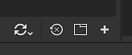
* <b>Updating resources in projects</b>  
  Reloading a resource won't automatically update the version used inside a project via the layer stack, display settings, shaders settings, etc. To do so, make sure to enable the <b>Resources used in project</b> option as well.

  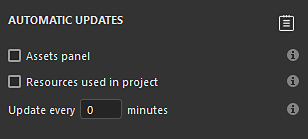
* <b>Update frequency </b>  
  How often Painter should look for an update of resources can be defined in minutes via a dedicated setting. Using 0 minutes will make the application refresh every few seconds. Note however such a low value can lead to performance issues. The application will also automatically refresh when regaining focus.
* <b>Manual resource update</b>  
  The refresh and update process can also be triggered manually by using the dedicated buttons at the bottom of the auto-update menu. This can be more convenient than using and waiting for the automatic process to kick in.

  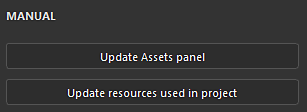
* <b>Mismatch and errors in log window</b>  
  Updating resources, especially if the difference between the old and new version is important, can lead to issues. For example texturing results can greatly change or break because of missing/changing parameters on a Substance resource. This is why <b>Skip assets when their parameters mismatch</b> is enabled by default. Issues will be reported in the log window.  
  To force an update, simply disable this setting.

  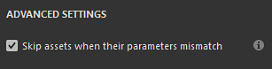

  
* <b>Available in Python API for automating project maintenance </b>  
  The auto-update workflow has also been exposed to Python. New functions have been added to help list outdated resources and replace them.  
  For more information, check out the dedicated documentation via the application Help menu.

>[!NOTE]
>
> For more information, see the [dedicated documentation page](../../features/auto-update/auto-update.md).

### New filled path tool

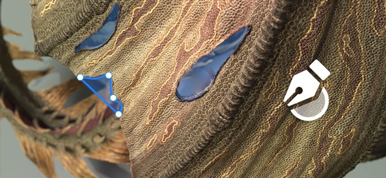

The filled path tool is a new type of path tool which allows to create shapes on the surface of the 3D model filled with a uniform color. It makes possible the creation of complex patterns.

* <b>New tool to create path with a filled color</b>  
  A new tool called <b>Filled path</b> is available in the Path menu. This tool can fill the inner area of a path when closed. The filling is done with a uniform color for each channel of the Texture Set.

  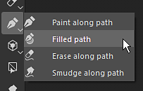
* <b>Adapt to surface automatically</b>  
  The Filled path tool can fit any kind of surfaces, it is not restricted to planar areas. It can cross gaps and object boundaries.

  
* <b>Compatible with mirror and radial symmetry</b>  
  This new tool also supports the symmetry properties, which opens possibilities to create complex shapes.

  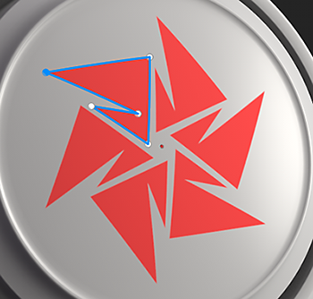
* <b>Easy switch between path tools</b>  
  A new way to switch between the different types of path tools has been added in the Properties window. It makes it easier to try out tools and duplicating paths. For example you can create a path outline and then duplicate it to convert it into a filled path, making it possible to quickly have a shape with an outline.

  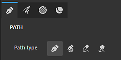

### Improved path tools with snapping, straight lines and more

In this new release a lot of behavior and quality of life improvements have been added to make the path tools easier to use:

* <b>Path preview (toggle with Shift+P)</b>  
  When editing a path, a new dotted line will appear to indicate how the path will react when adding a new point at the end of the curve. This makes changes more predictable. This preview can be disabled via the dedicated settings menu or by using the <b>Shift+P</b> keyboard shortcut.

  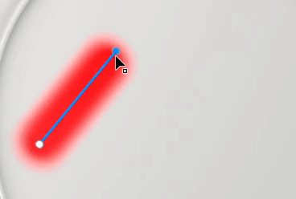
* <b>Straight line and angle snapping</b>  
  The <b>Shift </b>keyboard modifier can now be used to create straight lines between points automatically. Maintaining <b>Ctrl </b>can also be used to apply angle snapping which helps build geometric shapes.  
  The angle snapping settings can modified via the path settings menu in the contextual toolbar.

  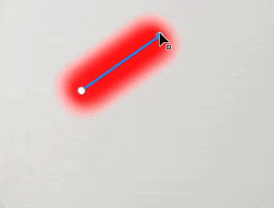
* <b>Snap Path points to mesh polygons</b>  
  To make placing points easier, a new snapping (magnet icon) can be enabled. This option allows to put points on the 3D model vertices and to follow a surface or an edge.  
  Snapping can be done in three different manners:

  * Snap to vertices
  * Snap to edges
  * Snap to center of edges

  All of these modes are available via the path settings menu in the contextual toolbar.

  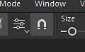

  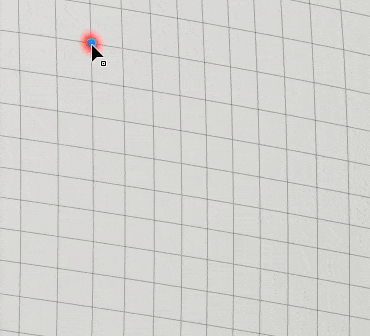
* <b>Auto-close when clicking on last vertex</b>  
  To make the <b>Filled path tool </b>easier to use, clicking on the first vertex while the last one is selected will now automatically close the path. To select a point instead of closing the path you can use the <b>CTRL </b>key. (This behavior was inverted in the previous version.)

  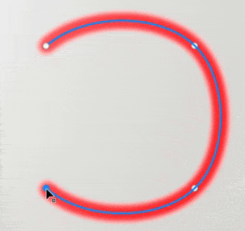
* <b>Copy path vertices positions from content to mask</b>  
  It is now possible to do <b>Copy</b> a path in material mode and then use <b>Paste all vertices</b> on a path in a mask. This make synchronizing different paths possible between materials and masks.

  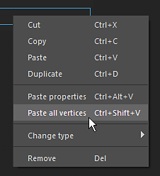
* <b>Improved show/hide UI display behavior</b>  
  Pressing the viewport manipulators keyboard shortcuts (<b>W</b>, <b>S</b>, or <b>D</b>) will now toggle them on the fly. They can also be enabled/disabled from the contextual toolbar dedicated buttons. This change make it possible to quickly show or hide them without also hiding the other visuals in the viewport (like the path curve and points).

  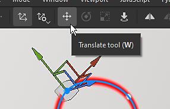
* <b>Rotate and Scale now accessible on path vertices</b>  
  In this version the <b>Rotate </b>and <b>Scale </b>tool can now be used when multiple vertices are selected. It opens the possibility to adjust and align vertices together.

  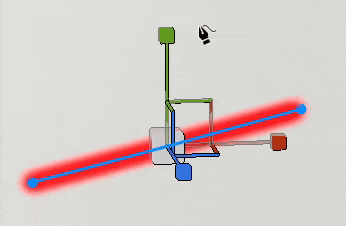
* <b>Show path information in Properties window</b>  
  The properties window now has a new section when a path tool is selected. This new section regroups information and action specific to paths such as the length of a path, the projection depth, and actions to switch between types.

  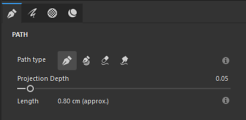
* <b>Improved Tangent edition when viewed from an angle</b>  
  Editing custom tangents could be difficult depending on the view angle. This has now been changed so that tangents will be constrained to their own plan.

  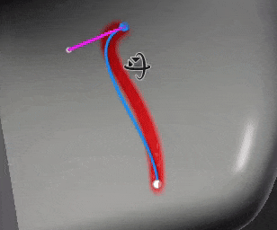
* <b>Keep Path list open across layers</b>  
  When switching between different paint layers and effects, if the Path panel in the viewport was closed it would also stay closed on other layers. The panel will now remain open to make back and forth more convenient.

  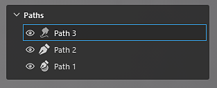
* <b>Focus on currently selected path </b>  
  Pressing the <b>F</b> keyboard shortcut will now focus on a path instead of the whole 3D model when editing a path.
* <b>Delete path with backspace </b>  
  Paths can now be quickly deleted by pressing the <b>Backspace </b>keyboard shortcut.

### New Substance filters and texture generators

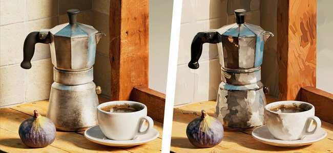

The new version introduces a few new filters as well as some procedural patterns.

<b>Filters:</b>

* <b>Stylization</b>  
  This new filter can be used to convert an existing texturing into a more stylized version. It simulates brush strokes in 3D space and can apply a few other effects to achieve a painterly look. It contains several presets to make it easy to play with.

  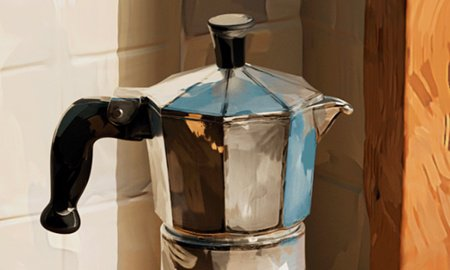
* <b>Quantize</b>  
  The quantize filter can be used to reduce the number of colors in an image and create flat areas with hard limits. It can also be used for stylizing textures.

  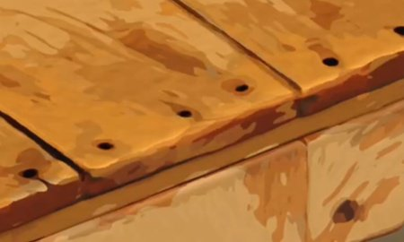
* <b>Anisotropic Kuwahara</b>  
  This filter applies the [Kuwahara filter](https://en.wikipedia.org/wiki/Kuwahara_filter "https://en.wikipedia.org/wiki/Kuwahara_filter") which can be used for noise reduction and for stylizing textures too.

  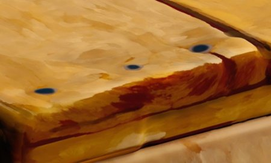
* <b>Directional distance</b>  
  This is a simple filter to stretch pixels in a given direction in 2D space. It can be used to smudge brush strokes or easily create leaks.

  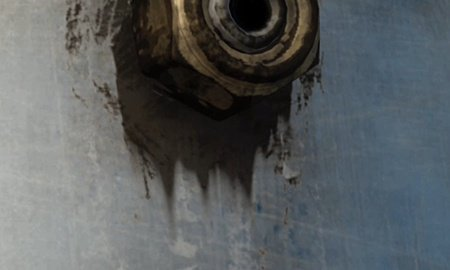
* <b>Bevel smooth</b>  
  The bevel smooth is a new version of the bevel filter, providing better results and controls. It is available in addition to the existing filter.

  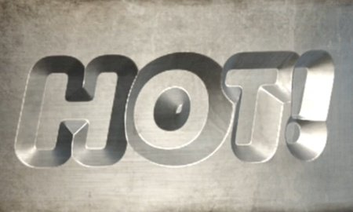
* <b>Grayscale conversion </b>  
  This new filter can be used to conveniently convert images or channels to grayscale, providing control over the Red, Green, and Blue channels if needed.

<b>Texture generators and noises</b>:

* <b>Scratches generator </b>  
  An improved scratches generator simulating thin threads with various controls for randomness.
* <b>Triangle Grid </b>  
  A noise built from the connections of triangles, with controls for randomness and smoothness.
* <b>Tile Random </b>  
  A texture generator tailored to building tile patterns.
* <b>Voronoi and Voronoi Fractal noises </b>  
  Already available as 3D noises, these new 2D versions can be used for working and tiling in 2D or UV space.
* <b>Updated noises to latest version from Designer </b>  
  Most of the noises available in Painter have been updated with the latest version from Substance 3D Designer. Noises parameters are no longer hidden into a group to make them quicker to edit.

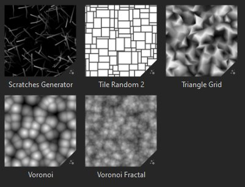

### New automatic cage for baking (experimental)

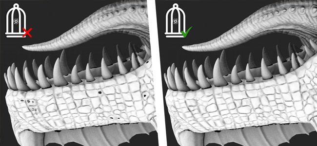

When baking a high-poly mesh onto a low-poly meshes, you can now select a new <b>Automatic </b>option when specifying the cage mode. This new method tries to compute an automatic cage mesh that fits the best the high-poly meshes to avoid artifacts.

* <b>New setting in the common baking parameters </b>  
  Inside the common baking parameter the cage parameter has been replaced with a selection between three options:   
  <b>Distance-based</b>: the default frontal/rear distance settings.   
  <b>Automatic (experimental)</b>: the new automatic cage.   
  <b>Custom file</b>: the previous way of loading a custom mesh file as a cage.

  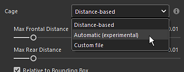

>[!NOTE]
>
> This feature is considered experimental. We plan on improving the algorithm in future versions. We are also looking for feedback on the quality of the results and possible bugs.

### Rendering with Metal on Mac OS

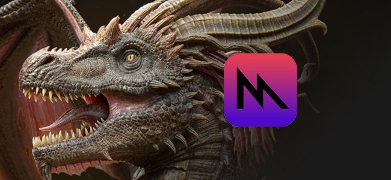

Specific changes related to the Mac platform have been made in this release:

* <b>Metal graphic API is now used instead of OpenGL on Mac </b>  
  Starting with this version, Painter now uses the <b>Metal </b>graphic API on Mac, both for rendering its viewport and computing textures. This switch greatly improves the performance and stability of the application. It will also make it easier to integrate new functionalities in the future as OpenGL has been deprecated on MacOS.
* <b>Removal of support for Intel architecture on Mac OS </b>  
  With this version, the compatibility with Intel CPUs on MacOS has been removed. The ARM architecture (M1, M2, etc.) is now the only one supported.

### Miscellaneous

A few other features have also been added in this version:

* <b>Only enable base Color channel on new fill layer/effect</b>  
  Now by default, when creating a new fill layer or effect, only the Base Color channel will be enabled. (This change doesn't apply when drag and dropping a resource that would create itself a fill layer/effect.)  
  Based on feedback from the community we made this change to improve performance by avoiding triggering the computation of channels that get disabled afterward. This should help responsivity when working at high resolution or with UV tiles.  
  Note that you can quickly re-enable all the channels by clicking on the Base Color button while maintaining the <b>ALT </b>keyboard shortcut.

  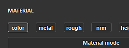
* <b>Rename UV Tiles for exporting textures</b>  
  In the Texture Set list window it is not possible to add a custom name on UV Tiles. Contrary to the description, the custom name can be retrieved in export presets via the dedicated tag <b>$uvTileName</b>.  
  This new functionality allows to replace UDIM numbers into specific names during export.

  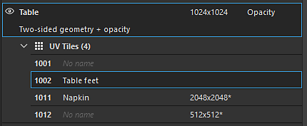
* <b>New export button available in Dock toolbar</b>  
  The <b>Send To</b> actions which allows to export toward other applications have moved into a dedicated window, now available from the Dock toolbar on the right side of the application.

  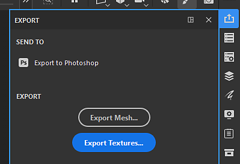
* <b>Improve naming of copy/pasted paths and layers</b>  
  The naming scheme of layers when duplicating or copy/pasting layers and paths has been improved to be more consistent and predictable.

  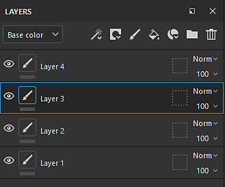

## Tutorials

## Release Notes

### 11.0.0

Release date: <b>2025/03/11</b>  
Summary: <b>Major release, new Auto-update feature, Filled path tool and other path improvements, as well as new filters and an experimental Auto-cage generation for baking</b>

<b>Added</b>:

* Auto Update
* &#91;Auto-update&#93; Auto-update modified assets in the Assets panel
* &#91;Auto-update&#93; Auto-update modified assets across the project
* &#91;Auto-update&#93; Keep auto-update off by default
* &#91;Auto-update&#93; Make update optional if resource parameters do not match (.sbsar, .glsl, .ai, .svg)
* &#91;Auto-update&#93; Add environment variable to disable auto-update feature
* &#91;Auto-update&#93;&#91;SBSAR&#93; Make update optional if resource parameters do not match
* Filled Path
* &#91;Path&#93;&#91;Fill&#93; Add new tool to create filled paths
* Path improvements
* &#91;Path&#93; Create path which snaps to polygons
* &#91;Path&#93; Allow to switch Path types
* &#91;Path&#93; Allow to copy paste path vertex data between content and mask
* &#91;Path&#93; Allow to constrain angle when creating a new point
* &#91;Path&#93; Allow to constraint point creation to a line
* &#91;Path&#93; Close shape with a single click
* &#91;Path&#93; Display path information
* &#91;Path&#93; Allow to scale and rotate path vertices
* &#91;Path&#93;&#91;UX&#93; Make transformation gizmos easier to access
* &#91;Path&#93; Add path preview
* &#91;Path&#93; Disable Path preview with Shift + P
* &#91;Path&#93; Improve tangent edition from side view
* &#91;Path&#93; Allow to focus on a 3D path
* &#91;Path&#93; Vertices should retain selection status when toggling UI off and on again
* &#91;Path&#93; Allow to delete Path using Backspace
* &#91;Path&#93; Keep path list open if user expands it
* &#91;Path&#93;&#91;Layer Stack&#93; Correctly rename duplicates on copy/paste
* &#91;Path&#93; UI and tooltip improvements
* Performance
* &#91;Performance&#93; Improve viewport performance when using high tessellation level
* &#91;Performance&#93; Enable only the first channel on new fill layers/effects
* &#91;Performance&#93; Parallelize brush stroke computation
* Baking
* &#91;Baking&#93; Add new fully automatic cage generation option for baking with high-poly meshes (Experimental)
* Content
* &#91;Content&#93; Add 6 new filters: stylization, quantize, anisotropic kuwahara, bevel smooth, directional distance, grayscale conversion
* &#91;Content&#93; Update Noises and Grunges to latest version from Designer (with new 2D Voronoi)
* &#91;Content&#93; Add 3 new texture generators (Tile Random, Triangle Grid, Scratches Generator)
* &#91;Content&#93; Rename Unreal Engine template and export presets
* Python
* &#91;Shelf&#93;&#91;Python&#93; Save smart material or smart mask to disk from Python
* &#91;Python&#93; Add baking auto-cage to Python API
* &#91;Python&#93; Allow to edit Texture Sets/UV Tiles names and descriptions
* &#91;Python&#93; Share resolution settings on Vector &amp; Font sources
* &#91;Auto-update&#93;&#91;Python&#93; Expose project auto-update functionalities in Python
* Misc
* &#91;Export&#93; Make Send to options easier to access with a new panel
* &#91;Nvidia&#93; Add warning about latest Nvidia drivers (572.16)
* Angle snapping should be affected by Object/World space selection​
* &#91;Texture Set list&#93; Allow to add custom name to UV Tiles and use them at export
* Mac
* &#91;Mac&#93; Use Metal instead of OpenGL for graphics rendering
* &#91;Mac&#93; Drop Mac Intel support

<b>Fixed</b>:

* &#91;Nvidia&#93;&#91;Baking&#93; Ambient occlusion baker results have artifacts
* &#91;Crash&#93; Alt click to toggle visibility on disabled Texture Set leads to a crash
* &#91;Baking&#93; Cage is taken into account with low poly as high poly param
* &#91;Baking&#93; Material color for ID map baker doesn't work with USD file format
* &#91;Performance&#93; Slow rendering in viewport with meshes and lot of overlapping objects
* &#91;Qt&#93; Custom built color picker does not have Color Management settings
* &#91;Viewport&#93; 3D Manipulators flicker when Anti-Aliasing is enabled
* Grayscale slot of the eraser in mask blocks brush state
* &#91;Log&#93; Very long error messages are not reported when importing meshes
* &#91;Content&#93; Typo in list of preset names inside Topstitches tool preset
* &#91;Python&#93; Replacing a SVG/Ai file by another one doesn't update its properties
* &#91;Python&#93; Vectorial resource Artboard ID is empty in some cases when queried from Python
* &#91;Python&#93; Error printed in log sometimes has a lot of line returns

<b>Known Issues</b>:

* &#91;Color Management&#93; HDR color space conversions with ACE on Linux produce clamped colors
* &#91;Regression&#93;&#91;UI&#93; Right-click Menu is too small on HD screens
* &#91;Crash&#93;&#91;Python&#93; USD export triggered by TextureStateEvent
* &#91;Engine&#93; Painting with Clone tool in normal channel shift colors incorrectly
* &#91;Python&#93; Ghost widget appears deleted by script still functioning
* &#91;RedHat&#93; Color picker issues
