# Version 11.1

<b>Substance 3D Painter 11.1 </b>brings the new Ribbon path tool with dedicated content, symmetry on fill layers and effects, physics size for displacement and the support of Vulkan graphics API.

Release date: <b>November 18, 2025</b>

>[!NOTE]
>
> This version of Painter switches the graphics API from OpenGL to Vulkan. This change may impact which GPUs are supported by the application, notably for baking with GPU-based raytracing.
> 
> For more information check out our [system requirements page](../../getting-started/system-requirements/system-requirements.md).

## Major features

### new Ribbon tool

The <b>Ribbon path</b> is a new tool in the path tool family. A Ribbon will transform and repeat a texture along a path without any cuts, with extra control for the start and the end, as well as options for sharp corners.

This new tool opens the door to new behavior such as putting text along paths, placing perfect gradient along a path, and easily creating your own advanced trims to wrap around a mesh.  
In short, the ribbon is a cleaner tool for more precise drawing with paths.

* <b>New Ribbon tool available next to the other path-like tools</b>  
  The new Ribbon tool is available next to the other path like tools in the interface. It can be selected either from the toolbar or from the path type shortcuts.

  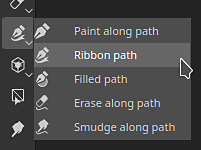

  
* <b>The Ribbon is a continuous path that works across all kinds of surfaces</b>  
  ItThe Ribbon is a tool that allows to repeat or stretch a texture along a path. It works across any kind of surfaces and geometry, even when mesh parts are not connected.

  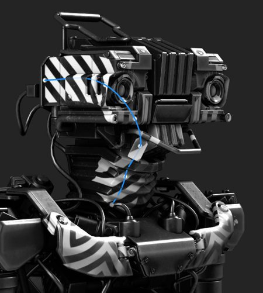
* <b>Making repeating patterns and gradients</b>  
  This new tool can repeat images in various ways with no seams or cuts, which is suitable for gradients and clean patterns.

  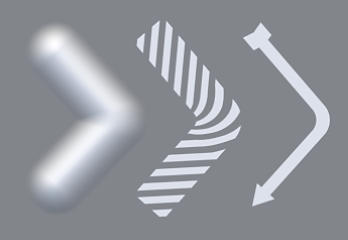
* <b>Stretch images with custom start and end</b>  
  The <b>stretch between offsets</b> setting allows to isolate parts of an image to use them as start and end sections on a path, while the middle section is stretched along the rest of the path. This can come in handy to quickly use simple bitmaps and place them along a path without distortions, like arrows.

  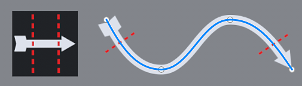
* <b>Different corner types available</b>  
  When breaking tangents to create corners, several shapes are available depending on the needs - from classic break to smooth turning.

  
* <b>Stretching and tiling controls</b>  
  Images can easily be repeated or stretched along a Ribbon path, either automaticaly or manually.

  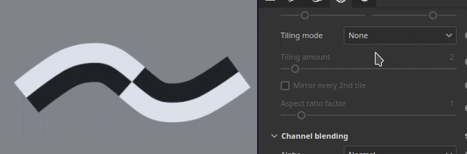
* <b>Text along path</b>  
  Font resources can be used directly on a Ribbon path. Text automatically adjusts to the path to deform along it curves. Alignments settings can be used to better adapt text for any situations.

  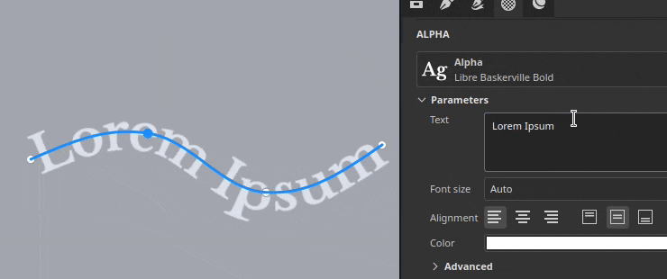
* <b>Aspect ratio and non-square resources</b>  
  Non-square resources are automatically adjusted to fit to the Ribbon path's length, which makes it ideal for elongated patterns, such as repeating decorations and trims.

  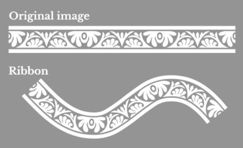
* <b>Compatible with Substance dynamic strokes workflow</b>  
  Ribbon paths are also compatible with the Substance based dynamic stroke system, making it possible to create complex results. One notable example is the ability to have custom start/ends and left/right corners.  
  Two new tool presets named <b>Custom Ribbon Grayscale</b> and <b>Custom Ribbon Material</b> are also provided to make this functionality easily accessible.

  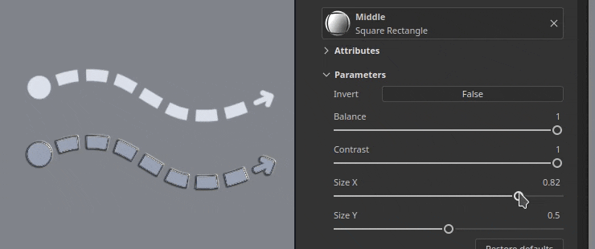
* <b>Compatible with symmetry</b>  
  Like other types of tools, the Ribbon path is also compatible with the symmetry feature.

  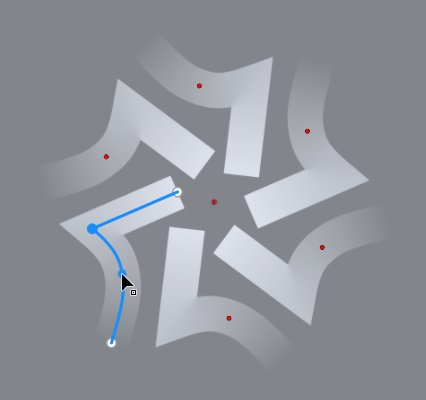
* <b>Blending modes when self-overlapping</b>  
  When a Ribbon path crosses over itself, it can lead to unexpected results. The dedicated blending mode for the Alpha, Normal and Height channel can help to achieve better results.

  

Additional improvements have been made across all path tools:

* <b>Separate size and opacity per vertex on paths</b>  
  Adjusting the size and opacity per vertex on a path is now possible and not tied to the pressure parameter anymore. These two properties are now handled separately with dedicated sliders in the interface.

  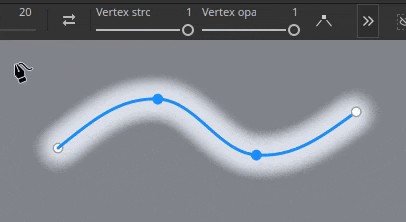
* <b>Parameters grouping in the Properties window </b>  
  Most tools in Painter now have collapsible groups for their parameters. This change makes it easier to hide parameters on the fly and reduce the length of the window.

  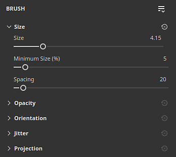

>[!NOTE]
>
> For more information on the <b>Ribbon tool</b>, check out the [dedicated documentation page](../../painting/tool-list/ribbon-tool/ribbon-tool.md).
> 
> For more information on <b>dynamic strokes</b>, check out the [dedicated documentation page](../../painting/dynamic-strokes/dynamic-strokes.md).

### New content and categories for Ribbon tool

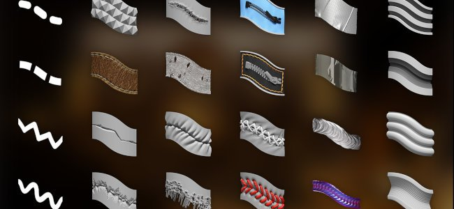

This release includes 75 new tool presets which take advantage of the new Ribbon capabilities. To make the presets easier to discover, new preset categories have been added in the <b>Properties</b> window.

* <b>New preset categories shortcuts in Properties window</b>  
  A series of new buttons now sits at the top of the <b>Properties</b> window when using any path tools. Each button gives access to tool presets, sorted per categories. The favorites category regroups presets you chose.

  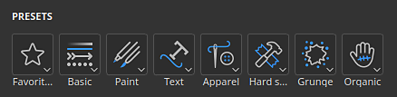

  Clicking on one of the buttons will give a quick access to some pre-selected presets. Clicking on <b>Show more in Assets</b> will reveal more path tool presets in the <b>Assets</b> window.

  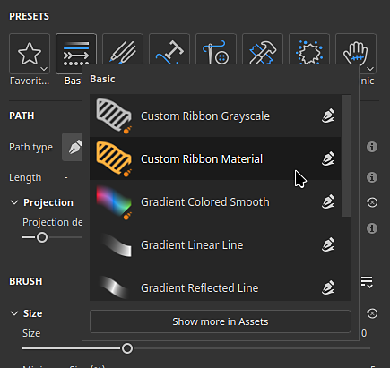
* <b>Quick switch between presets</b>  
  To make switching between presets easier, clicking on a preset no longer deselect the currently edited path.

  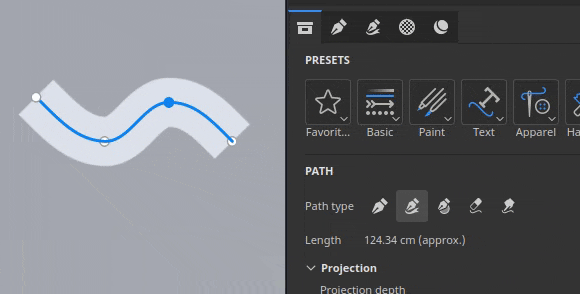
* <b>New content</b>  
  75 new tool presets dedicated to the Ribbon tool have been added in this version as part of the default content. These presets are available directly inside the <b>Assets</b> window under the brush section or via the new categories shortcuts in the <b>Properties</b> window.  
  These presets include:

  * <b>Apparel</b>: Improved seam puckering and topstitches presets, as well as zippers and fabric tears.
  * <b>Basic</b>: Simple strokes such as lines and dashes, but also gradients and the <b>Custom Ribbon</b> presets based on the <b>Dynamic Stroke</b> system.
  * <b>Grunge</b>: 3 types of cracks to simulate damages on various kind of surfaces.
  * <b>Hard surface</b>: Grip patterns, panel and shutlines detailing, tapes and welding to use or mechanical objects.
  * <b>Organic</b>: Bandages, both clean and dirty, to wrap around skin and other surfaces.
  * <b>Paint</b>: brush based gradients and gouaches presets.
  * <b>Text</b>: Quick presets to setup text along a path with the Ribbon with different alignments modes and stretching.
* <b>New tool keyword for searching in Assets window</b>  
  Typing "ribbon", "paint", "path" or even "smudge" in the <b>Assets</b> window is now possible and can help find presets which will match the corresponding tool.

  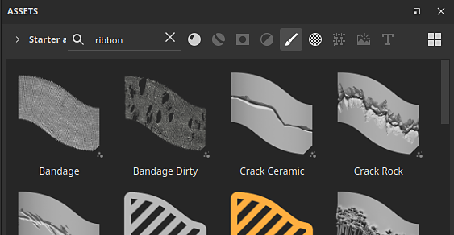

### New symmetry for fill layers and effects

Fill layers and effects now support symmetry with their 3D projection modes. It can be enabled via the symmetry menu in the contextual toolbar or via the newly added symmetry section in the <b>Properties</b> window.

* <b>Symmetry on fill layers </b>  
  When using 3D based projection modes in fill effects and layers, symmetry can now be enabled. Both mirror and radial symmetry are available.

  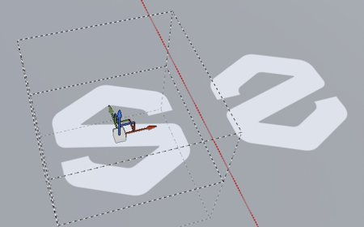
* <b>Enable symmetry via the contextual toolbar or the Properties window</b>  
  Symmetry can be activated via the <b>contextual toolbar</b> menu, similar to paint tools, or via the <b>Properties</b> window with the new dedicated section.

  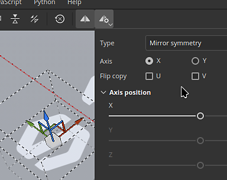

  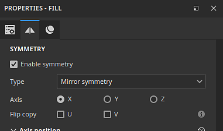
* <b>Flip input resource for Texts and Logos</b>  
  Fill layer and effects symmetry also benefit from a new options than allows to flip the input images or the X/Y axes. This allows to mirror a text for example but still make it readable on both sides.

  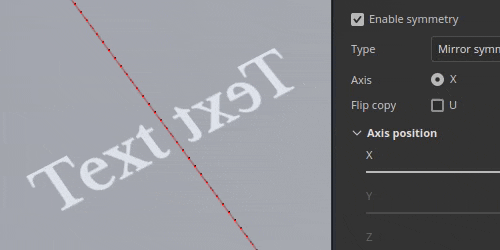
* <b>Improved symmetry settings interface</b>  
  The interface of the symmetry settings has been reworked to be easier to read and quicker to use. Axes sliders each have their own line for example, which helps to be more precise. The radial display has also been downsized to occupy less space.

  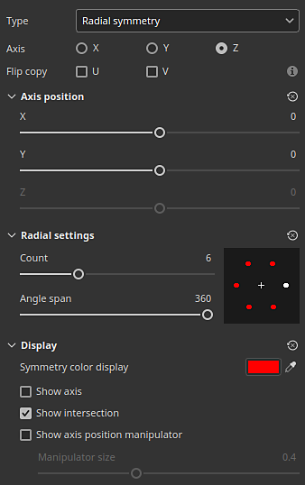

For more information about the <b>symmetry</b>, see the [dedicated documentation page](../../painting/symmetry/symmetry.md).

### Physical size for displacement

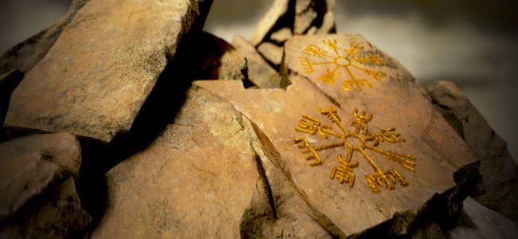

Displacement can now be defined with a specific unit. This change makes it easier to align and match the displaced geometry across other applications.

* <b>New scale unit option in displacement settings</b>  
  In the <b>Shader settings</b> window, when adjusting the displacement intensity, there is a new scale unit settings available. This setting offers the following options:

  * <b>Normalized</b>: default, matches the previous behavior of Painter. This size is based on the mesh bounding box inside the current project.
  * <b>Scene</b>: uses the units stored inside the mesh file as the reference point.
  * <b>Physical size (cm)</b>: uses the project's unit defined in the <b>Project configuration</b> window.

  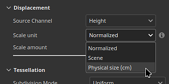

### New Vulkan graphics backend for Windows and Linux

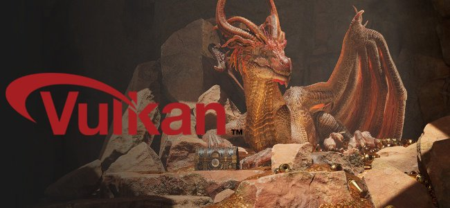

In continuation of the work started in our previous version, which switched from OpenGL to Metal on Mac OS, this new version now uses <b>Vulkan</b> on Windows and Linux platforms.

* <b>Vulkan graphics API is now used instead of OpenGL on Windows and Linux</b>  
  Painter now uses the Vulkan graphics API for rendering in the viewport and computing textures. This switch should improve the general performance of the application. It will also make it easier to integrate new functionalities in the future.
* <b>GPU raytracing for baking via Vulkan</b>  
  DirectX raytracing (DRX) and Optix have been replaced in favor of raytracing via the Vulkan graphics API in our bakers. This change means that GPU based raytracing is now available on AMD GPUs as well as on the Linux operating system.  
  Switching to Vulkan also improve baking render times, especially at high resolutions.

### Miscellaneous

Additional features and improvements have been added in this version:

* <b>Substance resolution override</b>  
  When using Substance resources in Tools and Fill layers/effects, a new <b>Resolution</b> parameter group is available. These settings can be used to change the default resolution selected by the application.  
  This can be useful to either increase or reduce the resolution a Substance is generated at, for quality or performance reasons.

  The available settings are:

  * <b>Resolution</b>: define the mode and context used to compute the resolution. Default is Auto, but it can set to <b>Texture Set</b> or <b>Custom</b>.
  * <b>Factor</b>: additional control over the resolution,  to create relative differences. For example: using half of the resolution of a given context.
  * <b>Output size</b>: the final resolution computed based on the previous settings.

  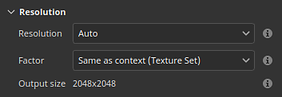
* <b>Performance improvements on single big triangle</b>  
  Until now, Painter would struggle on very low poly meshes or meshes with very big and/or long triangles. This is no longer the case. Working with single quad meshes, for example to create tiling textures, should not be a problem anymore.
* <b>Improved default brush shape</b>  
  The default brush shape has been updated with new settings to control its size and roundness while taking into account the hardness behavior.

  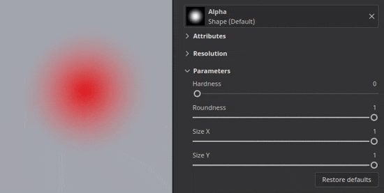

## Tutorials

Here is the latest tutorial that covers our new feature:

## Release Notes

### 11.1.0

Release date: <b>2025/11/18</b>  
Summary: <b>This update is a major release, it contains the new Ribbon tool with dedicated new content, symmetry support for fill layers, physical size parameter for displacement, improved performance through the updated bakers, full Vulkan support for Windows and Linux and other improvements.</b>

<b>Added</b>:

* New ribbon tool
* &#91;Tool&#93; Add new Ribbon tool to make seamless paths
* &#91;Ribbon&#93; Add Ribbon preset shortcuts in Properties window
* &#91;Ribbon&#93; Allow to change the opacity of the Ribbon per vertex on the path
* &#91;Ribbon&#93; Allow to change the size of the Ribbon per vertex on the path
* &#91;Ribbon&#93; Remove begin/end defined in a Substance when paths are closed
* &#91;Ribbon&#93; Remove Path/Material preview in properties window for Paint/Eraser/Smudge path tools
* &#91;Ribbon&#93; Add blending modes for the alpha and some channels when self-overlapping
* Fill symmetry
* &#91;Fill&#93; Add support for symmetry on fill layers and effects
* &#91;Fill&#93;&#91;UI&#93; Expose symmetry settings in properties window for fill layer and effects
* &#91;Fill&#93; Rework symmetry settings UI in both viewport menu and properties window
* &#91;Fill&#93; Properly reorient normal textures when projecting in warp mode
* Physical size displacement
* &#91;Displacement&#93; Use physical size as displacement unit
* Performance improvement
* &#91;Performance&#93; Improve rendering of small brush strokes on big triangles
* &#91;Performance&#93; Improve Shader compilation time
* &#91;Performance&#93; Full Vulkan support for Windows and Linux
* &#91;Performance&#93; Updated bakers with faster GPU rendering and support of AMD raytracing
* &#91;UI&#93; Re-organize tools properties into groups and collapse some by default
* &#91;Engine&#93; Update Substance Engine to version 9.2.5
* &#91;Substance&#93; Expose resolution override for Substance resources in Tools and Fills
* &#91;Export&#93; Update Mesh Maps export preset to export grayscale textures
* Python
* &#91;Baking&#93;&#91;Python&#93; Indicate in changelog breaking changes following bakers update
* &#91;Python&#93; Expose fill symmetry settings in Python
* Content and new content
* &#91;Content&#93; Add 75 new tool presets for the Ribbon tool
* &#91;Content&#93; Update gradient builder resource to be compatible with Ribbon

<b>Fixed</b>:

* &#91;Crash&#93; Loading another project while path snapping is enabled can crash
* &#91;Crash&#93; Right click in Path panel with info from another session in clipboard can crash
* &#91;UI&#93; Interface scrolls up in tool properties when creating a path
* &#91;UI&#93; Mouse cursor disappear when path viewport visualization is hidden
* &#91;Path&#93; Copy/pasting different Tool properties in Path panel lead to unstable properties
* &#91;Tool&#93; Eraser and Smudge tool presets do not always update channel selection
* &#91;Tool&#93; Painted value is gray but UI shows white after loading colored tool preset in mask
* &#91;Tool&#93; Preset created from mask retains channels values loaded from another preset
* &#91;Substance&#93; Normal color space override defined in graph is not taken into account
* &#91;Content&#93; Default brush shape resource uses an outdated Substance

<b>Known Issues</b>:

* Shader instance history not tracked properly
* &#91;Ribbon&#93; Performance issue with UV Tiles
* &#91;Ribbon&#93; Path can overlap itself unexpectedly after a corner in some cases
* &#91;Ribbon&#93; Tangents create unwanted loop when point is moved closely to the path ends
* &#91;Crash&#93;&#91;Ribbon&#93; Creating very long texts in Ribbon can crash
* &#91;Tool&#93; Material preview does not work when projection is used in a mask
* &#91;Baking&#93; AO setting "Self Occlusion" is ignored with several Texture Sets and "match by name" enabled
* &#91;Baking&#93; AO with normal has artifacts at edges because of missing padding
* &#91;Color Management&#93; HDR color space conversions with ACE on Linux produce clamped colors
* &#91;Regression&#93;&#91;UI&#93; Right-click Menu is too small on HD screens
* &#91;Crash&#93;&#91;Python&#93; USD export triggered by TextureStateEvent
* &#91;Engine&#93; Painting with Clone tool in normal channel shift colors incorrectly
* &#91;Python&#93; Ghost widget appears deleted by script still functioning
