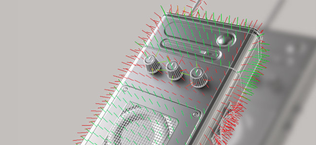

# Version 12.1

<b>Substance 3D Painter 12.1</b> brings an improved baking workflow with automatic rebaking and skew correction painting, support for the OpenPBR material definition, and a new hard surface mode for automatic UV unwrapping.

Release date: <b>June 22, 2026</b>

>[!NOTE]
>
> This version raises the minimum supported macOS version to 13.0 (Ventura). For more information check out our [system requirements page](https://helpx.adobe.com/substance-3d-painter/getting-started/system-requirements.html).

## Major features

### Improved baking workflow with skew painting

The baking workflow has been reworked to support continuous rebaking, on-mesh skew correction painting, edge protection, and a redesigned mesh map list.

* <b>Automatic rebaking</b>
  A mesh map can be rebaked continuously as its baking parameters are adjusted, removing the need to manually trigger a bake after each change. Auto-rebake is toggled per map and applies to a single map at a time. This is particularly convenient for the skew painting workflow, but also when adjusting general bake settings.

  
* <b>Skew correction painting</b>
  When the cage is set to <b>Distance-based</b> mode, skew corrections can be painted directly onto the low-poly mesh to control the projection direction used during baking. The brush, eraser, and polygon fill tools are available, with a compact grayscale value picker, symmetry, and the usual brush controls (<b>Ctrl + Right-click</b> to resize the brush, <b>X</b> to invert the painted value). Skew painting actions can be undone.

  
* <b>Edge protection</b>
  When painting skew correction, a new edge protection option preserves the high-poly softness projected onto hard edges. Its result is controlled by the <b>Edge Distance</b> and <b>Edge Contrast</b> parameters.

  
* <b>Redesigned mesh map list</b>
  The mesh map list provides per-map controls: toggle a map as the viewport <b>preview</b>, <b>quick bake</b> a single map, toggle its <b>auto-rebake</b>, and <b>sync</b> its settings across Texture Sets (available when the project has several Texture Sets). Each control has a tooltip on hover.

  
* <b>Simplified bake button</b>
  The viewport bake button has been replaced with a single <b>Bake</b> button that displays the number of maps to bake (Texture Sets x UV Tiles x selected mesh maps).

  

>[!NOTE]
>
> For more information about baking, see the [dedicated documentation page](https://experienceleague.adobe.com/en/docs/substance-3d-painter/using/baking/baking).

### OpenPBR support

The OpenPBR shading model is now supported in Painter and is used as the default workflow, providing a standardized material definition that can be carried across applications.

* <b>New OpenPBR shader and default workflow</b>
  A shader implementing the OpenPBR 1.1 specification is available and used by default. A new project created without a template uses the OpenPBR shader, and the first entry of the new project window is now labeled <b>OpenPBR</b> instead of <b>ASM</b>. New project templates for OpenPBR are included, and the sample projects have been updated to use it.

  
* <b>Shader selected from the project template on import</b>
  When importing a USD or GLTF file, the shader is now set from the project template rather than guessed from the file content. A message is reported in the log when a material and a template use mismatching workflows.

  
* <b>OpenPBR naming convention on export</b>
  The <b>Export Textures</b> window has a new dropdown to choose the naming convention. It defaults to OpenPBR when at least one shader in the project uses it, and the selected scheme is reflected in each Texture Set's list of maps.

  
* <b>USD and MDL support</b>
  OpenPBR materials are supported through the USD format. A new MDL has also been added to allow rendering OpenPBR materials in Iray, providing more accurate material representations.

>[!NOTE]
>
> Custom shaders may need updating. The shader API has been changed to support OpenPBR, refer to the changelog available in the Help menu of application for the details.

### New hard surface automatic unwrapping

A new automatic unwrapping mode tailored to hard-surface assets has been added.

* <b>Hard surface unwrap mode</b>
  A <b>Hard surface</b> option is available in the automatic unwrap settings. It minimizes UV distortion and produces UV layouts aligned orthographically, which makes it better suited to mechanical and hard-surface meshes.

  

>[!NOTE]
>
> For more information about automatic unwrapping, see the [dedicated documentation page](https://experienceleague.adobe.com/en/docs/substance-3d-painter/using/features/automatic-uv-unwrapping).

### Miscellaneous

Additional features and improvements have been added in this version:

* <b>Add or remove several channels at once</b>
  Following the introduction of OpenPBR, a new window accessible from the <b>Texture Set settings</b> allows selecting multiple channels at once, which is convenient when setting up the large channel list used by the OpenPBR workflow.

  * The new window is accessible in the Texture Set settings via the <b>Add or remove channels</b> button.

    
  * The window gives an overview of all the channels that can be used in Painter.

    
  * The <b>Apply to all Texture Sets</b> button can be used to edit the channel configuration of all Texture Sets at once.

    
* <b>Flatten all instances across Texture Sets</b>
  A new <b>Flatten all instances</b> option is available on instanced layers and groups. It produces a flattened result across every Texture Set where the instance appears, going down the whole instance tree, and is recorded as a single undo step.

  
* <b>Unified undo history</b>
  Baking and painting modes now share the same undo history. Switching between Baking mode and Paint mode is recorded as an undoable step, so actions can be undone only in the mode where they happened.

## Tutorials

Coming soon.

## Release Notes

### 12.1.0

Release date: <b>2026/06/23</b>

Summary: <b>This update is a major release, it contains bakers improvements with New baking default UI state, painting skew map, auto rebake, new option for Auto UV unwrap for hardsurface meshes and OpenPBR. For further details, see the complete release notes.</b>

<b>Added</b>:

* &#91;Skew baking&#93; Skew Painting Tools
* &#91;Skew Baking&#93; Add Skew Preview shader and Skew Direction Vector visuals when painting skew map
* &#91;Skew Baking&#93; Add Edge Protection option
* &#91;Skew baking&#93; Auto rebake
* &#91;Skew Baking&#93; Rework Mesh map List UI
* &#91;Skew Baking&#93; Split Mesh Map / Common Baking settings + Move Common Settings out of mesh map list basecolor or mask only
* &#91;Skew Baking&#93; Change viewport toolbar buttons
* &#91;Skew Baking&#93; Show Symmetry toggle for brush in top toolbar
* &#91;Skew Baking&#93; Rename Options in mesh map List Sync menu
* &#91;Skew Baking&#93; Update Sync and Checked state dialogs
* &#91;Skew Baking&#93; Create Grayscale color picker variant
* &#91;Skew Baking&#93; Update baking mode icon
* &#91;Auto Unwrap&#93; Integrate Hard Surface option
* &#91;OpenPBR&#93; Add support for OpenPBR 1.1
* &#91;OpenPBR&#93; Make OpenPBR the default workflow and shader
* &#91;OpenPBR&#93; Import OpenPBR materials and textures via USD
* &#91;OpenPBR&#93; Export OpenPBR materials and textures via USD
* &#91;OpenPBR&#93; Update Export Textures window to show OpenPBR naming convention
* &#91;OpenPBR&#93; Add documentation about changes to support OpenPBR
* &#91;OpenPBR&#93;&#91;Iray&#93; Add new MDL to support OpenPBR 1.1 in Iray
* Several minor improvements to USD exports
* &#91;UI&#93; Add warning in the viewport when trying to paint on another Texture Set
* &#91;Flatten&#93; Allow to flatten all instanced layers across Texture Sets
* &#91;Texture Set settings&#93; Allow to select several channels at once via new window
* &#91;History&#93; Update "value" Undo entry wording to reflect parameter name
* &#91;Layer stack&#93; Make fill effects in masks default to white (1.0)
* &#91;Substance&#93; Add new "mesh_hard_edges_triangle" engine map input
* &#91;Substance&#93; Add new "mesh_hard_edges" engine map input
* &#91;Shader&#93; Prevent shader instances to share the same names
* &#91;Shader&#93; Use the shader from the project template when importing a USD or GLTF file
* Update Adobe Color Engine to version 7.0
* Upgrade minimum MacOSX version to 13.0 (Ventura)
* &#91;Content&#93; New project templates for OpenPBR
* &#91;Content&#93; Update sample projects to use the new OpenPBR shader
* &#91;Python&#93; Expand Geometry Mask API to allow inclusion and exclusion modes like in UI

<b>Fixed</b>:

* &#91;Crash&#93;&#91;Mesh Maps Settings&#93; Apply settings to other texture sets
* &#91;Crash&#93; When baking curvature from map without world space normal
* &#91;Crash&#93;&#91;Baking&#93; Baking with custom cage enabled but no file selected crashes
* &#91;Crash&#93; Cancelling AO baking
* &#91;Auto-Cage&#93; Infinite load when high poly file path is invalid
* &#91;Linux&#93;&#91;Windows&#93; Color picker can sometimes be fully black or not appear
* &#91;Polygon Fill Tool&#93; The tool does not work with non-PBR
* &#91;&#91;Paint&#93; Deleting base color channel does not delete previously painted color
* &#91;USD&#93; Shader instances are not all correctly detected
* &#91;Substance&#93; Only the first usage of an input/output node is taken into account
* &#91;Shader&#93; Ambient Occlusion is applied twice with Texture Sets using different mixing methods
* &#91;Engine&#93; Normal textures with empty blue channel (black) can lead to wrong blend results
* &#91;GLTF Import&#93; Alpha blending is enabled on every texture sets
* &#91;GLTF Export&#93; Alpha blending is always enabled at export
* &#91;Export&#93; Double sided geometry is always disabled when importing a GLTF file
* &#91;Javascript&#93; Modification of shaders settings don't contribute to undo history
* &#91;Samples&#93; Subsurface scattering is not enabled in Display Settings for Meet Mat

