# Version 8.1

**Substance 3D Painter 8.1** integrates the Adobe Color Engine (ACE) with support for ICC profiles, new bakers, new 3D noises and 20 grunge maps and an improved eyedropper.

Release date: *7 June 2022*

## Major features

### New color management with Adobe Color Engine (ICC support)

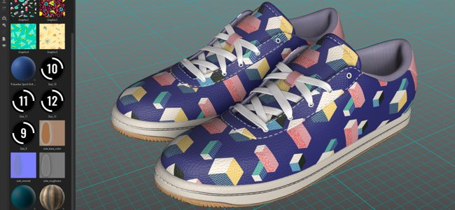

In this new version, the color management system has been expanded with the support of the Adobe Color Engine (ACE) which unlocks the use of ICC profiles. This new system allows to match colors across a wide range of applications, including Photoshop.

* **New project settings**   
  When creating a new project, it is now possible to specify the color management engine with the newly added **Adobe Color Engine** (ACE).

  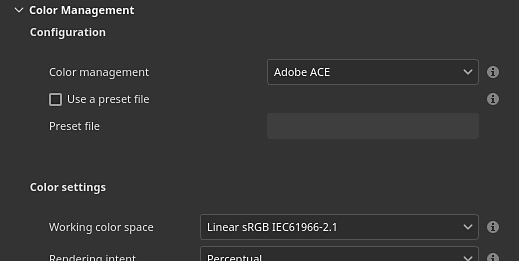{width="400px"}

  ACE comes with the following working color space:

  * **Linear sRGB**
  * **ACEScg**
  * **Linear Adobe RGB**
* **Monitor ICC profile support**   
  You can use your ICC profile to adjust the viewport look and make your colors match your monitor.

  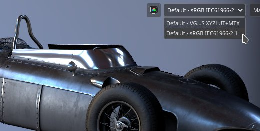{width="400px"}

* **Import and export of images with ICC profiles embedded**   
  When importing bitmaps, the ICC profile can be automatically extracted. It also possible to override that profile in the layer properties.  
  When exporting it is possible to specify the intended ICC profile that will be embedded in the texture files.

  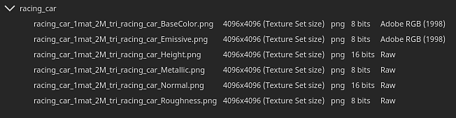{width="400px"}

* **New json template settings** To share and re-use settings across projects it is possible to specify a preset file. To know more about the preset specifications, see the [dedicated documentation](../../features/color-management/color-management-with-ado/color-management-with-adobe-ace-icc.md).

>[!NOTE]
>
> For more information, see the [color management](../../features/color-management/color-management.md) documentation.

### New physical size support for Substance materials

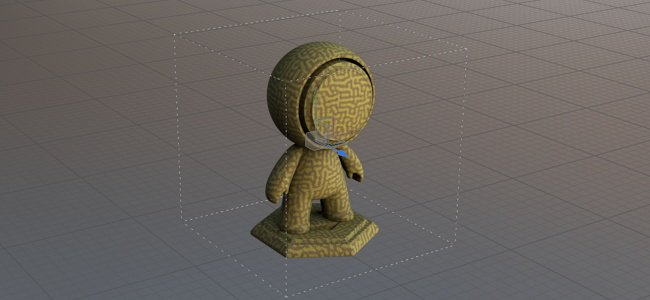

The size inside Substance materials can now be used to drive their scale and tiling inside fill layer projections. This is a useful tool to match properly materials on surfaces according to their real size without the need to guess.

* **New fill layer parameters**   
  A fill layer (or effect) there are new parameters to control the tiling/repetition of a material if it has a physical size defined. These new parameters are only available with 3D projections.

  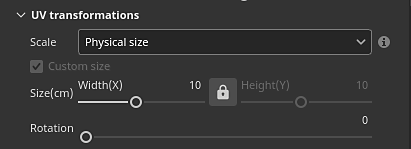{width="400px"}

* **New viewport grid**   
  To make the physical size easier to understand and visualize, it is now possible to activate a grid in the 3D viewport via the [Display settings](../../interface/display-settings/display-settings.md) window.  
  Once enabled the grid will be automatically subdived based on the level of zoom. The grid unit is indicated in the bottom left of the viewport.

  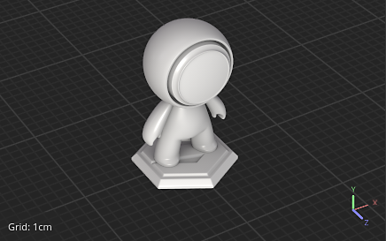{width="400px"}

  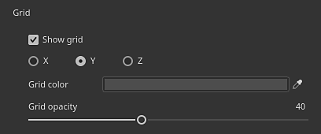{width="400px"}

>[!NOTE]
>
> For more information, see the [dedicated documentation](../../features/physical-size/physical-size.md).

### New bakers

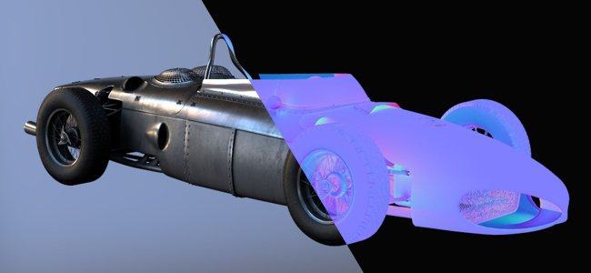

These three new additions close the gap between Designer and Painter to extend the texturing and rendering possibilities.

They have been added to the baker list, however they are disabled by default:

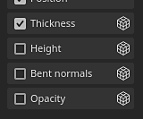

The new bakers are:

* **Bent Normals baker**The Bent Normals baker allows to bake an occlusion direction (as a vector, similar to normal maps). This texture can be used to improve the shading in the viewport by enabling the **Bent Normal** setting in the [Shader settings](../../interface/shader-settings/shader-settings.md) window. Bent Normals greatly improve the accuracy of the real-time viewport shading.   
  For **diffuse shading**, it gives a more accurate occlusion and can even look like an approximate global illumination (first example below).  
  For **specular reflections**, it allows to simulate self-shadowing and reduce the amount of light leaking, making the object feel much more grounded especially with metallic surfaces (second example below).

  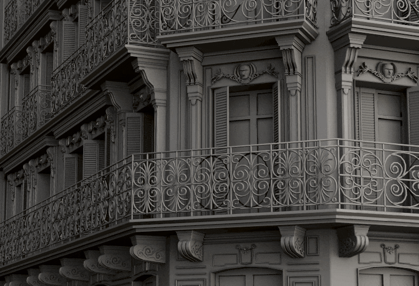{width="350px"}

  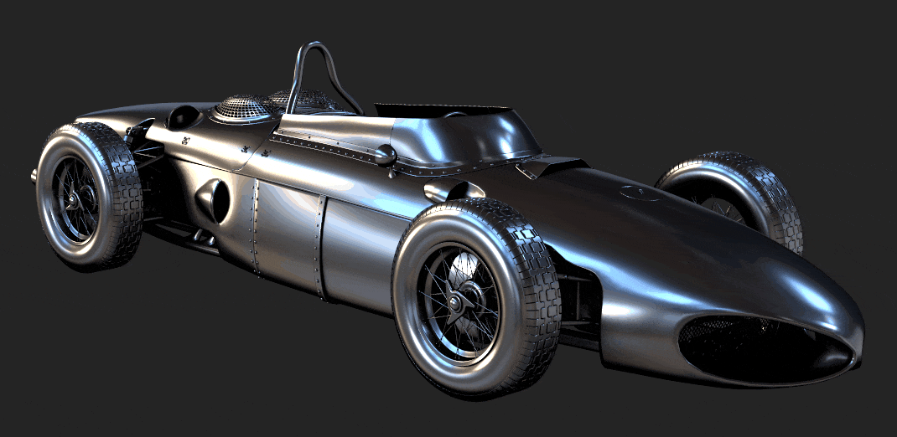{width="400px"}

* **Height baker**   
  The Height baker allows to bake the difference between the low and high-poly mesh as a grayscale texture which could then be used to produce displacement on tessellated meshes. For example when baking scan information against a plane.

  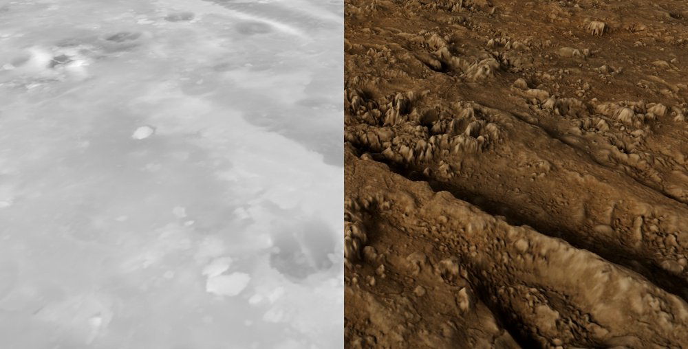{width="400px"}

* **Opacity baker**   
  The Opacity baker produces a black and white map that shows holes from a high-poly mesh. For example it can be used to bake fences or even holes inside a fabric surface.

### New content

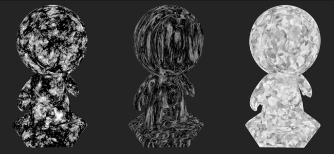

A variety of new content has been added in this release, including:

* **New and improved 3D noises with more than 100 presets**   
  The existing 3D noises have been reworked and three new ones have been added. Each of them now include predefined settings which brings a total of 105 presets across 7 noises. These presets can be used as a starting point to fiddle with their parameters and get a specific look. As always with 3D noises, they are seamless and can very easily repeat without a noticeable pattern.  
    
  To find the 3D noises, simply go to the procedurals section of the Asset panel:

  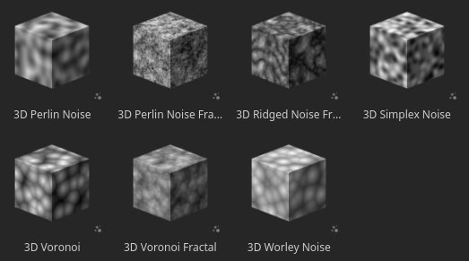{width="400px"}

  The noises provide a very wide range of possibilities, here are for example the presets available with the **3D Voronoi Fractal**:

  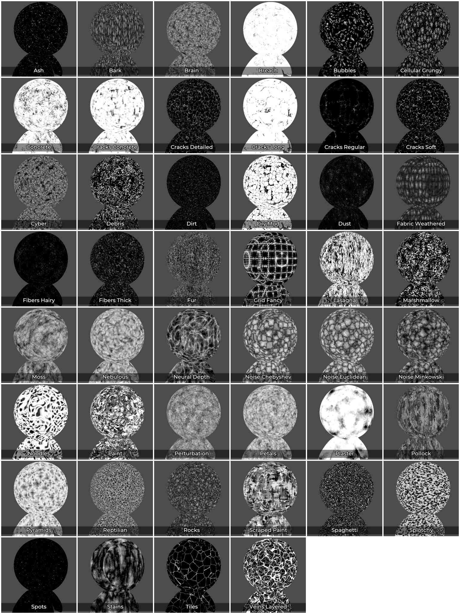{width="300px"}

* **20 new grunge bitmaps and 2 cloth patterns**   
  A new set of grunges has been added with the default content to expand the existing range of patterns. They can be found under **Procedurals &gt; Grunges Bitmap**.   
  Two cloth patterns are also available under **Procedurals &gt; Fabric**.

  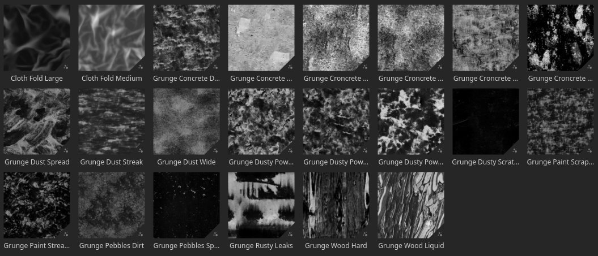{width="400px"}

>[!NOTE]
>
> Some of the 3D noises can take a few seconds to compute during their first usage.

### Improved eyedropper and material picker

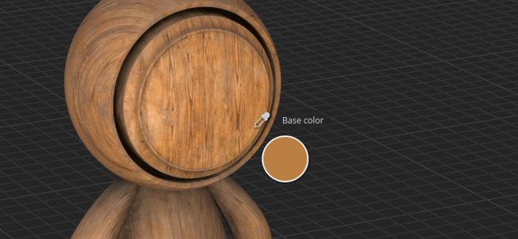

Several improvements have been made to the eyedropper to make extracting and managing colors easier.

* **New picking mode**   
  When picking colors, it is not necessary to press and maintain the mouse click anymore while moving the mouse. Now it is possible to single click the eyedropper, move the mouse to the desired location and click again to capture a color.

* **New eyedropper buttons**   
  Next to color buttons there is a new eyedropper icon that can be used to capture colors without having to open the color picker first.

  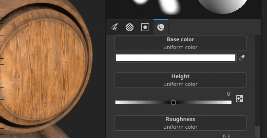{width="400px"}

* **New eyedropper keyboard shortcut**   
  When the color picker window is open, you can also press **I** to enter the eyedropper mode without needing to click the dedicated icon, which makes it easier to quickly iterate between picking and painting.

* **New preview while eyedropping**   
  When using the eyedropper to pick a color, a new preview is not visible next to the mouse. This preview is also color managed.

  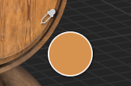

* **New picking directly into a channel**   
  With the new eyedropper behavior it is now possible to directly pick into a channel on the mesh. To do so simply press and maintain SHIFT to pick a color directly form the channel. The channel is determined from where the eyedropper has been started. This method bypass any color transformation which is important with color management to retrieve accurate colors. A tooltip will appear to indicate from which channel the color is captured.

  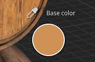

* **New color space settings when capturing a color**   
  When color management is enabled, a new setting is available in the color picker to specify the color space used when capturing colors. This setting is global to the session of Painter and will apply as well to the eyedropper button next to the color buttons in the properties window.

  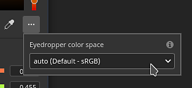

* **Improved material picker behavior**   
  The material picker from the Tools toolbar (keyboard shortcut P) now respects the channel selection inside the properties window. It will no longer enable by channels itself.

  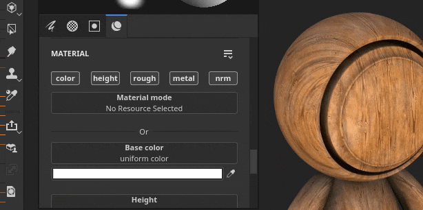{width="400px"}

### Improved automatic unwrapping

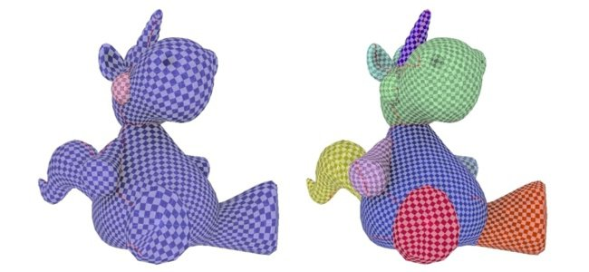

The automatic UV unwrapping process now provides a more natural segmentation.

Now meshes are cut into separate UV islands using a method comes closer to what can be done by hand, especially on organic meshes.

## Release Notes

### 8.1.0

*(Released June 07, 2022)*

**Added:**

* &#91;Color Management&#93; Add support for ICC profiles with Adobe Color Engine (ACE)
* &#91;Color Management&#93; Add support for "Adobe 98 RGB" as working color space for ICC
* &#91;Color Management&#93; Allow to configure ACE/ICC settings via a configuration file
* &#91;Color Management&#93; Allow to input linear color values in Color Picker with Legacy mode
* &#91;Color Management&#93; Allow to specify the color profile used for picking color outside the UI
* &#91;Color Management&#93; Remember the last Display value chosen in the viewport
* &#91;Color Management&#93;&#91;Substance&#93; Make generators/filters work properly with Color Management
* &#91;Color Management&#93;&#91;Substance&#93; Add new colorspace override keywords $working and $standardsrgb
* &#91;Physical Size&#93;&#91;Engine&#93; Extract physical size info from mesh
* &#91;Physical Size&#93;&#91;Engine&#93; Physical size computation
* &#91;Physical Size&#93; Expose options to use physical size in the UI
* &#91;Physical Size&#93; Add visual helpers in the viewport
* &#91;Baking&#93; Add Height baker
* &#91;Baking&#93; Add Bent Normals baker
* &#91;Baking&#93; Add Opacity baker
* &#91;Eye Dropper&#93; New color picker preview
* &#91;Eye Dropper&#93; Color picker panel reappears at its last position when reopened
* &#91;Eye Dropper&#93; A new icon for the Material Picker
* &#91;Eye Dropper&#93; Color manage the channel preview of the color picker
* &#91;Eye Dropper&#93; Add click-to-select functionality to the eyedropper
* &#91;Eye Dropper&#93; Material picker no longer activates non-active channels
* &#91;Eye dropper&#93; Allow to use eyedropper with a shortcut
* &#91;Eye dropper&#93; Eyedropper picks up the relevant channel, when applicable
* &#91;Eye dropper&#93; Entering the color picker mode deactivates all shortcuts
* &#91;Eye dropper&#93; Remove auto selection of the hex field
* &#91;Eye dropper&#93; Don't close the panel when using the material picker
* &#91;Eye dropper&#93; New disabled state when channel is unavailable to pick
* &#91;Export&#93; Add tangent attribute to glTF export
* Update Substance Engine to v8.4
* Update Auto Unwrap to 0.9.0
* Update to Qt 5.15.8
* Update to Python 3.9
* &#91;Shader&#93; Add support for Bent Normals shading
* &#91;MacOS&#93; Support of 3DConnexion SpaceMouse
* &#91;Python&#93; Document the Python version used in the API
* &#91;Content&#93; Add 6 new 3D noises with 105 presets
* &#91;Content&#93; 20 new grunge maps and 2 cloth folds patterns
* &#91;Content&#93; Update "Mesh maps" export preset to use new bakers
* &#91;Content&#93; Blur Slope and warp filter depends on texture set resolution
* &#91;Content&#93; Update sample projects to use the 3 new bakers

**Fixed:**

* &#91;glTF&#93; Cannot open glTF with special character
* &#91;Engine&#93; Artefacts with anisotropy and SVT disabled
* &#91;MacOS&#93;&#91;M1&#93; Smart materials are not displayed correctly
* &#91;Mesh Processing&#93; Cannot import meshes from Modeler
* &#91;UI&#93; Horizontal scrollbar in new project window with Color Management enabled
* &#91;Color Management&#93; Working space value missing in color picker with some OCIO configs
* &#91;Color Management&#93; Brush preview in the viewport is not color managed
* &#91;SpaceMouse&#93; Pivot is not updated immediately with focus change and sometimes out of the model
* &#91;Export&#93;&#91;USD&#93; Exported USD files have a wrong structure
* &#91;USD&#93; Ambient Occlusion issue when exporting
* &#91;Content&#93; Update thumbnail's mesh to match Preview Sphere sample project

**Known Issues:**

* Export textures using diffusion padding renders black maps
* Normal/Ambient Occlusion mixing is broken
* &#91;MacOS&#93; Crash when launching Iray in some rare cases
* &#91;Preview Thumbnail&#93; Simplified thumbnails aren't updated when an anchor is used
* &#91;Color Management&#93; HDR color space conversions with ACE on Linux produce clamped colors
