# Version 8.2

**Substance 3D Painter 8.2** focuses on a lot of quality-of-life improvements with dedicated features in several areas of the application.

Release date: *6 October 2022*

## Major features

### New options to apply blending modes and opacity

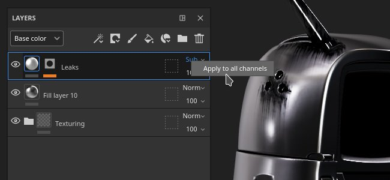

Several shortcuts and actions have been added to make it quick and easy to copy and apply blending modes and the opacity across multiple channels in the Layer Stack.

* **Right-click on a blending mode or opacity control**   
  When right-clicking on a blend mode or an opacity, select the action **Apply to all channels** to use this blend mode on all the other channels of the layer. This action is also available on effects that have blend mode and opacity controls.

  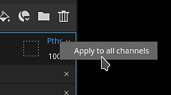

* **Right-click on a layer and choose Blending options**   
  It is also possible to right-click on a layer (or effect) and choose one of the following actions:

  * **Apply blending to all channels**: apply the current channel blending mode to all the other channels of the current layer/effect.
  * **Apply opacity to all channels**: apply the current channel opacity to all the other channels of the current layer/effect.
  * **Apply both to all channels**: apply the current channel blending mode and opacity to all the other channels of the current layer/effect.
  * **Copy channel blending settings**: Copy all the blending modes and opacity values of the current layer/effect to clipboard.
  * **Paste channel blending settings**: Apply the blending modes and opacity values currently in the clipboard to targeted layer/effect.

  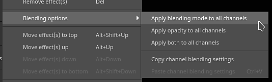

### New blending mode and opacity on filter and color selection effects

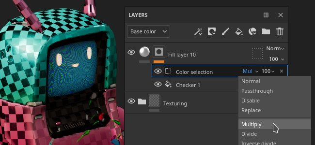

Filter and color selection effects now have the possibility to use blending modes and opacity controls.

* **Blending mode and opacity on filters**   
  Filters can now use blending modes and opacity values. They default to **Replace** in order to retain the same behavior as before and avoid doubling the alpha component information. Blending modes on filters allow to compute effects and combine their results directly on layers, avoiding the need to use anchor points and fill effects to achieve the same result. This also avoid the need of manually implementing blending modes inside the filter itself.

  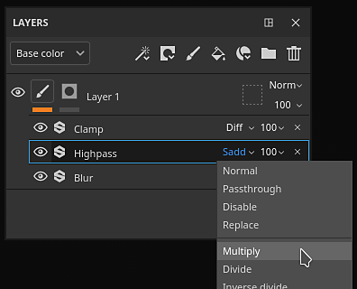

* **Blending mode and opacity on color selection**   
  The color selection effect has been modified to support blending modes and opacity controls. Previously this effect was outputting an alpha result, and in order to make blending modes work as expected, a new setting has been added to specify the background color that is being output. It is set to black instead of transparent (which is the legacy behavior).

  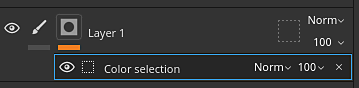

  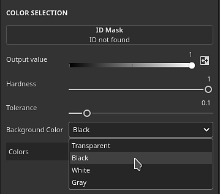

* **Simplified effect stack**   
  Previously when there was a need to combine effects in a certain ways (with the help of blending modes, for example), using anchor points and fill effects was a necessity. Now with blending modes directly on filters, it is no longer necessarily which can significantly reduce the effect stack complexity.

  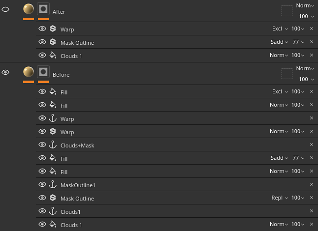{width="400px"}

### New effects on folders

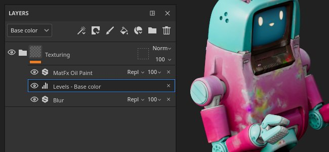

Folder content (the color part of a layer) can now receive effects of any kind. Before it was necessary to create complex layer configurations (like passthrough layers or anchor points) to achieve the same result.

### New Substance archive (SBSAR) export

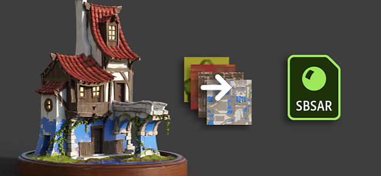

Substance archive (SBSAR) file format is now available when exporting textures. An SBSAR is a container that can be opened in many applications with Substance integration, which can make it faster and easy to 'plug-and-play' custom textures.

* **Exporting a Substance archive (SBSAR)**   
  It is now possible to specify the SBSAR file format from the list of file formats in the **Export Textures** window. This will export a single SBSAR file containing all specified textures. The naming of output nodes and their usages is defined from the selected export preset and its channel types.

  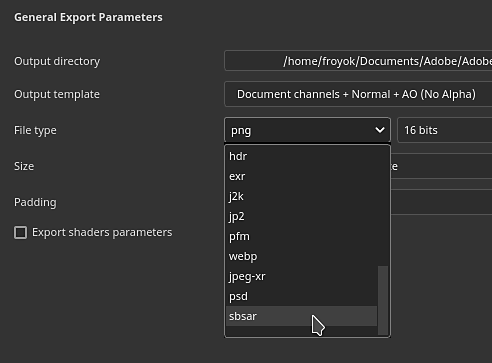

* **Hybrid export presets with PSD and SBSAR file formats**   
  Export presets can now specify output maps as PSD or SBSAR in addition to all other image formats. PSD and SBSAR formats are considered as "containers", meaning that multiple textures can be stored inside. When an export preset specifies both container formats and standalone image formats then every output in the template that target an SBSAR file will be grouped together while the other outputs will be exported as individual files.

  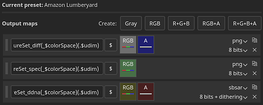

### New environment option to light up underneath 3D models

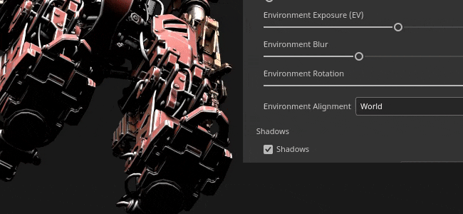

A new setting inside [Display Settings](../../interface/display-settings/environment-settings/environment-settings.md) allows to align the environment map to the camera making it possible to adjust the lighting angle and light up parts below the 3D model.

To use this new setting, go to [Display Settings](../../interface/display-settings/environment-settings/environment-settings.md) and change **Environment alignment** setting:

* **World**: the environment map is aligned to the scene.
* **Local**: the environment map is aligned to the camera.

Shadows will automatically adjust based on the configuration of this setting.

### New Favorites and delete/reload in Assets window

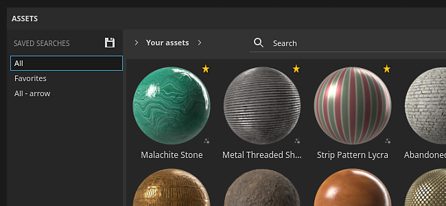

New actions have been added to the [Assets](../../interface/assets/assets.md) window to make management of resources more convenient.

* **Favorite resources to quickly find them**   
  Right-click on any resource in the Assets window to favorite (or un-favorite) it. Favorite resources always appear first in line in search queries with a little star tag in the corner, making them stand out and accessible. A dedicated search query has been added as well, making it easy to view all your favorite resources.

  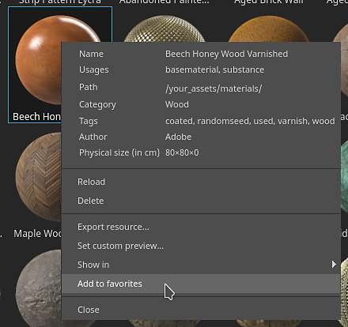{width="350px"}

* **Delete and reload resources on disk**   
  Resources located in user libraries can now be deleted, reloaded or renamed (except for resources part of a package, like Substance graphs or ABR brushes).

### Miscellaneous features and improvements

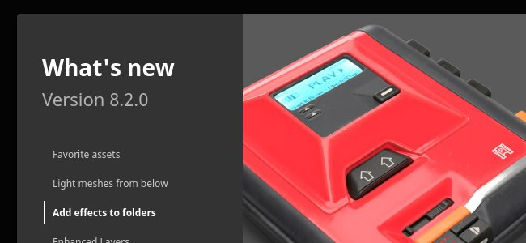

A lot of small additional improvements and features have been added in this new version:

* **New Welcome and What's new window**   
  To stay informed about new features added to the application we now introduce a new Welcome and What's new window when launching the application. Those window can be easily closed and won't reappear upon next launches. It is always possible to re-open them via the **Help** menu.

  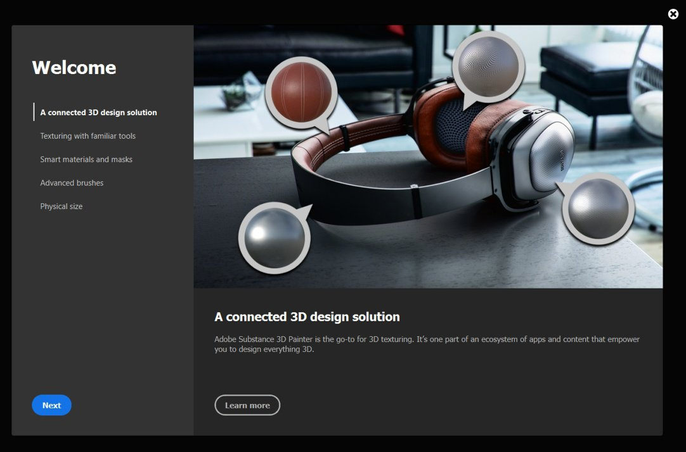{width="400px"}

  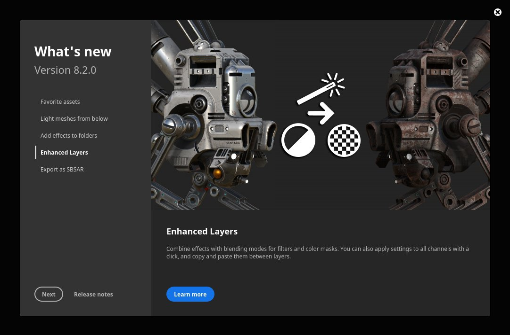{width="400px"}

* **New action to quickly re-import a 3D model**   
  A new keyboard shortcut (**CTRL+SHIFT+R** by default) has been added and allows to quickly re-import the 3D model of the current project. This makes iteration on an asset easier and faster. If the source file cannot be found, an error message will be raised in the log. An action has also been added to the **Edit** menu.

  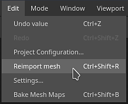

* **Improved HDPI support**   
  Several fixes have been made regarding HDPI screens and system scaling. We now support intermediate scaling values (ex. 125%) which should avoid the interface being too big or too small on certain screens. Moving windows between HDPI screens with different scaling values should also behave correctly.

* **Reset Substance graph parameters to default**   
  Everywhere a Substance graph is used (as an alpha, materials, filter, etc.) it is now possible to reset its parameters to default.

  * **Reset all parameters**: Use the restore defaults button below the list of parameters to reset the whole Substance resource.
  * **Right-click**: Right-click on a specific parameter to open a menu with a reset action specific to this parameter.

  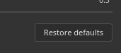 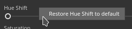

* **View individual RGBA components in viewports**   
  When looking at a channel in the viewports, there is a new setting named **Color channels** under **Display Settings &gt; Channel display** that allows to look at RGBA componenst individually. This can be useful to analyze textures or isolate specific components within user channels.

  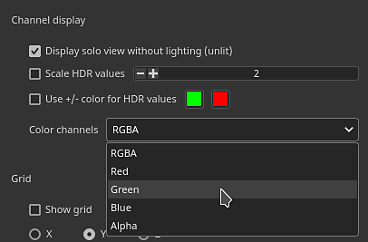

  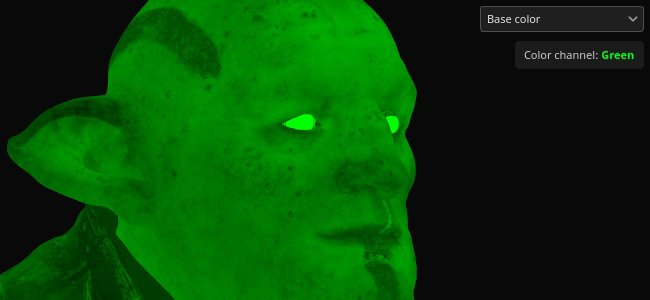{width="450px"}

* **Tiling fill layers and effects beyond 128**   
  The tiling parameter of fill layers and effects has been modified to have a soft range. This makes it now possible to type any desired tiling value. The default range of the slider has also been reduced from &#91;-128,128&#93; to &#91;-32,32&#93; to make it easier to drag.

  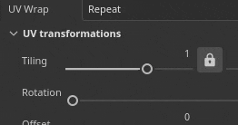

* **New 16f and 32f EXR texture export setting**   
  Previously, EXR texture export was forced to 32f bit in the interface but inside the actual file it would result in 16f bit data (half-float). It has now been fixed, and there is an explicit possibility to choose between 16f and 32f bits. Old projects and export presets using EXR as their file format will default to 16f bits to respect the old behavior (mostly to avoid producing heavier files than before).

  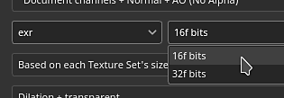

* **Export and reload UI layouts**   
  New actions to save and reload the UI layout can be found inside the **Windows** menu. This makes it more convenient to switch between different layouts, or save and re-use a UI across computers. The two current Painter modes - Rendering and Painting - have their own layouts. A few functions are also available in Python to allow to save and reimport UI layout (see below).

  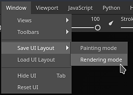

* **Re-organized file menu**   
  We decluttered the file menu by grouping together several advanced save functionalities. Some of these actions have also been renamed to clarify their behavior.

  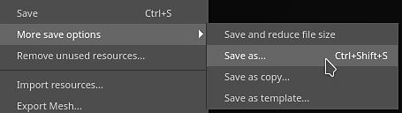

* **Improved error message when opening projects that are too recent.**   
  A more helpful message is now displayed when opening projects made with a newer version of the application. The message now includes both project and application versions, which allows to be better informed about the required version.

  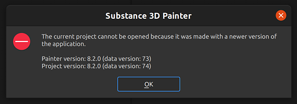{width="400px"}

### Improved Python scripting

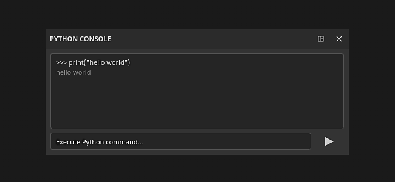

Several new functionalities have been added to the Python API. For full details, take a look at the documentation available in the Help menu of the application.

* **substance\_painter.resource**   
  **substance\_painter.resource.Type** now allows to identify more kinds of resources, notably Substance and Photoshop brush packages.  
  Resource objects can now list their parent and children, allowing to navigate between Substance packages and Substance graphs, for example.

* **substance\_painter.textureset**   
  Two new functions (and an enum) have been added to get and set mesh maps in Texture Set settings: **get\_mesh\_map\_resource()** and **set\_mesh\_map\_resource()**.

* **substance\_painter.ui**   
  Several functions have been added to save and reload the UI layout. Note that the layout depends as well on the current application mode (Painting or Rendering).

* **substance\_painter.event**   
  A new **TextureStateEvent** has been added to help track modification in layer stack of Texture Sets as well as other parameter changes. This event triggers on paint strokes or addition/removal of channels.

## Release Notes

### 8.2.0

*(Released: October 06, 2022)*   
Summary: **Major release with new onboarding panels (new welcome panel and what's new panel), export to SBSAR, effects for folder, several improvements for quality of life and bug fixes.**

**Added:**

* &#91;Onboarding&#93; Onboarding panel to welcome new users

  Added a new Welcome screen when new CC users open Painter for the very first time.
* &#91;Onboarding&#93; What's new panel to improve new features discoverability

  Added a new What's New screen which displays main new features. It is shown automatically the very first time Painter is opened after a major update, and can be accessed again via Help &gt; What's new.
* &#91;Onboarding&#93; Rename old Welcome to "Home screen"

  Old Welcome screen renamed Home screen to avoid confusion with the new Welcome screen.
* &#91;UI&#93; Resolve scaling issues for high-DPI screens

  Improved Painter UI adaptation on high definition screens with custom display scaling.
* &#91;UI&#93; Avoid persistent error messages in the UI

  Error messages from previous projects are now removed from the bottom status bar.
* &#91;UI&#93; Rework save menu

  Additional save options are now grouped in a submenu and some are renamed for consistency.
* &#91;UI&#93; Save and Export/Share UI layouts

  Inside the Window menu are new actions to save the UI layout into files and to reload them. The Painting and Rendering layouts are saved separately.  
  Various functions have been added to "substance\_painter.ui" to save, reset and load UI layouts as well.
* Add copy/paste actions for blending modes/opacity of a layer

  Added a new entry 'Blending options' in layers' right-click menu. It allow to copy and paste the blending mode and opacity of all channels from one layer to another.
* Apply blending mode/opacity to all channels of a layer

  Added a right-click functionality to layers' blending mode and opacity which allows to apply the currently clicked setup to all channels.
* Reload mesh with a keyboard shortcut (CTRL+SHIFT+R)

  Added an editable shortcut to reload the mesh file with last available settings. Can also be accessed via Edit &gt; Reimport mesh.
* Reset Substance parameters to default

  Added a new button in Properties at the bottom of .sbsar resources which allows to reset the resource to defaut.
* Reset paint brush to default

  Added a new menu to the Brush section in Properties which allows to reset to default basic brush.
* Right click to reset individual Substance parameters to default

  Added the possiblity to reset individual parameters within an .sbsar resource via right-click.
* &#91;Assets panel&#93; "Pin" favorite assets to appear on top of asset panel

  Added a new right-click option to library assets that allows to pin them as favorites to the top of the panel. You can also view all your favorite assets via Saved Searches.
* &#91;Assets panel&#93; Delete, reload and rename assets

  Added right-click menu options to delete, reload and rename assets in the user library. They are deleted directly from their library location on disk and reloaded from original location. Assets that are part of a package like .abr or .sbsar cannot be edited individually.
* &#91;Color Selection&#93; Add blending modes to Color Selection effect
* &#91;Layer Stack&#93; Add blending mode and opacity on filters
* &#91;Layer stack&#93; Allow tiling values bigger than 128 for fill layer/effects
* &#91;Layer stack&#93; Cylinder caps for cylindrical projection in fill layer/effect

  Cylindrical projection in Fill layer properties now has the option to remove cylinder caps.
* &#91;Log&#93; Show an error message if mesh part are in negative space when trying to create a UV Tile project

  Added a clearer error message when failing to create a UV Tile project because UV parts are found in negative spaces.
* &#91;Project&#93; Indicate version in error message "data too recent" when opening a project

  When opening a project that is too recent for the the application, the error message will now indicate the version of the project to make it easier to identify the right application version.
* &#91;Viewport&#93; Allow to light the mesh from underneath

  Added a new Environment Alignment parameter in Display Settings &gt; Camera &gt; Environment settings to align the environment map lighting to the camera when set to "Local".
* &#91;Viewport&#93; View R, G, B and Alpha in viewport (solo display mode)

  Under Display Settings &gt; Viewport Settings &gt; Channel display there is a new Color channels setting that allows to only display the R, G, B or Alpha component of a channel when in single display mode.
* &#91;Shader&#93; Allow to set User channels as RGBA in Material Layering shaders

  When settings the Texture Set channels configuration inside a shader for material layering, it is now possible to specify the format of the channel to deviate from the default value. This allow notably to request color user channels instead of grayscale only.
* &#91;Export&#93; Allow to export textures as SBSAR

  When export textures via the File &gt; Export Textures window the SBSAR (Substance Archive) file format can be chosen to regroup them together. The content of the SBSAR is driven by the output template used.  
  The SBSAR file format can also be set in the export presets. When using hybrid configuration (SBSAR + Other format) textures that target an SBSAR are grouped together while the rest is exported alongside.
* &#91;Export&#93; Expose 16bit option for EXR file format

  When exporting EXR texture files, it is now possible to chose 16f bit (Half-Float) or 32f bit (Float) in the Export Textures window (both for export settings and export presets). Old projects and old export presets will default to 16f bit to reflect the old behavior.
* &#91;Python&#93; Add event to know when Texture Sets are modified

  The new "substance\_painter.event.TextureStateEvent" allows to know when a Texture Set has been modified either because of a paint stroke, a new channel added or a channel removed.
* &#91;Python&#93; Allow to get and set Mesh Map resources in Texture Set settings

  New functions have added in "substance\_painter.project" module to get and set mesh maps resources. These functions can be used to update the mesh maps referenced by the Texture Set settings.
* &#91;Plugins&#93; Remove option to get other JS plugins

  Removed the option to get Javascript plugins since they were hosted on the depricated Share website.
* &#91;Content&#93; Add new Roblox template and export preset

  A new Roblox "Material Variant" and "Surface Appearance" project template and export preset have been added to make it easier to export PBR texture to Roblox. The template can be accessed via the File &gt; New project window.
* Update Substance Engine to last version (8.6.3)
* &#91;Steam&#93; Optimized build for Apple Silicon chipset (Apple M1 / M2)

**Fixed:**

* Crash when using 16k exr
* &#91;Crash&#93; Ctrl Z After deleting a shader instance
* &#91;Iray&#93; IoR is blocked to 1 for some shaders
* &#91;Win&#93;&#91;Baking&#93; Some high poly fail to load
* &#91;Color Management&#93; Incorrect color space name in UI with filters
* &#91;Python&#93; Resource objects returned by import function don't have a type

  When importing Substance package in Python the function was returning the package instead of its graph(s). The resource module now provide functions and parameters to retrieve the graph(s) of a Substance package.

**Known Issues:**

* &#91;Color Management&#93; HDR color space conversions with ACE on Linux produce clamped colors
* &#91;Layer Stack&#93; Input source not saved per layer
* &#91;Painting&#93; Temporal anti aliasing causes artifacts when painting in some cases
* &#91;Export&#93; 2DView exports randomly uniform map
