# Version 8.3

**Substance 3D Painter 8.3** introduces a brand new baking mode, USD files import and support for physical size in UV projection mode.

Release date: *10 January 2023*

## Major feature

### New baking mode

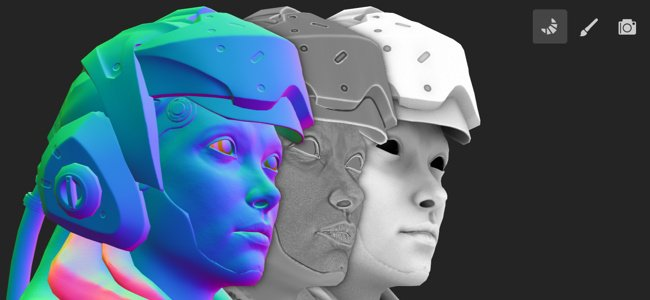

The old baking window has been replaced by a dedicated mode with several new features, notably with viewport visualization such as the display of the cage and matching errors.

* **Accessing and switching between modes**   
  Baking is now a new and separate mode in addition to the already existing painting and rendering modes of the application. To get to the baking mode, simply use the little croissant icon in the contextual toolbar. Switching between modes can also be done otherwise: by using the mode menu or the keyboard shortcuts. To get back to another mode, simply use the dedicated icon of the mode (Additionally, the **Bake Mesh maps** button inside the [Texture Set settings](../../interface/texture-set/texture-set-settings/texture-set-settings.md) can still be used to get into the new mode).

  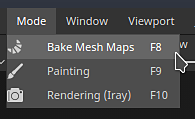

  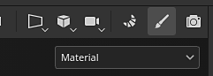

* **New mode interface**   
  The traditional baking window has been transformed into a mode with dedicated docks, notably:

  * **Texture Set list** can be used to define which parts of the project will be baked.
  * **Mesh Map Bakers** allows to select between the common baking settings and the baker settings. It is also where you can specify which baker process will be launched.
  * **Mesh Map Settings** is where all the baker and common settings are located and can be modified, depending on the selection from the two previous window.
  * **Baking Log** regroups different information about the baking process, notably error messages.
  * **Baking visualization**: this panel sits in the viewport and controls several options related to the display of the low and high poly meshes.

  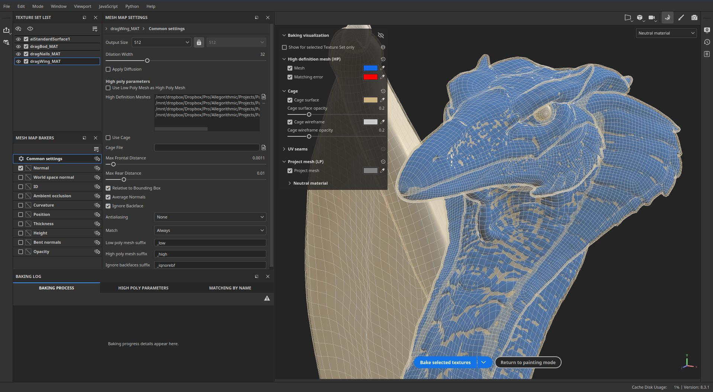{width="500px"}

* **Start and cancel the baking process directly from the viewport**   
  The button to launch or cancel the baking process now sits at the bottom of the viewport. A little arrow can also be used to specify the baking mode: based on the Texture Set list selection or by using the currently active Texture Set.

  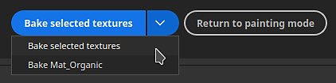

  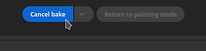

* **Display high-poly mesh in viewport**   
  When specifying a high-poly mesh in the baking settings, it will now be loaded in the viewport as well (unless the dedicated visualization setting is disabled). This allows to check whether the low and high poly mesh geometry match well.

  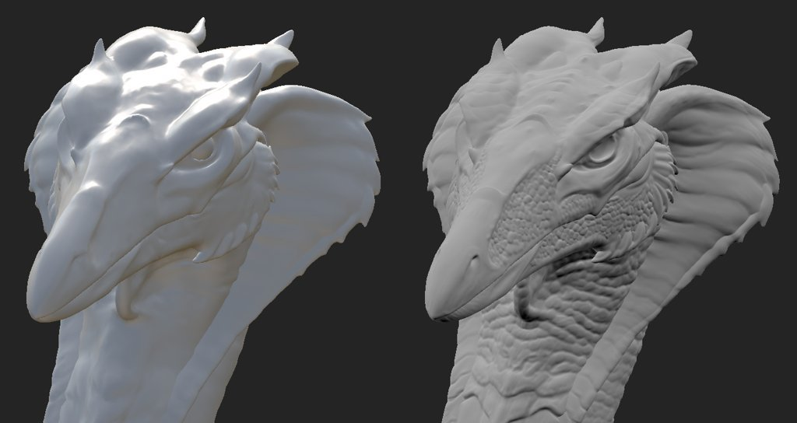{width="400px"}

* **Display cage mesh in viewport with missed areas as error**   
  The cage mesh can also be displayed in the viewport. When not using a dedicated mesh file, an implicit cage will be displayed instead and it will react to the Max Frontal Distance parameter. When adjusting the cage size, any part of the high-poly mesh that is outside the cage will be shown as red by default, allowing to easily find part of the mesh that will be missed by the baking process.

  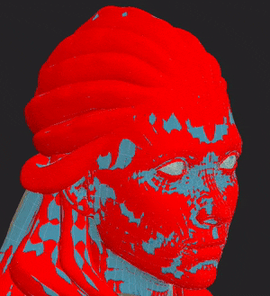

* **Look around mesh while loading and baking**   
  Loading meshes and baking no longer freezes the application, meaning it is possible to interact with the viewport during those operations. This can be useful to investigate the baking in progress, identify issues early and cancel the bake, helping save time in the end. Similarily, the most visible Texture Set in the viewport will now be baked first which will help check out results on specific areas in advance.

  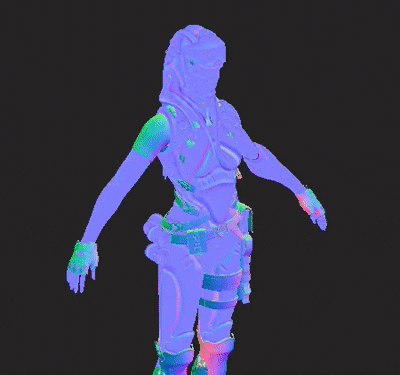

* **Neutral material and viewport settings**   
  To help focus on the baking results and look for issues if any arise, the baking mode doesn't display painted textures, instead using a neutral material. This neutral material's settings can be adjusted in the Baking visualization panel inside the viewport.

  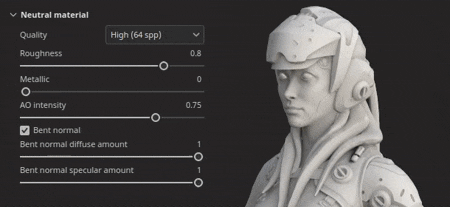

* **Display hard edges with missing UV seams**   
  One source of artifacts when baking is the presence of hard edges that don't have UV seams. This can lead to visible lines and break the smoothness of shading. For this purpose, a visualization settings has been added to highlight them both in the 3D and 2D view as they are very easy to miss otherwise.

  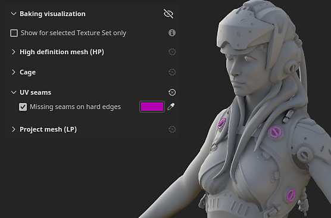{width="450px"}

  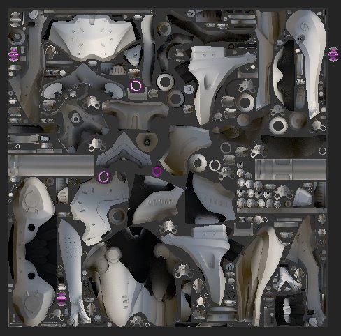{width="300px"}

* **Synchronize and unsynchronize parameters**   
  The new sync action allows to specify which part of the Baking settings are synchronized across Texture Sets. Otherwise it would be tedious to configure settings multiple times in identical ways. Sometimes it is useful to have Texture Sets with dedicated settings and keeping them unsynchronized is preferred. For example, keeping the Common settings separated now allows to use a Max Frontal Distance, Resolution and/or list of high-poly meshes which would be different per Texture Set.

  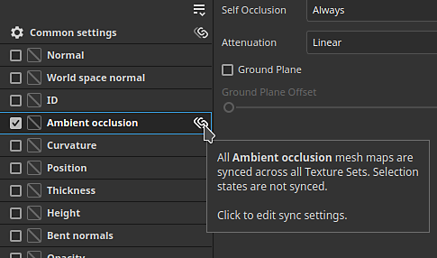{width="400px"}

  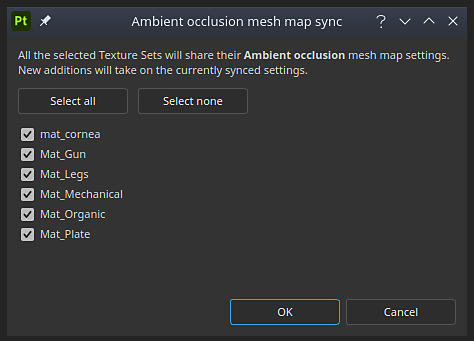{width="400px"}

* **Matching by name checker**   
  The **Matching by name** tab in the **Baking Log** can help find errors in the matching process before baking, making it easier to notice meshes that won't match. Meshes that match are grouped together while other will be isolated and displayed in red.

  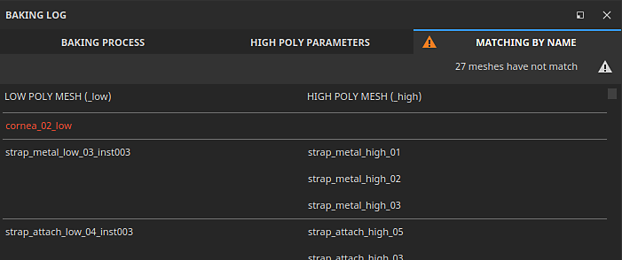{width="450px"}

>[!NOTE]
>
> There are many more new settings in this new mode. To learn more about see the [dedicated documentation page](../../baking/baking.md).

### New import and export of USD files

This new version adds the support of the [Universal Scene Description (USD)](https://graphics.pixar.com/usd/release/intro.html) file format. It is now possible to start a Painter project, exporting meshes and textures using a USD format, which makes for a more consistent workflow across applications.

* **Import USD file with variants, skinning and at a specific frame**   
  A USD file format can be used when creating a project or re-importing a mesh inside a project. USD files can often be complex scenes, therefore a scope and variant selector is also available to only import a subset of the file.

  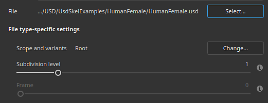{width="400px"}

  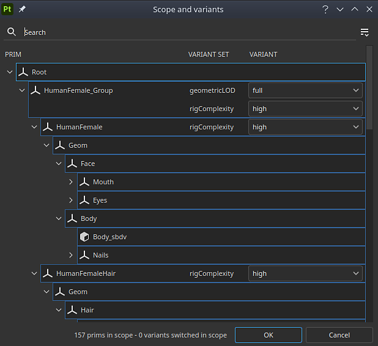{width="400px"}

* **Export USD as a new file or linked to the original USD used in the project**  
  When your texturing is ready, you can use the **File &gt; Export textures** window to export your USD file alongside your texture files. Simply enable the setting **Export USD asset** to do so. This will generate several USD files that can be easily integrated into a pipeline afterward. If you used a non-USD file or a USD-file without UVs, this will export a new USD geometry file in addition to texture maps and USD material file.   
  Additionally, it is also possible to use the **File &gt; Export mesh** to export the project geometry as a USD file.

  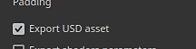

  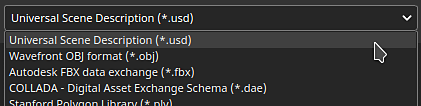{width="400px"}

### Improved support of physical size in UV mode

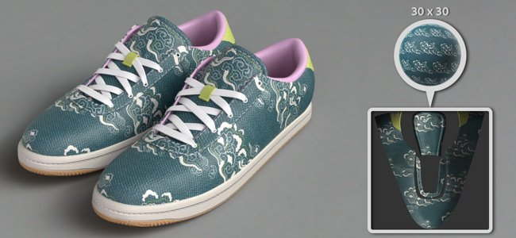

Support of Substance materials with embedded physical sizes has been extended to UV based projections.

* **Physical size in UV mode**   
  It is now possible to set the Scale mode to Physical size instead of Tiling in fill layer and fill effects using UV projection mode. The size of the UV is computed automatically based on the average size of the triangles from the UV unwrapping.

  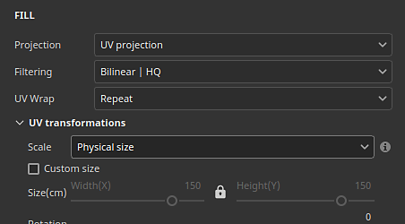{width="400px"}

* **Automatically switch to physical size**A new project setting has been added to automatically set the scale setting to physical size when creating a material (when drag and dropping a resource for the Asset window, for example). This allows to use consistent sizing across a project without having to switch settings manually every time a new Fill layer is created. To enable it in an existing project, go to **Edit &gt; Project configuration** and enable **Switch fill layer scaling to Physical size when assigning materials**. This setting can also be enabled when creating a new project.

  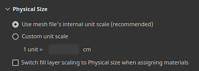

## Platform support information

With this release we raised the minimum supported version of Painter on Steam to Ubuntu 20.04.

## Tutorials

To discover and learn about the new Baking mode, check out our latest tutorial:

## Release Notes

*(Released: January 10, 2023)*   
Summary: **Major release with new baking mode, new import and export of USD files, and physical size support for UV projection**

**Added:**

* &#91;Baking Mode&#93; New baking mode dedicated to baking process
* &#91;Baking Mode&#93; Set shortcut to switch to baking mode to F8
* &#91;Baking Mode&#93; Add Start and Cancel baking button in the viewport
* &#91;Baking Mode&#93; Add baking selection in Texture Set list
* &#91;Baking Mode&#93; Add new Mesh Map Bakers window to select bakers
* &#91;Baking Mode&#93; Add new Mesh Map Settings window to edit baking settings
* &#91;Baking Mode&#93; Add new Baking Log window to follow baking process
* &#91;Baking Mode&#93; Add baking parameters and undo actions to history window
* &#91;Baking Mode&#93; Add breadcrumbs in Mesh Map Settings
* &#91;Baking Mode&#93; Add mesh maps thumbnails in the Mesh Map Bakers window
* &#91;Baking Mode&#93; Add visualization settings collapsible menu in 3D viewport
* &#91;Baking Mode&#93; Add visualization setting to show/hide the high-poly mesh
* &#91;Baking Mode&#93; Add visualization setting to show/hide the cage mesh and wireframe
* &#91;Baking Mode&#93; Add visualization setting to show/hide the low-poly mesh
* &#91;Baking Mode&#93; Add visualization setting to show hard edges without UV seams as errors
* &#91;Baking Mode&#93; Inform in viewport about mesh and bake errors if Baking Log is not visible
* &#91;Baking Mode&#93; Add action to synchronize baker settings across all Texture Sets

  In the Mesh Map Bakers window, each baker (as well as the common settings) can be synced across Texture Sets by clicking on the link icon next to their name. This action will open a window which allows to select which Texture Sets will share the same parameters.
* &#91;Baking Mode&#93; Add actions to copy and paste baker settings

  In the Mesh Map Bakers window are available actions to copy and past each baker settings across Texture Sets either via the dedicated menu at the top of the window or the right-click contextual menu.
* &#91;Baking Mode&#93; Add button in Baking Log to jump from error to the right settings

  When a baker fails or a mesh doesn't load properly, an error message appears in the Baking Log. A button next to the message allows to change the Mesh Map Bakers and Mesh Map Settings window to show the related settings. This help isolate more easily the source of an issue to be able to fix it.
* &#91;Baking Mode&#93; Add menus to manage Texture Sets and Baker selections

  In both the "Texture Set list" and "Mesh Map Bakers" window have been added a little action menu to help copy, invert selections.
* &#91;Baking Mode&#93; Split baker selection list per Texture Set
* &#91;Baking Mode&#93; Split common settings per Texture Set
* &#91;Baking mode&#93; Load high-poly and cage meshes without freezing the interface
* &#91;Baking Mode&#93; Use the viewport progress bar to show mesh loading
* &#91;Baking Mode&#93; Add mesh loading state in Baking Log
* &#91;Baking Mode&#93; Allow to turn around mesh in viewport during baking
* &#91;Baking Mode&#93; Set baking order based on current mesh viewport visibility
* &#91;Baking Mode&#93; Display implicit baking cage in viewport

  When not using a custom cage mesh file, an automatic cage mesh will be generated and displayed in the viewport. Its size will we based on the Max Frontal Distance parameter from the baking common settings. The cage mesh is used to indicate how far the matching between the low and high poly will go.
* &#91;Baking Mode&#93; Show matching list of mesh names for Matching By Name in Baking Log
* &#91;Baking Mode&#93; Use neutral material to display 3D model in viewport
* &#91;Baking Mode&#93; Disable engine computation while in baking mode
* &#91;Baking Mode&#93; Display a warning when quitting the app while a bake is in progress
* &#91;Bakers&#93; Update anti-aliasing setting labels

  The anti-aliasing setting values have been renamed to "Supersampling" and with an explicit multiplier number to clarify their behavior.
* &#91;Bakers&#93; Update bakers to version 2.5.7.
* &#91;USD&#93; Import and export Universal Scene Description (USD) files
* &#91;USD&#93; Add USD options to the New Project window when selecting a USD file
* &#91;USD&#93; Add new Scope and Variants selection window

  When importing a USD file, clicking on the change button in the New Project or Project Configuration window allow to select which part and variants of a USD file to import.
* &#91;USD&#93; Add subdivision levels option

  When creating a new project with a USD mesh file that contains subdivisions, it is possible to select the level of subdivisions using a slider. The project will be created with the subdivided mesh. The level can be modifier via Project Configuration.
* &#91;USD&#93; Import USD skinned meshes at specific frame

  When creating a new project with a USD mesh file that contains animation, it is possible to select the frame using a slider which reflects the embedded timeline sequence. The frame can be modifier via Project Configuration.
* &#91;USD&#93;&#91;Export&#93; Add an option to export USD files

  New Export USD check box added to Export textures window. When it is checked, it allows to export USD files as well as texture maps using any template.
* &#91;USD&#93;&#91;Export&#93; Add USD file format to mesh export
* &#91;USD&#93; Rename the existing "USD PBR Metal Roughness" export preset to be more explicit

  The USD export template previously known as 'USD PBR Metal Roughness' is still accessible via Export textures &gt; Output template &gt; USDz (Apple AR).
* &#91;Auto Unwrap&#93; Add Lock orientation for packing

  New option for auto-unwrap settings which allows to preserve the orientation of existing UV islands when using the packing feature. It can be accessed via New project &gt; Auto-unwrap options &gt; UV island orientation.
* &#91;Physical Size&#93; Add setting to automatically use Physical Size in fill effect/layer

  A new option to automatically switch to physical size scale when using a material with embedded physical size has been added. It can be enabled per project via New project or via Edit &gt; Project configuration &gt; Physical size &gt; Switch fill layer scaling to Physical size when assigning materials.
* &#91;Physical Size&#93; Expose physical size for UV projection

  Physical size scaling is now available for UV projections - it enable auto-resizing for a material based on the physical size of a mesh. It can be selected via Scale &gt; Physical size in the Fill layer or effect Properties window.
* &#91;Scripting&#93;&#91;Python&#93; Allow to query the application version
* &#91;Scripting&#93;&#91;JavaScript&#93; Update API to match new baking parameters
* &#91;Scripting&#93;&#91;Python&#93; Baking module: edit baking parameters
* &#91;Scripting&#93;&#91;Python&#93; Baking module: launch/cancel baking
* &#91;Scripting&#93;&#91;Python&#93; Baking module: select curvature method
* &#91;Scripting&#93;&#91;Python&#93; Baking module: selection of bakers/uv tiles
* &#91;Scripting&#93;&#91;Python&#93; Baking module: synchronize baker settings across all Texture Sets
* &#91;SVT&#93; Enable sparse hardware support on AMD GPUs

  Hardware acceleration for the Sparse Virtual Textures system can now be enabled with AMD GPUs. This setting is automatically enabled in the general preferences.
* &#91;Projection&#93; Rename Cylindrical projection parameters

  The parameter "Cylinder Cap Culling" has been renamed to "Backface Culling" to better represent its action. The associated tooltip as been adjusted accordingly.
* &#91;Project&#93; Save application version in project and retrieve it via scripting

  Since version 8.2, the version of the application is now stored inside the spp file when saving.  
  This version number can be retrieved with the function last\_saved\_substance\_painter\_version() in the project module of the Python API.  
  For project made before 8.2, the returned value will be null.
* &#91;Import&#93; Improve general import time of 3D models

  We improved the general import time of meshes. For example reducing the waiting time when loading high-poly meshes for baking. This optimization applies in particular to the loading of OBJ files.

**Fixed:**

* &#91;Crash&#93; Changing channels on filter with specific stack
* &#91;Mac&#93;&#91;M1&#93; Crash when creating a fill layer and leaving the layer stack

  This issue can be fixed by updating to Mac OS 13 (Ventura).
* &#91;Scripting&#93;&#91;Python&#93; Crash when using ui.add\_dock\_widget() with wrong type
* &#91;Baking&#93; Incomplete error message in log when a bake fails
* &#91;Baking&#93; Memory is not freed when baking is finished
* &#91;Engine&#93; Texture cache doesn't update when changing effect visibility
* &#91;Export&#93; 2DView exports randomly uniform map
* &#91;Project&#93; Memory allocation error when saving project with big mesh
* &#91;Viewport&#93; TAA causes artifacts when painting in some cases

**Known Issues:**

* &#91;Color Management&#93; HDR color space conversions with ACE on Linux produce clamped colors
* &#91;Layer Stack&#93; Input source not saved per layer
* &#91;Export&#93; 2D View exports randomly uniform map
