# Version 9.0

<b>Substance 3D Painter 9.0</b> introduces a new way to paint strokes with re-editable path in the 3D viewport as well as refreshed default content.

Release date: *20 June 2023*

## Major features

### New paint along path in 3D viewport

The <b>Paint along Path</b> tool is a new way to paint strokes in the 3D viewport. Similar to other applications, you can create bezier based curves driven by points on the surface of your 3D object to draw patterns. Combined with Substance materials this new tool can open a lot of new possibilities.

* <b>New tool to create paint strokes driven by a path with points</b>  
  Inside the tool's toolbar is a new icon dedicated to the Path tool. This new tool allows to draw curves on the surface of the 3D model to create paint strokes. These strokes can always be re-edited. When the tool is active, simply click on the mesh surface to add a point. Click on an existing point and press delete to remove it.

  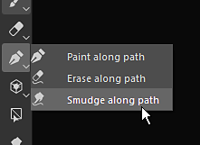

  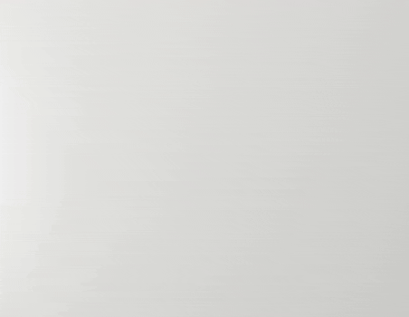
* <b>Drag and move points on mesh surface</b>  
  To edit the shape of a path, simply click and drag a point to move along the 3D modle surface.

  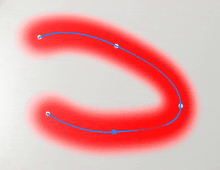
* <b>Close path to create seamless patterns</b>  
  Path can also be closed to create loops, which can be useful for both creating repeating patterns around specific areas for example.

  

  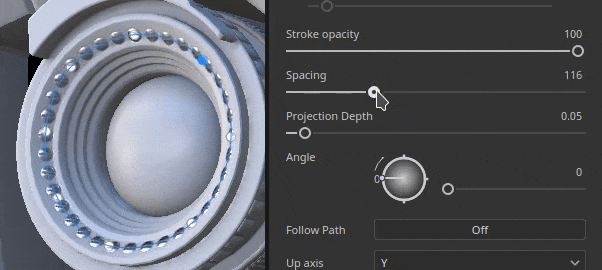
* <b>Re-edit paths (and their properties) with the Path panel</b>  
  When the Paht tool is selected, the path made within the current paint layer are listed in the dedicated Paht panel at the top of the 3D viewport. This panel allows to select, delete or rename path to

  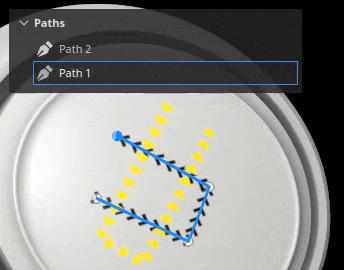

  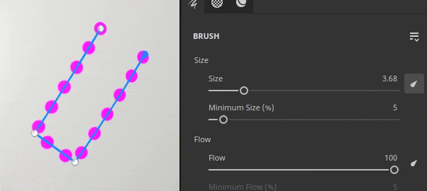
* <b>Compatible with other paint feature like symmetry, geometry mask, dynamic strokes, etc.</b>  
  Many settings from regular paint strokes can be used with the path tool:

  * Enabling symmetry allows to draw a path multiple time while only managing one.
  * Path that are on a layer with a geometry mask enabled can paint under hidden geometry

  
* <b>Paint with other tools like Eraser or Smudge</b>  
  The path tool is also compatible with the eraser and the smudge tool, unlocking more advanced ways of painting and combining strokes with the easy and re-editable way of manipulating path points.

  

* <b>Save and re-use path properties with presets</b>  
  When using the Path tool, you can also save the brush properties as presets. This allows to save tool presets which will automatically switch to the Path tool when selected from the Assets window.

>[!NOTE]
>
> For more information, see the [dedicated documentation](../../painting/tool-list/path/path.md).

### New content to use with paint along path feature

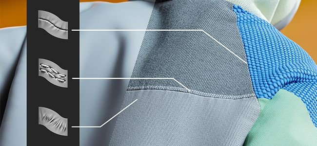

A few new tool presets have been included in this version to take advantage of the new paint along path feature:

* Pipe Rack Sci-Fi
* Puckering
* Seam
* Topstiching
* Welding metal
* Zipper Tape

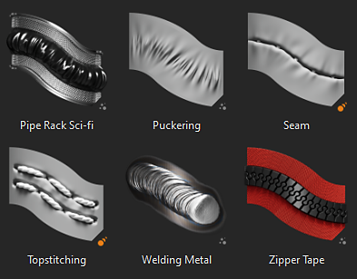

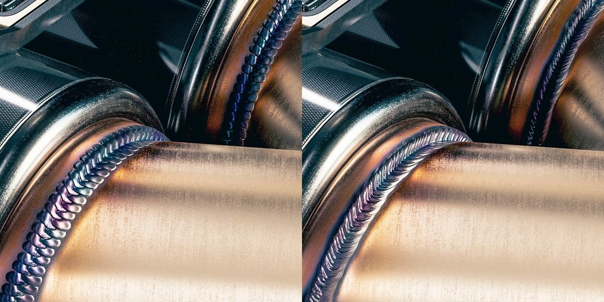

### Improved dynamic strokes for paint along path feature

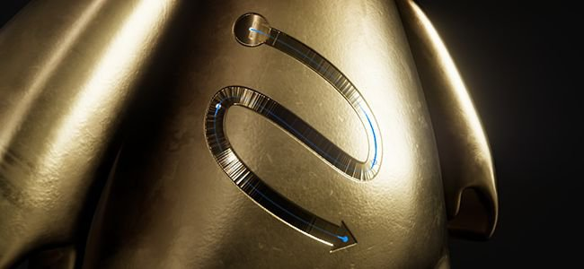

We took to opportunity of the new path tool to add new properties to the dynamic stroke system. These new properties unlock new kind of strokes which weren't possible before, like the arrow on the image above which features a different start and end visual.

* <b>New Start/Middle/End property</b>  
  A new property can be defined to specify to the Substance graph if a stamp inside a stroke is the first one, the last one, or any in the middle. This allows to create start and end points, which can be very usefull for example to creatter zippers. (<b>Note</b>: the end state is only available with the path tool.)
* <b>New Size and Spacing property</b>  
  The size and spacing property allow to adjust the output of a Substance graph based on the current stamp state.
* <b>New stroke length properties</b>  
  Having the distance along the path and the maximum distance of a path allows to better control when some effects repeat, instead of providing a normalized valued directly.  
  It makes it possible to build both a growing stroke  for exmaple but also a stroke with a repeating pattern based on the distance drawn (and not the total number of stamps drawn).

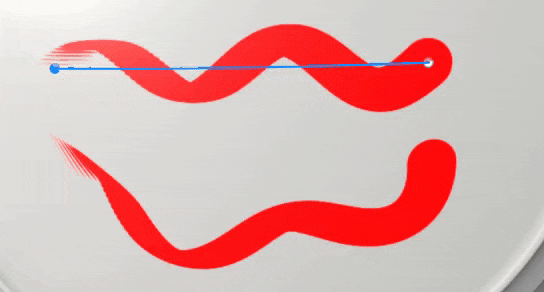

>[!NOTE]
>
> For more information, see the [dedicated documentation](../../painting/dynamic-strokes/creating-custom-dynamic/creating-custom-dynamic-strokes.md).

### Refreshed default materials

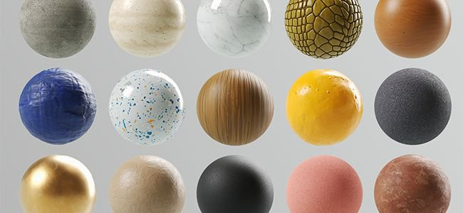

With this release we decided to do a bit of cleanup in our library and therefore changed our default base materials to make them more useful to everybody. These materials have been crafted by the same team delivering content on [Substance 3D Assets](https://substance3d.adobe.com/assets).

>[!NOTE]
>
> The content which was removed is available on [Substance 3D community assets](https://substance3d.adobe.com/community-assets?q=painter23update&amp;u=painter23update).

## Tutorials

To discover and learn about the new path tool, check out our latest tutorial:

## Release Notes

### 9.0.0

Release date: <b>2023/06/20</b>  
Summary: <b>Major release with Paint along path allowing 3D Curves, new base materials and cleaning of legacy materials and new presets for 3D Curves</b>

<b>Added:</b>

* &#91;Path&#93; Add new Paint along Path tool
* &#91;Path&#93; Add an empty shortcut for the path tool
* &#91;Path&#93; Allow to add new points to an existing path
* &#91;Path&#93; Add shortcut to exit current path creation
* &#91;Path&#93; Allow to edit brush properties for paths
* &#91;Path&#93; Adjust tangents automatically when placing a point
* &#91;Path&#93; Recompute tangents when a point is moved
* &#91;Path&#93; Snap newly created points to the surface of a mesh
* &#91;Path&#93; Allow to edit pressure per vertex
* &#91;Path&#93; Adjust newly created point's pressure from neighboring points
* &#91;Path&#93; Allow to convert points to smooth/corner (tangent break)
* &#91;Path&#93; Allow to move a newly added point immediately
* &#91;Path&#93; Allow to remove points from existing path
* &#91;Path&#93; Allow to reverse the direction of a path
* &#91;Path&#93; Allow to select a path in the viewport
* &#91;Path&#93; Allow to select path points with marquee selection
* &#91;Path&#93; Introduce CTRL-A shortcuts to select all points of a path
* &#91;Path&#93; Allow to close path
* &#91;Path&#93; Allow to specify path up axis in Properties
* &#91;Path&#93; Add a vertex control menu to the contextual toolbar
* &#91;Path&#93; Introduce paint/erase/smudge modes to the path tool
* &#91;Path&#93; Create visual feedback for paths in the viewport
* &#91;Path&#93; Add a visual indicator for path direction
* &#91;Path&#93; Add line thickness to path display settings
* &#91;Path&#93; Allow to hide paths UI
* &#91;Path&#93; Add Path panel to list paths of currently selected layer
* &#91;Path&#93; Add visual feedback when hovering over a path in the Path panel
* &#91;Path&#93; Display path panel whenever the Path tool is selected
* &#91;Path&#93; Allow to rename, delete, copy, cut, duplicate path in Path panel
* &#91;Path&#93; Display message when trying to interact in the 2D viewport with the Path tool
* &#91;Library&#93; Integrate new content (path tools and base materials)
* &#91;Dynamic Strokes&#93; Add distance property for dynamic strokes
* &#91;Dynamic Strokes&#93; Add size and spacing properties to dynamic strokes
* &#91;Dynamic Strokes&#93; Add start/middle/end property for dynamic strokes
* &#91;Python&#93;&#91;USD&#93; Expose project configuration parameters for the USD format
* &#91;Python&#93;&#91;USD&#93; Expose project creation parameters for the USD format
* &#91;Export&#93;&#91;USD&#93; Add project path information inside exported USD file
* &#91;GLTF&#93; Update textures in library when reloading a GLTF file
* &#91;Shader&#93; Reduce seam artifacts for UV islands with different orientation
* &#91;Engine&#93; Update to Substance engine version 9.0

<b>Fixed:</b>

* &#91;Import&#93; Some GLB with textures do not get textures in Painter
* &#91;AMD&#93; Artefacts on borders for all 3D projection fills
* &#91;Engine&#93; Textures break when toggling layer visibility
* &#91;Engine&#93; Textures are empty in some places when changing blending mode
* &#91;Engine&#93; Texture/Projection is empty warp mode in some cases
* &#91;Iray&#93; Iteration reset to 0 when saving render
* &#91;Log&#93; USD error message when doing File &gt; New

<b>Known Issues:</b>

* &#91;Color Management&#93; HDR color space conversions with ACE on Linux produce clamped colors
* &#91;Layer Stack&#93; Input source not saved per layer
