# Version 9.1

<b>Substance 3D Painter 9.1</b> adds tangent control for the Path tool, support of the SVG file format, the ability to import and apply resources by drag and drop and support for translucency in the viewport.

Release date: *7 November 2023*

## Major features

### New tangent controls and improvements for path tool

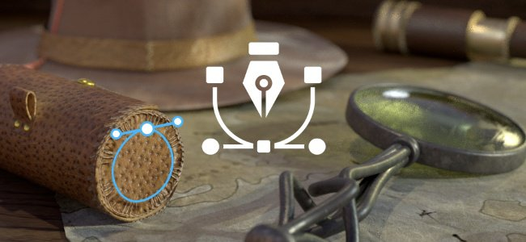

In this new version we continue the development of the Path tool (introduced in version 9.0) to add missing bits and features requested by the community.

* <b>Control path points tangents manually</b>

  It is now possible to manually set the tangents of a specific point on a path. This allows to override the automatic behavior to create new shapes.

  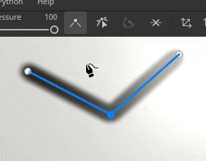
* <b>Edit path points via manipulators</b>

  Sometimes, just slidings points on the surface of the object is not enough. The manipulators allow to move points beyond the surface. This can be very helptful to move several points at once for example in case they were too far from a surface after a mesh re-import.

  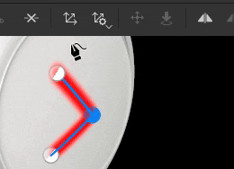
* <b>Toggle paths visibility individually</b>

  Paths visibility can now be changed per path via the dedicated viewport panel. Disabling a path will remove its contributions from final textures without having to delete it.

  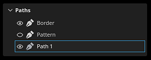
* <b>Copy and paste path positions and properties</b>

  Copy and pasting paths has been extended to be able to only copy a path point positions or its properties. Syncing paths in different ways is now possible, making it easier to create complex effects (via the positions) or to share a specific look across different locations (via the properties).

  

  

>[!NOTE]
>
> For more information about the Path tool, [see the dedicated documentation](../../painting/tool-list/path/path.md).

### New support for translucency, transparency and absorption in viewport

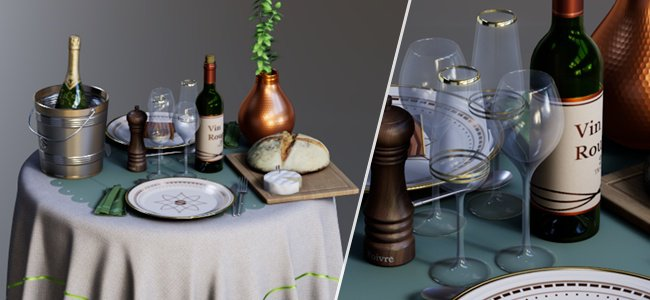

The <b>Adobe Standard Material</b> (ASM) shader, which is the default when creating a new project, has been updated to support <b>Translucency</b>, <b>Transparency</b> and <b>Absorption</b> properties. This means it is now possible to view the result of those rendering behaviors in the real-time viewport (as well as inside Iray renderer).

So authoring materials like <b>glass</b>, <b>foliage</b> or <b>plastics</b> with a thin absorption of light is now possible and directly viewable in the viewport. Exporting to other Substance 3D applications will also result into matching look thanks to the ASM definition.

* <b>New ASM shader settings</b>

  The ASM shader has been updated to support new functionalities, which can be modified via the [Shader settings](../../interface/shader-settings/shader-settings.md) window:

  * <b>Transparency</b> (opacity): is it not necessary anymore to switch to another shader to get transparent surfaces, like foliage. Instead, enable either the <b>alpha test</b> or <b>alpha blending</b> parameter under the <b>Geometry &gt; Opacity</b> group. The usual settings, like dithering, are also available.
  * <b>Translucency</b>: this new property allows to create surfaces like glass, making shapes transparent while keeping the specular reflections. To use it add a Translucency channel in your project and enable the <b>Translucency</b> parameter under the <b>Interior</b> group.
  * <b>Absorption</b>: this new property allows to simulate light passing through an object and being absrobed which can be useful to simulate plastic or liquids in a better way than using sub-surface scattering. To use it enable the <b>Absorption</b> setting under the <b>Interior</b> group.
* <b>Improved shader settings UI and tooltips</b>

  With the rework of the shader we took the opportunity to improve the UI of the parameters, as well as adding many new tooltips to more easily discorver how to activate them.

  The order of parameters should also match better other Substance 3D software, making it easier to do back and forth when trying out settings.

  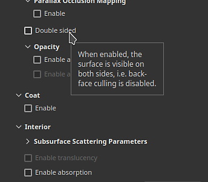
* <b>New sample project to demo the Adobe Standard Material</b>

  Manipulating the new ASM properties can be difficult at first, so a new sample project demonstrating several features of the shader has been added to make it easier to learn them.

  This project is called <b>French Restaurant Table</b> and can be found via the <b>File &gt; Open sample</b> menu. It also uses a lot of little tricks, so it can be a great learning resource to discover new ways of texturing.

  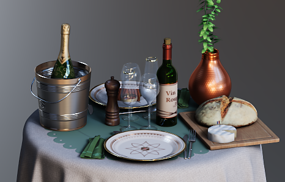
* <b>Translucency channel now defaults to a black color</b>

  In order to make the new shader properties easier to use and avoid unexpected results in the viewport, the default color of the channel Translucency has been changed to black (instead of white).

  If this channel was already in use in your project, you can get the previous behavior by simply adding a fill layer at the bottom of your layer stack and setting the channel value to white. You might want to enable the setting <b>Use translucency as scattering mask</b> in the shader parameter as well to re-apply the contribution of the channel to the sub-surface scattering result.

### New support for vector graphic files (SVG)

This release adds the support of SVG files as resources that can be used in layers, paint tools, etc.

SVG file are quite handy to represent logos or shapes precisely while being very lightweight. In Painter they can be rendered at a desired resolution and easily updated, making them perfect for the non destructive workflow.

* <b>Import SVG files</b>  
  SVG files can be imported like any other resources, in projects, in libraries, etc. SVG <b>up to version 1.1</b> can be imported, features from newer versions are unsupported.

  Import has also been made easier in this version as well (see below) so that using SVG files can be done by simply drag and dropping resources from outside Painter directly onto the mesh or the layer stack.
* <b>Dedicated SVG settings</b>  
  When using an SVG resource, a few settings are available to control its look:

  * <b>Resolution</b>: to either use an automatic one, one defined within the file or one a custom value.
  * <b>Crop area</b>: to define the specific region of the SVG canvas to use.
  * <b>Scope</b>: to select the whole content of the SVG or only some elements.

  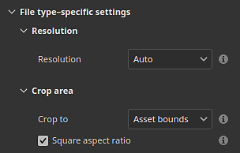
* <b>New SVG tailored materials</b>

  3 new resources have been added to help the use of SVG files when texturing:

  * <b>Custom Spray Paint</b>: allows to simulate a decal painted on a wall from a single input image.
  * <b>Custom Sticker</b>: to create a plastic sticker on a surface. It features several settings to simulate damage and folding.
  * <b>Graphic to Material</b>: allows to create several material properties from a single image input. This resource is automatically inserted when drag and dropping an SVG file into the viewport. This resource offers an easy way to share the transparency of its input across multiple channels, making it perfect for simple decals.

  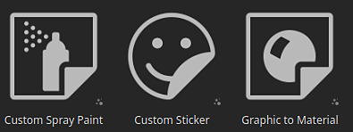

  

>[!NOTE]
>
> For more information about the SVG format and settings, [see the dedicated documentation](../../painting/vector-graphic-svg/vector-graphic-svg.md).

### New import of resources via drag and drop

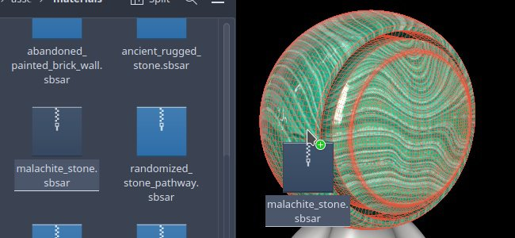

This release make it possible to drag and drop an external file into different contexts of the application to automatically import a resource and use it. This new process allows to skip tedious steps related to importing files.

* <b>Import via drag and drop into the viewport</b>

  Drag an external file into the viewport to be able to put it directly on the mesh. This action will automatically create a new layer. Depending on the nature of the resource (image, Substance material, Substance filter, etc.) the result will adapt accordingly.
* <b>Import via drag and drop into the layer stack</b>  
  The same way it is possible to drop external resource files into the viewport, dropping files into the layer stack allow to directly create layers or effects with the resource in it.
* <b>Import via drag and drop into a resource slot</b>

  Importing a resource directly into a layer or a tool is also possible. If a fill layer or effect with the right setup already exists, simply drop an external file into one of the channel slot of the Properties window to import and apply it.

>[!NOTE]
>
> For more information on importing resources, [see the dedicated documentation](../../content/importing-assets/import-drag-and-drop/import-drag-and-drop.md).

### New resource drag and drop behaviors

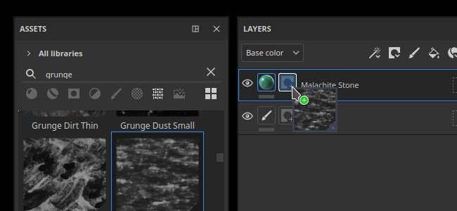

Drag and drop improvements are not limited to importing resources. Drag and dropping a resource from the Assets window can now be used to create new layers, effects and even masks on the fly.

* <b>Drag and drop many types of resources</b>

  It is now possible to drag and drop types of resources directly into the viewport or the layer stack. The following type of resources can now be drag and dropped (almost) anywhere:

  * Alphas
  * Textures
  * Procedurals
  * Materials
  * Smart materials
  * Smart masks
  * Generators
  * Filters
  * Environment maps
* <b>Drop resources as new layer or effect</b>

  By choosing where a resource is dropped, Painter will automatically create a new layer or a new effect:

  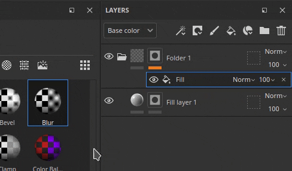
* <b>Choose between Content or Mask effect stack while dragging  
  </b>

  When dragging a resource over a thumbnail Painter will automatically switch to the associated effect stacks. After that it becomes very easy to just drop the resource in a precise location inside that stack. This avoid the need to switch to the right stack beforehand.

  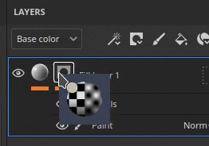
* <b>Create a new black mask on the fly</b>

  A new icon appears on any layer without a mask while dragging a resource. When a resource is dropped on this ghost mask it will automatically create a new mask and add the new resource. It is a quick way to setup a new mask and avoid to cancel the drag and drop to add it manually.

  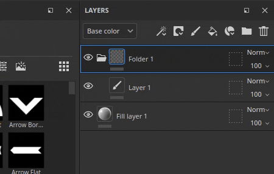
* <b>Drop in the viewport to create new layers</b>

  Drag and dropping resources can also be done in the viewport to create new layers. Depending on the type of the resource, the result may change. A filter will create a paint layer in passthrough mode, while a smart mask will create a fill layer with a new mask.

  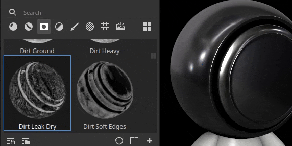

  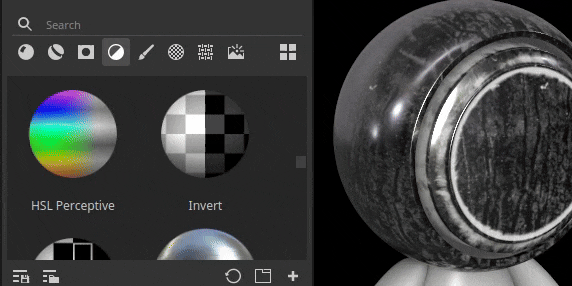
* <b>Use keyboard modifiers for advanced behaviors</b>

  When dropping a resource, maintaining the keyboard modifier CTRL or ALT can enable additional behaviors:

  * <b>CTRL</b> while dropping in the <b>layer stack</b>: create a new layer with the resource in a black mask. can be useful to force a material to be put into a mask for example. Or to skip the dropdown menu with an alpha.
  * <b>ALT</b> while dropping in the <b>layer stack</b>: only applies when dropping over a layer thumbnail. ALT will remove all the previous effects. This can be used as a quick way to try out different resources, notably smart masks, without having to manually remove them first.
  * <b>CTRL</b> while dropping in the <b>viewport</b>: create a new layer with the resource in a black mask. The resource will be put under a <b>Color ID Selection</b> effect which will be set based on the selection done in the viewport.
  * <b>ALT</b> while dropping in the <b>viewport</b>: same as before, will force a resource to be in decal projection mode.

### Miscellaneous improvements

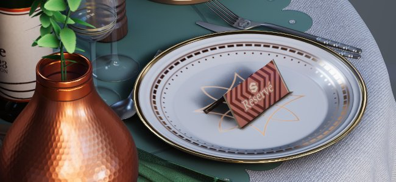

Several minor features and improvements have also been added in this release.

* <b>Lossless compression of 16bit images</b>

  From now on, any images contained in a project with a bit depth of 16 will be compressed with a lossless algorithm, allowing to reduce their size without losing quality. This is in addition of the project file already compressing its own data.

  This change principally target <b>bake textures</b> which are usually the reason why project files can be very heavy on the disk. In average we saw projects being <b>reduced by 30% to 50% in size on disk</b>.

  This compression is applied automatically when saving any project (old or new) on resources not already compressed. It means that for old projects, saving for the first time in this new version could take a bit more time than usual. Saving time should be back to normal once this is done.
* <b>New UV set to UV set fill projection mode</b>

  A new projection mode for fill layers/effects has been added named <b>UV set to UV set projection</b>. It can be used to project a texture based on different UVs available on the mesh inside the project. It can be used to perform more advanced texture transfert without the need to rely on external tools.

  <b>UV set 0</b> is the default UV used for painting by Painter. If additional UV sets are available, they will be available inside the dropdown from the setting <b>Source</b>:

  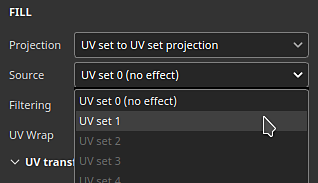
* <b>Temporal Anti-Aliasing is enabled by default on any new project</b>

  When creating a new project, the <b>Temporal Anti-Aliasing</b> setting available in the Display Settings window is now enabled by default in order to improve the quality of the rendering in the viewport.
* <b>New Python API improvements</b>

  The Python API recived a few additions in this release:

  * Painter can be closed/shutdown via Python with the new <b>substance\_painter.application.close() </b>function.
  * The main viewport camera can now be modified via the API. This includes its position, rotation but also its other properties like Field of View, Aperture, etc. To make it easier to position the camera regarding the mesh, the API now also exposes the scene bounding box.
  * Exporting the project mesh, with triangulation or not and displacement or not, is now possible via the export module.
  * The project export textures path can now also be retrieved from the API.
* <b>New send to After Effects (beta)</b>

  A new send to action is available to export a mesh and its texture to After Effects, making it convenient to iterate on visual effects. This feature requires the access to After Effects version 24.1 beta minimum.

## Tutorials

## Release notes

### 9.1.0

(Released: November 07, 2023)  
Summary: <b>Major release introducing SVG and transparency support, as well as drag and drop and path tool improvements</b>

<b>Added:</b>

* &#91;SVG&#93; Allow to import vectorial files (SVG)
* &#91;SVG&#93;&#91;UI&#93; Add support for SVG-specific properties
* &#91;SVG&#93; Add an option to easily preserve original image proportions
* &#91;SVG&#93; Allow to automatically use alpha of SVG with transparency
* &#91;Interop&#93; Allow to send a textured mesh to After Effects (Ae 24.1 beta)
* &#91;Interop&#93; Add settings for Send to After Effects
* &#91;QoL&#93;&#91;Assets&#93;&#91;UI&#93; Auto-import asset when drag and dropping into UI slot
* &#91;QoL&#93; Allow to drag and drop external assets into the layer stack
* &#91;QoL&#93;&#91;Layer Stack&#93; Drag and drop textures from Assets Panel into the Layer Stack
* &#91;QoL&#93;&#91;Viewport&#93; Allow to drag and drop generator, filters on the mesh
* &#91;QoL&#93;&#91;Viewport&#93; Allow to drop external assets onto the mesh
* &#91;QoL&#93;&#91;Projection&#93; Add new UV set to UV set projection mode
* &#91;QoL&#93; Drag and drop Smart Masks as new layers in viewport and Layer Stack
* &#91;QoL&#93; Add selector for Generators with multiple outputs when used in mask
* &#91;QoL&#93; Allow to drag and drop single channel images over a fill effect
* &#91;QoL&#93;&#91;Layer stack&#93; Use CTRL/ALT modifiers with drag and drop to specify where/how to create effects/layer
* &#91;Path&#93; Toggle paths visibility individually in path panel
* &#91;Path&#93; Allow to use transformation manipulators for path points
* &#91;Path&#93; Allow to control tangents per vertex manually
* &#91;Path&#93; Copy/paste path properties
* &#91;Path&#93; Introduce an empty shortcut for break tangent button
* &#91;Shader&#93; Add support for Opacity &amp; Translucency in ASM shader
* &#91;Shader&#93; Add support for Absorption color channel with ASM shader
* &#91;Shader&#93; Improve ASM shader parameters tooltips
* &#91;Shader&#93; Change Translucency channel default color to black
* &#91;Display settings&#93; Enable Temporal Anti-Aliasing by default
* &#91;Display settings&#93; Enable Sub-surface scattering setting by default
* &#91;Substance&#93; Add support for ColorSpace property from graph input/output
* &#91;Substance&#93; Update Substance engine to version 9.0.3
* &#91;UI&#93; Make contextual toolbar button accessible even if the app window is small
* &#91;Auto Unwrap&#93; Control UV Tiles number with Texel Density
* &#91;Baking&#93; Deactivate GPU raytracing on AMD GPUs by default
* &#91;Performance&#93; Apply lossless compression on 16bit images to reduce project footprint
* &#91;Python&#93; Allow to manipulate the default Camera in 3D View
* &#91;Python&#93; Expose the ability to export mesh via scripting
* &#91;Content&#93;&#91;Samples&#93; Add new sample project "French Restaurant Table"
* &#91;Content&#93; Update Substance logo alpha to new version
* &#91;Content&#93; Add three SVG focused material filters (Custom Sticker, Custom Spray and Graphic to Material)

<b>Fixed:</b>

* &#91;Crash&#93; Changing manipulator size when not using symmetry tool
* &#91;Crash&#93; &#91;Layer stack&#93; Creating layer when nothing is selected
* &#91;Project&#93; Mesh maps can be corrupted after a removing unused resources
* &#91;Project&#93; Resource corruption after re-importing or re-baking image
* &#91;Assets&#93; Reloading an asset removes it from Favorites
* &#91;Import&#93; Can not import resources when there is "No result found" in asset panel
* &#91;UI&#93; Contextual toolbar arrow does not appear in some cases
* &#91;Substance&#93; Side by side button for boolean values is not supported
* &#91;Level&#93; Wrong channel label when used in mask
* &#91;Export&#93;&#91;glTF&#93; glTF/GLB files exported from Painter do not have a physical size unit
* &#91;Content&#93; Blur filter intensity is clamped to 16
* &#91;Content&#93; Color Match filter "target color" image input is not visible

<b>Known issues:</b>

* &#91;Color Management&#93; HDR color space conversions with ACE on Linux produce clamped colors
* &#91;Crash&#93;&#91;Linux&#93; with Linux Wayland on AMD when drag and dropping resource in the Layer Stack
* &#91;Crash&#93;&#91;Mac&#93; Changing Anisotropic filtering value on Monterey OS
* &#91;Crash&#93; Exr used as image input
* &#91;Crash&#93; Using 16K environment map
* &#91;Auto Unwrap&#93; UI issue for texel density control
* &#91;Regression&#93;&#91;UI&#93; Right Click Menu is too small on hd screen
* &#91;Python&#93; Crash exporting USD triggered by TextureStateEvent
* &#91;QoL&#93; Drag and drop of Alpha resource in decal mode creates UV projection in mask
