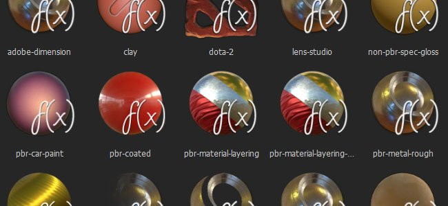

# Shader API



Substance Painter uses shaders to render materials in its realtime viewport. It is possible to write custom shaders to implement new behaviors or to simply make the viewport match other renderers.

Additional shaders for Substance Painter can be found on [Substance Share](https://share.allegorithmic.com/libraries?by_category_type_id=6).

>[!NOTE]
>
> The Shader API is also available directly from the application, by going into the menu **Help &gt; Documentation &gt; Shader API**.

## Shader reference

## Changelog

* [Full changelog file](changelog-shader-api/changelog-shader-api.md)

## Warm up

In Substance Painter, you can write your own shaders in *GLSL*. We allow you to write only a *portion* of the fragment shader, which is sometimes called a *surface shader*. Without further ado, let's introduce the "Hello world" Substance Painter surface shader:

```

void shade(V2F inputs) { 

  diffuseShadingOutput(vec3(1.0, 0.0, 1.0)); 

}
```


Now, if you save this snippet into a *.glsl* file and load it into Substance Painter by dropping it into your shelf's shader tab, you can now use it and see a beautiful uniform pink color on your mesh.

## Surface shader

* [surface-shader.glsl](shaders-shader-api/surface-shader-shader-api/surface-shader-shader-api.md)

## Engine provided data (or how do I access my channels?)

In Substance Painter, you can access rendering engine parameters (document's channels, additional textures, camera-related data and the like). Here is an exhaustive list of all engine provided parameters :

* [all-engine-params.glsl](parameters-shader-api/all-engine-params-shader/all-engine-params-shader-api.md)

## Engine settings (or how do I specify rendering states?)

In some cases you may want to use a specific rendering configuration (culling, blending, sampling locality, and the like) for an effect. Some rendering states are exposed and can be set in the shader. Here is an exhaustive list of all exposed rendering states :

* [all-rendering-states-params.glsl](parameters-shader-api/all-rendering-states-par/all-rendering-states-params-shader-api.md)

## Custom tweaks (or how do I tweak my shader?)

It's usual to have custom tweaks in a shader. To do so in Substance Painter's shaders, we have introduced a way to specify custom tweaks. Here is an exhaustive list of all custom shader tweaks types :

* [all-custom-params.glsl](parameters-shader-api/all-custom-params-shader/all-custom-params-shader-api.md)

## Embedded libraries

In order to avoid writing a lot of boilerplate code in all of your shaders, we created a small yet practical library of useful functions. **Please note that you can't edit it nor create your own at the moment.**

* [lib-alpha.glsl](libraries-shader-api/lib-alpha-shader-api/lib-alpha-shader-api.md) : contains opacity related helpers
* [lib-bayer.glsl](libraries-shader-api/lib-bayer-shader-api/lib-bayer-shader-api.md) : contains bayer matrix helpers
* [lib-defines.glsl](libraries-shader-api/lib-defines-shader-api/lib-defines-shader-api.md) : contains useful math constants
* [lib-emissive.glsl](libraries-shader-api/lib-emissive-shader-api/lib-emissive-shader-api.md) : contains emissive properties helpers
* [lib-env.glsl](libraries-shader-api/lib-env-shader-api/lib-env-shader-api.md) : contains environment map related helpers
* [lib-normal.glsl](libraries-shader-api/lib-normal-shader-api/lib-normal-shader-api.md) : contains normal map related helpers (and height-map generated normal map)
* [lib-pbr.glsl](libraries-shader-api/lib-pbr-shader-api/lib-pbr-shader-api.md) : contains physically based rendering helpers
* [lib-pbr-aniso.glsl](libraries-shader-api/lib-pbr-aniso-shader-api/lib-pbr-aniso-shader-api.md) : contains anisotropic physically based rendering helpers
* [lib-pom.glsl](libraries-shader-api/lib-pom-shader-api/lib-pom-shader-api.md) : contains parallax occlusion mapping helpers
* [lib-random.glsl](libraries-shader-api/lib-random-shader-api/lib-random-shader-api.md) : contains random utilities (low discrepancy sequences)
* [lib-sampler.glsl](libraries-shader-api/lib-sampler-shader-api/lib-sampler-shader-api.md) : contains channel getters helpers
* [lib-sparse.glsl](libraries-shader-api/lib-sparse-shader-api/lib-sparse-shader-api.md) : contains safe sparse texture sampling helpers
* [lib-sss.glsl](libraries-shader-api/lib-sss-shader-api/lib-sss-shader-api.md) : contains subsurface scattering helpers
* [lib-utils.glsl](libraries-shader-api/lib-utils-shader-api/lib-utils-shader-api.md) : contains color utility functions (sRGB conversions, tone mapping)
* [lib-vectors.glsl](libraries-shader-api/lib-vectors-shader-api/lib-vectors-shader-api.md) : contains common vectors helpers

## Metadata

You can declare additional non required information to give some hint to the rendering system. Here is the syntax:

```

//: metadata { 

//:   "key1":"value1", 

//:   "key2":"value2" 

//: }
```


Supported keys are:

* **custom-ui**: Replace the standard shader parameters user interface with a custom view written as a QML module (see scripting documentation). The path can be absolute or relative to one of your shelf *custom-ui* folder.
* **mdl**: define the Iray mdl material to use with the shader. The path syntax is as follow: *mdl::folder1::folder2::mdl\_filename::material\_name* where *folder1::folder2::mdl\_filename* is the path inside one of your shelf *mdl* folder to a mdl file and *::material\_name* is the name of a material declared inside this mdl file. (ex: "mdl" : "mdl::alg::materials::physically\_metallic\_roughness::physically\_metallic\_roughness")

## Example shaders (yeah, finally!)

To get a taste of what looks like a real shader, here are a few sample shader, ordered by increasing complexity:

* [pixelated.glsl](shaders-shader-api/pixelated-shader-api/pixelated-shader-api.md) : a pixelating shader
* [toon.glsl](shaders-shader-api/toon-shader-api/toon-shader-api.md) : a toon shader
* [pbr-metal-rough.glsl](shaders-shader-api/pbr-metal-rough-shader/pbr-metal-rough-shader-api.md) : the default PBR shader embedded in Substance Painter

## Dynamic material layering

The Dynamic Material Layering is a specific workflow where materials are mixed together inside a shader and let the user dynamically edit blending masks in Substance Painter. To enable this workflow, there are two new functionalities:

* declare editable stacks from a shader definition: [layering\_declare\_stacks.glsl](parameters-shader-api/layering-declare-stacks/layering-declare-stacks-shader-api.md)
* bind materials as shader parameters: [layering\_bind\_materials.glsl](parameters-shader-api/layering-bind-materials/layering-bind-materials-shader-api.md)
