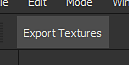
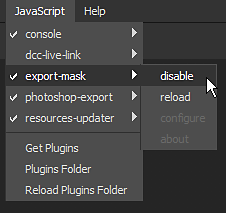

# Creating a Javascript plugin

This step by step guide describes how to create a simple plugin that allows to export the mask of the currently selected layer in a project.

The goal of the plugin in this guide is to export all the channels of the current Texture Set inside a project as individual textures.

## 1 - Navigating to the plugins folder

To add a new Javascript plugin, a folder must be created into the plugin folder of Substance 3D Painter.

To access the **plugins** folder, navigate to:

<table data-preserve-html="true" style="width: 100.0%;"> <colgroup> <col style="width: 15.0%;"/> <col style="width: 15.0%;"/> <col style="width: 70.0%;"/> </colgroup> <tbody> <tr> <th>Platform</th> <th>Version</th> <th>Path</th> </tr> <tr> <td rowspan="2"><strong>Windows</strong></td> <td><strong>7.2</strong> or newer</td> <td colspan="1">C:&#92;Users&#92;username&#92;Documents&#92;Adobe&#92;Adobe Substance 3D Painter</td> </tr> <tr> <td colspan="1">Legacy</td> <td colspan="1">C:&#92;Users&#92;username&#92;Documents&#92;Allegorithmic&#92;Substance Painter</td> </tr> <tr> <td rowspan="2"><strong>Mac</strong></td> <td colspan="1"><strong>7.2</strong> or newer</td> <td colspan="1">/Users/username/Documents/Adobe/Adobe Substance 3D Painter</td> </tr> <tr> <td colspan="1">Legacy</td> <td colspan="1">/Users/username/Documents/Allegorithmic/Substance Painter</td> </tr> <tr> <td rowspan="2"><strong>Linux</strong></td> <td colspan="1"><strong>7.2</strong> or newer</td> <td colspan="1">/home/username/Documents/Adobe/Adobe Substance 3D Painter</td> </tr> <tr> <td>Legacy</td> <td colspan="1">/home/username/Documents/Allegorithmic/Substance Painter</td> </tr> </tbody> </table>

### 2 - Creating the plugin folder

A plugin name is based on the name of its parent folder.

For this example, simply create a new folder named  **export-textures**  inside the plugins folder.

### 3 - Creating the plugin files

Open the newly created folder and create two empty text files (notepad):

* **main.qml**
* **toolbar.qml**

The qml file extension is a Javascript extension for scripts created for Qt QML language. It allows to run Javascript code but also create custom UIs.

The **main.qml** file is mandatory, it's the first file that will be looked for by the application to load the plugin. Additional files can be created with any names however, allowing to split a script into parts for easier management. In this case,  **toolbar.qml**  will be used to describe the look of a button that will be added in the interface by the plugin.

### 4 - Script content

Open the script files into a text editor such as Notepad++ and paste the following code snippets. Take a look at the code comments for more details.

**toolbar.qml**

```

import QtQuick 2.7 

import AlgWidgets 2.0 

import AlgWidgets.Style 2.0 

 

AlgButton 

{ 

 tooltip: "" 

 iconName: "" 

 text: "Export Textures" 

}
```


**main.qml**

```

// Default includes, to acces Qt/QML 

// and Substance 3D Painter APIs 

import QtQuick 2.7 

import Painter 1.0 

 

// Root object for the plugin 

PainterPlugin 

{ 

 // Disable update and server settings 

 // since we don't need them 

 tickIntervalMS: -1 // Disabled Tick 

 jsonServerPort: -1 // Disabled JSON server 

 

 // Implement the OnCompleted function 

 // This event is used to build the UI 

 // once the plugin as been loaded by Substance 3D Painter 

 Component.onCompleted: 

 { 

  // Create a toolbar button 

  var InterfaceButton = alg.ui.addToolBarWidget("toolbar.qml"); 

 

  // Connect the function to the button 

  if( InterfaceButton ) 

  { 

   InterfaceButton.clicked.connect( exportTextures ); 

  } 

 } 

 

 // Custom function called by the Button, 

 // this is the core of the plugin 

 function exportTextures() 

 { 

  // Catch errors in the script during execution 

  try 

  { 

   // Verify if a project is open before  

   // trying to export something 

   if( !alg.project.isOpen() ) 

   { 

    return; 

   } 

 

   // Retrieve the currently selected Texture Set (and sub-stack if any) 

   var MaterialPath = alg.texturesets.getActiveTextureSet() 

   var UseMaterialLayering = MaterialPath.length > 1 

   var TextureSetName = MaterialPath[0] 

   var StackName = "" 

 

   if( UseMaterialLayering ) 

   { 

    StackName = MaterialPath[1] 

   } 

 

   // Retrieve the Texture Set information 

   var Documents = alg.mapexport.documentStructure() 

   var Resolution = alg.mapexport.textureSetResolution( TextureSetName ) 

   var Channels = null 

 

   for( var Index in Documents.materials ) 

   { 

    var Material = Documents.materials[Index] 

 

    if( TextureSetName == Material.name ) 

    { 

     for( var SubIndex in Material.stacks ) 

     { 

      if( StackName == Material.stacks[SubIndex].name ) 

      { 

       Channels = Material.stacks[SubIndex].channels 

       break 

      } 

     } 

    } 

   } 

 

   // Create the export settings 

   var Settings = { 

    "padding":"Infinite", 

    "dithering":"disbaled", // Hem, yes... 

    "resolution": Resolution, 

    "bitDepth": 16, 

    "keepAlpha": false 

   } 

 

   // Build the base of the export path 

   // Files will be located next to the project 

   var BasePath = alg.fileIO.urlToLocalFile( alg.project.url() ) 

   BasePath = BasePath.substring( 0, BasePath.lastIndexOf("/") ); 

 

   // Export the each channel 

   for( var Index in Channels ) 

   { 

    // Create the stack path, which defines the channel to export 

    var Path = Array.from( MaterialPath ) 

    Path.push( Channels[Index] ) 

 

    // Build the filename for the texture to export 

    var Filename = BasePath + "/" + TextureSetName 

 

    if( UseMaterialLayering ) 

    { 

     Filename += "_" + StackName 

    } 

 

    Filename += "_" + Channels[Index] + ".png" 

 

    // Perform the export 

    alg.mapexport.save( Path, Filename, Settings ) 

    alg.log.info( "Exported: " + Filename ) 

   } 

  } 

  catch( error ) 

  { 

   // Print errors in the log window 

   alg.log.exception( error ) 

  } 

 } 

} 


```


Once done, save and close the file.

### 5 - Loading and enabling the plugin

Start Substance 3D Painter, by default new plugins are automatically loaded and enabled.

Open a project then click on the UI button created by the plugin to export the channels of the currently selected Texture Set:



To enable or disable a plugin, use the Javascript menu at the top of the interface:


