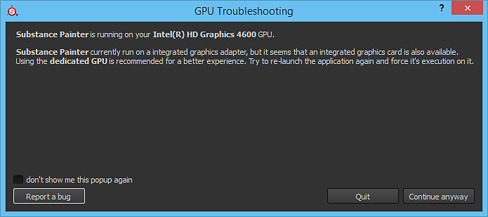

# Running on integrated GPU

{width="500px"}

It can happens that some computers are set by default to run on an integrated chipset rather than on a dedicated GPU.   
Since performances on integrated chipset are very low, we recommend to use a dedicated GPU instead. A pop-up can appears and warns you about it.

With an NVIDIA GPU, the switch to the NVIDIA GPU depends on application profiles. If an application does not have such profile, you can assign the graphics card manually:

1. Right-click on the Desktop and select NVIDIA Control Panel  **or**  Navigate to the Control Panel and search for NVIDIA Control Panel
1. Under  **3D Settings**  , go to  **Manage 3D Settings**
1. Under the tab  **Program settings**  add a new profile for  **Substance 3D Painter**
1. Change the preferred graphics processor setting to High-performance NVIDIA processor
