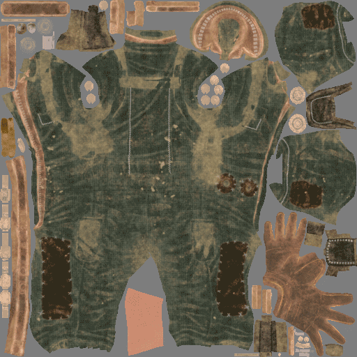
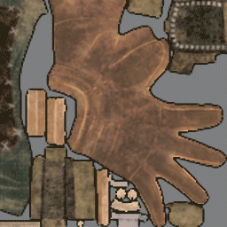
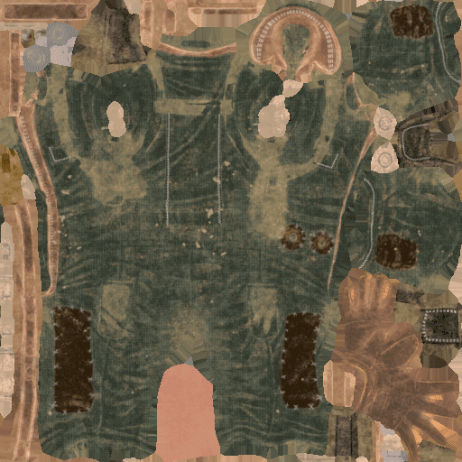
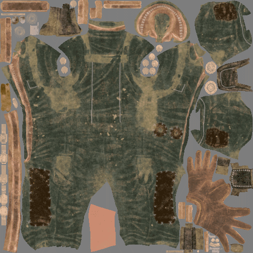
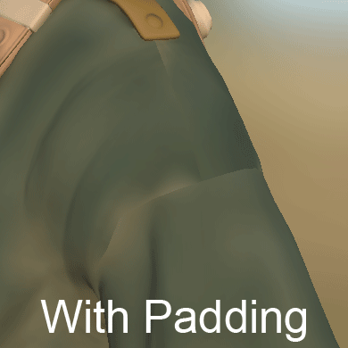

# Texture dilation or Padding

**Padding** (sometimes also called **dilation**) is a process that happens after the generation of a texture. Its purpose is to dilate the borders of the UV islands to fill empty areas with similar pixels.

Generating a good quality padding is important to ensure good [mipmaps](../../../../getting-started/glossary/glossary.md) generation later by game engines or offline renderers.   
Substance 3D Painter can generate an infinite padding: this means a pixel will be stretched until it reaches an other UV island or the borders of the texture.

## Infinite padding generation

Here is an example of how the infinite padding works :

<table>
<tr style="border: 0;">
<td style="border: 0;" valign="top">

{width="512px"}

</td>
<td style="border: 0;" valign="top">

</td>
</tr>
</table>

## MipMaps

In 3D computer graphics, **mipmaps** are pre-calculated, optimized sequences of textures, each of which is a progressively lower resolution representation of the same image. They are intended to increase rendering speed and reduce aliasing artifacts. A high-resolution mipmap image is used for objects close to the camera. Lower-resolution images are used as the object appears farther away. This is an efficient way of rendering instead or reading all the pixels from the original texture. The mipmaps (each level) are embedded inside the texture itself (when supported by the file format).

Padding is very important for mipmaps as it avoids incorrect colors to bleed inside the UVs of the mesh when going to lower texture resolutions.

<table>
<tr style="border: 0;">
<td style="border: 0;" valign="top">

{width="400px"}

</td>
<td style="border: 0;" valign="top">

{width="400px"}

</td>
</tr>
</table>

On the example above the gray background bleeds into the UVs (right image), while with padding keeps the color clean (left image).

Inside a 3D application this is the result :

## Padding controls

Substance 3D Painter allows to change the behavior of the padding generation (such as disabling it) in different places :

* **When baking** : see the [baking documentation](../../../../baking/baking.md) for more information.
* **When generating textures for a Texture Set** : see the [Texture Set settings](../../../../interface/texture-set/texture-set-settings/texture-set-settings.md) documentation for more information.
* **When exporting textures** : see the "Padding settings" section of the [export settings](../../../../getting-started/export/export-window/export-window.md) documentation for more information.
