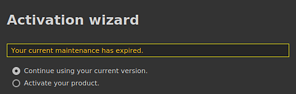

# Maintenance is expired dialog on startup

When starting the application, a dialog with the message "Your current maintenance has expired" may appear. This page list solutions on how to avoid this dialog.

## Solution 1: update the license file

The warning message appears because the license file is too old and needs to be updated. To do so, simply **re-activate the product** via the application wizard. The license file can also be manually downloaded via the Substance 3D website: <https://www.substance3d.com/>.

## Solution 2: edit the preference settings to hide the dialog

>[!NOTE]
>
> We recommend trying to update the license file first before using this alternative solution.

Another solution is to hide warning message by putting in place a specific setting.

Navigate to the application preference location:

<table data-preserve-html="true"><colgroup> <col/> <col/> <col/> </colgroup><tbody><tr><th>System</th><th>Version</th><th>Path</th></tr><tr><td rowspan="2">
<strong>Windows</strong>

(registry)
</td><td><strong>7.2</strong> or newer</td><td>HKEY&#95;CURRENT&#95;USER&#92;Software&#92;Adobe&#92;Adobe Substance 3D Painter</td></tr><tr><td>Legacy</td><td>HKEY&#95;CURRENT&#95;USER&#92;Software&#92;Allegorithmic&#92;Substance Painter</td></tr><tr><td rowspan="2">
<strong>Mac</strong>

(library)
</td><td><strong>7.2</strong> or newer</td><td>/Users/&#91;username&#93;/Library/Preferences/com.adobe.Adobe Substance 3D Painter.plist</td></tr><tr><td>Legacy</td><td>/Users/&#91;username&#93;/Library/Preferences/com.substance3d.Substance Painter.plist</td></tr><tr><td rowspan="2"><strong>Linux</strong></td><td><strong>7.2</strong> or newer</td><td>/home/&#91;username&#93;/.config/Adobe/Adobe Substance 3D Painter.conf</td></tr><tr><td>Legacy</td><td>/home/&#91;username&#93;/.config/Allegorithmic/Substance Painter.conf</td></tr></tbody></table>

### Windows

To set the variable on Windows, follow these steps:

1. Open the start menu.
1. Search for **Regedit** to open the Registry editor.
1. Navigate to the registry key listed in the table above.
1. Click on the registry key named as the software in the tree view on the left.
1. Right-click in the empty area in the right panel and choose **New &gt; String value**.
1. Name the new value as **DisableLicenseWarningPopup** and press enter to validate.
1. Double click on the value just created.
1. Set the Value data field to: **true**
1. Save the change.
1. Start the application.

### MacOS

1. Open a new **Finder** window
1. Navigate to the path listed in the table above.
1. Right-click on the **plist** file and choose **Open with &gt; Xcode**.
1. A the top of the list, add a new key named **DisableLicenseWarningPopup**
1. Set the key type to **string**
1. Set the key value to **true**
1. Save and close the file.
1. Start the application.

### Linux

To set the variable on Linux, follow these steps:

1. Navigate to the path list in the table above.
1. Open the **.conf** file present in the folder.
1. Add a new line under the line **&#91;General&#93;**
1. On the new line, paste the following text: **DisableLicenseWarningPopup=true**
1. Save the file.
1. Start the application.
