# Configuring Pens and Tablets

This page list multiple recommendations to configure a graphic tablet pen on Windows in order to improve its compatibility with the application.

## What is Windows Ink ?

Windows Ink is a software/service that handles Pens such as stylus or pens from graphic tablets. It offers various application such as Sticky Notes and Sketchpad to interact with a pen on the computer.

Since version 2019.3, the application relies on it to handle graphic tablets. Before this version Wintab was used instead (older service that is not supported by all graphic tablets models).

## Enabling Windows Ink in Tablet driver settings

To make sure the pen pressure is properly recognized, Windows Ink has to be enabled in the driver settings of the Graphic Tablet.

>[!NOTE]
>
> Windows Ink is not supported on virtual machines, so graphic tablet events won't be forwarded to the application. Pen pressure is therefore not supported in this configuration.

### Enabling Windows Ink for Wacom Tablets

1. Open the  **Start**  menu.
1. Type  **Wacom Tablet Properties**  and click on the first search result.
1. In the  **Wacom Tablet Properties**  Window click on the  **Pen**  in the tool list.   
    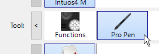
1. Click on the plus  **"+"**  button to add an application profile.   
    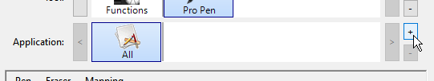
1. Click on the  **Browse**  button in the new window to locate Substance 3D Painter executable.   
    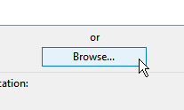
1. Click on  **OK**  to validate and create the profile.   
    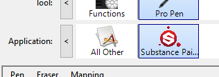
1. Click on the  **Mapping**  tab.   
    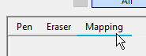
1. In the bottom left of the window, make sure  **Use Windows Ink**  is enabled.   
    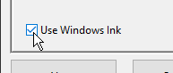

>[!NOTE]
>
> After enabling Windows Ink, restart the application to make sure the changes are properly taken into account.

### Enabling Windows Ink for Huion Tablets

1. Open the  **Start**  menu.
1. Type  **Huion Tablet**  and click on the first search result
1. In the  **Huion Tablet**  window click on  **Digital Pen**  .   
    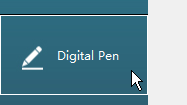
1. In the bottom left of the window, make sure  **Enable Windows Ink**  is enabled.   
    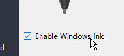

## How to access Windows Ink settings

Windows Ink settings can be accessed in the general Windows settings:

1. Open the  **Start**  menu.
1. Click on the  **Settings**  icon.   
    
1. In the Settings window, click on  **Devices**  .   
    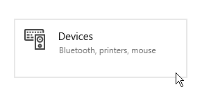
1. In the  **Devices**  window, click on  **Pen &amp; Windows Ink**  (only available if a graphic tablet is connected).   
    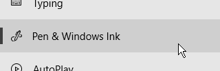

## Recommended Windows Ink settings

Below are the Windows Ink settings and the recommended configuration for each of them.

>[!NOTE]
>
> Even after following this guide, some visuals related to Windows Ink will be still visible. Unfortunately Microsoft doesn't offer settings in Windows to disable them.
> 
> The remaining visuals are:
> 
> * **Circle**  when right-clicking.
> * **Tooltip**  below the mouse when pressing a key modifier (Ctrl, Alt, or Shift).

### Pen Settings

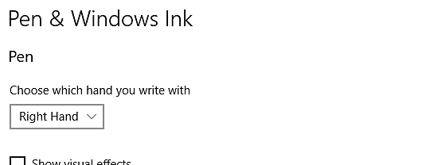

| ***Setting*** | ***Description*** |
| --- | --- |
| **Choose which hand to write with** | Recommended:  **Right hand** This settings control how the pen orientation is recognized. Setting this setting to Left Hand can lead to some UI freeze when tweaking parameters. |
| **Show visual effects** | Recommended:  **Disabled** This settings controls visual effects that are displayed during various Pen interaction. Disabling it allow to hide the ripple circle effect when clicking: 

 |
| **Show cursors** | Recommended:  **Disabled** |
| **Let me use my pen as a mouse in some desktop apps** | Recommended:  **Enabled** This settings allow the graphic tablet pen to send regular mouse inputs. If disabled, this setting can lead to some interaction issues with UI parameters. |

### Handwriting Settings

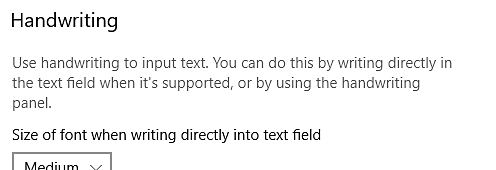

| ***Setting*** | ***Description*** |
| --- | --- |
| **Size of font when writing directly into text field** | Recommended:  **Medium (default)** |
| **Font when using handwriting** | Recommended:  **Segoe UI (default)** |
| **When I tap a text field with my pen, use handwriting to input text** | Recommended:  **Only in tablet mode** This settings controls how and when the handwriting text input window appears. If not set to "only in tablet mode", the window will appear everytime a text field is selected in the UI. For example when typing a specific value into a slider. |
| **Let me use my pen as a mouse in some desktop apps** | Recommended:  **Enabled** This settings allow the graphic tablet pen to send regular mouse inputs. If disabled, this setting can lead to some interaction issues with UI parameters. |
| **Write in the handwriting panel with your fingertip** | Recommended:  **Disabled** |

### Pen Shortcuts Settings

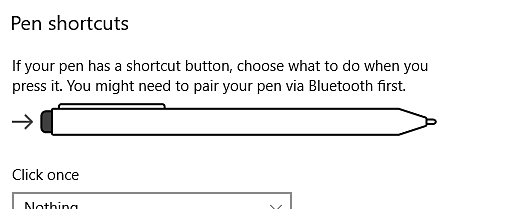

| ***Setting*** | ***Description*** |
| --- | --- |
| **Click once** | Recommended:  **Nothing** |
| **Double-click** | Recommended:  **Nothing** |
| **Press and hold (only supported on some pens)** | Recommended:  **Nothing** |
| **Allow apps to override the shortcut button behavior** | Recommended:  **Enabled** |
| **When available, show Ink Workspace after I remove my pen from storage** | Recommended:  **Disabled** |

## How to access Pen and Touch settings

Pen and Touch settings can be accessed in the Control Panel:

1. Open the  **Start**  menu.
1. Type  **Control Panel**  and click on the first search result.
1. Switch the Control Panel  **display mode**  to  **small icon**  .   
    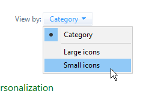
1. Click on  **Pen and Touch**  settings.   
    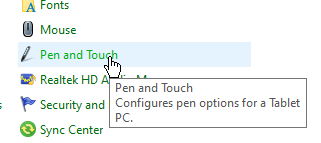

## Recommended Pen and Touch settings

The following settings are recommended to improve the painting behavior and camera manipulation.

To access the settings, click on one of the  **pen action**  in the window and then click on the  **settings**  button.

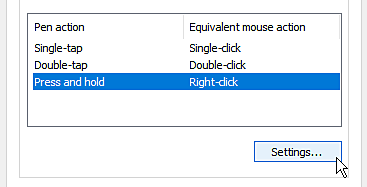

| ***Setting*** | ***Description*** |
| --- | --- |
| **Single-tap** | No parameters. |
| **Double-tap** | Recommended:  **Default values.** |
| **Press and hold** | Recommended:  **Disable the setting"Enable press and hold for right-clicking"**  Disabling this setting will allow to drag any element normally without activating the Windows drag circle: 

 |
| **Use the pen button as a right-click equivalent** | Recommended:  **Enabled** |
| **Use the top of the pen to erase ink (where available)** | Recommended:  **Enabled** |
