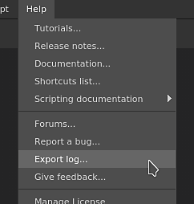
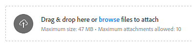

# Exporting the log file

This page explains how to find the application log file and how to share it to ask for support.

## Retrieving the log file

There are two ways of obtaining the log file:

### Exporting the log file from the application

The log file can be directly exported from the application by going into the **Help** menu and selecting the **Export log** action.

### Retrieving the log file manually on the disk

If the application doesn't launch it will not be possible to export the log file. Fortunately the log file can be located manually on the disk. Navigate to the folder matching your operating system below and retrieve the **log.txt** file manually.

<table data-preserve-html="true"><colgroup> <col/> <col/> <col/> <col/> </colgroup><tbody><tr><th>Platform</th><th>Version</th><th colspan="2">Path</th></tr><tr><td rowspan="4"><strong>Windows</strong></td><td rowspan="2"><strong>7.2</strong> or newer</td><td colspan="1">App Data (local)</td><td colspan="1">C:&#92;Users&#92;&#91;username&#93;&#92;AppData&#92;Local&#92;Adobe&#92;Adobe Substance 3D Painter</td></tr><tr><td colspan="1">App Data (roaming)</td><td colspan="1">C:&#92;Users&#92;&#91;username&#93;&#92;AppData&#92;Roaming&#92;Adobe&#92;Adobe Substance 3D Painter</td></tr><tr><td rowspan="2">Legacy</td><td colspan="1">App Data (local)</td><td colspan="1">C:&#92;Users&#92;&#91;username&#93;&#92;AppData&#92;Local&#92;Allegorithmic&#92;Substance Painter</td></tr><tr><td colspan="1">App Data (roaming)</td><td colspan="1">C:&#92;Users&#92;&#91;username&#93;&#92;AppData&#92;Roaming&#92;Allegorithmic&#92;Substance Painter</td></tr><tr><td rowspan="2"><strong>Mac</strong></td><td colspan="1"><strong>7.2</strong> or newer</td><td colspan="2">/Users/&#91;username&#93;/Library/Application Support/Adobe/Adobe Substance 3D Painter</td></tr><tr><td colspan="1">Legacy</td><td colspan="2">/Users/&#91;username&#93;/Library/Application Support/Allegorithmic/Substance Painter</td></tr><tr><td rowspan="2"><strong>Linux</strong></td><td colspan="1"><strong>7.2</strong> or newer</td><td colspan="2">/home/&#91;username&#93;/.local/share/Adobe/Adobe Substance 3D Painter</td></tr><tr><td>Legacy</td><td colspan="2">/home/&#91;username&#93;/.local/share/Allegorithmic/Substance Painter</td></tr></tbody></table>

>[!NOTE]
>
> Some of the directories in the paths mentioned above may be hidden by default. Type the path manually in the file explorer or display hidden files to view them.

## Attaching the log file to a community message for support

When writing a message, use the attachment area to insert your log file:

