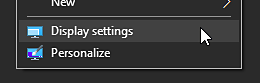
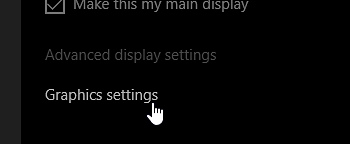
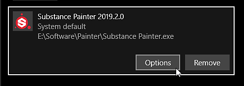
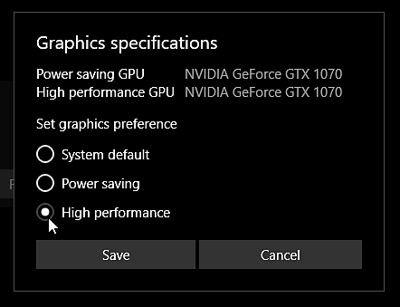

# Painter doesn't start on the right GPU

On Windows, the application may not use the right GPU when starting up which can lead to performance and stability issues. Below is a list of of common issues and their solutions to make sure the software works with the right GPU.

To know which GPU is used, you can check the [log file](../../../../technical-support/exporting-the-log-file/exporting-the-log-file.md).

## Windows

### Monitor Cables Configuration

On Windows the GPU assigned to an application depends of the monitor on which the application is running. This is because the monitor cables are linked directly to the output of the GPU itself. The application may start on the wrong GPU therefore if the monitor on which it starts is linked to the graphics output of the motherboard instead of the one from the graphic card itself. In that case, Windows is likely to use the integrated GPU rather than the dedicated GPU.

<b>To solve this issue</b> : simply fix the cable configuration by un-plugin the monitor linked to the motherboard and then linking it to the GPU outputs instead.

### Incorrect GPU Driver Installation

If the GPU drivers are not properly installed the application will be unable to reach the dedicated GPU and it will have to fallback on the integrated GPU instead.

<b>To solve this issue</b> : uninstall the current GPU drivers, perform a cleanup and then reinstall the GPU drivers after a reboot of the computer.

### Nvidia GPU driver profile setting

On some computers, such as Laptops, the application may run on the integrated GPU instead of the dedicated Nvidia GPU by default. With an NVIDIA GPU, the switch to the right GPU depends on application profiles. If an application does not have such profile, you can assign one manually.

<b>To solve this issue</b> :

1. Right-click on the Desktop and select NVIDIA Control Panel <b>or</b> Navigate to the Control Panel and search for NVIDIA Control Panel
1. Under <b>3D Settings</b>, go to <b>Manage 3D Settings</b>
1. Under the tab <b>Program settings</b> add a new profile for <b>Substance 3D Painter</b>
1. Change the preferred graphics processor setting to High-performance NVIDIA processor

### Windows Performance Setting

Windows may have set the wrong GPU setting for the application because of the default performance and power consumption settings.

<b>To solve this issue : </b>follow the step by step below to override the default GPU configuration.

1. Open the display settings by right-clicking on your desktop :

   
1. Navigate to the bottom of the window on the home and click on "Graphics Settings" :

   
1. Click on the "Browse" button and locate the Substance 3D Painter executable :

   
1. Once the application has been added, click on the button "Options" :

   
1. Choose the setting "High performance" and click on the "Save" button

   

## Linux

### Disable "Prefers Non Default GPU"

When running Painter from a desktop shortcut or when running it via Steam, make sure the setting <b>PrefersNonDefaultGPU</b> inside the <b>\*.desktop</b> file is set to <b>false</b>.

This setting can be misleading and lead to the integrated GPU being used/forced instead of the discreet and more powerful one. For more informlation [see this discussion](https://github.com/ValveSoftware/steam-for-linux/issues/9940).

### Force specific GPU using DRI\_PRIME environment variable

By default Painter will use the first GPU listed by the Vulkan graphics API, however this GPU might be the wrong one (it might be the integrated GPU listed first), leading to poor performances. The DRI\_PRIME environment variable can be used to force the GPU of your choice. For more information [see the documentation from the Arch wiki](https://wiki.archlinux.org/title/PRIME#For_open_source_drivers%E2%80%94PRIME). You can also refer to the [Mesa documentation](https://docs.mesa3d.org/envvars.html#envvar-DRI_PRIME).
