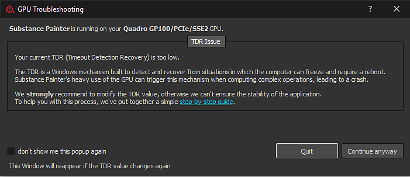
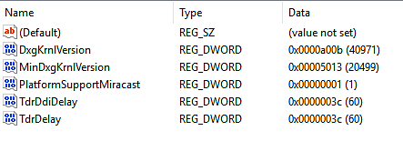
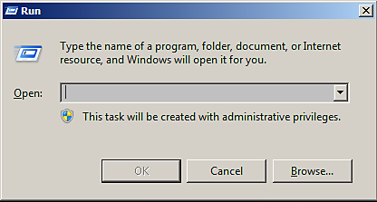
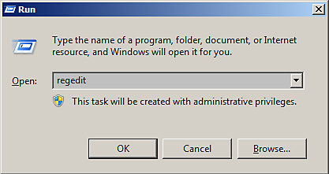
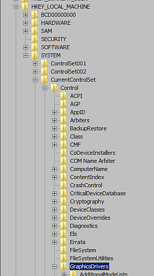
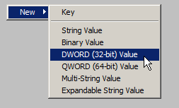
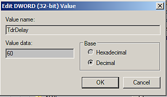

# GPU drivers crash with long computations (TDR crash)

{zoomable="yes"}

On Windows, this window will appear if Substance 3D Painter detects that the current TDR value is below a specific limit (10 seconds).

<table>
<tr style="border: 0;">
<td style="border: 0;" valign="top">

## Why does the GPU driver crash?

</td>
<td style="border: 0;" valign="top">

### How to edit the TDR values

</td>
<td style="border: 0;" valign="top">

### Revert TDR values to defaults

</td>
</tr>
</table>

## Why does the GPU driver crash?

In order to prevent any rendering or GPU computation from **locking up the system**, the Windows operating system **kills the GPU driver** whenever a rendering takes more than a few seconds. When the driver is killed, the application using it crashes automatically. It is not possible to know how long a rendering task or a computation may take (it depends on the GPU, the drivers, the OS, the mesh size, the texture size, etc.), therefore it is not possible to put a limit on how much the computer should process and avoid the crash from the application level.

On Windows there is a **registry** **key** specifying how long the OS should wait before killing the GPU driver. Application are not authorized to modify this setting directly, this procedure has to be done manually (see below).

For more information consult the official documentation: <https://docs.microsoft.com/en-us/windows-hardware/drivers/display/tdr-registry-keys>.

### List of Keys that need to be changed

To adjust the TDR simply increase the TDR Delay: change both **TdrDelay** and **TdrDdiDelay** to a higher value (like 60 seconds).

{zoomable="yes"}

>[!NOTE]
>
> Note that these Keys can be reset to their default value by Windows updates or GPU Drivers updates.

## How to edit the TDR values

Follow this procedure to change the TDR value.

***Note that  two different  keys will have to be created/edited.***

>[!WARNING]
>
> Please note that editing the registry can have serious, unexpected consequences that can prevent the system from starting and may require to reinstall the whole operating system if you are unsure of how to modify it. The registry keys mentioned in this page shouldn't create these kind of issues however.
> 
> Adobe take no responsibility for any damage caused to your system by modifying the system registry.

### 1 - Open the Run window

Click on **Start** then **Run** (or press the **Windows** and **R** key). It will open the **Run** window.

{zoomable="yes"}

### 2 - Launch the registry editor

Type **regedit** in the text field and press **OK**.

{zoomable="yes"}

### 3 - Navigate to the GraphicsDrivers registry key

The registry window will open.   
 In the left pane, navigate in the tree to the **GraphicsDrivers** key by going into:

```

Computer\HKEY_LOCAL_MACHINE\SYSTEM\CurrentControlSet\Control\GraphicsDrivers
```


Be sure to **stay on** "GraphicsDrivers" and **to not click** on the Registry **keys below** before going through the next steps.

+++'GraphicsDrivers' in Windows Registry tree
{zoomable="yes"}


+++

### 4 - Add or Edit the TdrDelay value

>[!NOTE]
>
> If the <b>TdrDelay</b> value <b>doesn&#39;t exist yet</b>, right-click in the right pane and choose <b>New &gt; DWORD (32bit) Value</b> . Name it "<b>TdrDelay</b>". The case is important, be sure to follow it (and check that there are no other characters such as a trailing space).
> 
> 

In the **right pane**, double click on the value  **TdrDelay**. Change the **Base** setting to **Decimal** . Set the value to something else than the default **2** (we recommend **60**).

This value indicates in seconds how long the operating system will wait before considering that the GPU is unresponsive during a computation.

{zoomable="yes"}

### 5 - Add or Edit the TdrDdiDelay value

>[!NOTE]
>
> If the <b>TdrDdiDelay</b> value <b>does not exist</b> , right-click in the right pane and choose <b>New &gt; DWORD (32bit) Value</b> . name it " <b>TdrDdiDelay</b> ". The case if important, be sure to follow it (and check that there are no other characters such as spaces).
> 
> 

In the **right pane** , double click on the value  **TdrDdiDelay**  . Change the **Base** setting to **Decimal** . Set the value to something else than the default **5** (we recommend **60** ).

This value indicates in seconds how long the operating system will wait before considering that a software took too much time to leave the GPU drivers.

**Hexadecimal** is the default value, simply switch to **decimal** to display the right value. Note that **3C** (Hexadecimal) equals to **60** (Decimal).

### 6 - Finish and Restart

The right pane should now looks like this:

{zoomable="yes"}

**Close** the Registry editor. **Restart** the computer by using **Start** then **Restart** .

The TdrValue is only looked at when the computer start, so to force a refresh a reboot is necessary.

If the application still crashes when doing a long computation, try increasing the delay (in seconds) from 60 to 120 for example.

## Revert TDR values to defaults

There are two ways to revert the TDR to its default values :

* Set the **TdrDelay** to **2s** and the **TdrDdiDelay** to **5s**, by following the steps described above.
* Or **Remove** the **TdrDelay** and **TdrDdiDelay** keys from the registry entry.
