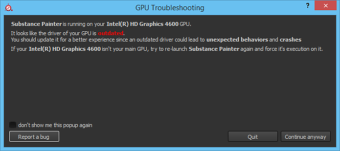

# GPU has outdated drivers

{width="500px"}

When launching Substance 3D Painter a pop-up window can appear mentioning that the GPU drivers are outdated. This message simply means the software requires a minimum version of the GPU drivers to be installed. We recommended updating the GPU drivers to the latest version available when possible to get the best working experience.

| *Vendor* | *Link* |
| --- | --- |
| **NVIDIA** | [http://www.nvidia.com/Download/index.aspx](http://www.nvidia.com/Download/index.aspx?lang=en-us) <ul data-preserve-html="true"><li data-preserve-html="true"><strong> GeForce </strong> : "Studio Drivers" (SD) version recommended.</li><li data-preserve-html="true"><strong> Quadro </strong> : "Optimal Driver fro Enterprise" (ODE) version recommended.</li></ul> |
| **AMD** | <http://support.amd.com/en-us/download> |
| **Intel** | <https://downloadcenter.intel.com/> |

>[!NOTE]
>
> Some computers <b>may have two GPUs</b>: an integrated one (like an Intel chipset) and a dedicated one (like an Nvidia graphics card). <b>Both</b> need to be <b>up to date </b>to minimize the risk of bugs in Painter.
