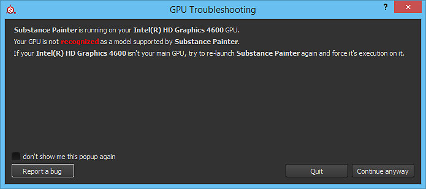

# GPU is not recognized

{width="500px"}

Some  **NVIDIA Optimus**  users can have troubles getting Substance 3D Painter to run on the right GPU. A workaround is to set the following keys in the Registry of Windows to 0:

* HKEY\_LOCAL\_MACHINE\SOFTWARE\Microsoft\Windows NT\CurrentVersion\Windows\RequireSignedAppInit
* HKEY\_LOCAL\_MACHINE\SOFTWARE\Wow6432Node\Microsoft\Windows NT\CurrentVersion\Windows\RequireSignedAppInit
