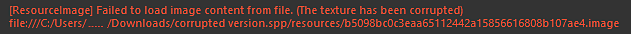
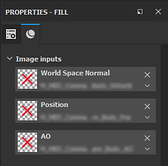

# Corrupted texture error message

Corrupted textures in a project will cause failures during the saving process and can lead to projects being entirely corrupted and non-salvageable. However this can be manually fixed.  
A corrupted resource manifests itself in the log when opening a project with an error message similar to this one in the log window :

## Fixing a corrupted resource reference

### 1 - Finding the resource

The first step when an error appears it to find and identify the problematic resource.   
In most cases the culprit is from the **Mesh maps** (baked textures). A quick way to verify that is to look at the mask generators in the layer stack.

Corrupted resources will look like this:

>[!NOTE]
>
> This could also mean that the resource is simply missing.   
> To make sure, try clearing the slot and manually re-affecting the bake. If the red cross thumbnail is still here it means the resource is corrupted.

### 2 - Replacing the resource

To replace a corrupted resource, all the references to it must be removed first. If the current is relatively small, this can be done manually.   
However if the project spans across multiple texture sets or lots of layers, the [Resource Updater ](../../../../features/plugins/resources-updater/resources-updater.md)can be helpful to locate the corrupted resource and replace it temporarily with another one.

>[!NOTE]
>
> * In the cased of the baked textures, don't forget to also clear the Mesh Maps slots in the [Texture Set settings](../../../../interface/texture-set/texture-set-settings/texture-set-settings.md) window.
> * Bakes that are only used in the Texture Set Settings like the normal map could also be corrupted. Try removing them as well if errors persist.

### 3 - Cleanup

Once all references to the corrupted resources are gone, perform a Clean of the project from the main menu (**File** &gt; **Clean**).   
This should remove all the now unused corrupted resources from the Project. It is possible to verify by browsing to the Project tab in the shelf to make sure all the problematic resources are gone.

### 4 - Save

After the cleanup, try saving the project :

* If it saves without error the project is now free from corruptions (Mesh maps can now be rebaked and resources reimported).
* If errors remain this means there is still a reference to a corrupted resource in the project.
