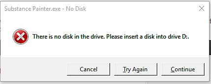

# Error there is no disk in the drive

On Windows, you can sometimes encounter this error:

"There is no disk in the drive. Please insert a disk into drive X."

There are a few things to check to get rid of this error:

* Verify that your drive letters setup is correct (see <https://support.microsoft.com/en-us/kb/330137> )
* Verify that any previous location used in Substance 3D Painter is valid (like the "recent Files" list)
