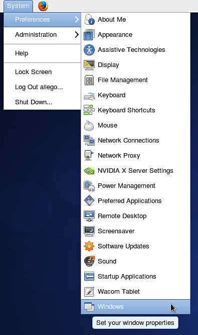
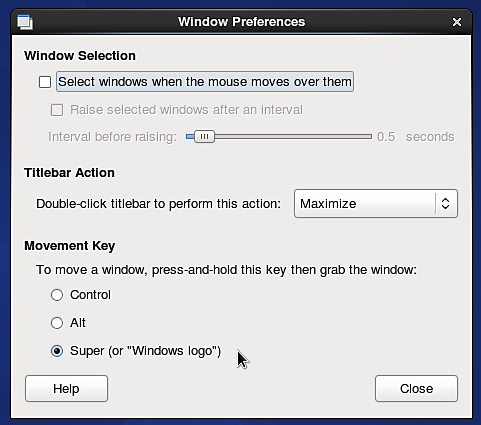
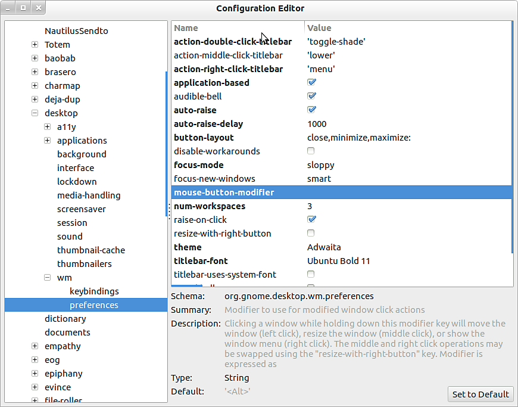

# Impossible to use the ALT keyboard shortcut on Linux

If you are running a Linux distribution (**Ubuntu**  or  **CentOS**) which use  **Gnome**  as user interface, you might want to disable the default behavior of the  **ALT**  key to be able to navigate in the viewport.

## CentOS

1 - Go to  **System &gt; Windows**

{width="250px"}

2 - Change the "movement key" setting to something else than "  **Alt**  ". For example use "  **Super**  " (to choose the "Windows" key of your keyboard).

{width="350px"}

## Ubuntu

1 - Open a terminal and run the following command:

```

sudo apt-get install dconf-tools
```


This will install an advanced configuration tool, you might have to allow additional dependencies to be installed to be able to run it.

2 - Open the start menu and look for "  **Dconf-tools**  ". Launch it.

3 - Expand the tree menu on the left by going to the following route :  **org &gt; gnome &gt; desktop &gt; wm &gt; preferences**

4 - Edit the "mouse-button-modifier" and change it value. Set it  or  instead, but  *don't leave it empty*  . Super is an equivalent to the "Windows" key.

{width="500px"}
