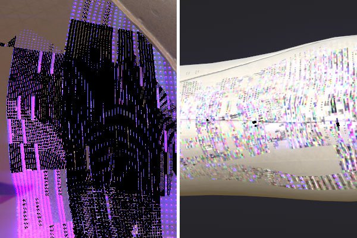
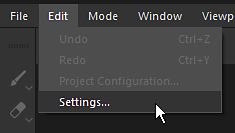
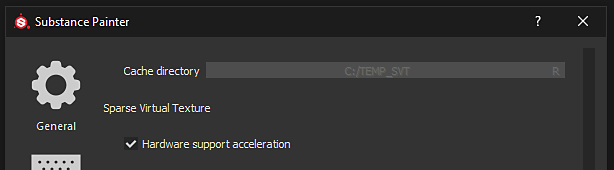
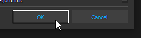
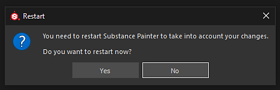

# Blocky artifacts appear on textures in the viewport

Starting with version 2018.3.0 the following kind of artifacts can appear in the viewport:

{width="400px"}

These artifacts are related to issues with Nvidia GPU Drivers.   
To avoid the artifacts the Sparse Virtual Textures hardware support needs to be deactivated.

The GeForce  **Drivers 440.97**  have now  **fixed this issue**  . We recommended to update to these drivers and to keep the SVT enabled to get good performances.

New drivers are available on Nvidia website: <https://www.nvidia.com/Download/index.aspx>

## Disabling the Sparse Virtual Textures Hardware acceleration

### 1 - Start Substance 3D Painter and open the Settings

Open the main Settings via Edit &gt; Settings.

### 2 - Find the section named "Sparse Virtual Textures"

Inside the "General" section, scroll down and find the sub-section named "Sparse Virtual Textures"

### 3 - Uncheck the setting

Disable the "Hardware support acceleration" setting by unchecking it.

### 4 - Validate and restart Substance 3D Painter

Validate the change by clicking on the "OK" button.

Restart Substance 3D Painter by clicking on the "Yes" button to apply the change.
