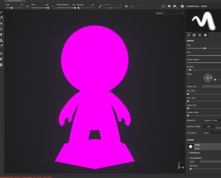

# Mesh appears pink in the viewport

{width="400px"}

The mesh can appear  **pink**  inside the viewport because the  **shader**  used to draw it  **doesn't compile anymore**  (as mentioned by the  **log window**  ). This can be caused by an outdated shader which doesn't support the latest version of the shader API.

Here is how to fix it:

* For  **default shaders**: follow the step by step procedure from the [Updating a shader](../../../../interface/shader-settings/updating-a-shader/updating-a-shader.md) page.
* For **custom shader**: take a look at the error message in the log window as well as the [Shader API](https://helpx.adobe.com/substance-3d/unlisted/documentation/spdoc/custom-shader-api-89686018.html) page.
