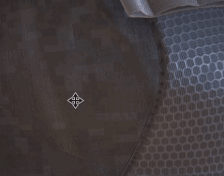

# Mesh flash to white when moving camera

{width="300px"}

With old projects moving around the camera in the viewport may briefly show white flashes created by white/empty textures. This is because the  [Sparse Virtual Textures](https://substance3d.adobe.com/display/DRAFTPAINTER/Sparse+Virtual+Textures)  (SVT) system relies on specific shader configurations which older shaders don't use.

To get rid of the white flash simply  **update**  the  **project shader**:

* For **default shaders**: follow the step by step procedure from the [Updating a shader](../../../../interface/shader-settings/updating-a-shader/updating-a-shader.md) page.
* For **custom shaders**: take a look at the error message(s) in the log as well as the [Shader API](https://helpx.adobe.com/substance-3d/unlisted/documentation/spdoc/custom-shader-api-89686018.html) page.
