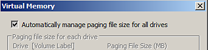
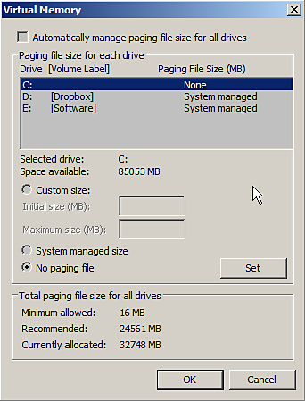

# Crash with low virtual memory

Substance 3D Painter can be unstable if the  **paging**  file (  **swap**  memory/  **virtual**  memory) is set with a value  **too low**  .   
It is advised to let the Operating System handling these settings (which is normally the case by default). Substance 3D Painter requires a  **minimum**  of  **16GB**  of virtual memory in order to work properly.

## How to change the virtual memory size on Windows ?

>[!NOTE]
>
> Changing the virtual memory size on Windows will require a restart of the computer.

Access the virtual memory settings with the following steps

1. Right-click on the **Computer/This PC** icon and choose **Properties**
1. Select "**Advanced System Settings**
1. Click on the **Settings** button of the **Performance** section
1. Click on the **Advanced** tab
1. Click on **Change** in the **Virtual Memory** section

Now it is possible to either:

* Enable the checkbox **Automatically manage paging file size for all drives**

**or**

* Select the hard drive where you want to change the virtual memory size and choose **System managed size** and click on the **Set** button.

**Automatic:**

**Manual:**

