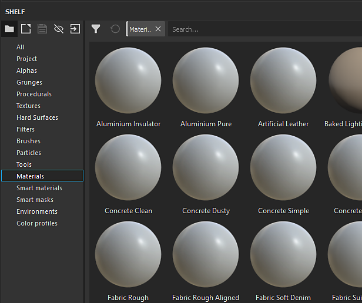
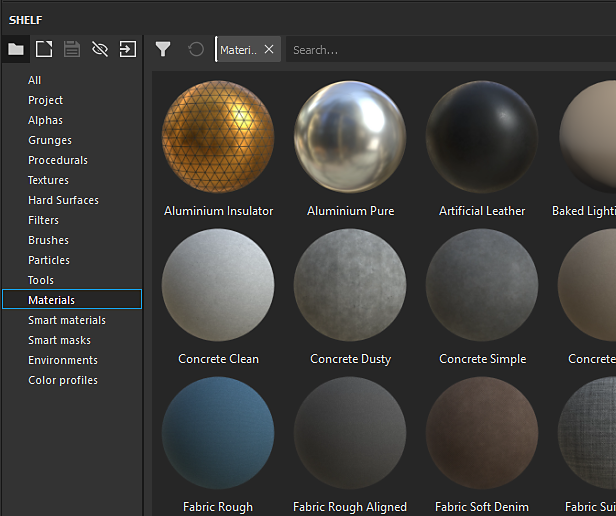
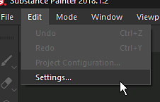
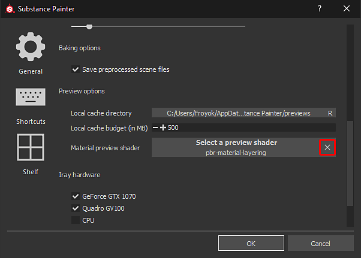

# Thumbnails in the shelf look incorrect

If the thumbnails in the shelf appear to be different than habitual it may be because of the shader used to render the previews.

| Broken thumbnails | Normal thumbnails |
| --- | --- |
| 

 | 

 |

## 1 - Open the main settings window

Go to  **Edit**  and click on  **Settings**  :

## 2 - Remove the Shelf preview shader

In the  **General**  view scroll down until the "Preview options" section is visible.   
Click on the  **cross**  button in front of the "  **Material preview shader**  " to remove the current shader specified.

{width="450px"}

## 3 - Restart Substance 3D Painter

In order to regenerate the thumbnails so that they can look correct Substance 3D Painter needs to be restarted.
