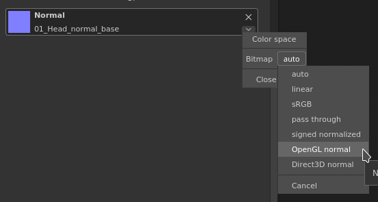

# Normal map looks incorrect when loaded in layer or tool properties

When loading a normal into the current tool of fill layer, this one can appear incorrect if it's an OpenGL normal map.   
The reason is quite simple : the engine of Substance 3D Painter assume that loaded normal map are DirectX by default.

This behavior can easily be edited by clicking on the little arrow next to the substance material or the dedicated channel:

