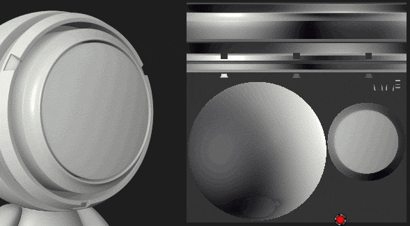
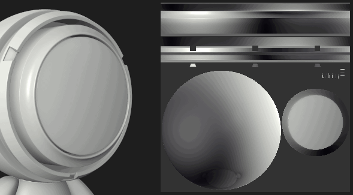

# Paint Tool bleeds on other UV islands

Some default behaviors of the [ Paint tool](../../../../help/features/effects/paint/paint.md) may seem counter-intuitive in some specific situations. Substance 3D Painter is an application that mainly work in 3D space, this applies to painting as well. The default setting of the paint brush is to try to be seamless across UVs when painting. This is why when interacting with the 2D view some results may seem unexpected.

To avoid the bleeding on other UV islands when painting in the 2D view simply change the  **Alignment**  setting in the tool parameters:

| *Alignment Mode* | *Preview* |
| --- | --- |
| **Tangent Wrap** | 

 |
| **UV** | 

 |
